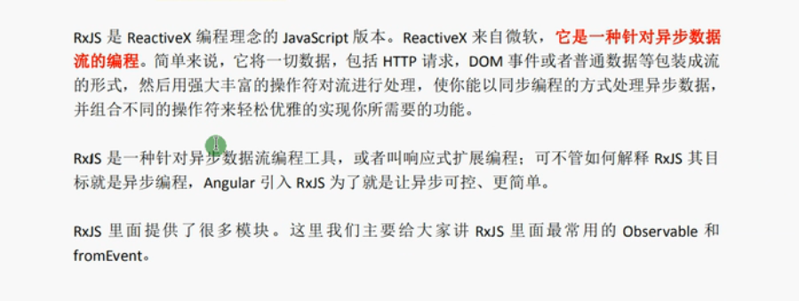

# Angular学习入门

## 1.什么是Angular

是一个基于 TypeScript构建的开发平台,

## 2.环境搭建

（1）安装node和npm

（2）安装Angular Cli

```npm
npm install -g @angular/cli
```

（3）创建开发项目

```
ng new <project-name>
```

（4）运行应用

```
ng serve --open
```

`ng serve` 命令会启动开发服务器、监视文件，并在这些文件发生更改时重建应用。

`--open`（或者只用 `-o` 缩写）选项会自动打开你的浏览器，并访问 `http://localhost:4200/`。

## 3.目录结构分析及详解

```js
|-- 文件名 // 说明
|-- 首层目录
|-- e2e // 自动化集成测试目录
|-- node_modules // npm/cnpm第三方依赖包存放目录
|-- src // 应用源代码目录
	|-- app // 工程源码目录
		|-- app-routing.module.ts // app路由
		|-- app.component.css // app的css
		|-- app.component.html // app的html
		|-- app.component.spec.ts // app的测试
		|-- app.component.ts // app的组件
		|-- app.module.ts // app的模块
	|-- assets // 资源目录
	|-- environments // 环境配置目录
		|-- environments目录
		|-- environments.prod.ts // 生产环境
		|-- environments.ts // 开发环境
	|-- favicon.ico // header里的icon
	|-- index.html // 单页应用的宿主HTML
	|-- main.ts // 入口ts文件
	|-- polyfills.ts // 不同浏览器兼容脚本加载
	|-- karma.conf.js // 自动化测试框架Karma的配置文件
	|-- style.css // 整个项目的全局css
	|-- test.ts // 测试入口
|-- .editorconfig // 不同编译器统一代码风格
|-- .gitignore // git中的忽略文件列表
|-- angular.json // Angular的配置文件
|-- browserslist // 配置浏览器兼容性的文件
|-- karma.conf.js // 自动化测试框架Karma的配置文件
|-- package-lock.json // 依赖包版本锁定文件
|-- package.json // 标准的npm工具的配置文件
|-- README.md // 项目说明的MakeDown文件
|-- tsconfig.app.json // app项目的TypeScript的配置文件
|-- tsconfig.json // 整个工作区的TypeScript配置文件
|-- tsconfig.spec.json // 用于测试的TypeScript配置文件
|-- tslint.json // TypeScript的代码静态扫描配置
```

app.moudule.ts

```js
/*这个文件是angular根模块，告诉angular如何组装应用*/
import { BrowserModule } from '@angular/platform-browser';//BrowserModule浏览器解析模块
import { NgModule } from '@angular/core';//angular核心模块
import { AppRoutingModule } from './app-routing.module';
import { AppComponent } from './app.component';//根组件
/*@NgModule装饰器，@NgModule接受一个元数据对象，告诉angular如何编译和启动应用*/
@NgModule({
declarations: [
AppComponent,//配置当前项目的运行组件
],
imports: [//配置当前模块运行依赖的其他模块
BrowserModule,
AppRoutingModule,
HomeModule,
ScrollableTabModule
],
providers: [],//配置项目所需要的服务
bootstrap: [AppComponent]//指定应用的主视图（称为根组件）通过引导根AppModule来启动应用
})
export class AppModule { }//根模块不需要导出任何东西，因为其他模块不需要导入根模块
```

app.component.ts

```js
import { Component } from '@angular/core';// @Component组件是UI最小的渲染单位
/**
* Component修饰符可以让开发者通过Angular 的Component创建一个类似Java的class，并同时提供额外的元数据用于定义在运行环境中，这个component将如何运行/实例化以及被使用。
* Angular components实质是directives下的一个子集
* 不同于directive：Component始终存在一个视图模板，在这个视图模板中，每一个元素只能有一个component被实例化
* Component元数据说明图表
*/
@Component({
selector: 'app-root',// 其他组件导入选择器
templateUrl: './app.component.html',// 该组件模板路径template / templateUrl
styleUrls: ['./app.component.css']// 该样式路径 styles / styleUrls
})
export class AppComponent {}// 导出控制器
```

## 4.组件及组件里面的模板

```js
ng new angular01 --skip-install//不创建依赖
cd angular01
npm install
ng serve --open
ng g component components/news//创建组件
```

数据绑定：普通数据和对象数组等，在news.components.ts里定义，在html直接使用{{}}

```js
//数组定义
public list:any[]=[1,2]
public arr:Array<string>=["1","2","3"]
public userList:any[] = [{},{}]
```

## 5.内容投影

`ng-content` 元素是一个用来插入外部或者动态内容的占位符。父组件将外部内容传递给子组件，当 Angular 解析模板时，就会在子组件模板中 `ng-content` 出现的地方插入外部内容。

### （1）单插槽内容投影

```html
//bun.component.html
<button (click)=onClick($event)>
  <ng-content></ng-content>
</button>

//在使用btn组件的地方
<app-btn>Cancel</app-btn>
<app-btn><b>Submit</b></app-btn>

//在 <app-btn></app-btn> 中的内容会传递给 btn 组件，并且显示在 ng-contnet 中。
```

### （2）多插槽内容投影

每个插槽可以指定一个 CSS 选择器，该选择器会决定将哪些内容放入该插槽,使用 `<ng-content>` 的 `select` 属性来完成此任务。

```html
/*card.component.html*/
<div class="card">
  <div class="header">
    <ng-content select="header"></ng-content>
  </div>
  <div class="content">
    <ng-content select="content"></ng-content>
  </div>
  <div class="footer">
    <ng-content select="footer"></ng-content>
  </div>
</div>
```

```html
//在使用card组件的地方
<app-card>
  <header>
    <h1>Angular</h1>
  </header>
  <content>One framework. Mobile & desktop.</content>
  <footer><b>Super-powered by Google </b></footer>
</app-card>
//假如有不属于 header, content, footer 之外的内容？
<app-card>
  <header>
    <h1>Angular</h1>
  </header>
  <div>Not match any selector</div>
  <content>One framework. Mobile & desktop.</content>
  <footer><b>Super-powered by Google </b></footer>
  <div>This text will not not be shown</div>
</app-card>
//会发现两个 div 都没有渲染在页面中，为了解决这个问题，我们可以在组件中添加一个没有任何 selector 的 ng-content 标签。所有没办法匹配到任何其他插槽的内容都会被渲染在这个里面。
<div class="card">
  <div class="header">
    <ng-content select="header"></ng-content>
  </div>
  <div class="content">
    <ng-content select="content"></ng-content>
  </div>
  <div class="footer">
    <ng-content select="footer"></ng-content>
  </div>
  <ng-content></ng-content>/*多加一个ng-content 相当于default*/
</div>
```

### （3）有条件的内容投影

#### ngProjectAs

```html
//将 header 包裹在了 ng-container 中
<app-card>
  <ng-container>
    <header>
      <h1>Angular</h1>
    </header>
  </ng-container>
  <content>One framework. Mobile & desktop.</content>
  <footer><b>Super-powered by Google </b></footer>
</app-card>
//但是由于 ng-container 的存在，header 部分并没有被渲染到我们想要渲染的插槽中，而是渲染到了没有提供任何 selector 的 ng-content 中。
//所以加上ngProjectAs属性就可以实现了
<app-card>
  <ng-container ngProjectAs='header'>
    ...
</app-card>
```

#### ng-template

你的组件需要_**有条件地**_渲染内容或多次渲染内容，则应配置该组件以接受一个 ng-template 元素，其中包含要有条件渲染的内容。

而不是使用ng-content，要组件的使用者提供了内容，即使该组件从未定义 ng-content 元素或该 ng-content 元素位于 [ngIf](https://link.juejin.cn/?target=http%3A%2F%2Fangular.cn%2Fapi%2Fcommon%2FNgIf) 语句的内部，该内容也总会被初始化

```html
//example-zippy.template.html
//1.使用ng-container来定义投影区域
<p *ngIf="expanded">//通过内置的动态指令*ngIf来控制是否渲染投影。
  <ng-container [ngTemplateOutlet]="content.templateRef"> </ng-container>//使用ngTemplateOutlet指令来渲染ng-template元素。
</p>

//2.将要投影的内容放在ng-template里面
<app-page-container>
  <ng-template appContent>
    <app-my-hello>有条件的内容投影~</app-my-hello>
  </ng-template>
</app-page-container>
```

```js
//组件可以使用 @ContentChild 或 @ContentChildren 装饰器获得对此模板内容的引用（即 TemplateRef）
//3.发现没有成功渲染，还需要注册指令,app.component.ts
import { Directive, TemplateRef } from '@angular/core';

@Directive({
  selector: '[appContent]',
})
export class ContentDirective {
  constructor(public templateRef: TemplateRef<unknown>) {}//注入 TemplateRef 实例
  @ContentChild(ZippyContentDirective) content!: ZippyContentDirective;//使用 @ContentChild 获取此投影内容的模板
}
```

## 6.服务

所有Service服务组件都是通过依赖注入进行管理的

公共方法放在service里面，提供给多个组件使用

### （1）依赖注入

依赖注入（Dependency Injection）是一种经典的设计模式，主要是用来处理组件如何获取依赖的问题。依赖注入可以简单的理解为：在一个容器中我们定义了很多个模块和组件化服务，当模块需要某些服务时，只需要跟容器说我需要这些服务，并且只需要提供服务的名称，容器就会自动提供这些服务的实例。调用服务的模块不需要考虑这些服务是怎么来的，这些服务会由容器通过依赖注入提供给对应的模块。

服务是单例，无论这个服务被注入到任何地方，对象始终只有一个实例

服务之间可以相互调用，

### （2）使用

```js
ng g s <service-name>
ng g //提示所有的命令
```

```js
//app.component.ts
//引入并且配置服务
import { CartService } from '../cart.service';
@NgModule([
    providers:[CartService]
   // providers : [{provide:vfualt, useClass:VehicleFaultService}] // 这是一种别名的写法
])
export class AppModule{}
```

```js
//cart.service.ts
// cart.service.ts
import { Product } from "./products";
export class CartService {
  items: Product[] = [];

  addToCart(product: Product) {
    this.items.push(product);
  }
  getItems() {
    return this.items;
  }
  clearCart() {
    this.items = [];
    return this.items;
  }
  /* . . . */
}

```

```js
import { CartService } from '../cart.service';
@Injectable()
export class EvenBetterLogger extends Logger {
  constructor(private cartService: CartService) { super(); }//注入服务

   addToCart(product: Product) {//使用服务里面的方法
    this.cartService.addToCart(product);
    window.alert('Your product has been added to the cart!');
  }
}
```

## 7.表单

响应式表单

响应式表单使用显式的、不可变的方式，管理表单在特定的时间点上的状态。对表单状态的每一次变更都会返回一个新的状态，这样可以在变化时维护模型的整体性。响应式表单是围绕 [Observable](https://angular.cn/guide/glossary#observable) 流构建的，表单的输入和值都是通过这些输入值组成的流来提供的，它可以同步访问

使用 Observable 的操作符提供了不可变性，并且通过 Observable 流提供了变化追踪功能。

```js
//注册响应式表单模块
import { ReactiveFormsModule } from '@angular/forms';

@NgModule({
  imports: [
    // other imports ...
    ReactiveFormsModule
  ],
})
export class AppModule { }
```

```js
//注册一个表单控件，就要导入 FormControl 类并创建一个 FormControl 的新实例
import { Component } from '@angular/core';
import { FormControl } from '@angular/forms';

@Component({
  selector: 'app-name-editor',
  templateUrl: './name-editor.component.html',
  styleUrls: ['./name-editor.component.css']
})
export class NameEditorComponent {
  name = new FormControl('');
}
```

```js
<label for="name">Name: </label>
<input id="name" type="text" [formControl]="name">//formControl表单的绑定
//视图会反映模型的变化，模型也会反映视图中的变化
```

```js
updateName() {
  this.name.setValue('Nancy');//改变某个值用setValue()
}
```

```js
//多个控件
import { Component } from '@angular/core';
import { FormGroup, FormControl } from '@angular/forms';
//创建一个名叫 profileForm 的属性，并设置为 FormGroup 的一个新实例。要初始化这个 FormGroup
@Component({
  selector: 'app-profile-editor',
  templateUrl: './profile-editor.component.html',
  styleUrls: ['./profile-editor.component.css']
})
export class ProfileEditorComponent {
  profileForm = new FormGroup({
    firstName: new FormControl(''),
    lastName: new FormControl(''),
  });
}
```

```js
//多个控件更新部分数据用patchValue
updateProfile() {
  this.profileForm.patchValue({
    firstName: 'Nancy',
    address: {
      street: '123 Drew Street'
    }
  });
}
```


## 8.angular里面的dom操作及动画

### （1）原生js操作dom

```js
//视图加载完成后触发的方法，dom加载完成（建议把dom操作放在这个里面）
ngAfterViewInit(){
    var boxDom:any = document.getElementById("box");
    boxDom.style.color = "red"
}
//ngOnInit(){}只是组件和指令初始化完成，并不是真正的dom加载完成
```

### （2）ViewChild操作dom

```js
<div #myBox></div>//给DOM元素命令为box
```

在组件ts文件里面

```js
//1.导入ViewChild和ElementRef
@ViewChild("myBox") myBox!: ElementRef;   
@ViewChild("myBox1") myBox1: ElementRef | undefined;
//在ngAfterViewInit里面操作dom
ngAfterViewInit(){
    this.myBox.nativeElement.style.width = "100px"
}
```

### （3）组件中通过viewChild调用子组件方法

```js
<app-header #header></app-header>
```

父组件获取子组件实例

```js
@ViewChild("header") header!: ElementRef; //装饰器里面传值
```

父组件调用子组件方法

```js
this.haeder.run()//run是子组件里面的方法
```

### （4）动画

```js
showAside(){
    var asideDom:any = document.getElementById("aside");
    asideDom.style.transform = "translate(0,0)"
}
hideAside(){
    var asideDom:any = document.getElementById("aside");
    asideDom.style.transform = "translate(100%,0)"
}
```

## 9.组件之间的传值

### （1）父子组件通信

#### a.子组件调用父组件@Input

```js
//父组件给子组件传值
<app-child [msg]="hello"></app-child>

//子组件引入input模块
import {Component,OnInit,Input} from "@angular/core"
//子组件中@Input接受父组件传过来的数据
@Input() msg:string//相当于vue中的prop
```

```js
//父组件给子组件传递方法
<app-child [run]="run"></app-child>
@Input() run:any
//子组件直接调用父组件方法
this.run()
```

把整个父组件传递给子组件

```js
//传递this
<app-child [home]="this"></app-child>
@Input home:any
//子组件直接调用方法和变量
this.home.msg
this.home.run()
```

**使用一个输入属性的 setter，以拦截父组件中值的变化，并采取行动。**

子组件 `NameChildComponent` 的输入属性 `name` 上的这个 setter，会 trim 掉名字里的空格，并把空值替换成默认字符串。

```js
//子组件
@Component({
  selector: 'app-name-child',
  template: '<h3>"{{name}}"</h3>'
})
export class NameChildComponent {
  @Input()
  get name(): string { return this._name; }
  set name(name: string) {
    this._name = (name && name.trim()) || '<no name set>';
  }
  private _name = '';
}
//父组件传递
<app-name-child *ngFor="let name of names" [name]="name"></app-name-child>
```

**通过*ngOnChanges()*来截听输入属性值的变化**

```js
//子组件会监测输入属性 major 和 minor 的变化，并把这些变化编写成日志以报告这些变化。
@Component({
  selector: 'app-version-child',
  template: `
    <h3>Version {{major}}.{{minor}}</h3>
    <h4>Change log:</h4>
    <ul>
      <li *ngFor="let change of changeLog">{{change}}</li>
    </ul>
  `
})
export class VersionChildComponent implements OnChanges {
  @Input() major = 0;
  @Input() minor = 0;
  changeLog: string[] = [];

  ngOnChanges(changes: SimpleChanges) {
    const log: string[] = [];
    for (const propName in changes) {
      const changedProp = changes[propName];
      const to = JSON.stringify(changedProp.currentValue);
      if (changedProp.isFirstChange()) {
        log.push(`Initial value of ${propName} set to ${to}`);
      } else {
        const from = JSON.stringify(changedProp.previousValue);
        log.push(`${propName} changed from ${from} to ${to}`);
      }
    }
    this.changeLog.push(log.join(', '));
  }
}
```

#### b.父组件调用子组件@Output

```js
//子组件引入Output和EventEmitter
import {Component,OnInit,Input,Output,EventEmitter} from '@angular/core'
//子组件中实例化EventEmitter
@Output() private outer = new EventEmitter<string>();//用EventEmiter和output装饰器配合使用
this.outer.emit("hhhh")//子组件emit提交数据
//父组件调用子组件方法，定义一个接收事件，outer就是子组件的EventEmitter对象outer
<app-child (outer)="runParent($event)"></app-child>
```

#### c.父组件通过ViewChild来调用子组件

```js
//子组件定义数据和方法
public msg:string="hello world";
public run(){
   console.log(111) 
}
<app-child #child ></app-child>
//父组件引入模块
import {Component ,OnInit,ViewChild} from '@angular/core'
@ViewChild('child') child:any;
//获取数据
this.child.msg
//父组件执行子组件方法
this.child.run()
```

### （2）非父子组件传值

#### a.使用服务

#### b.获取locatalStroage

## 10.生命周期

生命周期函数就是组件创建、更新、销毁触发的一系列函数

| 钩子方法                                        | 用途                                                         | 时机                                                         |
| :---------------------------------------------- | :----------------------------------------------------------- | :----------------------------------------------------------- |
| `ngOnChanges()`                                 | 当 Angular 设置或重新设置数据绑定的输入属性时响应。 该方法接受当前和上一属性值的 `SimpleChanges` 对象注意，这发生的非常频繁，所以你在这里执行的任何操作都会显著影响性能。 欲知详情，参阅本文档的[使用变更检测钩子](https://angular.cn/guide/lifecycle-hooks#onchanges)。 | 如果组件绑定过输入属性，那么在 `ngOnInit()` 之前以及所绑定的一个或多个输入属性的值发生变化时都会调用。注意，如果你的组件没有输入属性，或者你使用它时没有提供任何输入属性，那么框架就不会调用 `ngOnChanges()`。 |
| `ngOnInit()`：**重要**                          | 在 Angular 第一次显示数据绑定和设置指令/组件的输入属性之后，初始化指令/组件。 欲知详情，参阅本文档中的[初始化组件或指令](https://angular.cn/guide/lifecycle-hooks#oninit)。 | 在第一轮 `ngOnChanges()` 完成之后调用，只调用**一次**。而且即使没有调用过 `ngOnChanges()`，也仍然会调用 `ngOnInit()`（比如当模板中没有绑定任何输入属性时）。 |
| `ngDoCheck()`                                   | 检测，并在发生 Angular 无法或不愿意自己检测的变化时作出反应。 欲知详情和范例，参阅本文档中的[自定义变更检测](https://angular.cn/guide/lifecycle-hooks#docheck)。 | 紧跟在每次执行变更检测时的 `ngOnChanges()` 和 首次执行变更检测时的 `ngOnInit()` 后调用。 |
| `ngAfterContentInit()`                          | 当 Angular 把外部内容投影进组件视图或指令所在的视图之后调用。欲知详情和范例，参阅本文档中的[响应内容中的变更](https://angular.cn/guide/lifecycle-hooks#aftercontent)。 | 第一次 `ngDoCheck()` 之后调用，只调用一次。                  |
| `ngAfterContentChecked()`                       | 每当 Angular 检查完被投影到组件或指令中的内容之后调用。欲知详情和范例，参阅本文档中的[响应被投影内容的变更](https://angular.cn/guide/lifecycle-hooks#aftercontent)。 | `ngAfterContentInit()` 和每次 `ngDoCheck()` 之后调用         |
| `ngAfterViewInit()`：**重要： dom加载完成之后** | 当 Angular 初始化完组件视图及其子视图或包含该指令的视图之后调用。欲知详情和范例，参阅本文档中的[响应视图变更](https://angular.cn/guide/lifecycle-hooks#afterview)。 | 第一次 `ngAfterContentChecked()` 之后调用，只调用一次。      |
| `ngAfterViewChecked()`                          | 每当 Angular 做完组件视图和子视图或包含该指令的视图的变更检测之后调用。 | `ngAfterViewInit()` 和每次 `ngAfterContentChecked()` 之后调用。 |
| `ngOnDestroy()`：**重要**                       | 每当 Angular 每次销毁指令/组件之前调用并清扫。 在这儿反订阅可观察对象和分离事件处理器，以防内存泄漏。 欲知详情，参阅本文档中的[在实例销毁时进行清理](https://angular.cn/guide/lifecycle-hooks#ondestroy)。 |                                                              |

### 简单理解

1. constructor：class初始化对象的时候，会立即调用

2. ngOnChanges：外部参数更改的时候，我们就会执行 `ngOnChanges`，也就是说组件中有 `@Input` 所绑定的属性值发生改变的时候调用。

3. ngOnInit：这个方法调用的时候，说明组件已经初始化成功。在第一次 `ngOnChanges()` 完成之后调用，且只调用一次。

```js
// demo.component.ts
export class DemoComponent implements OnInit, OnChanges {
  @Input() public count: number;
  constructor() {
    console.log('1. demo constructor')
  }
  ngOnChanges() {
    console.log('2. demo ngOnChanges')
  }
  ngOnInit() {
    console.log('3. demo ngOnInit')
  }
}
```

当通过 `@Input` 将值传递给子组件 `demo` 的时候，就会触发 `demo` 组件中的 `ngOnChanges`。

比如父组件写了click让number加1，则子组件demo会调用ngOnChanges

4. ngDoCheck：当发生变化检测的时候，触发该钩子函数。

这个钩子函数，紧跟在每次执行变更检测时候 `ngOnChanges` 和首次执行执行变更检测时 `ngOnInit` 后面调用。

```js
ngDoCheck() {
  console.log('4. demo ngDoCheck')
}
//如果点击父组件的number+1,除了ngOnChanges会一直打印，ngDoCheck也会一直打印
```

调用频繁，使用成本较高

5. ngAfterContentInit：当把外部的内容投影到内部组件，第一次调用 `ngDoCheck` 之后调用 `ngAfterContentInit`，而且只调用一次。

```js
// demo.component.ts
ngAfterContentInit() {
  console.log('5. demo ngAfterContentInit');
}
```

6. ngAfterContentChecked：`ngAfterContentChecked` 钩子函数在每次 `ngDoCheck` 之后调用.

如果点击父组件的number+1,除了ngOnChanges会一直打印，ngDoCheck也会一直打印，ngAfterContentChecked也会一直打印

7. ngAfterViewInit：视图初始化完成调用此钩子函数。在第一次 `ngAfterContentChecked` 之后调用，只调用一次【dom加载完成之后调用】

8. ngAfterViewChecked：视图检测完成调用。在 `ngAfterViewinit` 后调用，和在每次 `ngAfterContentChecked` 之后调用，也就是在每次 `ngDoCheck` 之后调用。

会依次打印ngDoCheck、ngAfterContentChecked、ngAfterViewChecked

9. ngOnDestroy：组件销毁的时候进行的操作

在这个钩子函数中，我们可以取消订阅，取消定时操作等等。

总结：调用一次的钩子函数会比较常用

## 11.Rxjs快速入门



异步解决方案

1.回调函数

```js
getCallbackData(cb){
    setTimeout(()=>{
        var usrname = "张三";
        cb(username);
    },1000)
}
// callback获取异步数据
this.request.getCallbackdata((data)=>{
    console.log(data)
})
```

2.promise获取异步数据

```js
getPromiseData(){
    return new Promise((resolve)=>{
        setTimeout(()=>{
        	var usrname = "张三";
        	resolve(username);
        },1000)
    })
}
//promise获取异步数据
var promiseData = this.request.getPromsieData();
promiseData.then((data)=>{
    console.log(data)
})
```

3.rxjs获取异步数据

```js
import {Observable} from 'rxjs';
let stream = new Observable(observer=>{
    setTimeout(()=>{
        oberver.next('obervable timeout')
    },2000)
})
stream.subscribe(value=>console.log(value))
```

通过observer.next来返回数据，promise里面使用的resovle

promise创建之后动作是无法撤回的，observable不一样，动作可以通过unsubscrible方法撤回，而且observable在内部做了处理

```js
var test = stream.subscribe(value=>console.log(value));
setTimeout(()=>{
    test.unsubscribe();//过一秒之后可以进行取消操作
},1000)
```

取消方法执行，但是请求还是发送了，只是不接受值了，不订阅返回的数据了

promise无法多次调用resovle，但是rxjs可以一直调用next

```js
import {Observable} from 'rxjs';
let stream = new Observable<number>(observer=>{
    let count = 0;
    setTimeout(()=>{
        oberver.next(count++)
    },1000)
})
stream.subscribe(value=>console.log(value))
```

4.工具函数 map 

```js
import {map,filter} from 'rxjs/operator'
let stream = this.request.getRxjsDate();
stream.pipe(
	filter((value)=>{
        if(value%2===0){
            return true;
        }
   	})
).subscribe(value=>console.log(value))
```

## 12.数据交互 get jsonp post

（1）引入HTTPClientModule

```js
import {HttpClientModule} from "@angular/common/http"
```

（2）导入

```js
imports:[HttpClientModule]
```

（3）在用到的地方引入HttpClient并在构造函数中声明

```js
import {HttpClient} from '@angular/common/http'
constructor(public http:HttpClient){}
```

（4）使用

```js
this.http.get(api).subscribe((res)=>{
    console.log(res)
})
```

post请求需要手动设置请求头，导入HttpHeader

```js
const httpOptions = {
    headers: new HttpHeaders('Content-Type':'application/json')
}
var api = 'http://127.0.0.1:3000/doLogin';
this.http.post(api,(uersname:'hhhh',age:20),httpOptions).subscribe(res=>{
    console.log(res)
})
```

jsonp获取服务器数据

```js
//导入
import {HttpClientModule,HttpClientJsonpModule} from "@angular/common/http"
imports:[HttpClientModule,HttpClientJsonpModule]
this.http.jsonp(api,'callback').subscribe((res)=>{
    console.log(res);
}))
```

axio获取服务器数据，封装后使用,写成服务

```js
//安装axios 
npm install axios
//导入
import axios from `axios`
axiosGet(api){
    return new Promise((resolve,reject)=>{
        axios.get(api).then(function(response){
            resolve(response)
        })
    })
}
```

## 13.路由

根据不同的url进行页面的映射

比平常的项目多了app-route-module.ts，在app.moudule.ts里面导入了路由模块，在app.component.html里面多了<router-outlet></route-outlet>

### （1）基本路由操作

app-routing.module.ts

```js
import { NgModule } from '@angular/core';
import { Routes, RouterModule } from '@angular/router';
const routes: Routes = [{
path : '',// 默认路由路径
component : HomeComponent// 默认路由组件
}];
// @angular/cli 打包的最小单位
/**
* @angular/cli 会检查所有 @NgModule 和路由配置，如果你配置了异步模块，cli 会自动把模块切分成独立的 chunk（块）
* 其它框架基本上都需要你自己去配置 webpack，自己定义切分 chunck 的规则而Angular 里面，打包和切分的动作是 @angular/cli 自动处理的，不需要你干预
* @NgModule 元数据类型图表
* */
@NgModule({
imports: [RouterModule.forRoot(routes)],// 导入模块
exports: [RouterModule]// 导出模块
})
// 导出控制器
export class AppRoutingModule { }
```

新建路由

```js
ng new routing-app --routing --defaults
```

在app-route-module.ts配置路由

```js
import { FirstComponent } from './first/first.component';
import { SecondComponent } from './second/second.component';
const routes: Routes = [
  { path: 'first-component', component: FirstComponent },
  { path: 'second-component', component: SecondComponent },
  { path: '**', redirectTo: 'home'}//任意的路由 重定向到某个页面
   //{ path: '**', component: PageNotFoundComponent },  // 默认显示404页面
];
```

使用

```js
<a routerLink="/first-component" routerLinkActive="active">First Component</a>
<a routerLink="/second-component" routerLinkActive="active">Second Component</a>
```

路由的选中状态，加上active状态

```js
<a routerLink="/home" routerLinkActive="active">点击路由是选中状态</a>
然后css里面可以使用active:{color:red}设置样式
```

### （2）路由跳转传值

#### 1. get传值

传值：queryParams

```js
<a [routeLink[="['/newRoute']" [queryParams]="{id:key,namge:name}"></a>
```

获取值

```js
import { Router, ActivatedRoute, ParamMap } from '@angular/router';

constructor(public route:ActiveRoute){}
ngOnInit(){
    console.log(this.route.queryParams);//是一个observable对象，所以要订阅
    this.route.queryParams.subscribe((data)=>{//获取get传值
        console.log(data);
    })
}
```

#### 2. 获取动态路由传值

路由里面写

```js
{path:"newRoute/:id",component:NewRouteComponent}
```

```js
<ul>
	<li *ngFor="let item of arr;let key = index">
		<a [routeLink[="['/newRoute',key]">{{key}}----{{item}}</a>
	</li>
</ul>
//获取传值
this.route.params.subscribe(()=>{})
```

#### 3.业务逻辑里面实现页面跳转：动态路由js跳转

```js
<button (click)="getNewsContent()"></button>

import {Router} from "@angular/router";
constructor(public router:Router){}
getNewsContent():void{
    this.router.navigate(['/newsContent','1234'])
    //this.router.naviagte('/home')
}
```

#### 4.navigationExtras传参配置路由跳转

```js
import {Router,NavigationExtras} from "@angular/router";
getNewsContent():void{
    let navigationExtras:NavigationExtras={
    queryParams:{'id':"123"},
    fragment:'anchor'
}
this.router.navigate(['/news'],navigationExtras);//注意写法，在[]外面了
}
```

### （3）嵌套路由：父子路由

实现效果：点击导航路由切换左侧页面，点击左侧路由，右面主页面切换

要把子路由放在父路由的 `children` 数组中

```js
const routes: Routes = [
  {
    path: 'first-component',
    component: FirstComponent, 
    children: [
      {
        path: 'child-a', // child route path
        component: ChildAComponent, // child route component that the router renders
      },
      {
        path: 'child-b',
        component: ChildBComponent, // another child route component that the router renders
      },
    ],
  },
];
```

然后页面添加router-outlet

```js
<h2>First Component</h2>

<nav>
  <ul>
    <li><a routerLink="child-a">Child A</a></li>
    <li><a routerLink="child-b">Child B</a></li>
  </ul>
</nav>

<router-outlet></router-outlet>
```

### （4）路由守卫

- [`CanActivate`](https://angular.cn/api/router/CanActivate)
- [`CanActivateChild`](https://angular.cn/api/router/CanActivateChild)
- [`CanDeactivate`](https://angular.cn/api/router/CanDeactivate)
- [`Resolve`](https://angular.cn/api/router/Resolve)
- [`CanLoad`](https://angular.cn/api/router/CanLoad)

在守卫类里实现你要用到的守卫

```js
export class YourGuard implements CanActivate {
  canActivate(
    next: ActivatedRouteSnapshot,
    state: RouterStateSnapshot): boolean {
      // your  logic goes here
  }
}
```

在路由模块中，在 `routes` 配置中使用相应的属性。这里的 `canActivate` 会告诉路由器它要协调到这个特定路由的导航

```js
{
    path： '/you-path',
    component:YourComponent,
    canActivate:[YourCuard]
}
```

## 14.模板指令等

### （1）插值

```html
<p>{{title}}</p>
<div></div>
<p>The sum of 1 + 1 is {{1 + 1}}.</p>

```

### （2）方法调用

```html
<button (click)="deleteHero()">Delete hero</button>
```

### （3）管道

```html
<p>The hero's birthday is {{ birthday | date }}</p>
//{{ amount | currency:'EUR' }} 会把 amount 转换成欧元
<p>The hero's birthday is {{ birthday | date:"MM/dd/yy" }} </p>
<p>The chained hero's birthday is{{ birthday | date | uppercase}}</p>
```

```js
//使用 PipeTransform 接口实现自定义管道
import { Pipe, PipeTransform } from '@angular/core';
@Pipe({name: 'exponentialStrength'})
export class ExponentialStrengthPipe implements PipeTransform {
  transform(value: number, exponent = 1): number {
    return Math.pow(value, exponent);
  }
}
//使用
import { Component } from '@angular/core';

@Component({
  selector: 'app-power-booster',
  template: `
    <h2>Power Booster</h2>
    <p>Super power boost: {{2 | exponentialStrength: 10}}</p>
  `
})
export class PowerBoosterComponent { }
```

检测原始类型和对象引用的变更

```js
import { Pipe, PipeTransform } from '@angular/core';
import { Hero } from './heroes';

@Pipe({ name: 'flyingHeroes' })
export class FlyingHeroesPipe implements PipeTransform {
  transform(allHeroes: Hero[]) {
    return allHeroes.filter(hero => hero.canFly);
  }
}
//使用
<div *ngFor="let hero of (heroes | flyingHeroes)">
  {{hero.name}}
</div>
//如果this.heroes.push(hero);
//变更检测器会忽略对数组元素的更改，所以管道不会运行,忽略了被改变的数组元素的原因是对数组的引用没有改变。由于 Angular 认为该数组仍是相同的，所以不会更新其显示
//为了让它显示，使用不纯的管道
@Pipe({
  name: 'flyingHeroesImpure',
  pure: false
})
```

使用AsyncPipe接受一个可观察对象作为输入，并自动订阅输入

```js
import { Component } from '@angular/core';
import { Observable, interval } from 'rxjs';
import { map, take } from 'rxjs/operators';
@Component({
  selector: 'app-hero-async-message',
  template: `
    <h2>Async Hero Message and AsyncPipe</h2>
    <p>Message: {{ message$ | async }}</p>
    <button (click)="resend()">Resend</button>`,
})
export class HeroAsyncMessageComponent {
  message$: Observable<string>;

  private messages = [
    'You are my hero!',
    'You are the best hero!',
    'Will you be my hero?'
  ];
  constructor() {
    this.message$ = this.getResendObservable();
  }

  resend() {
    this.message$ = this.getResendObservable();
  }

  private getResendObservable() {
    return interval(500).pipe(
      map(i => this.messages[i]),
      take(this.messages.length)
    );
  }
}
```

管道优先级

管道操作符要比三目运算符(`?:`)的优先级高，这意味着 `a ? b : c | x` 会被解析成 `a ? b : (c | x)`

### （4）属性绑定

```js

<tr><td [colSpan]="1 + 1">Three-Four</td></tr>
 <p>"<span [innerHTML]="evilTitle"></span>" is the <i>property bound</i> evil title.</p> 
```

```js
<tr><td [attr.colspan]="1 + 1">One-Two</td></tr>    
```

```js
//单样式和多样式绑定实例
@Component({
  selector: 'app-nav-bar',
  template: `
<nav [style]='navStyle'>
  <a [style.text-decoration]="activeLinkStyle">Home Page</a>
  <a [style.text-decoration]="linkStyle">Login</a>
</nav>`
})
export class NavBarComponent {
  navStyle = 'font-size: 1.2rem; color: cornflowerblue;';
  linkStyle = 'underline';
  activeLinkStyle = 'overline';
  /* . . . */
}
```

```js
//注入属性值,通过依赖注入来将 HTML 属性的值传递给组件/指令构造函数
import { Attribute, Component } from '@angular/core';

@Component({
  selector: 'app-my-input-with-attribute-decorator',
  template: '<p>The type of the input is: {{ type }}</p>'
})
export class MyInputWithAttributeDecoratorComponent {
  constructor(@Attribute('type') public type: string) { }
}

<app-my-input-with-attribute-decorator type="number"></app-my-input-with-attribute-decorator>
//The type of the input is: number
```

### （5）事件绑定

```js
<button (click)="onSave()">Save</button>
```

```js
//指令通常使用 Angular 的 EventEmitter 引发自定义事件,父指令通过绑定到该属性来监听事件，并通过传入的 $event 对象接收数据
//子组件
@Output() deleteRequest = new EventEmitter<Item>();

delete() {
  this.deleteRequest.emit(this.item);
  this.displayNone = this.displayNone ? '' : 'none';
  this.lineThrough = this.lineThrough ? '' : 'line-through';
}
//父组件
<app-item-detail (deleteRequest)="deleteItem($event)" [item]="currentItem"></app-item-detail>
//当 deleteRequest 事件触发时，Angular 就会以该条目为参数调用其父组件的 deleteItem()
```

### （6）双向绑定

```js
//方括号和圆括号的组合 [()]
<app-sizer [(size)]="fontSizePx"></app-sizer>
//sizer.component.ts
export class SizerComponent {
  @Input()  size!: number | string;
  @Output() sizeChange = new EventEmitter<number>();

  dec() { this.resize(-1); }
  inc() { this.resize(+1); }

  resize(delta: number) {
    this.size = Math.min(40, Math.max(8, +this.size + delta));
    this.sizeChange.emit(this.size);
  }
}
```

### （7）模板变量

在模板中，要使用井号 `#` 来声明一个模板变量。下列模板变量 `#phone` 语法在 `<input>` 元素上声明了一个名为 `phone` 的变量

```js
<input #phone placeholder="phone number" />
<button (click)="callPhone(phone.value)">Call</button>//在button里面引用模板变量
```

如果你在 `<ng-template>` 元素上声明变量，该变量就会引用一个 `TemplateRef` 实例来代表

**模板变量的作用域**

```js
//修改 <input> 中的文本值也会改变 <span> 中的值，因为 Angular 会立即通过模板变量 ref1 来更新这种变化
<input #ref1 type="text" [(ngModel)]="firstExample" />
<span *ngIf="true">Value: {{ ref1.value }}</span>
//同上 使用ng-template来
<input #ref1 type="text" [(ngModel)]="firstExample" />
<ng-template [ngIf]="true">
  <span>Value: {{ ref1.value }}</span>
</ng-template>
```

**模板输入变量**

```js
// let 关键字声明模板输入变量
<ng-template #hero let-hero let-i="index" let-odd="isOdd">
  <div [class]="{'odd-row': odd}">{{i}}:{{hero.name}}</div>
</ng-template>
```

## 15.模块

### （1）NgModules

**NgModules** 用于配置注入器和编译器，并帮你把那些相关的东西组织在一起

NgModule 是一个带有 `@NgModule` 装饰器的类。 `@NgModule` 的参数是一个元数据对象，用于描述如何编译组件的模板，以及如何在运行时创建注入器。 它会标出该模块自己的组件、指令和管道，通过 `exports` 属性公开其中的一部分，以便外部组件使用它们。 `NgModule` 还能把一些服务提供者添加到应用的依赖注入器中。

模块可以在应用启动时急性加载，也可以由路由器进行异步的惰性加载。

```js

// imports
import { BrowserModule } from '@angular/platform-browser';
import { NgModule } from '@angular/core';

import { AppComponent } from './app.component';

// @NgModule decorator with its metadata
@NgModule({
  declarations: [AppComponent],//属于该 NgModule 的组件、指令和管道。新应用项目的根模块中只有一个叫做 AppComponent 的组件。
  imports: [BrowserModule],//你要用的其他 NgModule，这样你才可以使用它们的可声明对象。新生成的根模块会导入BrowserModule ，以便使用特定于浏览器的服务，比如 DOM 渲染、无害化处理和定位
  providers: [],//一些服务提供者，可供其他 NgModule 中的组件使用。新生成的根模块中没有提供者。
  bootstrap: [AppComponent]// Angular 创建的入口组件，Angular 会创建它，并把它插入到宿主页面 index.html 中，从而引导该应用。这个入口组件 AppComponent 会同时出现在 declarations 和 bootstrap 数组中。
})
export class AppModule {}
```

**通过 `@NgModule` 使用指令**

```js
//写一个文件并导出
import { Directive } from '@angular/core';

@Directive({
  selector: '[appItem]'
})
export class ItemDirective {
  constructor() { }
}

//使用 JavaScript 的 import 语句把它导入到 NgModule 中（这里是 app.module.ts）
import { ItemDirective } from './item.directive';
//添加到 @NgModule 的 declarations 数组
declarations: [
  AppComponent,
  ItemDirective
],
```

**import数组**

```js
//告诉 Angular 该模块想要正常工作，还需要哪些模块
imports: [
  BrowserModule,
  FormsModule,
  HttpClientModule
],
```

**`providers` 数组**

```js
//ng generate service 名字 创建服务
import { Injectable } from '@angular/core';
@Injectable({
  providedIn: 'root',//providedIn: 'root' 指定 Angular 应该在根注入器中提供该服务
})
export class UserService {
}
```

```js
//规定某个服务只有在特定的 @NgModule 中提供
@Injectable({
  providedIn: UserModule,
})
//也可以在模块中为该服务声明一个提供者,该服务会在该组件及子组件中有效
import { NgModule } from '@angular/core';
import { UserService } from './user.service';
@NgModule({
  providers: [UserService],
})
export class UserModule {
}
```

**`bootstrap` 数组**

基于某个 API 的响应来启动此组

### （2）常用的api

| NgModule              | 导入自                      | 为何用它                                                     |
| :-------------------- | :-------------------------- | :----------------------------------------------------------- |
| `BrowserModule`       | `@angular/platform-browser` | 当你要在浏览器中运行应用时，**（必须的）**                   |
| `CommonModule`        | `@angular/common`           | 当你要使用 `NgIf` 和 `NgFor` 时                              |
| `FormsModule`         | `@angular/forms`            | 当你要构建模板驱动表单时（它包含 `NgModel` ）                |
| `ReactiveFormsModule` | `@angular/forms`            | 当你要构建响应式表单时                                       |
| `RouterModule`        | `@angular/router`           | 当你要使用路由功能，并且要用到 `RouterLink`,`.forRoot()` 和 `.forChild()` 时 |
| `HttpClientModule`    | `@angular/common/http`      | 当你要通过 HTTP 协议和服务器对话时                           |