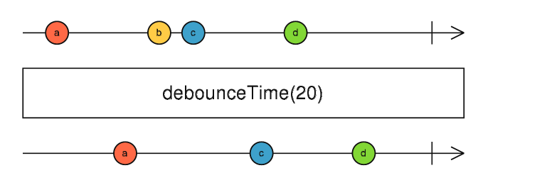
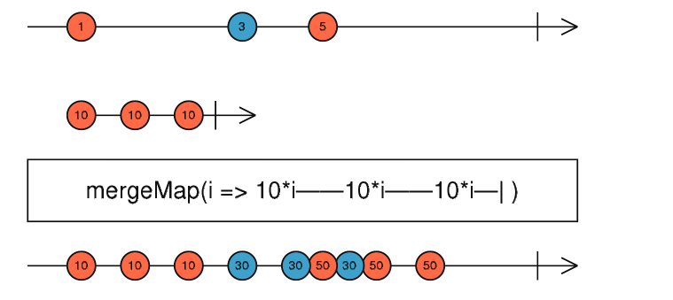

# 函数式反应型编程（FRP）

## 前言

当我们开始写项目的时候，总会遇到一些情景，比如定时任务，ajax请求，要求我们去请求大的文件或者图片这些，然后我们就发现，直接写代码，会出现加载缓慢，白屏这样的问题，众所周知，js是单线程的，所以js任务也是一个一个顺序执行的，就是同步执行，后一个任务必须等待前一个任务完成之后才能执行，就如前面所说的，如果前一个任务花费的时间很长，就会造成阻塞，给用户带来不好的体验，我们要解决这些问题，当我们等待但是又不要阻塞程序，所以就需要异步处理这些耗时间的任务。

## 1.处理异步的方法

假设有多个异步任务，且任务有依赖关系，后一个任务必须拿到前一个任务的执行结果才可以执行

作为刚刚入门学习的小白，比如我，最先能想到的就是函数调用了

### （1）回调：容易造成回调地狱

回调是实现异步编程最简单的方法，我们可以在一个函数中调用其他函数，实现我们想要的逻辑

```
getData1(data1 => {
  getData2(data1, data2 => {
    getData3(data2, data3 => {
      getData4(data3, data4 => {
        getData5(data4, data5 => {
          // 终于取到data5了
        })
      })
    })
  })
})
```

乍一看，写的还可以，也达到了预期的效果，就是看起来不美观，而且还形成了回调地狱，但是如果里面出现很多问题，需要进行异常处理及各种逻辑检查呢，那这一块代码就会变得非常长，非常复杂，可能下次同事看见了你的代码，直接暴走。

为了让代码更具备可读性，Promise隆重登场。

### （2）Promise:解决回调地狱

依旧来解决上面的问题

```javascript
getData1(data1)
.then(data1 => {
   return getData2(data1);
})
.then(data2 => {
   return getData3(data2);
})
.then(data3 => {
   return getData4(data3);
})
.then(data4 => {
   return getData(data4);
})
.catch(err => {
	console.log(err);
})
```

我们直接一路链式调用，看起来更清楚明了，但是感觉这样调用也不是个办法。

你的上级询问，那还能做的更优雅吗？这可难住了我，喔喔喔，但是不要怕，es5的回调让我陷入地狱，但是我爬起来了，es6的Promise让我得到夸奖，es7这不是又出了好方法吗？让我们接下来看看es7的async/await吧。

### （3）async/await:简化了逻辑，但是损失了异步带来的性能优势（比如把并行变成串行,增加了时间开销）

```
// 定义一个执行Async函数方法
async function getSSQ () {
   let a = await getData1(data1)
   let b = await getData2(a)
   let c = await getData3(b)
   let d = await getData4(c)
   let e = await getData5(d)
   console.log(d);
}
```

确实好用，也可以使用try..catch了,啊，这你想肯定能满足上级的要求了，又简单又优雅，小白一眼就看懂，async/await带着我走向了人生巅峰。

### （4）各个方法优缺点总结

| 方法        | 优点                                                         | 缺点                                                         |
| ----------- | ------------------------------------------------------------ | ------------------------------------------------------------ |
| 回调        | 简单逻辑处理很方便                                           | 逻辑复杂时容易造成回调地狱                                   |
| Promise     | 1.状态改变就不会再变，任何时候都能得到确切的结果 2.写法符合思维逻辑 | 1.一旦创建，立即执行，中途无法取消 2.处于pending状态时，无法得知状态3.不设置回调函数，内部错误无法反映到外部 |
| Async/await | 1. 做到了串行的同步写法 2.代码清晰明了                       | 1.做不到并行，除非await不在一个函数里面 2.没有了promise的方法，比如race() 3.没有Promise的reject方法，得写在try...catch中 |

代码非常简洁易读了，但是学海无涯，我发现现在有了一个新的技术，叫做FRP，看了一些文章，文章里面一直说**有了FRP，就使用流来处理异步，把异步数据看成数据流来处理**，会让事情更简单

那FRP到底是什么呢？

## 2.FRP是什么

首先让我们先使用FRP直接实现上述的需求

```
 function getSSQ() {
        let data1 = 1;
        return rxjs.from(getData(data1)).pipe(
            rxjs.operators.mergeMap(a =>
                rxjs.from(getData(a))
            ),
            rxjs.operators.mergeMap(b =>
                rxjs.from(getData(b))
            ),
            rxjs.operators.mergeMap(c =>
                rxjs.from(getData(c))
            ),
            rxjs.operators.tap(console.log),
            rxjs.operators.mergeMap(d =>
                rxjs.from(getData(d))
            ),
            rxjs.operators.tap(e => {
            }),
        );
    }
    getSSQ().subscribe({
        // next(x) { console.log('got value ' + x); },
        // error(err) { console.error('something wrong occurred: ' + err); },
        complete() { console.log('done'); }
    })
```

看不懂吧，看不懂没关系，只需要知道from是建立流的，mergeMap()是操作流的，subscribe是订阅流的，最后直接输出结果就好了，我们先来了解一下什么是FRP及实际应用，重点是学习FRP不同的思维方式

### （1）概念

FRP(Functional Reactive Programming),也叫函数式响应式编程

函数反应式编程 = 函数式编程（Functional programming）+响应式编程（Reactive Programming）

如果不知道函数式编程的朋友，推荐看这个[编程指南](https://llh911001.gitbooks.io/mostly-adequate-guide-chinese/content/)，这边主要讲解响应式编程

```
响应式编程使用异步数据流编程，即将各种数据【包括http请求、DOM事件等】包装成流的形式，用操作符对流进行操作，能用同步方式处理异步数据
```

光看这个概念，我是完全没法看明白的，所以需要拆开来看

### （2）数据流是什么？

数据流是按时间排序的即将发生的事情的序列


举个例子，我们写代码时，会对数据进行转换运算，比如先转成什么再转成什么再转成什么，转换这整个过程相当于一个流着数据的管道，数据以流的方式在这个管道中流通，这些数据转换我们会使用各种方法，相当于传入数据作为函数参数转换后得到新数据结果，最后的结果从管道中流出。

流转换的思想为将数据事件抽象成管道中流通的流体，转换成新的数据事件，这些事件还包含了基本的数据值，还可以进行相应的运算，这种运算让我们不需要花时间去进行事件监听什么的，我们只需要专注于数据的转换，也就是事件的使用,而不是直接操作数据。

所以我们在学习这章内容的时候，还应该学会转换思维。

总体思想：什么都可以是流，变量，用户输入，属性，高速缓存，数据结构等，将时间线上的数据建模成流

### （2）响应式是什么？变化传递（跟着变化）

vue就是响应式编程，我们只需要关注数据变化，不需要操作视图改变，因为视图会跟着改变

### （3）观察者模式

是一种设计模式，允许定义一种订阅机制，可以在对象事件发生时通知多个观察的该对象的其他对象

比如你花钱了之后银行会给你发消息，就是观察者模式，余额是被观察的对象，用户是观察者

### （4）迭代器模式

游标模式，挨着挨着一步一步运行

比如map,set,array都使用了迭代器模式

## 3.使用案例

前端的FRP的库：Rxjs【比较多人使用】、Most，后续内容使用Rxjs

Rxjs中文文档：https://cn.rx.js.org/

Rxjs英文文档：https://rxjs.dev/

让我们学习几个小案例，来体会FRP的魅力吧~~

可引入也可以使用npm安装：

<script src="https://cdn.bootcdn.net/ajax/libs/rxjs/7.3.0/rxjs.umd.js"></script>

RxJS 是一个库，它通过使用 observable 序列来编写异步和基于事件的程序。它提供了一个核心类型 Observable，附属类型 (Observer、 Schedulers、 Subjects) 和操作符 (map、filter、reduce、every, 等等)，这些数组操作符可以把异步事件作为集合来处理。

基本概念：

- **Observable (可观察对象):** 表示一个概念，这个概念是一个可调用的未来值或事件的集合。
- **Observer (观察者):** 一个回调函数的集合，它知道如何去监听由 Observable 提供的值。
- **Subscription (订阅):** 表示 Observable 的执行，主要用于取消 Observable 的执行。
- **Operators (操作符):** 采用函数式编程风格的纯函数 (pure function)，使用像 `map`、`filter`、`concat`、`flatMap` 等这样的操作符来处理集合。
- **Subject (主体):** 相当于 EventEmitter，并且是将值或事件多路推送给多个 Observer 的唯一方式。
- **Schedulers (调度器):** 用来控制并发并且是中央集权的调度员，允许我们在发生计算时进行协调，例如 `setTimeout` 或 `requestAnimationFrame` 或其他。

借用官网第一个例子入门

注册事件监听器的常规写法如下

```js
var button = document.querySelector('button');
button.addEventListener('click', () => console.log('Clicked!'));
```

使用 RxJS 的话，创建一个 observable 来代替。

```js
var button = document.querySelector('button');
Rx.Observable.fromEvent(button, 'click')
  .subscribe(() => console.log('Clicked!'));
```

### （1）实现计数器

​		a.以前实现计数器：

​		直接想实现方法，直接定义全局变量开始写实现细节,点击则全局变量+1然后打印，这是我们平时思考的正常思维

```javascript
let counter = 0;
buttton.on("click", ()=>{
	counter+=1;
	console.log(counter);
})
```

​			缺点：

​					使用了全局变量：容易被改变值，输入输出不确定性，后期维护困难等

​		b.有了FRP之后实现计数器：

* 已知创建流的函数formEvent

* 已知操作流的函数：pipe、map、scan、subscribe

   pipe:用于链接可观察的运算符

​		map：类似于**Array.prototypr.map()**，它把每个源值传递给转化函数以获得相应的输出值。


​		scan:数组的 **reduce** 类似。它需要一个暴露给回调函数当参数的初始值。每次回调函数运行后的返回值会作为下次回调函数运行时的参数


​		subscribe:监听流，订阅流

我们先在api中找到了对应的方法，formEvent直接创建一个流->用pipe进行数据流的连接(在里面可以写事件的实现方法，我们只需要考虑怎么运用事件处理，而不需要直接去操作数据)->利用map进行初始化操作->scan进行数据相加操作->subscribe()方法订阅整个流，最后输出

```javascript
rxjs.fromEvent(document.querySelector('.this'), 'click').pipe( // 连接运算符
        rxjs.operators.map((_) => 1), // 将原值全变为1，不用定义全局变量
        rxjs.operators.scan((sum, val) => { // 相加
            return sum + val;
        }, 0)
    ).subscribe((x) => { console.log('got value ' + x); }); //打印
```

​	优点：

​			和直接操作数据相比，除了创建流之外，FRP不需要有全局变量，直接可操作

++++

### （2）实现双击

​		例子：如果两次click之间的间隔时间小于等于250ms，为一次双击，否则为两次单击，请在单击、双击时分别log

​		以前实现双击：我们会考虑时间戳，判断点击事件的间隔时间是否小于等于250ms，然后进行判断，但是会出现问题，如果连点三次，判断上就会出现问题,或者设置标志位，但是不管哪种方式实现，都会有些困难

```javascript
<input type="button" onclick="aa()" ondblclick="bb()" value="点我">  
<script language="javascript">  
var isdb;  //设置变量
function aa(){  
    isdb=false;  //标志位
    window.setTimeout(cc, 250) //这里调用window
    function cc(){  
        if(isdb!=false)return;  
        console.log("单击")  
    }  
}  
function bb(){  
    isdb=true;  
    console.log("双击") 
}  
</script>  
```


​		FRP实现双击：

-    已知操作流的函数：debounceTime、buffer、filter

​		debounceTime：去抖动的作用，控制发送频率操作



​		buffer:将过往的值收集到一个数组中


​		filter:类似于 **Array.prototype.filter()**， 它只会发出符合标准函数的值。


双击事件也是操作api，有直接可以使用的去抖动方法debounceTime(),思考流程应该是点击事件创建流->然后这个流去抖动->收集去抖动的值->判断产生的每个数组长度，等于2就是双击，同理可得等于1就是单击

```javascript
    var button = document.querySelector('.this');
    var clickStream = rxjs.fromEvent(button, 'click'); //创建流

    var doubleClickStream = clickStream.pipe(
        rxjs.operators.buffer( // 收集点击事件到数组中，
            clickStream.pipe(
                rxjs.operators.debounceTime(250)
            )
        ),
        rxjs.operators.map(function (list) { return list.length; }),//返回数组长度
        rxjs.operators.filter(function (x) { //过滤出双击
            return x === 2;
        })
    );
	//同理 单击
    var singleClickStream = clickStream.pipe(
        rxjs.operators.buffer(
            clickStream.pipe(
                rxjs.operators.debounceTime(250)
            )
        ),
        rxjs.operators.map(function (list) { return list.length; }),
        rxjs.operators.filter(function (x) { return x === 1; })
    );
	// 显示
    singleClickStream.subscribe(function (x) {
        document.querySelector('h2').textContent = 'click';
    });
    doubleClickStream.subscribe(function (x) {
        document.querySelector('h2').textContent = '' + x + 'x click';
    });
```

+++

### （3）实现拖动

​		请使用mousedown、mousemove、mouseup事件来实现“鼠标拖动时，log：draging”

​		a.以前实现：[js实现拖拽](http://www.phpzu.com/article/2014/05/27/407.html)，以前实现拖拽，起码是一两百行代码起步，而且逻辑判断上可能还会出现问题

​		b.现在FRP实现：

- 已知操作流的函数：flatMap【现在已变成mergeMap】、takeUntil

  flatmap:每个流进行运算然后合并输出

  

  takeUntil:先发出一个流的值，直到第二个流发出值，就完成

  
  
  但是当我们使用Rxjs实现的时候，代码实现就会变得很少，只需要几行就可以实现需求，如下所示【具体理解上可能会有些困难，学习具体的推荐从官方中文文档入手，比较详细】

```javascript

<script>
    let mousedown = rxjs.fromEvent(document, 'mousedown');
   	let mousemove = rxjs.fromEvent(document, 'mousemove');
    let mouseup = rxjs.fromEvent(document, 'mouseup');

	mousedown.pipe(
        rxjs.operators.flatMap((_) => {
            return mousemove.pipe(rxjs.operators.takeUntil(mouseup))
        })
    ).subscribe(() => {
        console.log("draging");
    })
</script>
```

## 4.为什么要使用FRP

从处理异步的方法上，我们发现async/await并不擅长处理并行需求，虽然也可以处理，但是耗费时间多些，但是FRP操作符，对于并行串行都可以很适用

流处理方式的价值且远不止于此，对于事件处理也非常适用，响应式编程的思维方式也是非常有价值的一点

FRP的特性总结如下：

- ### 纯净性 (Purity)

使得 RxJS 强大的正是它使用纯函数来产生值的能力。这意味着你的代码更不容易出错。

通常你会创建一个非纯函数，在这个函数之外也使用了共享变量的代码，这将使得你的应用状态一团糟。

- ### 流动性 (Flow)

RxJS 提供了一整套操作符来帮助你控制事件如何流经 observables 。

## 5.总结

### （1）优点

- 抽象层面更高

  FRP以流为单位，封装了时间序列和具体的数据，隐藏了“状态的同步”、“异步逻辑的具体实现”等底层细节。

- 和函数式编程配合使用

  能够使用组合，像管道处理一样处理各种流，符合函数式编程的思维。

- 提供非阻塞、异步特性，便于处理异步情景，但是得是有非常复杂的异步情景时才适用，平时的简单异步请求，90%都是可以被async/await还有Promise解决的

- 避免模式混用，回调和promise混用、全局变量和局部变量混用，最后可能成为无尽的callback+Promise地狱

- 易于编写维护，及时响应

**响应式编程可以加深你代码抽象的程度，让你可以更专注于定义与事件相互依赖的业务逻辑，而不是把大量精力放在实现细节上，同时，使用响应式编程还能让你的代码变得更加简洁。**

### （2）缺点

- 学习成本高，需要转换思维，用流来思考

最后的最后借用尤大大的一句话

```
我个人倾向于在适合 Rx 的地方用 Rx，但是不强求 Rx for everything。比较合适的例子就是比如多个服务端实时消息流，通过 Rx 进行高阶处理，最后到 view 层就是很清晰的一个 Observable，但是 view 层本身处理用户事件依然可以沿用现有的范式。
```
FRP的思想和对事件操作的能力很不错，在需要使用的地方使用上会是锦上添花
## 6.参考文章

1.[Rxjs思想入门](https://juejin.cn/post/6844903885539147784)

2.[你一直都错过的反应型编程](https://my.oschina.net/u/2288602/blog/359270)

3.[Rxjs光速入门](https://zhuanlan.zhihu.com/p/104024245)

4.[响应式编程介绍](https://wiki.jikexueyuan.com/project/android-weekly/issue-145/introduction-to-RP.html)

