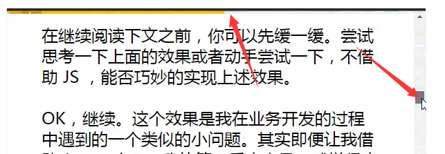

# CSS3知识点

### 1.画一条0.5px的线

（1）采用meta viewport的方式

```xml
<meta name="viewport" content="width=device-width, initial-scale=0.5, minimum-scale=0.5, maximum-scale=0.5"/>
```

这样子就能缩放到原来的0.5倍，如果是1px那么就会变成0.5px

要记得viewport只针对于移动端，只在移动端上才能看到效果

（2）采用transform: scale()的方式，在垂直方向缩小0.5

```css
transform: scale(0.5);
transform-origin: 50% 100%; // 要指定origin值, 要不然会模糊
```

### 2.CSS3新特性

（1）边框：border-radius、border-shadow、border-image

（2）渐变：Gradients、

（3）2D、3D：transform

（4）多媒体查询：

```xml
1.@media screen and (max-width: 699px) and (min-width: 520px)
2.<link rel="stylesheet" media="mediatype and|not|only (expressions)" href="print.css">
```

（5）CSS3弹性盒子

```css
.flex-container {
    display: -webkit-flex;
    display: flex;
    width: 400px;
    height: 250px;
    background-color: lightgrey;
}
 
.flex-item {
    background-color: cornflowerblue;
    width: 100px;
    height: 100px;
    margin: 10px;
}
<div class="flex-container">
  <div class="flex-item">flex item 1</div>
  <div class="flex-item">flex item 2</div>
  <div class="flex-item">flex item 3</div> 
</div>
```

### 2.Flex布局

https://juejin.im/post/6844903574929932301#heading-64

### 3.**css3三种动画**

（1）过渡：`transition`实现渐变动画

```css
transition: all 2s ease-in 500ms;
/*property:填写需要变化的css属性
duration:完成过渡效果需要的时间单位(s或者ms)
timing-function:完成效果的速度曲线（linear,ease,ease-in,ease-out等等）
delay:延迟时间（默认0）*/
```

（2）transform`转变动画`:2D和3D

```css
transform:scale(0.8, 1.5) rotate(35deg) skew(5deg) translate(15px, 25px);
/*rotate(angle)，2D 旋转，*/
rotate(x,y,z,angle)，3D旋转
/*缩放(scale) 分为2D和3D x,y,z是收缩比例
倾斜(skew)：主要用于对元素的样式倾斜
移动(translate)：主要用于将元素移动*/
```

（3）`animation`实现自定义动画，

```css
animation：动画名称，一个周期花费时间，运动曲线（默认ease），动画延迟（默认0），播放次数（默认1），是否反向播放动画（默认normal），是否暂停动画（默认running）

/*2秒后开始执行一次logo2-line动画，运动时间2秒，运动曲线为 linear*/
animation: logo2-line 2s linear 2s;
```

```css
&：hover{
		animation-name: bounce;
         animation-duration: 3s;
         animation-iteration-count: infinite;
     }
 }
@keyframes bounce{
     0% {
         top: 0px;
    }
     50% {
         top: 249px;
         width: 130px;
         height: 70px;
    }
     100% {
         top: 0px;
    }
}
/*name：需要绑定到选择器的keyframe名称。
duration：完成该动画需要花费的时间，秒或毫秒。
timing-function：跟transition-linear一样。
delay：设置动画在开始之前的延迟。
iteration-count：设置动画执行的次数，infinite为无限次循环。
direction：是否轮询反向播放动画。normal，默认值，动画应该正常播放；alternate，动画应该轮流反向播放。*/
```

### 4.css3选择器


### 5.box-shadow

```css
box-shadow: 水平阴影的位置 垂直阴影的位置 模糊距离 阴影的大小 阴影的颜色 阴影开始方向（默认是从里往外，设置inset就是从外往里）;
/*例子*/
box-shadow: 10px 10px 5px #888888;
```

### 6.boder-image

```css
border-image: 图片url 图像边界向内偏移 图像边界的宽度(默认为边框的宽度) 用于指定在边框外部绘制偏移的量（默认0） 铺满方式--重复（repeat）、拉伸（stretch）或铺满（round）（默认：拉伸（stretch））;
/*例子*/
border-image: url(border.png);
border-image-outset:0;/*图像边界向内偏移*/
border-image-width:20px;/*图像边界的宽度(默认为边框的宽度)*/
border-image-slice: 30;/*用于指定在边框外部绘制偏移的量（默认0）*/
border-image-repeat: round;/*铺满方式-铺满（round）*/
```

### 7.border-radius

```css
border-radius: n1,n2,n3,n4;
/*n1-n4四个值的顺序是：左上角，右上角，右下角，左下角。*/
```

### 8.bcakground-clip

```css
background-clip:border-box|padding-box|content-box/*制定背景绘制（显示）区域*/
border-box从边框开始绘制裁剪
padding-box从padding开始绘制，不算border
content-box只在内容区绘制（显示），不算padding和border，相当于把padding和border那里的背景给裁剪掉！
```

### 9.css3倒影

```css
-webkit-box-reflect:方向[ above-上 | below-下 | right-右 | left-左 ]，偏移量，遮罩图片
 -webkit-box-reflect: below;/*下倒影*/
```


```css
 -webkit-box-reflect: right 10px;/*右倒影且有偏移*/
 -webkit-box-reflect: below 0 linear-gradient(transparent, white);/*下倒影（图片遮罩）*/
```

### 10.background-size

```css
background-size:contain/*保持图像横纵比将图像缩放成适合北京 定位区域的最大大小*/
background-size:cover/*保持横纵比拉伸到和背景一样大铺满*/
background-size:auto 100%;background-repeat:repeat-x/*图像高度自适应，图片背景循环*/
background-size:400px;background-position:center/*背景宽度固定，高度自适应*/
```

### 11.text-overflow

```css
text-overflow:clip|ellipsis;/*clip:被裁剪；ellipse：超过省略号*/
```

多行省略

```css
div
{
    width:400px;/*固定盒子宽*/
    margin:0 auto;
    overflow : hidden;/*超出隐藏*/
    border:1px solid #ccc;
    text-overflow: ellipsis;/*文字溢出省略号*/
    padding:0 10px;
    display: -webkit-box;/*元素上设置该属性，可使其子代排列在同一水平上，类似display:inline-block;对象作为弹性伸缩盒子模型显示*/
    -webkit-line-clamp: 2;/*设置元素最大2行，必须配合display: -webkit-box;*/
    -webkit-box-orient: vertical;/*设置或检索伸缩盒对象的子元素的排列方式*/
    line-height:30px;/*固定行高*/
    height:60px;/*固定盒子高*/
}
```

### 12.text-shadow

```css
text-shadow:水平阴影，垂直阴影，模糊的距离，以及阴影的颜色
text-shadow: 0 0 10px #f00;
```

### 13.css3新颜色

```css
color: rgba(255,00,00,1);/*rgba:rgb为颜色值，a为透明度*/
color: hsla( 112, 72%, 33%, 0.68);/*hsla:h:色相，s：饱和度，l：亮度，a：透明度*/
```

### 14.滤镜和混合模式

```css
filter: grayscale(100%);/*黑白色*/
filter:sepia(1)/*褐色*/
filter:saturate(2);/*饱和度*/
filter:hue-rotate(90deg);/*色相旋转*/
filter:invert(1);/*反色*/
filter:opacity(.5);/*透明度*/
filter:brightness(.5);/*亮度*/
filter:contrast(2);/*对比度*/
filter:blur(3px);/*模糊*/
filter:drop-shadow(5px 5px 5px #000);/*阴影*/

/*background-blend-mode是用于同一个元素的背景图片和背景颜色的*/
background-blend-mode: multiply;/*正片叠底*/
background-blend-mode: screen;/*screen滤色*/
background-blend-mode: overlay;/*overlay叠加*/
background-blend-mode: darken;/*darken变暗*/
background-blend-mode: lighten;/*变亮*/
background-blend-mode: color-dodge;/*color-dodge颜色减淡模式*/
background-blend-mode: color-burn;/*颜色加深*/
background-blend-mode: hard-light;/*强光*/
background-blend-mode: soft-light;/*柔光*/
background-blend-mode: difference;/*差值*/
background-blend-mode: exclusion;/*排除*/
background-blend-mode: hue;/*hue色相*/
background-blend-mode: saturation;/*saturation饱和度*/
background-blend-mode: luminosity;/*luminosity亮度*/
```

### 15.媒体查询

媒体查询，就在监听屏幕尺寸的变化，在不同尺寸的时候显示不同的样式

```css
1.@media screen and (max-width: 960px) {
    body {
        background-color: darkgoldenrod;
    }
}
@media screen and (max-width: 480px) {
    body {
        background-color: lightgreen;
    }
}

2.<link rel="stylesheet" media="mediatype and|not|only (expressions)" href="print.css">
```


# CSS小技巧

### 1.css实现顶部进度条，随着页面滚动进度实现长短变化



```css
/*使用线性渐变来实现功能*/
/*整个body添加从左下角到右上角的线性渐变*/
body {
    background-image: linear-gradient(to right top, #ffcc00 50%, #eee 50%);
    background-repeat: no-repeat;
}

```


```css
/*运用一个伪元素，把多出来的部分遮住*/
body::after {
    content: "";
    position: fixed;
    top: 5px;
    left: 0;
    bottom: 0;
    right: 0;
    background: #fff;
    z-index: -1;
}
/*最后调整渐变高度*/
body {
    background-image: linear-gradient(to right top, #ffcc00 50%, #eee 50%);
    background-size: 100% calc(100% - 100vh + 5px);/*让滑动条和右上角贴合*/
    background-repeat: no-repeat;
}

```

[查看文章](https://juejin.cn/post/6844903758074216462)

