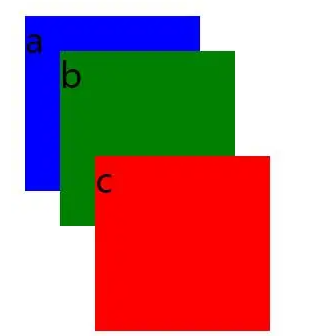
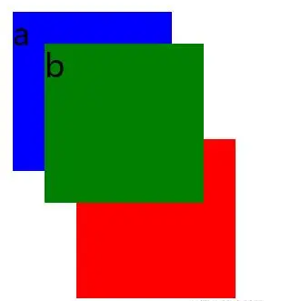

# CSS层叠上下文、层叠等级、层叠顺序、z-index详解

### 1.最初的理解

z-index就是一个元素在屏幕`Z轴`上的堆叠顺序。`z-index`值越大在`Z轴`上就越靠上，也就是离屏幕观察者越近

但是实际上的是并不不是只比较大小就可以判断显示,还与定位设置和其他因素有关

1.`z-index`属性仅在**定位元素（定义了`position`属性，且属性值为非`static`值的元素）上有效果。

2.判断元素在`Z轴`上的堆叠顺序，不仅仅是直接比较两个元素的`z-index`值的大小，这个堆叠顺序实际由元素的**层叠上下文**、**层叠等级**共同决定

### 2.什么是层叠上下文

层叠上下文(stacking context)，是HTML中一个三维的概念。在CSS2.1规范中，每个盒模型的位置是三维的，分别是平面画布上的`X轴`，`Y轴`以及表示层叠的`Z轴`。一般情况下，元素在页面上沿`X轴Y轴`平铺，我们察觉不到它们在`Z轴`上的层叠关系。而一旦元素发生堆叠，这时就能发现某个元素可能覆盖了另一个元素或者被另一个元素覆盖。

如果一个元素有层叠上下文，那就是距离观察者更近

### 3.什么是层叠等级

层叠等级(stacking level），描述的是层叠上下文元素在z轴上的位置

### 4.怎么产生层叠上下文

1. `HTML`中的根元素本身就具有层叠上下文，称为“根层叠上下文”。
2. 普通元素设置`position`属性为**非**`static`值并设置`z-index`属性为具体数值，产生层叠上下文。
3. CSS3中的新属性也可以产生层叠上下文。

举个栗子

（1）例子1：

```html
<style>
  div {  /*abc的父元素，没有设置z-index所以没有产生层叠上下文*/
    position: relative;  
    width: 100px;  
    height: 100px;  
  }  
  p {  
    position: absolute;  
    font-size: 20px;  
    width: 100px;  
    height: 100px;  
  }  
  .a {  /*abc都在根元素html中，所以是同一层级的层叠上下文，所以谁大谁就在上面*/
    background-color: blue;  
    z-index: 1;  
  }  
  .b {  
    background-color: green;  
    z-index: 2;  
    top: 20px;  
    left: 20px;  
  }  
  .c {  
    background-color: red;  
    z-index: 3;  
    top: -20px;  
    left: 40px;  
  }
</style>

<body>  
  <div>  
    <p class="a">a</p>  
    <p class="b">b</p>  
  </div> 

  <div>  
    <p class="c">c</p>  
  </div>  
</body> 
```



（2）例子2

```html
<style>
  div {
    width: 100px;
    height: 100px;
    position: relative;
  }
  .box1 {/*box1和box2都产生了层叠上下文，且box1更大，所以无论box2里面的元素的z-index多大，都不会在box1上面*/
    z-index: 2;
  }
  .box2 {
    z-index: 1;
  }
  p {
    position: absolute;
    font-size: 20px;
    width: 100px;
    height: 100px;
  }
  .a {/*ab在同一个层级上下文里面，所以谁大谁在上面*/
    background-color: blue;
    z-index: 100;
  }
  .b {
    background-color: green;
    top: 20px;
    left: 20px;
    z-index: 200;
  }
  .c {
    background-color: red;
    top: -20px;
    left: 40px;
    z-index: 9999;
  }
</style>

<body>
  <div class="box1">
    <p class="a">a</p>
    <p class="b">b</p>
  </div>

  <div class="box2">
    <p class="c">c</p>
  </div>
</body>
```



### 5.什么是层叠顺序

“层叠顺序”(stacking order)表示元素发生层叠时按照特定的顺序规则在`Z轴`上垂直显示

**“层叠上下文”和“层叠等级”是一种概念，而“层叠顺序”是一种规则**

当元素发生层叠时，遵循如下规则

```js
层叠上下文的background/border < z-index<0 < block块级水平盒子 < float浮动盒子 < inline/inline-block水平盒子 < z-index:auto/index:0 < z-index>0
```

注意

（1）`inline/inline-block`元素的层叠顺序要高于`block`(块级)/`float`(浮动)元素；

（2）`z-index: auto`和`z-index: 0`在同一层级，但这两个属性值本身是有根本区别的

### 6.CSS3中的属性对层叠上下文的影响

1. 父元素的display属性值为`flex|inline-flex`，子元素`z-index`属性值不为`auto`的时候，子元素为层叠上下文元素；
2. 元素的`opacity`属性值不是`1`；
3. 元素的`transform`属性值不是`none`；
4. 元素`mix-blend-mode属性值不是`normal`；
5. 元素的`filter`属性值不是`none`；
6. 元素的`isolation`属性值是`isolate`；
7. `will-change`指定的属性值为上面任意一个；
8. 元素的`-webkit-overflow-scrolling`属性值设置为`touch`。

CSS3中，元素属性满足以上条件之一，就会产生层叠上下文。

举个栗子

```html
<style>
  .box {
  }
  .parent {
    width: 200px;
    height: 100px;
    background: #168bf5;
    /* 虽然设置了z-index，但是没有设置position，z-index无效，.parent还是普通元素，没有产生层叠上下文 */
    z-index: 1;
  }/*.parent还是普通的块级元素，在层叠顺序规则中，z-index值小于0的.child会被普通的block块级元素.parent覆盖*/
  .child {
    width: 100px;
    height: 200px;
    background: #32d19c;
    position: relative;
    z-index: -1;
  }
</style>
</head>

<body>
  <div class="box">
    <div class="parent">
      parent
      <div class="child">child</div>
    </div>
  </div>
</body>
/*最终结果：parent在child上面*/
```

```css
/*修改上栗的.box修改成flex布局，其余DOM结构不变*/
.box {
  display: flex;/* 当给.box设置display: flex时，.parent就变成层叠上下文元素，根据层叠顺序规则，层叠上下文元素的background/border的层叠等级小于z-index值小于0的元素的层叠等级，所以z-index值为-1的.child在.parent上面。*/
}
/*最后效果：child在parent上面*/
```

### 7.原文学习地址

1. [原文地址](https://juejin.cn/post/6844903667175260174)

2. [张鑫旭-《深入理解CSS中的层叠上下文和层叠顺序》](https://www.zhangxinxu.com/wordpress/2016/01/understand-css-stacking-context-order-z-index/)