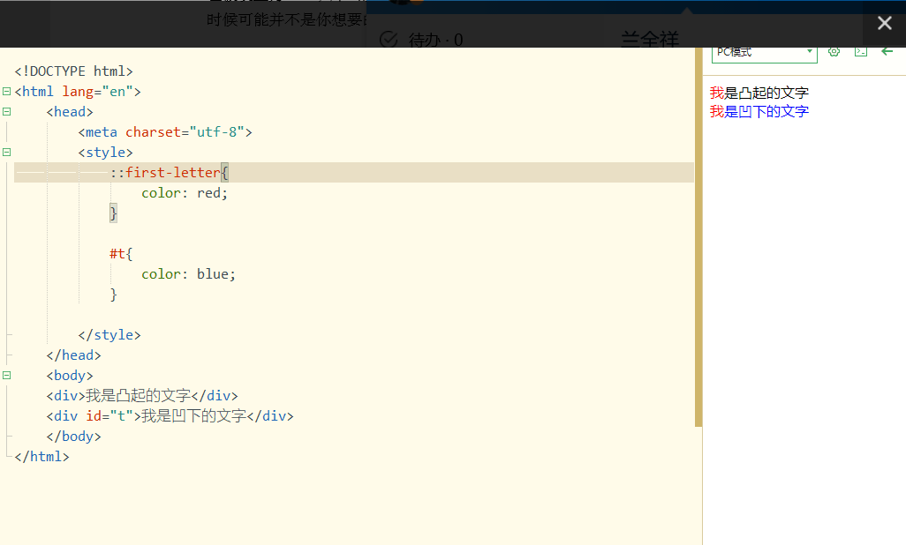
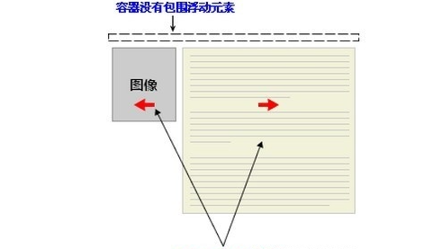
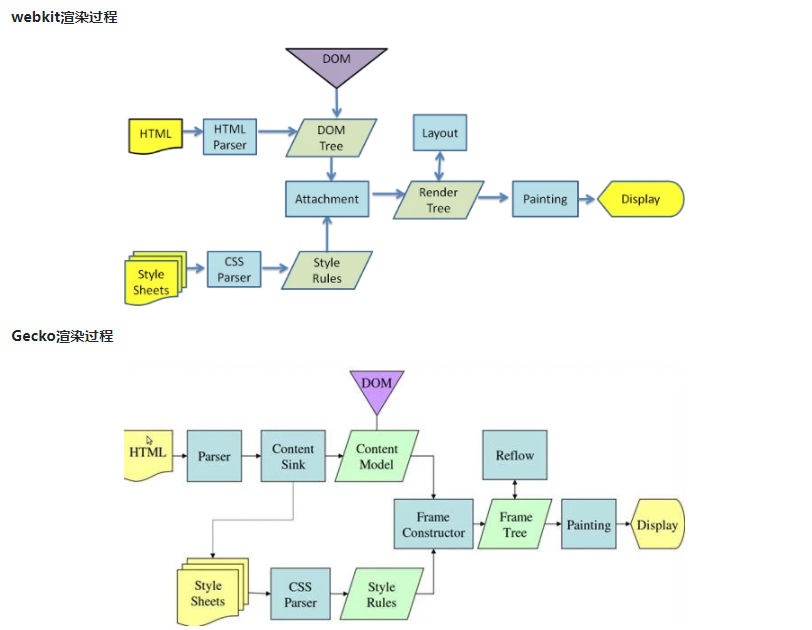
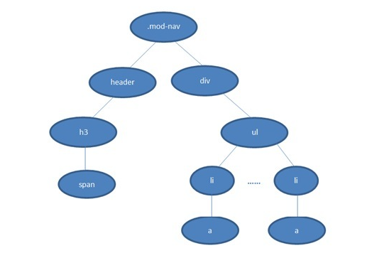
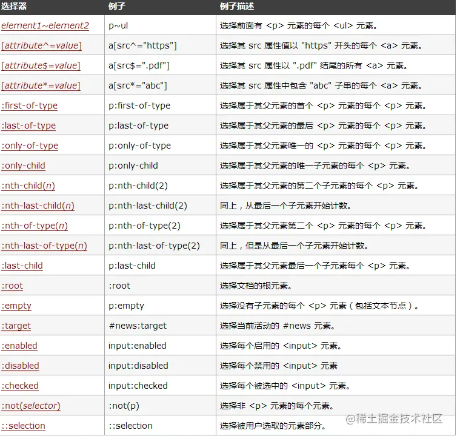
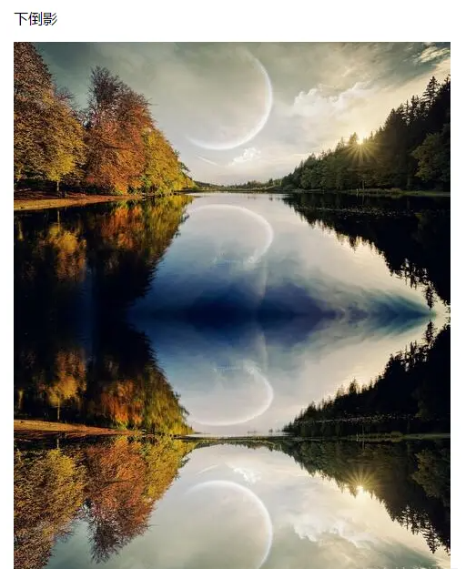
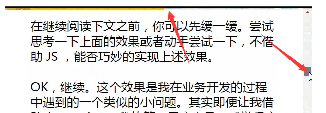
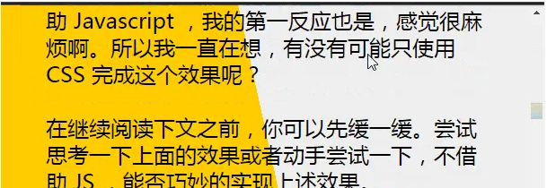

# CSS知识点

### 1.经典垂直居中

```css
/* 方法一 flex布局 */
body{
	display: flex;
	justify-content: center;
	align-items: center;
	height: 100vh;
} 
			
/* 方法二 绝对定位+transform: 不需要知道自身尺寸*/
 .one{
	width: 100px;
	height: 100px;
	border: 1px solid red;
	position: absolute;
	top: 50%;
	left: 50%;
	transform: translate(-50%,-50%);				
}
/* //方法三 子绝父相:必须知道自身尺寸*/
 .one{
	width: 100px;
	height: 100px;
	border: 1px solid red;
	position: absolute;
	top: 50%;
	left: 50%;
	margin-top: -50px;				
}
	
/* //方法四 子绝父相 类似方法二*/
	.one{
		width: 100px;
		height: 100px;
		border: 1px solid red;
		background-color: red;
		position: absolute;
		top: 50%;
		left: 50%;
		transform: translateY(-50%);				
	}
	/* 方法五 margin：auto*/
	.one{
		width: 100px;
		height: 100px;
		border: 1px solid red;
		background-color: red;
		position: absolute;
		top:0;
		buttom:0;
		left:0;
		right:0;
		margin:auto;
	}
	/*方法六*/
	body{
		display: table;
	}
	.one{
		width: 100px;
		height: 100px;
		border: 1px solid red;
		display: table-cell;
		vertical-align: center;/*vertical-align属性只对拥有valign特性的html元素起作用，例如表格元素中的<td><th>等等，而像<div><span>这样的元素是不行的。*/
} 
```

### 2.::first-letter和其他选择器




**为什么第一个字不会被class选择器和id选择器的颜色覆盖？**

**原因：**伪元素能在文档中插入假想元素从而的到某种效果,相当于在“我”两边加上了``标签，而``对于父级是继承关系，继承是没有优先级，所以被伪元素选择器覆盖了，显示成这个样子，有种降维打击的感觉。

**颜色等权重永远最高**
这是非常容易犯的一个错误，也是CSS世界10大不理解问题之一。

```html
p:first-letter {
    color: red;
}
p > span {
    color: blue !important;
}
<p><span>第一个</span>字符看看会不会变红？</p>
```

请问“第”这个字符的颜色是什么？

基本上，超过95%的前端小伙伴会认为是`blue`，因为大家都是从CSS选择器权重的角度去考虑的，本身是没问题，但是却忽略了很重要的一个点，`::first-letter`伪元素其实是作为子元素存在的，或者说应当看出是子元素，于是，就很好理解了，对于类似`color`这样的继承属性，子元素的CSS设置一定比父元素的级别要高，哪怕父级使用了重量级的`!important`，因为子元素会先继承，然后再应用自身设置，所以，上面CSS和HTML的最终结果是，第一个字符“第”字的颜色是`red`红色！

这就是`::first-letter`伪元素的另外一个重要特性，颜色等权重永远最高。

### 3.块级元素，行内元素，行内块元素对比

| 元素模式 | 元素排列     | 设置样式     | 默认宽度       | 包含                     |
| -------- | ------------ | ------------ | -------------- | ------------------------ |
| 块级元素 | 一行一个     | 可以设置宽高 | 容器的100%     | 容器级可以包含任何的标签 |
| 行内元素 | 一行可以多个 | 不可设置宽高 | 本身内容的宽度 | 文本或者其他行内元素     |
| 行内块   | 一行可以多个 | 可以设置宽高 | 本身内容的宽度 |                          |

### 4.CSS清除浮动

**举个例子**

```css
.news {
  	background-color: gray;
 	border: solid 1px black;
 }

.news img {
  	float: left;
 }

.news p {
  float: right;
 }

<div class="news">

<p>some text</p>
</div>
```



上述例子图片和文本都没有在div里面了，因为图片和文本都进行了浮动，打乱了原本的结构，造成了父元素高度塌陷，

浮动还会造成以至于父元素很多像背景颜色，边框等都不能正确的显示出来，同级子元素的位置不对等问题

#### （1）使用带clear的空元素

```css
.news {
 	background-color: gray;
 	border: solid 1px black;
}

.news img {
 	float: left;
}

.news p {
  	float: right;
 }

.clear { /*给新的空元素加clear:both*/
  	clear: both;
 }

<div class="news">

<p>some text</p>
<div class="clear"></div> //新加空元素
</div>
```

#### （2）给父容器加overflow：hidden属性

```css
.news {
  background-color: gray;
  border: solid 1px black;
  overflow: hidden; /*给浮动元素的容器添加overflow:hidden;或overflow:auto;可以清除浮动*/
  *zoom: 1; /*IE6 中还需要触发 hasLayout ，例如为父元素设置容器宽高或设置 zoom:1*/
  }

.news img {
  float: left;
  }

.news p {
  float: right;
  }

<div class="news">

<p>some text</p>
</div>
```

#### （3）给父容器加浮动，全部浮动，但是会影响布局

#### （4）:after伪元素

```css
.news img {
  float: left;
  }

.news p {
  float: right;
  }

.clearfix:after{ /*新增伪元素*/
  content: "020"; 
  display: block; 
  height: 0; 
  clear: both; 
  visibility: hidden;  
  }

.clearfix {
  /* 触发 hasLayout IE6 */ 
  zoom: 1; 
  }

<div class="news clearfix">// 给父元素加个类名

<p>some text</p>
</div>
```

#### （5）给父元素设置高度

### 5.渐进增强与正常降级之间的区别

```css
/*渐进增强（progressive enhancement）*/
.transition{
  -webkit-transition: all .5s;
     -moz-transition: all .5s;
       -o-transition: all .5s;
          transition: all .5s;  
}
```

```css
/*优雅降级*/
.transition{ 
　　     transition: all .5s;
　　  -o-transition: all .5s;
  　-moz-transition: all .5s;
 -webkit-transition: all .5s;
}
```

渐进增强（progressive enhancement）：**先对低版本浏览器进行操作，再对高级浏览器进行效果展示**

优雅降级（graceful degradation）：**一开始就构建完整的功能，然后再针对低版本浏览器进行兼容**。

区别：优雅降级是从复杂的现状开始，并试图减少用户体验的供给，而渐进增强则是从一个非常基础的、能够起作用的版本开始，并不断扩充，以适应未来环境的需要。

### 6.BFC（块级格式化上下文）

如何创建BFC
1、float的值不是none。
2、position的值不是static或者relative。
3、display的值是inline-block、table-cell、flex、table-caption或者inline-flex
4、overflow的值不是visible

### 7.vh vw rem px

vh:相当于视口的高度，视口被均分为100单位的vh

```js
font-size:8vh;//如果视口的高度是200mm，那么上述代码中h1元素的字号将为16mm，即(8x200)/100
```

vm:相对于视口的宽度，视口被均分为100单位的vw

```js
font-size:8vw;//如果视口的高度是200mm，那么上述代码中h1元素的字号将为16mm，即(8x200)/100
```

rem：相对长度单位，相对于根元素(即html元素)[font-size](https://www.html.cn/book/css/properties/font/font-size.htm)计算值的倍数

```css
html{
	font-size:12px;
}
h1{
	font-size:2rem;//表示24px
}
```

px：像素

### 7.CSS可继承元素

颜色，文字，字体间距行高对齐方式，和列表的样式可以继承。 

所有元素可继承：visibility和cursor。 

内联元素可继承：letter-spacing、word-spacing、white-space、line-height、color、font、font-family、font-size、font-style、font-variant、font-weight、text-decoration、text-transform、direction。 

终端块状元素可继承：text-indent和text-align。 

列表元素可继承：list-style、list-style-type、list-style-position、list-style-image。

### 8.行内(inline)元素 设置margin-top和margin-bottom 是否起作用?

不起作用

### 9.对内联元素设置padding-top和padding-bottom是否会增加它的高度?

不会

### 10.设置p的font-size:10rem，当用户重置或拖曳浏览器窗口时，文本大小是否会也随着变化?

rem是以html根元素中font-size的大小为基准的相对度量单位，文本的大小不会随着窗口的大小改变而改变。

### 11.CSS加载会造成阻塞吗？

从浏览器的渲染过程来看



1. css加载不会阻塞DOM树的解析【DOM解析和CSS解析是两个并行的过程】
2. css加载会阻塞DOM树的渲染【Render树在解析之后】
3. css加载会阻塞后面js语句的执行【js可能会操作DOM和CSS样式，所以应该维持顺序，先HTML，CSS再js】

为了避免让用户看到长时间的白屏时间，我们应该尽可能的提高css加载速度

方法：

1. 使用CDN(因为CDN会根据你的网络状况，替你挑选最近的一个具有缓存内容的节点为你提供资源，因此可以减少加载时间)
2. 对css进行压缩(可以用很多打包工具，比如webpack,gulp等，也可以通过开启gzip压缩)
3. 合理的使用缓存(设置cache-control,expires,以及E-tag都是不错的，不过要注意一个问题，就是文件更新后，你要避免缓存而带来的影响。其中一个解决防范是在文件名字后面加一个版本号)
4. 减少http请求数，将多个css文件合并，或者是干脆直接写成内联样式(内联样式的一个缺点就是不能缓存)

### 12.white-space,word-break,word-wrap(overflow-wrap)

`white-space:normal|nowrap|pre|pre-wrap|pre-line;`**控制空白字符显示**

```css
white-space:nowrap;/*空格被合并成一个空格，永不换行*/
white-space:pre/*保留空格，但是自动换行没有了*/
white-space:pre-wrap;/*保留空格和换行*/
white-space:pre-line;/*空格被合并了，但是换行符可以发挥作用*/
```

| 能否发挥作用 | 换行符   | 空格   | 自动换行     | &nbsp |
| ------------ | -------- | ------ | ------------ | ----- |
| normal       | 不能换行 | 被合并 | 可以自动换行 | √     |
| nowrap       | 不能换行 | 被合并 | 不能自动换行 | √     |
| pre          | 可以换行 | 保留   | 不能自动换行 | √     |
| pre-wrap     | 可以换行 | 保留   | 可以自动换行 | √     |
| pre-line     | 可以换行 | 被合并 | 可以自动换行 | √     |

`word-break:normal|break-all|keep-all`，**控制单词如何被拆分换行的**

```css
word-break:keep-all;/*单词不拆分换行，只有空格会拆分换行*/
word-break:break-all;/*所有单词碰到边界一律拆分换行,可能一个单词会被拆在两行显示，无论长短*/
```

`word-wrap（overflow-wrap）:normal|break-word`**超过一行的单词是否被拆分换行的,作为word-break的互补**

```css
word-wrap:break-word;/*当一个单词一整行都显示不下的时候，才显示换行*/
```

其实word-break也有break-word属性值，但是只有chrome和safari部分浏览器支持

### 13.三栏布局

#### （1）绝对定位

```css
.left {
    position: absolute;
    top: 0;
    left: 0;
    width: 100px;
    background-color: #f00;
}
.right {
    position: absolute;
    top: 0;
    right: 0;
    width: 200px;
    background-color: #00f;
}
.main {
    position: absolute;
    top: 0;
    left: 100px;
    right: 200px;
    background-color: #0f0;
}
```

#### （2）flex布局

```css
.container {
    display: flex;
}
.left {
    flex: 0 0 100px;
    background-color: #f00;
}
.main {
    flex: 1;
    background-color: #0f0;
}
.right {
    flex: 0 0 200px;//放大缩小真实大小
    background-color: #00f;
}
```

#### （3）table

```css
.container {
    display: table;
}
.left {
    display: table-cell;
    width: 100px;
    background-color: #f00;
}
.right {
    display: table-cell;
    width: 200px;
    background-color: #00f;
}
.main {
    display: table-cell;
    background-color: #0f0;
}
```

#### （4）grid布局

```css
.container {
    display: grid;
   grid-template-columns: 100px 1fr 100px;
}
.left {
   background: red;
}
.right {
    background-color: #00f;
}
.main {
    background-color: #0f0;
}
```

### 14.盒子模型

box-sizing

1.标准：content-box

设置宽高就是设置content ，加上padding border再加上宽高决定整个盒子大小

2.怪异：（IE）border-box

设置宽高决定了元素的边框盒，content内容包含了padding和border

3.box-sizing: inherit;

规定应从父元素继承 box-sizing 属性的值。

### 15.css样式优先级

**!important > 行内样式>ID选择器 > 类选择器 > 标签 > 通配符 > 继承 > 浏览器默认属性**

为什么从右往左遍历选择器？

因为是DOM形状的结构，从左往右相当于从上往下找，不符合就换那样会有性能浪费



### 16.什么是 FOUC（无样式内容闪烁）？你如何来避免 FOUC？

**FOUC - Flash Of Unstyled Content \**文档样式闪烁\****

如果使用import方法对CSS进行导入,会导致某些页面在Windows 下的Internet Explorer出现一些奇怪的现象:以无样式显示页面内容的瞬间闪烁,这种现象称之为文档样式短暂失效(Flash of Unstyled Content),简称为FOUC。

原因大致为：

1，使用import方法导入样式表。

2，将样式表放在页面底部

3，有几个样式表，放在html结构的不同位置。

其实原理很清楚：当样式表晚于结构性html加载，当加载到此样式表时，页面将停止之前的渲染。此样式表被下载和解析后，将重新渲染页面，也就出现了短暂的花屏现象。

解决方法：

使用LINK标签将样式表放在文档head中。

### 17.css动画和js动画优缺点比较

| 优缺点 | js动画                                                       | css动画                                                      |
| ------ | ------------------------------------------------------------ | ------------------------------------------------------------ |
| 缺点   | (1)JavaScript在浏览器的主线程中运行，而主线程中还有其它需要运行的JavaScript脚本、样式计算、布局、绘制任务等,对其干扰导致线程**可能出现阻塞，从而造成丢帧的情况**。 | (1)运行**过程控制较弱**,无法附加事件绑定回调函数。CSS动画只能暂停,不能在动画中寻找一个特定的时间点，不能在半路反转动画，不能变换时间尺度，不能在特定的位置添加回调函数或是绑定回放事件,无进度报告 |
|        | (2)代码的**复杂度高**于CSS动画                               | (2)**代码冗长**。想用 CSS 实现稍微复杂一点动画,最后CSS代码都会变得非常笨重。 |
| 优点   | (1)JavaScript动画**控制能力很强**, 可以在动画播放过程中对动画进行控制：开始、暂停、回放、终止、取消都是可以做到的。 | **集中所有DOM，一次重绘重排，刷新频率和浏览器刷新频率相同**。 |
|        | (2)动画效果比css3**动画丰富**,                               | **代码简单，方便调优**                                       |
|        | (3)CSS3有兼容性问题，而JS大多时候**没有兼容性问题**          | **不可见元素不参与重排，节约cpu**，.可以使用硬件加速GPU(translateZ(0)) |

### CSS动画比JS流畅的前提：

- JS在执行一些昂贵的任务

- 同时CSS动画不触发layout或paint
  在CSS动画或JS动画触发了paint或layout时，需要main thread进行Layer树的重计算，这时CSS动画或JS动画都会阻塞后续操作。

   只有如下属性的修改才符合“仅触发Composite，不触发layout或paint”：

- backface-visibility

- opacity

- perspective

- perspective-origin

- transfrom

所以只有用上了3D加速或修改opacity时，css3动画的优势才会体现出来

所以动画简单可以使用css,动画复杂，效果繁琐的使用js

# CSS3知识点

### 1.画一条0.5px的线

（1）采用meta viewport的方式

```xml
<meta name="viewport" content="width=device-width, initial-scale=0.5, minimum-scale=0.5, maximum-scale=0.5"/>
```

这样子就能缩放到原来的0.5倍，如果是1px那么就会变成0.5px

要记得viewport只针对于移动端，只在移动端上才能看到效果

（2）采用transform: scale()的方式，在垂直方向缩小0.5

```css
transform: scale(0.5);
transform-origin: 50% 100%; // 要指定origin值, 要不然会模糊
```

### 2.CSS3新特性

（1）边框：border-radius、border-shadow、border-image

（2）渐变：Gradients、

（3）2D、3D：transform

（4）多媒体查询：

```xml
1.@media screen and (max-width: 699px) and (min-width: 520px)
2.<link rel="stylesheet" media="mediatype and|not|only (expressions)" href="print.css">
```

（5）CSS3弹性盒子

```css
.flex-container {
    display: -webkit-flex;
    display: flex;
    width: 400px;
    height: 250px;
    background-color: lightgrey;
}
 
.flex-item {
    background-color: cornflowerblue;
    width: 100px;
    height: 100px;
    margin: 10px;
}
<div class="flex-container">
  <div class="flex-item">flex item 1</div>
  <div class="flex-item">flex item 2</div>
  <div class="flex-item">flex item 3</div> 
</div>
```

### 2.Flex布局

https://juejin.im/post/6844903574929932301#heading-64

### 3.**css3三种动画**

（1）过渡：`transition`实现渐变动画

```css
transition: all 2s ease-in 500ms;
/*property:填写需要变化的css属性
duration:完成过渡效果需要的时间单位(s或者ms)
timing-function:完成效果的速度曲线（linear,ease,ease-in,ease-out等等）
delay:延迟时间（默认0）*/
```

（2）transform`转变动画`:2D和3D

```css
transform:scale(0.8, 1.5) rotate(35deg) skew(5deg) translate(15px, 25px);
/*rotate(angle)，2D 旋转，*/
rotate(x,y,z,angle)，3D旋转
/*缩放(scale) 分为2D和3D x,y,z是收缩比例
倾斜(skew)：主要用于对元素的样式倾斜
移动(translate)：主要用于将元素移动*/
```

（3）`animation`实现自定义动画，

```css
animation：动画名称，一个周期花费时间，运动曲线（默认ease），动画延迟（默认0），播放次数（默认1），是否反向播放动画（默认normal），是否暂停动画（默认running）

/*2秒后开始执行一次logo2-line动画，运动时间2秒，运动曲线为 linear*/
animation: logo2-line 2s linear 2s;
```

```css
&：hover{
		animation-name: bounce;
         animation-duration: 3s;
         animation-iteration-count: infinite;
     }
 }
@keyframes bounce{
     0% {
         top: 0px;
    }
     50% {
         top: 249px;
         width: 130px;
         height: 70px;
    }
     100% {
         top: 0px;
    }
}
/*name：需要绑定到选择器的keyframe名称。
duration：完成该动画需要花费的时间，秒或毫秒。
timing-function：跟transition-linear一样。
delay：设置动画在开始之前的延迟。
iteration-count：设置动画执行的次数，infinite为无限次循环。
direction：是否轮询反向播放动画。normal，默认值，动画应该正常播放；alternate，动画应该轮流反向播放。*/
```

### 4.css3选择器



### 5.box-shadow

```css
box-shadow: 水平阴影的位置 垂直阴影的位置 模糊距离 阴影的大小 阴影的颜色 阴影开始方向（默认是从里往外，设置inset就是从外往里）;
/*例子*/
box-shadow: 10px 10px 5px #888888;
```

### 6.boder-image

```css
border-image: 图片url 图像边界向内偏移 图像边界的宽度(默认为边框的宽度) 用于指定在边框外部绘制偏移的量（默认0） 铺满方式--重复（repeat）、拉伸（stretch）或铺满（round）（默认：拉伸（stretch））;
/*例子*/
border-image: url(border.png);
border-image-outset:0;/*图像边界向内偏移*/
border-image-width:20px;/*图像边界的宽度(默认为边框的宽度)*/
border-image-slice: 30;/*用于指定在边框外部绘制偏移的量（默认0）*/
border-image-repeat: round;/*铺满方式-铺满（round）*/
```

### 7.border-radius

```css
border-radius: n1,n2,n3,n4;
/*n1-n4四个值的顺序是：左上角，右上角，右下角，左下角。*/
```

### 8.bcakground-clip

```css
background-clip:border-box|padding-box|content-box/*制定背景绘制（显示）区域*/
border-box从边框开始绘制裁剪
padding-box从padding开始绘制，不算border
content-box只在内容区绘制（显示），不算padding和border，相当于把padding和border那里的背景给裁剪掉！
```

### 9.css3倒影

```css
-webkit-box-reflect:方向[ above-上 | below-下 | right-右 | left-左 ]，偏移量，遮罩图片
 -webkit-box-reflect: below;/*下倒影*/
```



```css
 -webkit-box-reflect: right 10px;/*右倒影且有偏移*/
 -webkit-box-reflect: below 0 linear-gradient(transparent, white);/*下倒影（图片遮罩）*/
```

### 10.background-size

```css
background-size:contain/*保持图像横纵比将图像缩放成适合北京 定位区域的最大大小*/
background-size:cover/*保持横纵比拉伸到和背景一样大铺满*/
background-size:auto 100%;background-repeat:repeat-x/*图像高度自适应，图片背景循环*/
background-size:400px;background-position:center/*背景宽度固定，高度自适应*/
```

### 11.text-overflow

```css
text-overflow:clip|ellipsis;/*clip:被裁剪；ellipse：超过省略号*/
```

多行省略

```css
div
{
    width:400px;/*固定盒子宽*/
    margin:0 auto;
    overflow : hidden;/*超出隐藏*/
    border:1px solid #ccc;
    text-overflow: ellipsis;/*文字溢出省略号*/
    padding:0 10px;
    display: -webkit-box;/*元素上设置该属性，可使其子代排列在同一水平上，类似display:inline-block;对象作为弹性伸缩盒子模型显示*/
    -webkit-line-clamp: 2;/*设置元素最大2行，必须配合display: -webkit-box;*/
    -webkit-box-orient: vertical;/*设置或检索伸缩盒对象的子元素的排列方式*/
    line-height:30px;/*固定行高*/
    height:60px;/*固定盒子高*/
}
```

### 12.text-shadow

```css
text-shadow:水平阴影，垂直阴影，模糊的距离，以及阴影的颜色
text-shadow: 0 0 10px #f00;
```

### 13.css3新颜色

```css
color: rgba(255,00,00,1);/*rgba:rgb为颜色值，a为透明度*/
color: hsla( 112, 72%, 33%, 0.68);/*hsla:h:色相，s：饱和度，l：亮度，a：透明度*/
```

### 14.滤镜和混合模式

```css
filter: grayscale(100%);/*黑白色*/
filter:sepia(1)/*褐色*/
filter:saturate(2);/*饱和度*/
filter:hue-rotate(90deg);/*色相旋转*/
filter:invert(1);/*反色*/
filter:opacity(.5);/*透明度*/
filter:brightness(.5);/*亮度*/
filter:contrast(2);/*对比度*/
filter:blur(3px);/*模糊*/
filter:drop-shadow(5px 5px 5px #000);/*阴影*/

/*background-blend-mode是用于同一个元素的背景图片和背景颜色的*/
background-blend-mode: multiply;/*正片叠底*/
background-blend-mode: screen;/*screen滤色*/
background-blend-mode: overlay;/*overlay叠加*/
background-blend-mode: darken;/*darken变暗*/
background-blend-mode: lighten;/*变亮*/
background-blend-mode: color-dodge;/*color-dodge颜色减淡模式*/
background-blend-mode: color-burn;/*颜色加深*/
background-blend-mode: hard-light;/*强光*/
background-blend-mode: soft-light;/*柔光*/
background-blend-mode: difference;/*差值*/
background-blend-mode: exclusion;/*排除*/
background-blend-mode: hue;/*hue色相*/
background-blend-mode: saturation;/*saturation饱和度*/
background-blend-mode: luminosity;/*luminosity亮度*/
```

### 15.媒体查询

媒体查询，就在监听屏幕尺寸的变化，在不同尺寸的时候显示不同的样式

```css
1.@media screen and (max-width: 960px) {
    body {
        background-color: darkgoldenrod;
    }
}
@media screen and (max-width: 480px) {
    body {
        background-color: lightgreen;
    }
}

2.<link rel="stylesheet" media="mediatype and|not|only (expressions)" href="print.css">
```


# CSS小技巧

### 1.css实现顶部进度条，随着页面滚动进度实现长短变化



```css
/*使用线性渐变来实现功能*/
/*整个body添加从左下角到右上角的线性渐变*/
body {
    background-image: linear-gradient(to right top, #ffcc00 50%, #eee 50%);
    background-repeat: no-repeat;
}

```



```css
/*运用一个伪元素，把多出来的部分遮住*/
body::after {
    content: "";
    position: fixed;
    top: 5px;
    left: 0;
    bottom: 0;
    right: 0;
    background: #fff;
    z-index: -1;
}
/*最后调整渐变高度*/
body {
    background-image: linear-gradient(to right top, #ffcc00 50%, #eee 50%);
    background-size: 100% calc(100% - 100vh + 5px);/*让滑动条和右上角贴合*/
    background-repeat: no-repeat;
}

```

[查看文章](https://juejin.cn/post/6844903758074216462)

