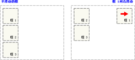
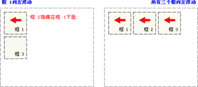
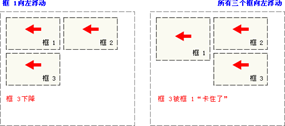

## HTML知识点

### 1.doctype的作用

主要作用是告诉浏览器的解析器使用哪种HTML规范或者XHTML规范来解析页面。

Doctype可声明三种DTD类型，分别表示严格版本、过渡版本以及基于框架的 HTML 文档。

在W3C标准出来之前，不同的浏览器对页面渲染有不同的标准，产生了一定的差异。这种渲染方式叫做混杂模式（兼容模式：向后兼容，模拟老式浏览器，防止浏览器无法兼容页面。）。

在W3C标准出来之后，浏览器对页面的渲染有了统一的标准，这种渲染方式叫做标准模式（严格模式：排版和JS 运作模式是 以该浏览器支持的最高标准运行。）

<!DOCTYPE>不存在或者形式不正确会导致HTML或XHTML文档以混杂模式呈现


### 2.tr and td

行标记tr及属性（**没有宽度属性**）

（1）行高度height（2）行的边框颜色bordercolor（3）行的背景颜色bgcolor

（4）行的对齐方式align（5）行的垂直对其方式valign

单元格td属性（**没有边框颜色**）

（1）高度height、宽度width（2）背景颜色bgcolor（3）背景图片background

（4）对齐方式align（5）垂直对其方式valign

（6）水平跨度colspan（7）垂直跨度rowspan（8）表头标记th与td类似

### 3.隐藏域的作用和用法

<input type="hidden" name="" value="">

隐藏域在页面中对于用户是不可见的，在表单中插入隐藏域的目的在于收集或发送信息，以利于被处理表单的程序所使用。浏览者单击发送按钮发送表单的时候，隐藏域的信息也被一起发送到服务器。 

1. 添加用户信息，提交表单时提交上来以确定用户身份，如sessionkey，等等．当然这些东西也能用cookie实现，但使用隐藏域就简单的多了．而且不会有浏览器不支持，用户禁用cookie的烦恼。 
2. 有些时候一个form里有多个提交按钮，怎样使程序能够分清楚到底用户是按那一个按钮提交上来的呢？我们就可以写一个隐藏域，然后在每一个按钮 处加上onclick="document.form.command.value="xx""然后我们接到数据后先检查command的值就会知道用户 是按的那个按钮提交上来的。 
3. 有时候一个网页中有多个form，我们知道多个form是不能同时提交的，但有时这些form确实相互作用，我们就可以在form中添加隐藏域来使它们联系起来。 
4. javascript不支持全局变量，但有时我们必须用全局变量，我们就可以把值先存在隐藏域里，它的值就不会丢失了。 
5. 还有个例子，比如按一个按钮弹出四个小窗口，当点击其中的一个小窗口时其他三个自动关闭．可是IE不支持小窗口相互调用，所以只有在父窗口写个隐藏域，当小窗口看到那个隐藏域的值是close时就自己关掉

### 4.iframe是什么？有什么缺点？

定义：iframe元素会创建包含另一个文档的内联框架

提示：可以将提示文字放在<iframe></iframe>之间，来提示某些不支持iframe的浏览器

缺点：

会阻塞主页面的onload事件

搜索引擎无法解读这种页面，不利于SEO（搜索引擎优化）

iframe和主页面共享连接池，而浏览器对相同区域有限制所以会影响性能。

### 5.锚t

```
<a name="tips">基本的注意事项 - 有用的提示</a>
```

然后，我们在同一个文档中创建指向该锚的链接：

```
<a href="#tips">有用的提示</a>
```

### 6.定位

| 描述     |                                                              |
| -------- | ------------------------------------------------------------ |
| absolute | **绝对定位**；脱离⽂档流的布局，遗留下来的空间由后⾯的元素填充。定位的起始位置为最近的⽗元素(postion不为static)，否则为Body⽂档本身。 |
| relative | **相对定位**；不脱离⽂档流的布局，只改变⾃身的位置，在⽂档流原先的位置遗留空⽩区域。定位的起始位置为此元素原先在⽂档流的位置。 |
| fixed    | **固定定位**；类似于absolute，但不随着滚动条的移动⽽改变位置。 |
| static   | **默认值；默认布局。** **忽略 top, bottom, left, right和z-index** |
| inherit  | **从父元素继承**该属性的值                                   |

以上的`absolute` 和`fixed` 可以使得元素脱离文档流。

浮动会脱离文档流







clear:定段落的左侧或右侧不允许浮动的元素

```
div p h1 form ul 是块级元素
```

```
span a label input img em是内联元素
```

### 7.居中

单行内容垂直居中

- 设置行高和元素高度，且两者相等,设置over-flow:hidden

- text-algin:center

多行内容垂直居中

内部文字span包裹，设置为行内块 display:inline-block

外部div块固定宽，使用line-height 设置高度

### 8.用通俗的语言解释REST，以及RESTful

URL定位资源，用HTTP动词（GET,POST,DELETE,DETC）描述操作

### 9.meta

所有浏览器支持

<meta> 元素可提供有关页面的元信息（meta-information），比如针对搜索引擎和更新频度的描述和关键词。
<meta> 标签位于head，不包含任何内容。<meta> 标签的属性定义了与文档相关联的名称/值对。

http-equiv 属性：`http`的文件头作用，它可以向浏览器传回一些有用的信息

比如：content-type:text/html。这将告诉浏览器准备接受一个 HTML 文档

name 属性：name 属性提供了名称/值对中的名称。告诉搜索引擎当前页面关键字（方便被搜索）

### 10.解释Cookie，会话存储和本地存储之间的区别？

本地存储**：（本地存储必须是**字符串**类型的，如果是想要存对象，需要先将对象转换成字符串来存储）

- 通过本地存储（Local Storage），web 应用程序能够在用户浏览器中对数据进行本地的存储。
- 在 HTML5 之前，应用程序数据只能存储在 cookie 中，包括每个服务器请求。本地存储则更安全，并且可在不影响网站性能的前提下将大量数据存储于本地。
- 与 cookie 不同，存储限制要大得多（**至少5MB**），并且信息不会被传输到服务器。

会话存储：

会话存储的工作方式和[本地存储](http://www.cnblogs.com/wuqun/p/6373828.html)的工作方式很接近，不同之处在于数据是各个浏览器上下文私有的，会**在浏览器被关闭时移除**（注意是被关闭时才移除，刷新是不会移除的）。我们通过全局**sessionStorage**访问会话存储，它返回一个Storage对象，该对象与[本地存储](http://www.cnblogs.com/wuqun/p/6373828.html)里的是一样的。

cookie：

**Cookie**实际上是一小段的文本信息（**key-value格式**）。**在浏览器和服务器之间进行传递**，客户端向服务器发起请求，如果服务器需要记录该用户状态，就使用response向客户端浏览器颁发一个Cookie。客户端浏览器会把Cookie保存起来。当浏览器再请求该网站时，浏览器把请求的网址连同该Cookie一同提交给服务器。服务器检查该Cookie，以此来辨认用户状态。

本地存储、会话存储和cookie都是客户端存储解决方案

会话数据保存在服务器上，而服务器仍由您直接控制。

本地存储和会话存储localStorage和sessionStorage是相对较新的API(意思是，并非所有遗留浏览器都将支持它们)

会话存储(顾名思义)仅在浏览器会话期间可用(并在关闭选项卡或窗口时被删除)

储在localStorage和sessionStorage中的数据可以很容易地从客户机/浏览器中读取或更改，因此不应该依赖于在应用程序中存储敏感或与安全相关的数据

相同点：都存储在客户端

不同点：

　　　　1.大小

　　　　　　cookie的存储大小不超过4KB

　　　　　　sessionStorage和localStorage可以达到5MB或更大；

　　　　2.数据存在时间：

　　　　　　　LocalStorage：关闭浏览器数据依旧会存在，除非主动删除其中数据；

　　　　　　　sessionStorage：当前页关闭则数据删除；

　　　　　　　cookie：根据用户设置的cookie保存时间来定，在设定时间到来之前都会一直存在；

　　　　3.数据与服务器之间的交互方式

　　　　　　 cookie的数据会自动传递到服务器，服务的也可以写到客户端

　　　　　　LocalStroage和sessionStroage的数据仅保存在本地

​               4. 存储数据

​				cookies存储用户信息，sessionStroage和LocalStroage存储客户端信息

