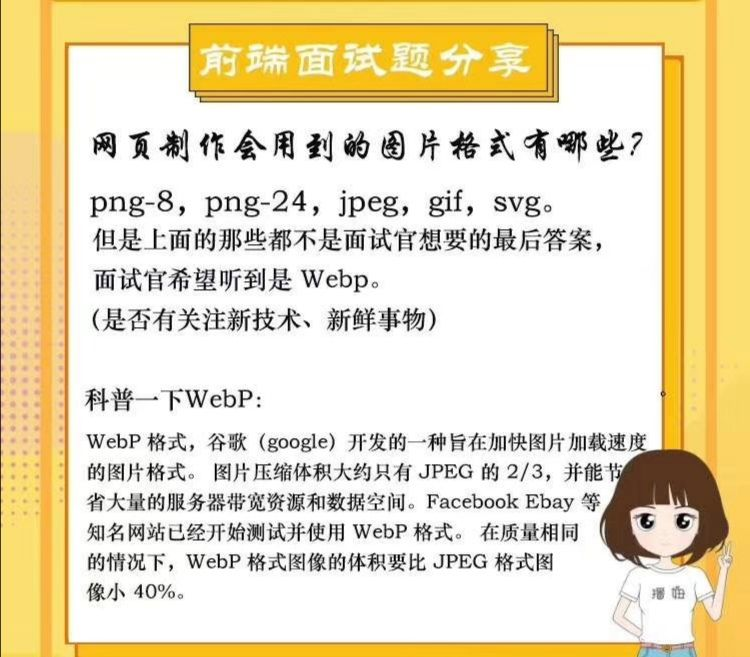

## HTML知识点

## HTML5知识点

### 1.网页制作的图片格式有哪些？

png、jpeg、gif、svg、webp

webp:



### 2.canvas常用方法

（1）getContext("2d") //得到画笔

（2）fillStyle颜色填充

（3）fillRect（）规定形状位置和尺寸

（4）moveTo(10,10)定义线条开始坐标

（5）lineTo(150,50)定义线条结束坐标

（6）stroke() ：绘制线条

（7）在canvas中绘制圆形, 我们将使用以下方法:

```
arc(x,y,r,start,stop)
```

（8）font定义字体:ctx.font="30px Arial";

fillText(*text,x,y*)在 canvas 上绘制实心的文本

strokeText(*text,x,y*) - 在 canvas 上绘制空心的文本

  (9)drawImage(*image,x,y*):把一幅图像放置到画布上

### （4）contenteditable

在元素上设置以使内容可编辑的属性。 它适用于`div`，`p`，`ul`等元素

```html
<h2> Shoppping List(Content Editable) </h2>
 <ul class="content-editable" contenteditable="true">
     <li> 1. Milk </li>
     <li> 2. Bread </li>
     <li> 3. Honey </li>
</ul>
```

### （5）mark标签

```html
<p>
    <mark>hello</mark>        // 高亮展示
    world
</p>

mark {//可以更换高亮颜色
  background-color: green;
  color: #FFFFFF;
}
```

### （6）data-*属性

用于存储页面或者应用程序的自定义数据

```html
<h2> Know data attribute </h2>
 <div 
       class="data-attribute" 
       id="data-attr" 
       data-custom-attr="You are just Awesome!"> 
   I have a hidden secret!
  </div>

 <button onclick="reveal()">Reveal</button>
```

```js
function reveal() {
   let dataDiv = document.getElementById('data-attr');
    let value = dataDiv.dataset['customAttr'];
   document.getElementById('msg').innerHTML = `<mark>${value}</mark>`;
}
```

### （7）datalist

```html
<form action="" method="get">
    <label for="fruit">Choose your fruit from the list:</label>
    <input list="fruits" name="fruit" id="fruit">//input框控件的可选项
        <datalist id="fruits">
           <option value="Apple">
           <option value="Orange">
           <option value="Banana">
           <option value="Mango">
           <option value="Avacado">
        </datalist>
     <input type="submit">
 </form>  
```

### （8）color picker

```html
<input type="color" onchange="showColor(event)">
<p id="colorMe">Color Me!</p>
```

### （9）inputs

required、autofocus、pattern正则校验

```html
<input type="password" 
    name="password" 
    id="password" 
    placeholder="6-20 chars, at least 1 digit, 1 uppercase and one lowercase letter" 
    pattern="^(?=.*\d)(?=.*[a-z])(?=.*[A-Z]).{6,20}$" autofocus required>
```

## HTML5.1知识点

### （1）响应式图片picture

```html
// srcset图像属性允许列出多个可用于替代的图片数据源，这些数据源的像素密度不同
// 如果用户设备的像素比是1，图片low-res将会被展示；如果是2，图片high-res将会被展示；如果是3或者更大，图片ultra-high-res将会被展示


// sizes根据用户屏幕尺寸来使用不同方式展示图片
//当视口宽度大于40em时，sizes属性把图片的宽度定义为视口宽度的50%；当视口（viewport）宽度小于或者等于40em时，把图片宽度定义为视口宽度的100%。


//根据屏幕不同展示不同的图片,使用picture属性
<picture>
  <source media="(max-width: 20em)" srcset="
    images/small/low-res.jpg 1x,
    images/small/high-res.jpg 2x, 
    images/small/ultra-high-res.jpg 3x
  ">
  <source media="(max-width: 40em)" srcset="
    images/large/low-res.jpg 1x,
    images/large/high-res.jpg 2x, 
    images/large/ultra-high-res.jpg 3x
  ">
  
</picture>
```

### （2）细节（Details）和总结（Summary）元素

新的<details>和<summary>元素可以通过鼠标点击实现附加信息的展示和隐藏

```html
<details>
    <summary>HTML5.1</summary>
    <p>
       HTML5.1新特性
    </p>
    <ul>
        <li>hhh</li>
        <li>kkk</li>
        <li>oooo</li>
    </ul>
</details>
```

### （3）dialog对话框

```html
<dialog open>
	<p>
        hhhhhh
    </p>
</dialog>
```

open代表对话框可见，没有就会隐藏

```js
const modal = document.querySelector('dialog');
modal.showModal();//添加open属性打开对话框
modal.show();// 打开对话框，show打开对话框没有背景遮罩
modal.close();// 删除open属性

dialog::backdrop{// 伪元素设置背景遮罩样式
    background-color:rgba(0,0,0,0.4);
}
```

