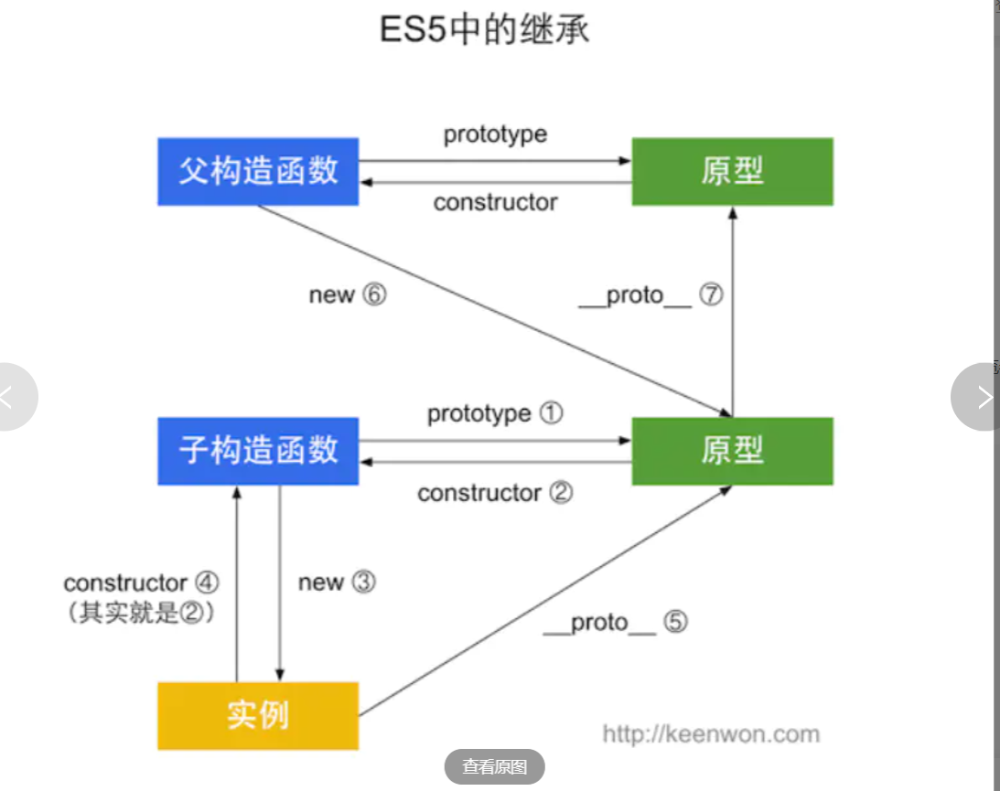
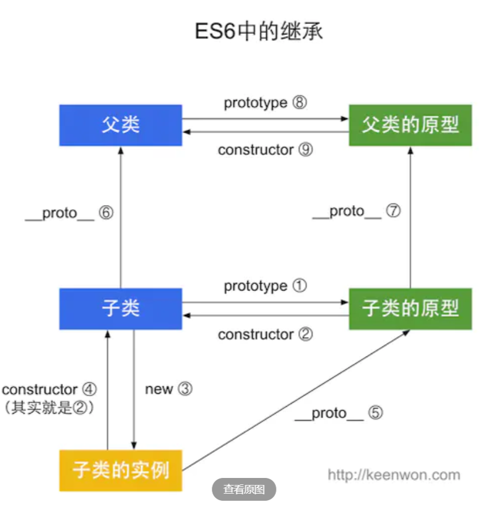
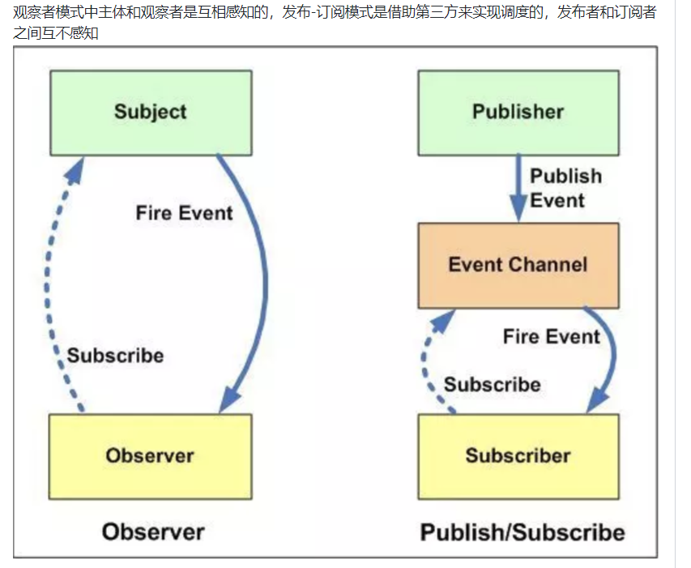
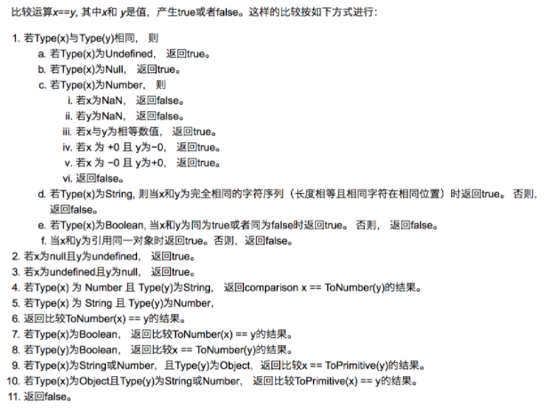

### 1.ES5/ES6 的继承除了写法以外还有什么区别



直接将父类的一个实例赋给子类的原型等方式，组合继承那些，apply，call等

```javascript
function Person(name){
 this.name=name;
 this.className="person" 
}
Person.prototype.getClassName=function(){
 console.log(this.className)
}
function Man(){
}
Man.prototype=new Person();
```



es6中：引入了class、extend、super、static

```javascript
class Person{
  //static sCount=0 //1 class内部不能放静态的属性
  constructor(name){
     this.name=name; 
     this.sCount++;
  }
  //实例方法 //2
  getName(){
   console.log(this.name)
  }
  static sTest(){
    console.log("static method test")
  }
}

class Man extends Person{
  constructor(name){
    super(name)//super去调用父类构造函数
    this.sex="male"//this关键字必须在super后面
  }
}
var man=new Man("Davin")
man.getName()
//man.sTest()
Man.sTest()//4 静态函数可以被继承，只能通过类名调用
输出结果：
Davin
static method test
```

es6的继承

```javascript
class A {
}

class B extends A {
}

B.__proto__ === A // true
B.prototype.__proto__ === A.prototype // true
```

主要是除了写法之外的区别还有调用的区别

其他区别：

ES6的继承实现在于使用super关键字调用父类，反观ES5是通过call或者apply回调方法调用父类。

###  2.npm安装机制，为什么npm install就可以安装对应的模块

（1）发出`npm install`命令

（2）查询node_modules目录之中是否已经存在指定模块（确定工程中的首层依赖，也就是 dependencies 和 devDependencies 属性中直接指定的模块（假设此时没有添加 npm install 参数）

- 若存在，不再重新安装
- 若不存在
  - npm 向 registry 查询模块压缩包的网址
  - 下载压缩包，存放在根目录下的`.npm`目录里
  - 解压压缩包到当前项目的`node_modules`目录

### 3.发布订阅者模式和观察者模式



观察者模式没中间商赚差价（菜农和买菜的），发布订阅模式（报社邮局和个人） 有中间商赚差价

### 4.实现 (5).add(3).minus(2) 功能。

例： 5 + 3 - 2，结果为 6

```js
Number.prototype.add = function(n) {
  return this.valueOf() + n;
};
Number.prototype.minus = function(n) {
  return this.valueOf() - n;
};
```

### 5.RESTful API

就是用`URI`表示资源，用HTTP方法(GET, POST, PUT, DELETE)表征对这些资源的操作

RESTful API 就是REST风格的API，是基于HTTP的协议，有设计规范和原则

比如

1. 将API部署在专用域名之下，API很简单，可以放主域名下

```javascript
https://example.org/api/
```

2. 统一接口。对于业务数据的CRUD，RESTful 用HTTP方法与之对应

- GET（SELECT）：从服务器取出资源（一项或多项）。
- POST（CREATE）：在服务器新建一个资源。
- PUT（UPDATE）：在服务器更新资源（客户端提供改变后的完整资源）。
- PATCH（UPDATE）：在服务器更新资源（客户端提供改变的属性）。
- DELETE（DELETE）：从服务器删除资源。

- HEAD：获取资源的元数据。
- OPTIONS：获取信息，关于资源的哪些属性是客户端可以改变的

比如：

- GET /zoos：列出所有动物园
- POST /zoos：新建一个动物园
- GET /zoos/ID：获取某个指定动物园的信息
- PUT /zoos/ID：更新某个指定动物园的信息（提供该动物园的全部信息）
- PATCH /zoos/ID：更新某个指定动物园的信息（提供该动物园的部分信息）
- DELETE /zoos/ID：删除某个动物园
- GET /zoos/ID/animals：列出某个指定动物园的所有动物
- DELETE /zoos/ID/animals/ID：删除某个指定动物园的指定动物

3.错误信息返回，返回的信息中将error作为键名，出错信息作为键值即可。

**其实就是各种统一的机制，方便不同的前端设备与后端进行通信，为了设计一套合理的、好用的API**

### 6.浏览器兼容问题

因为不同的浏览器对同一段代码有不同的解析，造成页面显示效果不统一的情况

#### （1）margin和padding各个浏览器占据宽度不同

解决方案：CSS里   *{margin:0;padding:0;}

#### （2）图片之间默认有间距

问题表现：几个img标签放在一块，有些浏览器会有默认的间距，有通配符也不起作用

解决方案：使用float属性为img布局

备注：img标签是行内属性标签，只要不超出容器高度，img会排在一行里，使用float是比较好的选择

#### （3）**字体大小定义不同**

问题表现：对字体大小small定义不同，Firefox为13px，而IE为16px，差别比较大

解决方法：使用指定的字体大小如14px或者使用em

#### （4）不同浏览器内核前缀不同

1.Chrome（谷歌浏览器） 与 Safari（苹果浏览器） 内核：Webkit （中译无） 前缀：-webkit-

2.IE （IE浏览器） 内核：Trident （中译三叉戟） 前缀：-ms-

3.Firefox （火狐浏览器） 内核：Gecko（中译壁虎） 前缀：-moz-

4.Opera （欧朋浏览器） 内核：Presto（中译迅速） 前缀：-o-

例：

```css
-webkit-border-radius: 10px; /*谷歌浏览器*/
 -ms-border-radius: 10px;     /*IE浏览器*/
 -moz-border-radius: 10px;    /*火狐浏览器*/
 -o-border-radius: 10px;      /*欧朋浏览器*/
 border-radius: 10px;
```

认同

1 坚决不兼容老浏览器
		2 坚决拥护成熟的前端框架 因为兼容人家已经处理的很好了 比如Bootstrap
		3 尽可能使用兼容性好的 第三方类库 比如JQuery要用1.x
		4 做好测试工作

### 7.alert()换行符

```js
// \n和\u00a
<script>
    alert('飞鸟慕鱼博客 \n http://www.feiniaomy.com');
    // 这两段代码的作用是一样的
    alert('飞鸟慕鱼博客 \u000a http://www.feiniaomy.com');
</script>
```

```js
// \r或\u000d换行
<script>
    alert('百度 \r http://www.baidu.com');
    // 这两段代码的作用是等价的
    alert('百度 \u000d http://www.baidu.com');
</script>
```

### 8.ajax交互模型

ajax的交互模型是：

1、用户发出异步请求；

2、利用onReadyStateChange监听；

3、创建请求，用open方法指定是get还是post，是否异步，url地址；

4、发送请求；

5、接受结果并分析；

6、实现刷新。

```js
var xhr = new XMLHttpRequest();//创建xhr
xhr.open('请求方式GET或者POST或者其他', 请求地址url, 是否开启异步async);//open打开异步通道，设置异步请求true为异步请求
xhr.send();//send发送数据
xhr.onreadystatechange = function() {//判断readystate==4;HTTP请求在200,300之间或者304数据请求成功
    // readyState == 4说明请求已完成
    if (xhr.readyState == 4 && xhr.status == 200) {
        console.log(xhr.responseText);
    }
}
if (method == 'POST') {
    //给指定的HTTP请求头赋值
    xhr.setRequestHeader('Content-type', 'application/x-www-form-urlencoded');
}

```

### 9.类型转换

在条件判断时（转boolean），除了 `undefined`， `null`， `false`， `NaN`， `''`， `0`， `-0`，其他所有值都转为 `true`，包括所有对象。

### 10.对象转基本类型

对象转基本类型的时候都会先调用valueOf再调用toString,这两个方法可以重写

当然你也可以重写 `Symbol.toPrimitive` ，该方法在转基本类型时调用优先级最高。

```js
let a = {
  valueOf() {
    return 0;
  },
  toString() {
    return '1';
  },
  [Symbol.toPrimitive]() {
    return 2;
  }
}
1 + a // => 3
'1' + a // => '12'
```

### 11.四则运算

当加法运算时，其中一方是字符串类型，就会把另一个也转为字符串类型

加法运算会触发三种类型转换：将值转换为原始值，转换为数字，转换为字符串。

```js
1 + '1' // '11'
2 * '2' // 4
[1, 2] + [2, 1] // '1,22,1'
// [1, 2].toString() -> '1,2'
// [2, 1].toString() -> '2,1'
// '1,2' + '2,1' = '1,22,1'
```

```js
'a' + + 'b' // -> "aNaN"
// 因为 + 'b' -> NaN
// 你也许在一些代码中看到过 + '1' -> 1
```

### 12.==操作符



这里来解析一道题目 `[] == ![] // -> true` ，下面是这个表达式为何为 `true` 的步骤

```js
// [] 转成 true，然后取反变成 false
[] == false
// 根据第 8 条得出
[] == ToNumber(false)
[] == 0
// 根据第 10 条得出
ToPrimitive([]) == 0
// [].toString() -> ''
'' == 0
// 根据第 6 条得出
0 == 0 // -> true
```

### 13.new一个对象

1. 新生成了一个对象
2. 链接到原型
3. 绑定 this
4. 返回新对象

在调用 `new` 的过程中会发生以上四件事情，我们也可以试着来自己实现一个 `new`

```js
function create() {
    // 创建一个空的对象
  let obj = new Object;
    // 获得构造函数
    let Con = [].shift.call(arguments);
    // 链接到原型
    obj.__proto__ = Con.prototype;
    // 绑定 this，执行构造函数
    let result = Con.apply(obj, arguments);
    // 确保 new 出来的是个对象
    return typeof result === 'object' ? result : obj
}
```

new的优先级

```js
function Foo() {
    return this;
}
Foo.getName = function () {
    console.log('1');
};
Foo.prototype.getName = function () {
    console.log('2');
};

new Foo.getName();   // -> 1
new Foo().getName(); // -> 2
//如上所示new Foo() 的优先级大于 new Foo ，
new (Foo.getName());
(new Foo()).getName();
```

### 14.为什么0.1+0.2！=0.3

因为 JS 采用 IEEE 754 双精度版本（64位），并且只要采用 IEEE 754 的语言都有该问题。

解决办法

```js
parseFloat((0.1 + 0.2).toFixed(10))
```

### 15.正则表达式

#### （1）元字符

| 元字符 |                             作用                             |
| :----: | :----------------------------------------------------------: |
|   .    |                匹配任意字符除了换行符和回车符                |
|   []   |  匹配方括号内的任意字符。比如 [0-9] 就可以用来匹配任意数字   |
|   ^    | ^9，这样使用代表匹配以 9 开头。[`^`9]，这样使用代表不匹配方括号内除了 9 的字符 |
| {1, 2} |                      匹配 1 到 2 位字符                      |
| (yck)  |                   只匹配和 yck 相同字符串                    |
|   \|   |                     匹配 \| 前后任意字符                     |
|   \    |                             转义                             |
|   *    |               只匹配出现 0 次及以上 * 前的字符               |
|   +    |               只匹配出现 1 次及以上 + 前的字符               |
|   ?    |                        ? 之前字符可选                        |

#### （2）修饰语

| 修饰语 |    作用    |
| :----: | :--------: |
|   i    | 忽略大小写 |
|   g    |  全局搜索  |
|   m    |    多行    |

#### （3）字符简写

| 简写 |         作用         |
| :--: | :------------------: |
|  \w  | 匹配字母数字或下划线 |
|  \W  |      和上面相反      |
|  \s  |   匹配任意的空白符   |
|  \S  |      和上面相反      |
|  \d  |       匹配数字       |
|  \D  |      和上面相反      |
|  \b  | 匹配单词的开始或结束 |
|  \B  |      和上面相反      |

### 16.V8下的垃圾回收机制

V8 实现了准确式 GC，GC 算法采用了**分代式垃圾回收机制**。因此，V8 将内存（堆）分为新生代和老生代两部分。

#### （1）新生代算法

新生代中的对象一般存活时间较短，使用 Scavenge GC 算法

在新生代空间中，内存空间分为两部分，分别为 From 空间和 To 空间。在这两个空间中，必定有一个空间是使用的，另一个空间是空闲的。新分配的对象会被放入 From 空间中，当 From 空间被占满时，新生代 GC 就会启动了。算法会检查 From 空间中存活的对象并复制到 To 空间中，如果有失活的对象就会销毁。当复制完成后将 From 空间和 To 空间互换，这样 GC 就结束了。

#### （2）老生代算法

老生代中的对象一般存活时间较长且数量也多，使用了两个算法，分别是标记清除算法和标记压缩算法。

什么情况下对象会出现在老生代算法空间中：

- 新生代中的对象是否已经经历过一次 Scavenge 算法，如果经历过的话，会将对象从新生代空间移到老生代空间中。
- To 空间的对象占比大小超过 25 %。在这种情况下，为了不影响到内存分配，会将对象从新生代空间移到老生代空间中。

在老生代中，以下情况会先启动标记清除算法：

- 某一个空间没有分块的时候
- 空间中被对象超过一定限制
- 空间不能保证新生代中的对象移动到老生代中

在这个阶段中，会遍历堆中所有的对象，然后标记活的对象，在标记完成后，销毁所有没有被标记的对象。

### 17.Service Worker

Service workers 本质上充当 Web 应用程序与浏览器之间的代理服务器，也可以在网络可用时作为浏览器和网络间的代理。它们旨在（除其他之外）使得能够创建有效的离线体验，拦截网络请求并基于网络是否可用以及更新的资源是否驻留在服务器上来采取适当的动作。他们还允许访问推送通知和后台同步 API。

通常用来做缓存文件，提高首屏速度

```js
// index.js
if (navigator.serviceWorker) {
  navigator.serviceWorker
    .register('sw.js')
    .then(function(registration) {
      console.log('service worker 注册成功')
    })
    .catch(function(err) {
      console.log('servcie worker 注册失败')
    })
}
// sw.js
// 监听 `install` 事件，回调中缓存所需文件
self.addEventListener('install', e => {
  e.waitUntil(
    caches.open('my-cache').then(function(cache) {
      return cache.addAll(['./index.html', './index.js'])
    })
  )
})

// 拦截所有请求事件
// 如果缓存中已经有请求的数据就直接用缓存，否则去请求数据
self.addEventListener('fetch', e => {
  e.respondWith(
    caches.match(e.request).then(function(response) {
      if (response) {
        return response
      }
      console.log('fetch source')
    })
  )
})
```

打开页面，可以在开发者工具中的 `Application` 看到 Service Worker 已经启动了

在 Cache 中也可以发现我们所需的文件已被缓存

当我们重新刷新页面可以发现我们缓存的数据是从 Service Worker 中读取的

### 18.Load和DOMContentLoaded区别

Load 事件触发代表页面中的 DOM，CSS，JS，图片已经全部加载完毕。

DOMContentLoaded 事件触发代表初始的 HTML 被完全加载和解析，不需要等待 CSS，JS，图片加载

### 19.减少重绘和回流

#### （1）使用 `translate` 替代 `top`

```html
<div class="test"></div>
<style>
  .test {
    position: absolute;
    top: 10px;
    width: 100px;
    height: 100px;
    background: red;
  }
</style>
<script>
  setTimeout(() => {
    // 引起回流
    document.querySelector('.test').style.top = '100px'
  }, 1000)
</script>
```

#### （2）使用 `visibility` 替换 `display: none`

前者只会引起重绘，后者会引发回流（改变了布局）

#### （3）把 DOM 离线后修改

比如：先把 DOM 给 `display:none` (有一次 Reflow)，然后你修改 100 次，然后再把它显示出来

#### （4）不要把 DOM 结点的属性值放在一个循环里当成循环里的变量

```js
for (let i = 0; i < 1000; i++) {
  // 获取 offsetTop 会导致回流，因为需要去获取正确的值
  console.log(document.querySelector('.test').style.offsetTop)
}
```

#### （5）不要使用 table 布局

可能很小的一个小改动会造成整个 table 的重新布局

#### （6）动画实现的速度的选择

动画速度越快，回流次数越多，也可以选择使用 `requestAnimationFrame`

### 20.如何渲染几万条数据不卡住页面

不能一次性将几万条都渲染出来，而应该一次渲染部分 DOM，那么就可以通过 `requestAnimationFrame` 来每 16 ms 刷新一次。

```html
<!DOCTYPE html>
<html lang="en">
  <head>
    <meta charset="UTF-8" />
    <meta name="viewport" content="width=device-width, initial-scale=1.0" />
    <meta http-equiv="X-UA-Compatible" content="ie=edge" />
    <title>Document</title>
  </head>
  <body>
    <ul>
      控件
    </ul>
    <script>
      setTimeout(() => {
        // 插入十万条数据
        const total = 100000
        // 一次插入 20 条，如果觉得性能不好就减少
        const once = 20
        // 渲染数据总共需要几次
        const loopCount = total / once
        let countOfRender = 0
        let ul = document.querySelector('ul')
        function add() {
          // 优化性能，插入不会造成回流
          const fragment = document.createDocumentFragment()
          for (let i = 0; i < once; i++) {
            const li = document.createElement('li')
            li.innerText = Math.floor(Math.random() * total)
            fragment.appendChild(li)
          }
          ul.appendChild(fragment)
          countOfRender += 1
          loop()
        }
        function loop() {
          if (countOfRender < loopCount) {
            window.requestAnimationFrame(add)
          }
        }
        loop()
      }, 0)
    </script>
  </body>
</html>
```

### 21.Node与Element，Children与Childnodes的区别

#### Node和Element区别

**Element继承了Node类，也就是说Element是Node多种类型中的一种，**即当NodeType为1时Node即为ElementNode，另外Element扩展了Node，Element拥有id、class、children等属性。

用document.getElementById("xxx")取到的是Node还是Element？

```html
<!DOCTYPE html>
<html>
<head>
    <meta charset="utf-8">
    <title>Demo</title>
</head>
<body>
    <div id="test">
        <p>One</p>
        <P>Two</p>
    </div>
    <script>
        var oDiv=document.getElementById("test");
        console.log(oDiv instanceof Node);        //true
        console.log(oDiv instanceof Element);    //true
    </script>
</body>
</html>
```

**用document.getElementById("xxx")取到的既是Element也是Node**

#### （2）**children属性与childNodes属性的差别**

childNodes属性返回所有的节点，（包括元素节点、属性节点、文本节点），通过nodeType来判断，nodeType = == 1是元素节点，nodeType== =2是属性节点，nodeType === 3是文本节点；

children属性只返回元素节点；

**children是Element的属性，childNodes是Node的属性**