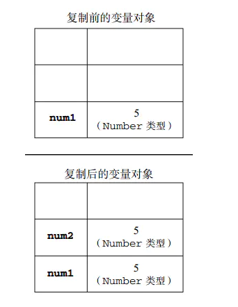
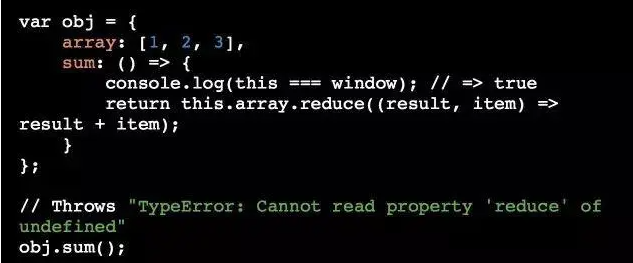
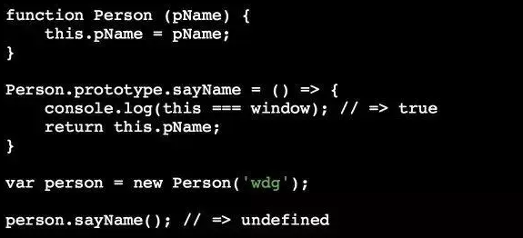

### 1.map会改变原数组吗？

map()为操作数组的一种方法，官方文档显示：

1. map() 方法返回一个新数组，数组中的元素为原始数组元素调用函数处理后的值。
2. map() 方法按照原始数组元素顺序依次处理元素。
3. **注意：** map() 不会对空数组进行检测。
4. **注意：** map() 不会改变原始数组。

#### （1）当数组为基础类型的时候，原数组不变

```js
    let array=[1,2,3,4,5]
    let newArray=array.map((item) => item*2)
    console.log(array); // [1,2,3,4,5]
	console.log(newArray) //[2,4,6,8,10]
```

#### （2）当数组是引用类型的时候原数组改变

```js
 let array = [{ name: 'Anna', age: 16 }, { name: 'James', age: 18 }]
    let newArray=array.map((item) => {
      item.like='eat';
      return item;
    })
    console.log(array); // [{ name: 'Anna', age: 16,like: "eat"},{ name: 'James', age: 18,like: "eat"}]
    console.log(newArray);//[{ name: 'Anna', age: 16,like: "eat"},{ name: 'James', age: 18,like: "eat"}]
    
// 为了避免原数组发生改变
let array = [{ name: 'Anna', age: 16 }, { name: 'James', age: 18 }]
let newArray=array.map((item) => {
    const obj = { ...item, like:'eat'};
      return obj;
    })
    console.log(array); // [{ name: 'Anna', age: 16},{ name: 'James', age: 18}]
    console.log(newArray);//[{ name: 'Anna', age: 16,like: "eat"},{ name: 'James', age: 18,like: "eat"}]
```

### 2.['1', '2', '3'].map(parseInt)what & why ?

不是[1,2,3],而是**[1,NaN,NaN]**

```js
parseInt:
　　parseInt(numString, [radix])
```

**参数**
`numString`
必选项。要转换为数字的字符串。
`radix`
可选项。在 2 和 36 之间的表示 numString 所保存数字的进制的值。如果没有提供，则前缀为 '0x' 的字符串被当作十六进制，前缀为 '0' 的字符串被当作八进制。所有其它字符串都被当作是十进制的。如果该参数小于 2 或者大于 36，则 parseInt() 将返回 NaN。

**注释：**只有字符串中的第一个数字会被返回。

**注释：**开头和结尾的空格是允许的。如果 numString 的前缀不能解释为整数，则返回 NaN（而不是数字）

```js
parseInt("abc") // 返回 NaN。
parseInt("12abc") // 返回 12。
```

**所以map函数的第一个是字符串，下标作为基数去转换**

```js
parseInt('1', 0) //radix为0时，且string参数不以“0x”和“0”开头时，按照10为基数处理。这个时候返回1

parseInt('2', 1) //基数为1（1进制）表示的数中，最大值小于2，所以无法解析，返回NaN

parseInt('3', 2) //基数为2（2进制）表示的数中，最大值小于3，所以无法解析，返回NaN
```

map函数的参数是

arr.map(function(currentValue（当前值），index（下标），arr（可选，属于数组对象）),thisValue) 

所以

```js
['10','10','10','10','10'].map(parseInt);
// [10, NaN, 2, 3, 4]
```

### 3.基本类型和引用类型的区别

基本类型：**Number**, **String**, **Boolean**, **Undefined**, **Null**,**BigInt、Symbol**

引用类型：**Object(Function Array Date)**

（1）变量解析方法不同

基本类型是操作保存在变量中的值

引用类型如果是复制，则是操作对象的引用，添加属性则是操作实际对象

（2）区别

| 基本类型                                                     | 引用类型                                                   |
| :----------------------------------------------------------- | ---------------------------------------------------------- |
| 简单的数据段                                                 | 有多个值构成的对象                                         |
| 保存在栈中，占固定大小的空间                                 | 栈中存指向数据的引用，堆中存数据，大小不限                 |
| 不能给添加属性                                               | 可以给引用类型添加属性                                     |
| 复制变量：基本类型在栈内存中会形成新的变量，但是两者不会互相影响 | 复制的话栈内存多分配给新的变量，但是都指向堆中的同一个对象 |
| 传递参数：传递值，改变值                                     | 传递值，改变堆中的对象的属性                               |
| typeOf检测类型                                               | instanceOf判断是否在Object上                               |

（3）检测类型方法不同

typeOf检测基本类型，引用类型使用instanceOf（根据原型链判断的，所有引用类型的值都是Object的实例）

所以：instanceOf判断基本类型总是返回false

注意：

```js
null instanceof Object —>flase
typeof(null) —>Object
```




### 4.堆栈的区别

```
堆：由操作系统动态分配的内存，大小不定也不会自动释放，一般由程序员分配释放，也可由垃圾回收机制回收。

栈：由操作系统自动分配内存空间，自动释放，存储的是基础变量以及一些对象的引用变量，占据固定大小的空间。
```

1.栈：先进后出的数据结构，内存中存放变量的空间，堆：也是内存中的空间，但是存储变量的时候没有规律

2.栈存取快，不灵活，结构简单，内存回收容易；堆：存取比栈慢，因为要去堆中取得真的值，使用灵活，可以动态增加删除空间，存取慢

| 栈                                   | 堆                                     |
| ------------------------------------ | -------------------------------------- |
| 先进后出数据结构                     | 存储变量无规律                         |
| 存取快                               | 存取慢                                 |
| 不灵活(数据大小和生存周期确定)       | 灵活删除增加动态空间                   |
| 自动分配空间，自动释放空间，大小确定 | 自动分配空间，分配大小不定，不自动释放 |

### 5.箭头函数和普通函数的区别

1. 箭头函数没有 this、super、arguments，也没有new.target绑定。this、super、arguments以及函数内部的new.target的值由所在的，最靠近的非箭头函数来决定
2. 不能使用new调用：箭头函数没有[[Construct]]方法，因此不能被用为构造函数，使用new调用箭头函数会抛出错误
3. 没有原型：既然不能对箭头函数使用new，那么他也不需要原型，也就是没有prototype属性
4. 不能改变this：this的值在函数内部不能被修改。但是可以对箭头函数使用call，apply，bind（然而this并不会受到影响）

### 6.new一个对象发生了什么？

1. 创建一个新对象；
2. 将构造函数的作用域赋给新对象（因此this就指向了这个新对象）；
3. 执行构造函数中的代码（为这个新对象添加属性）；
4. 返回新对象

```js
function _new(fn, ...arg) {
  const obj = {}; //创建一个新的对象
  obj.__proto__ = fn.prototype; //把obj的__proto__指向fn的prototype,实现继承
  fn.apply(obj, arg) //改变this的指向
  return Object.prototype.toString.call(obj) == '[object Object]'? obj : {} //返回新的对象obj
 }
```

### 7.es6的不适用场景

优点是代码简洁，this提前定义

箭头函数没有它自己的this值，箭头函数内的this值继承自外围作用域

##### （1）**在对象上定义函数**



抛出错误，this.array是undefined，因为this指向了外围作用域

##### （2）**在原型上定义函数**



同理this指向window

##### （3）**动态上下文中的回调函数**

this是js中非常强大的特点，他让函数可以根据其调用方式动态的改变上下文，然后箭头函数直接在声明时就绑定了this对象，所以不再是动态的。

监听函数不可以使用箭头函数


这个回调的箭头函数是在全局上下文中被定义的，所以他的this是window

### 8.JS 中值的类型分为原始值类型和对象类型。

**原始值类型包括 number, string, boolean, null 和 undefined、symbol、bigint；对象类型（引用类型）即 object。首先原始值类型它就不是对象**。

另外，要**注意 'hello' 和 new String('hello') 的区别，前者是字符串字面值，属于原始类型，而后者是对象**。用 typeof 运算符返回的值也是完全不一样的：

```js
typeof 'hello';//string
typeof new String('hello');//object
```

之所以很多人分不清字符串字面值和 String 对象，归根结底就是 JS 的语法对你们太过纵容了。当执行 'hello'.length 时，发现可以意料之中的返回 5，你们就觉得 'hello' 就是 String 对象，不然它怎么会有 String 对象的属性。**其实，这是由于 JS 在执行到这条语句的时候，内部将 'hello' 包装成了一个 String 对象，执行完后，再把这个对象丢弃了，这种语法叫做 “装箱”**，在其他面向对象语言里也有（如 C#）。

### 9.OOP（面向对象编程）

现实生活的事物以及关系，抽象成类，通过继承，实现，组合的方式把万事万物都给容纳了。实现了对现实世界的抽象和数学建模

买菜自己做就是面向过程，去饭店喊老板做就是面向对象

优点：降低耦合性，提高维护度，提高可维护性（比如换成其他菜）

1、封装
 隐藏对象的属性和实现细节，仅对外提供公共访问方式，将变化隔离，便于使用，提高复用性和安全性。
       2、继承
 提高代码复用性；继承是多态的前提。
       3、多态
 父类或接口定义的引用变量可以指向子类或具体实现类的实例对象。提高了程序的拓展性。

### 10.JavaScript特点

**解释性**：源代码不需要经过编译，而直接在浏览器中运行时被解释。

**基于对象**：能运用自己已经创建的对象。因此，许多功能可以来自于脚本环境中对象的方法与脚本的相互作用。

**事件驱动**：就是指在主页中执行了某种操作所产生的动作，此动作称为“事件”。比如按下鼠标、移动窗口、选择菜单等都可以视为事件。当事件发生后，可能会引起相应的事件响应

**跨平台**：JavaScript依赖于浏览器本身，与操作环境无关，只要能运行浏览器的计算机，并支持JavaScript的浏览器就可以正确执行。

**安全性**：JavaScript是一种安全性语言，它不允许访问本地的硬盘，并不能将数据存入到服务器上，不允许对网络文档进行修改和删除，只能通过浏览器实现信息浏览或动态交互。

**弱变量**：JavaScript语言中的变量是弱类型的，数据类型无须作出严格的要求。

**动态联编**：在程序运行时才能确定将要调用的函数。

**开发商**：JavaScript是网景公司开发的，Java是sun公司开发的。

### 11.事件委托

原理：事件冒泡

使用事件委托，只需在 DOM 树中尽量最高的层次上添加一个事件处理程序

最经典的就是ul和li标签的事件监听，比如我们在添加事件时候，采用事件委托机制，不会在li标签上直接添加，而是在ul父元素上添加。

https://blog.csdn.net/chenjuan1993/article/details/81347590

事件代理机制：如果每次点击一个li都绑定，性能会降低

```js
obj1.addEventListener('click',function(e){
   var e=e||window.event;
   if(e.target.nodeName.toLowerCase()=='h5'){
     alert(e.target.innerHTML);
 }，false);
```

使用target找到事件实际发生的元素

**阻止事件冒泡的方法：**

```js
//方式一：event.stopPropagation();
$("#div1").mousedown(function(event){
event.stopPropagation();
});
//方式二：return false;
$("#div1").mousedown(function(event){
return false;
});
```

但是这两种方式是有区别的。return false 不仅阻止了事件往上冒泡，而且阻止了事件本身。event.stopPropagation() 则只阻止事件往上冒泡，不阻止事件本身。

当`addEventListener`的第三个参数为`true`的时候，代表是在捕获阶段绑定，当第三个参数为`false`或者为空的时候，代表在冒泡阶段绑定。

`event.target`指向引起触发事件的元素，而`event.currentTarget`则是事件绑定的元素，只有被点击的那个目标元素的`event.target`才会等于`event.currentTarget`。

### 12.将原生ajax封装成promise

```js
var  myNewAjax=function(``url``){
	return new Promise(function(resolve,reject){
		var xhr = new XMLHttpRequest();
		xhr.open('get',url);
		xhr.send(data);
		xhr.onreadystatechange=function(){
		if(xhr.status==``200``&&readyState==``4``){
			var json=JSON.parse(xhr.responseText);
			resolve(json)
		}else if(xhr.readyState==``4``&&xhr.status!=``200``){
			reject(``'error'``);
	}
}
})
}
```

### 13.js加载过程阻塞，解决方法

指定script标签的async属性。

如果async="async"，脚本相对于页面的其余部分异步地执行（当页面继续进行解析时，脚本将被执行）

如果不使用async 且 defer="defer"：脚本将在页面完成解析时执行


## 14.require模块化编程

如果加载多个js文件，加载时候会停止网页渲染，越多响应时间越长，其次由于js文件之间存在依赖关系，必须有加载顺序，依赖关系复杂的话代码维护会比较困难

require.js就是为了解决这个问题，

（1）实现js文件的异步加载，避免网页失去响应；

（2）管理模块之间的依赖性，便于代码的编写和维护。

主模块文件中写

```js
require(['moduleA', 'moduleB', 'moduleC'], function (moduleA, moduleB, moduleC){
// 主模块依赖这三个模块
　　});
```

require.js要求，每个模块是一个单独的js文件。加载多个模块，就会发出多次HTTP请求，会影响网页的加载速度。因此，require.js提供了一个[优化工具](http://requirejs.org/docs/optimization.html)，当模块部署完毕以后，可以用这个工具将多个模块合并在一个文件中，减少HTTP请求数。

**AMD模块的写法**

require.js加载的模块，采用AMD规范，

模块定义在define（）中，一个require()去请求加载其他模块