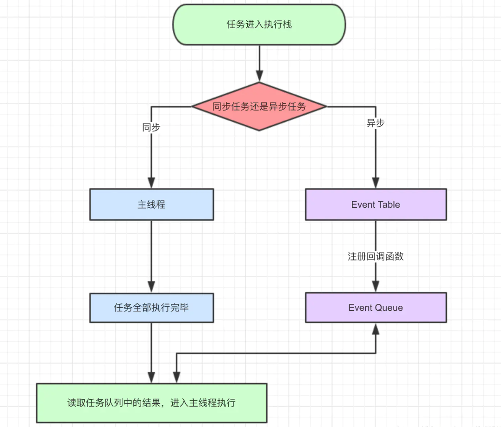
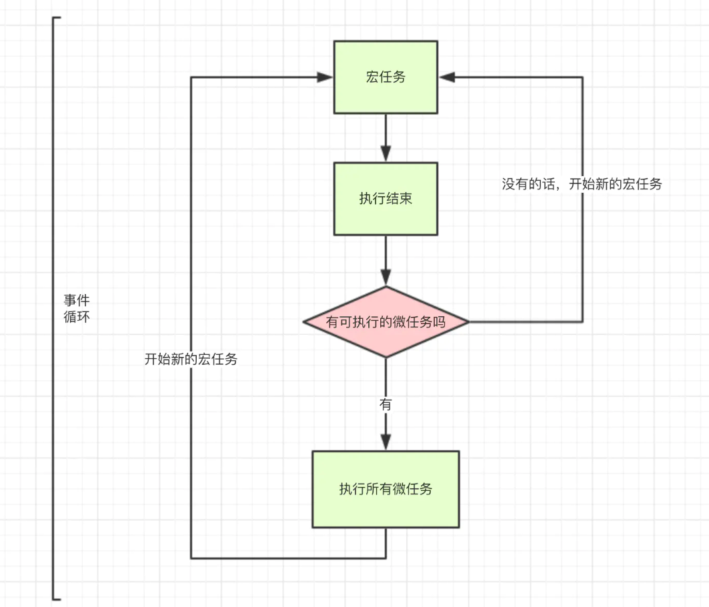

# JavaScript执行机制学习


## 1.关于JavaScript

javascript是一门单线程语言，在最新的HTML5中提出了Web-Worker，但javascript是单线程这一核心仍未改变。所以一切javascript版的"多线程"都是用单线程模拟出来的。

## 2.JavaScript的同步和异步

同步任务指的是，在主线程上排队执行的任务，只有前一个任务执行完毕，才能执行后一个任务；异步任务指的是，不进入主线程、而进入"任务队列"（task queue）的任务，只有"任务队列"通知主线程，某个异步任务可以执行了，该任务才会进入主线程执行。

1、同步和异步任务分别进入不同的执行"场所"，同步的进入主线程，异步的进入Event Table并注册函数。

2、当Event Table中指定的事情完成时，会将这个函数移入Event Queue（一般是先进先出，但是有定时器的，就考虑达到执行要求之后的先进先出）。

3、主线程内的任务执行完毕为空，会去Event Queue读取对应的函数，进入主线程执行。

4、上述过程会不断重复，也就是常说的Event Loop(事件循环)。



## 3.JavaScript宏任务和微任务

**macro-task(宏任务)**：包括整体代码script，setTimeout，setInterval

**micro-task(微任务)**：Promise.then，process.nextTick

注意：Promise立即执行，因为Promise是同步的函数，then函数分配到微任务**Event Queue**

不同类型的任务会进入对应的Event Queue。事件循环的顺序，决定js代码的执行顺序。进入整体代码(宏任务)后，开始第一次循环。接着执行所有的微任务。然后再次从宏任务开始，找到其中一个任务队列执行完毕，再执行所有的微任务。



## 4.举个栗子

### （1）同步

```javascript
console.log(1);
console.log(2);
console.log(3);
/*
  ``执行结果：1、2、3
  ``同步任务，按照顺序一步一步执行
*/
```

### （2）同步和异步

```javascript
console.log(1);
setTimeout(function() {
  console.log(2);
},1000)
console.log(3);
/*
  执行结果：1、3、2
  同步任务，按照顺序一步一步执行
  异步任务，放入消息队列中，等待同步任务执行结束，读取消息队列执行
*/
```

```javascript
console.log(1);
setTimeout(function() {
  console.log(2);
},1000)
setTimeout(function() {
  console.log(3);
},0)
console.log(4);
/*
  猜测是：1、4、2、3  但实际上是：1、4、3、2
  分析：
    同步任务，按照顺序一步一步执行
    异步任务，当读取到异步任务的时候，将异步任务放置到Event table（事件表格）中，当满足某种条件或者说指定事情完成了（这里的是时间分别是达到了0ms和1000ms）当指定事件完成了才从Event table中注册到Event Queue（事件队列），当同步事件完成了，便从Event Queue中读取事件执行。（因为3的事情先完成了，所以先从Event table中注册到Event Queue中，所以先执行的是3而不是在前面的2）
*/
```

### （3）宏任务和微任务 

```javascript
console.log(1);
setTimeout(function() {
  console.log(2)
},1000);
new Promise(function(resolve) {
  console.log(3);
  resolve();
}
).then(function() {
  console.log(4)
});
console.log(5);
/*
  以同步异步的方式来判断的结果应该是：1、3、5、2、4
  但是事实上结果是：1、3、5、4、2
  为什么是这样呢？因为以同步异步的方式来解释执行机制是不准确的，更加准确的方式是宏任务和微任务：
  因此执行机制便为：执行宏任务 ===> 执行微任务 ===> 执行另一个宏任务 ===> 不断循环
    即：在一个事件循环中，执行第一个宏任务，宏任务执行结束，执行当前事件循环中的微任务，
执行完毕之后进入下一个事件循环中，或者说执行下一个宏任务*/
```

```javascript
//经典面试题
console.log(1);
setTimeout(function() {
  console.log(2);
  process.nextTick(function() {
    console.log('3');
  })
  new Promise(function(resolve) {
    console.log(4);
    resolve();
  }).then(function() {
    console.log('5')
  })
})
process.nextTick(function() {
  console.log('6');
})
new Promise(function(resolve) {
  console.log('7');
  resolve();
}).then(function() {
  console.log('8')
})
setTimeout(function() {
    console.log('9');
    process.nextTick(function() {
        console.log('10');
    })
    new Promise(function(resolve) {
        console.log('11');
        resolve();
    }).then(function() {
        console.log('12')
    })
})
/*1,7,6,8,2,4,3,5,9,11,10,12*/
```

## 5.总结

总体来说就是先执行一个宏任务，再执行所有微任务，一直循环，直到所有事件执行完毕

