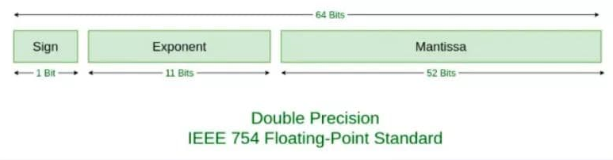

# JavaScript中0.1+0.2=0.3?

## 前言

最初知道0.1+0.2不等于0.3的时候，是读书的时候做计算器的demo，随便按了一下，居然发现加起来不等0.3，当时是感到震惊又疑惑，去百度了才知道是浮点数的精度的问题，在后面又遇到面试，会问到原因及解决办法，但是细致的原因自己并没有去深入理解，也没有做好后续的总结工作，所以打算详细学习并记录下来

## 1.问题

```
0.1 +  0.2  === 0.30000000000000004
1.15*100 === 114.99999999999999
```

## 2.Number类型

ECMAScript 中的 Number 类型使用 IEEE754 标准来表示整数和浮点数值。在ECMAScript中，会使用64位来存储一个浮点数

IEEE二进制浮点数算术标准（IEEE 754）是20世纪80年代以来最广泛使用的[浮点数](https://baike.baidu.com/item/浮点数)运算标准，为许多CPU与所采用。这个标准定义了表示浮点数的格式（包括负零-0）与反常值，一些特殊数值（无穷（Inf）与非数值（NaN）），以及这些数值的“浮点数运算符”；它也指明了四种数值舍入规则和五种例外状况（包括例外发生的时机与处理方式）。

## 3.浮点数转二进制计算

### （1）浮点数表示

```js
value = sign * exponent *fraction
//浮点数的实际值，等于符号位（sign bit）乘以指数偏移值(exponent bias)再乘以分数值(fraction)
```

### （2）计算

#### a.怎么计算一个值的二进制？

```js
1020 = 1 * 10^3 + 0 * 10^2 + 2 * 10^1 + 0 * 10^0//但是并非所有的数字计算都如此简单
1020 = 1 * 2^9 + 1 * 2^8 + 1 * 2^7 + 1 * 2^6 + 1 * 2^5 + 1 * 2^4 + 1 * 2^3 + 1 * 2^2 + 0 * 2^1 + 0 * 2^0//1020用二进制表示

//0.75二进制表示，abcd只能是0 1 
0.75 = a * 2^-1 + b * 2^-2 + c * 2^-3 + d * 2^-4 + ...
//如何知道abcd分别是什么，只要双方都乘以2就可以逐一知道
1 + 0.5 = a * 2^0 + b * 2^-1 + c * 2^-2 + d * 2^-3... (所以 a = 1)
0.5 = b * 2^-1 + c * 2^-2 + d * 2^-3...
1 + 0 = b * 2^0 + c * 2^-2 + d * 2^-3... (所以 b = 1)
//总结：所以0.75二进制为0.11

//那0.1计算如此类推
0.1 = a * 2^-1 + b * 2^-2 + c * 2^-3 + d * 2^-4 + ...
0 + 0.2 = a * 2^0 + b * 2^-1 + c * 2^-2 + ...   (a = 0)
0 + 0.4 = b * 2^0 + c * 2^-1 + d * 2^-2 + ...   (b = 0)
0 + 0.8 = c * 2^0 + d * 2^-1 + e * 2^-2 + ...   (c = 0)
1 + 0.6 = d * 2^0 + e * 2^-1 + f * 2^-2 + ...   (d = 1)
1 + 0.2 = e * 2^0 + f * 2^-1 + g * 2^-2 + ...   (e = 1)
0 + 0.4 = f * 2^0 + g * 2^-1 + h * 2^-2 + ...   (f = 0)
0 + 0.8 = g * 2^0 + h * 2^-1 + i * 2^-2 + ...   (g = 0)
1 + 0.6 = h * 2^0 + i * 2^-1 + j * 2^-2 + ...   (h = 1)
0.1 =  0.0001 1001 1001 1001 1001 1001 1001 1001 1001 1001 1001 1001 1001 1010(1001循环 进一舍零)
//总结：发现0.1一直在循环1001,0.1转成二进制之后变成了无限循环的数字
```

#### b.浮点数的存储



```js
//在ECMAScript中使用64位来存储浮点数
//1 位存储符号位，0 表示正数，1 表示负数
//11位存储exponent bias
//52位存储分数值
```

在二进制的科学计数法中，`IEEE754标准`的 64 位双精度值数字被公式表示为：

V = (-1)^S *  2^(E+1023) * （M+1）

比如4.5转成二进制就是100.1，用二进制科学计数法表示就是1.001*2^2，带入该公式，M就是0.001，指数就是2+1023 = 1025（二进制是10000000001），正数S是0,所以4.5用双精度64位表示则为

0 10000000001 001000000000000000000000000000000000…（直到满64位）

```js
//如上所述，0.1的二进制是0.00011001100110011…… （无限循环）
0.1 = 1*2^-4 *1.1001100110011.....//sign 就是 1，exponent 就是 2^-4，fraction 就是 1.1001100110011……

//用64位表示0.1就是
0 01111111011 1001100110011001100110011001100110011001100110011010
//0.2就是
0 01111111100 1001100110011001100110011001100110011001100110011010
```

由于在换成64位存储的时候，都是0.1和0.2都是循环的，自然会舍弃部分数字，因为只能有64位，所以在0.1和0.2存储的时候，精度就丢失了

然后需要将0.1+0.2进行计算，在计算的时候发现相加也发生了结果的丢失，所以0.1+0.2在存储和计算都造成了精度的丢失，所以不等于0.3了

## 4.解决的办法

### （1）parseFloat()

```js
parseFloat((0.1 + 0.2).toFixed(10))
```

### （2）将数字转为整数计算

同时乘以整数结果再除以整数

```js
(0.1*10+0.2*10)/10
```

## 5.参考资料

1.[JS浮点数](https://juejin.cn/post/7021711278640988168)

2.冴羽的博客

