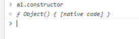

# 原型/原型链

## 1、引入（为什么会有原型prototype）

Javascript是一种基于对象的语言，也是可以不通过类，直接创建对象的语言。ECMA-262 将对象定义为一组属性的无序集合。

可以使用"属性"（property）和"方法"（method），封装成一个对象，并且从原型对象生成一个实例对象，如下所示

```js
let Cat = {
	name:"",
    color:""
}
let cat1 = {};//创建一个空对象
cat1.name = "大毛";//按照原型对象的属性赋值
cat1.color = "黄毛";
let cat2 = {};
cat2.name = "二毛";
cat2.color = "黑色";
```

如果要多创建几个对象，代码就很冗余，而且实例和原型之间看不出联系。

```js
function Cat(name, color) {
	return {
		name: name,
		color: color
	}
}
let cat1 = Cat("大毛","黄色");
let cat2 = Cat("二毛","黑色")
```

上图代码解决了冗余的问题，但是看不出实例和原型之间有什么联系。

为了解决从原型对象生成实例的问题，Javascript提供了一个构造函数（Constructor）模式，通过构造函数去创建对象

```js
function Cat(name,color) {
    this.name = name;
    this.color = color;
}
let cat1 = new Cat("大毛","黄色");
let cat2 = new Cat("二毛","黑色")
```

new可以改变this指向，谁调用它就指向谁，如上图this.name指向的分别是cat1和cat2。

可能有的朋友就会问了，为什么new可以改变this执行，new怎么实现的呢？这就需要看一下this指向以及后文的原型原型链了。

```js
function Cat(name, color) {
    this.name = name;
    this.color = color;
    this.type = "猫科动物";
    this.eat = function() {
        alert("吃老鼠");
    }
}
```

构造函数相对前面来说很好，但是如果多几个方法和属性，又有相同的方法，比如猫和老虎都是猫科动物，然后每次生成实例，都有重复的内容猫科动物，就会耗费内存，所以把相同的方法提出来，让type属性在内存中只生成一次，然后所有实例都指向那个内存地址。

## 2、什么是原型（prototype）

概念：原型是function对象的一个属性，它定义了该函数制造出的对象的公共祖先。（原型是给其他对象提供共享属性的对象）

通过该该函数产生的对象，可以继承该原型的属性和方法，原型也是对象。

`__proto__`和`constructor`是**对象**独有的。`prototype`属性是**函数**独有的；

但是函数也是对象，所以函数也有`__proto__`和`constructor`

`Person.prototype ------ 原型`

`Person.prototype = { } ------ 祖先`

```js
Person.prototype.lastName = "li";
Person.prototype.say = function() {
    console.log("hehe");
}
function Person(name, age, sex) {
    this.name = name;
    this.age = age;
    this.sex = sex;
}

let person = new Person("biubiu", 12, "女");
let person1 = new Person("hehesah", 10, "女");
// 大女儿有的二女儿也有，都有say和lastName
```

new会劫持所有的普通函数并用构造函数的形式来调用它，this的指向就会发生改变。

## 3、原型有什么作用

### （1）提取出共有属性，解决内存耗费的问题还有代码冗余问题

```js
cat.prototype = {
	type: "猫科",
	age: 18
}
function cat(name, color) {
	this.name = name;
	this.color = color;
}
let cat1 = new Cat("boblal","whit");
let cat2 = new Cat("hhh","red")
```


### （2）可以通过person.prototype增加，删除，查询，修改，

```js
Person.prototype.lastName = "li";
function Person(name) {
	this.name = name;
}
let person = new Person();
```


增加：Person.prototype.age  = 18;(直接通过原型增加)

删除：Delete Person.prototype.lastName

不能通过Delete person.lastName删除（后代无法改变祖先的方法和属性）


修改：Person.prototype.lastName = “bai”

查询：person.lastName直接向上查询，看是否有相应的属性或者方法

## 4、看原型里面有什么（constructor和__proto__）

```js
function Car() {
}
let car = new Car();
```


### (1)Constructor

constructor是为了后面的实例可以找到自己的构造器，car对象由Car构造很容易理解，但是并非这样，而是car.constructor通过默认的``[[prototype]]``委托指向Car。

```js
function Foo(){}
Foo.prototype = {};
let a1 = new Foo();
a1.constructor === Foo; // false
a1.constructor === Object // true
```



也可以给Foo.prototype添加一个.constructor属性,用definePrototype（）方法，让.constructor指向Foo

因为可以给任意对象添加一个.constructor属性或者对其修改，所以.constructor也是不可信任的，不安全的引用，不一定会指向默认的函数引用。

下列代码是将car的构造函数改为了Person()

```js
function Car() {}
function Person() {}
Car.prototype = {
	constuctor: Person
}
let car = new Car();
```


每个原型都有一个 constructor 属性指向关联的构造函数

```js
console.log(Person === Person.prototype.constructor); // true
```

### (2)隐式属性`__proto__`

（命名规则不可修改，JavaScript中无绝对的私有属性）


```js
console.log(person.___proto___ === Person.prototype); // true
```

每个对象都有`__proto__`属性指向它的原型，如果改变`__proto__`指向，则改变原型

## 5、原型链

原型是通过`__proto__`指向的，把原型连接成链就叫原型链，原型链记录了原型创建对象的整个过程，原型链是原型创建对象的历史记录。

当属性不直接存在于对象中的时候通过原型链来依次查找。


简单关系如下图所示：


```js
// 顺便学习一个ES5的方法,可以获得对象的原型
console.log(Object.getPrototypeOf(person) === Person.prototype) // true
person.__proto__ === Object.getPrototypeOf(person)//true
```

复杂关系如下图：


`Function.prototype === Function.__proto`//true

## 6、JS原型和Java中的类进行对比

它和Java中的类是不同的概念，JavaScript模仿了类，模仿了面向对象的使用思想，但是是基于对象的。


## 7、实现new

要创建一个实例，应该使用new操作符，用new来调用构造函数会执行如下操作

1. 创建一个新对象；
2. 这个新对象内部的[[Prototype]]特性被赋值为构造函数的 prototype 属性，实现继承
3. 将构造函数的作用域赋给新对象（因此this就指向了这个新对象）；
4. 执行构造函数中的代码（为这个新对象添加属性）；
5. 返回新对象，如果构造函数返回非空对象，则返回该对象；否则，返回刚创建的新对象。

```js
function _new(fn, ...arg) {
     const obj = {}; //创建一个新的对象
     obj.__proto__ = fn.prototype; //把obj的__proto__指向fn的prototype,实现继承
     fn.apply(obj, arg) //改变this的指向
     return Object.prototype.toString.call(obj) == '[object Object]'? obj : {} //返回新的对象obj
 }
```

所以，这也是为什么new可以改变this指向的原因，回答了刚刚开始的时候那个问题

## 8、JavaScript 面向对象的继承

面向对象语言都支持两种继承：接口继承和实现继承。 前者只继承方法签名，后者继承实际的方法

js中没有类的概念的，ES6 的类（class）都仅仅是封装了 ES5.1 构造函数加原型继承的语法糖而已，所以在js中，我们没法通过接口来实现继承，只能支持实现继承，而实现继承就是基于原型链的。

### （1）原型链继承

通过原型继承多个引用 类型的属性和方法。

```js
// 每个构造函数都有一个原型对象，原型有一个属性指回构造函数，而实例有一个内部指针指向原型
function SuperType() { 
 this.property = true; 
} 
SuperType.prototype.getSuperValue = function() { 
 return this.property; 
}; 
function SubType() { 
 this.subproperty = false; 
} 
// 继承 SuperType 
SubType.prototype = new SuperType(); 
SubType.prototype.getSubValue = function () { 
 return this.subproperty; 
}; 
let instance = new SubType(); 
console.log(instance.getSuperValue()); // true
```

原型和实例之间的关系可以通过两种方法来确定

```js
console.log(instance instanceof SubType); // true 
console.log(SubType.prototype.isPrototypeOf(instance)); // true
```

原型问题

在原型中包含引用值的时候，原型中包含的引用值会在所有实例间共享，这也是为什么属性通常会在构造函数中定义而不会定义在原型上的原因。

- 所有的实例都会共享这个属性，两个实例之间会相互影响

```js
function SuperType() { 
 this.colors = ["red", "blue", "green"]; 
} 
function SubType() {} 
// 继承 SuperType 
SubType.prototype = new SuperType(); 
let instance1 = new SubType(); 
instance1.colors.push("black"); 
console.log(instance1.colors); // "red,blue,green,black" 
let instance2 = new SubType(); 
console.log(instance2.colors); // "red,blue,green,black" 
```

- 子类型在实例化时不能给父类型的构造函数传参。事实上，我们无法在不影响所有对象实例的情况下把参数传进父类的构造函数。

### （2）盗用构造函数

在子类 构造函数中调用父类构造函数，解决引用值问题

函数就是在特定上下文中执行代码的简单对象，所以可以使用 apply()和 call()方法以新创建的对象为上下文执行构造函数

```js
function SuperType() { 
 this.colors = ["red", "blue", "green"]; 
} 
function SubType() { 
 // 继承 SuperType 
 SuperType.call(this); 
} 
let instance1 = new SubType(); 
instance1.colors.push("black"); 
console.log(instance1.colors); // "red,blue,green,black" 
let instance2 = new SubType(); 
console.log(instance2.colors); // "red,blue,green" 
```

传递参数：在子类构造函数中向父类构造函数传参,可以给子类实例添加格外的属性

```js
function SuperType(name){ 
 this.name = name; 
} 
function SubType() { 
 // 继承 SuperType 并传参
 SuperType.call(this, "Nicholas"); 
 // 实例属性
 this.age = 29; 
} 
let instance = new SubType(); 
console.log(instance.name); // "Nicholas"; 
console.log(instance.age); // 29
```

缺点：必须在构造函数中定义方法，所以函数就不能重用，子类也不能访问父类原型上定义的方法

### （3）组合继承（伪经典继承）

综合了原型链和盗用构造函数，使用原型链继承原型上的属性和方法，通过盗用构造函数继承实例属性。这样既可以把方 法定义在原型上以实现重用，又可以让每个实例都有自己的属性。

```js
function SuperType(name){ 
 this.name = name; 
 this.colors = ["red", "blue", "green"]; 
} 
SuperType.prototype.sayName = function() { 
 console.log(this.name); 
}; 
function SubType(name, age){ 
 // 继承属性
 SuperType.call(this, name); 
 this.age = age; 
} 
// 继承方法
SubType.prototype = new SuperType(); 
SubType.prototype.sayAge = function() { 
 console.log(this.age); 
}; 
let instance1 = new SubType("Nicholas", 29); 
instance1.colors.push("black"); 
console.log(instance1.colors); // "red,blue,green,black" 
instance1.sayName(); // "Nicholas"; 
instance1.sayAge(); // 29 
let instance2 = new SubType("Greg", 27); 
console.log(instance2.colors); // "red,blue,green" 
instance2.sayName(); // "Greg"; 
instance2.sayAge(); // 27 
```

组合继承弥补了原型链和盗用构造函数的不足，保留了 instanceof 操作符和 isPrototypeOf()方法识别合成对象的能力。

### （4）原型式继承

```js
function object(o) { 
 function F() {} 
 F.prototype = o; 
 return new F(); 
} 
// 实际上是对传入的对象进行了一次浅复制
```

```js
let person = { 
 name: "Nicholas", 
 friends: ["Shelby", "Court", "Van"] 
}; 
// 适用于你有一个对象，想在它的基础上再创建一个新对象。你需要把这个对象先传给 object()，然后再对返回的对象进行适当修改。
let anotherPerson = object(person); // 同let anotherPerson = Object.create(person);
anotherPerson.name = "Greg"; 
anotherPerson.friends.push("Rob"); 
let yetAnotherPerson = object(person); // 同let yetAnotherPerson = Object.create(person); 
yetAnotherPerson.name = "Linda"; 
yetAnotherPerson.friends.push("Barbie"); 
console.log(person.friends); // "Shelby,Court,Van,Rob,Bar
yetAnotherPerson.name = "Linda"; 
yetAnotherPerson.friends.push("Barbie"); 
console.log(person.friends); // "Shelby,Court,Van,Rob,Barbie"
```

这种方式添加属性会遮蔽原型对象上的同名属性，但是如上例，会创建两个person，复制两遍里面的属性

### （5）寄生式继承

和原型式继承很接近，创建一个实现继承的函数，以某种方式增强对象，然后返回这个对象

```js
function createAnother(original){ 
 let clone = object(original); // 通过调用函数创建一个新对象，任何返回新对象的函数都可以在这里使用
 clone.sayHi = function() { // 以某种方式增强这个对象
 console.log("hi"); 
 }; 
 return clone; // 返回这个对象
} 
//使用
let person = { 
 name: "Nicholas", 
 friends: ["Shelby", "Court", "Van"] 
}; 
let anotherPerson = createAnother(person); 
anotherPerson.sayHi(); // "hi" 
// 返回了基于person对象的一个新对象
```

缺点：会导致函数难以重用，与构造函数的缺点相似

### （5）寄生式组合继承

组合式继承会有效率问题：父类构造函数始终会被调用两次：一次在是创建子类原型时调用，另一次是在子类构造函数中调用

子类原型最终是要包含超类对象的所 有实例属性，子类构造函数只要在执行时重写自己的原型就行了

```js
function SuperType(name) { 
 this.name = name; 
 this.colors = ["red", "blue", "green"]; 
} 
SuperType.prototype.sayName = function() { 
 console.log(this.name); 
}; 
function SubType(name, age){ 
 SuperType.call(this, name); // 第二次调用 SuperType() 
 this.age = age; 
} 
SubType.prototype = new SuperType(); // 第一次调用 SuperType() ，现在name和colors成为了SubType的原型属性
SubType.prototype.constructor = SubType; 
SubType.prototype.sayAge = function() { 
 console.log(this.age); 
};
//现在是有两组name和colors属性的
```

寄生式组合继承是盗用构造函数和原型链继承结合，不通过调 用父类构造函数给子类原型赋值，而是取得父类原型的一个副本，

就是使用寄生式继承来继承父 类原型，然后将返回的新对象赋值给子类原型

```js
function inheritPrototype(subType, superType) { //接收子类构造函数和父类构造函数
 let prototype = object(superType.prototype); // 创建父类原型的副本
 prototype.constructor = subType; // 增强对象，给返回的prototype设置constructor属性
 subType.prototype = prototype; // 赋值对象，将新创建的对象赋值给子类型的原型
}
```

```js
// 使用
function SuperType(name) { 
 this.name = name; 
 this.colors = ["red", "blue", "green"]; 
} 
SuperType.prototype.sayName = function() { 
 console.log(this.name); 
}; 
function SubType(name, age) { 
 SuperType.call(this, name); 
 this.age = age; 
} 
inheritPrototype(SubType, SuperType); 
SubType.prototype.sayAge = function() { 
 console.log(this.age); 
}; 
```

寄生式组合继承是引用类型继承的最佳实践

## 9、参考资料

（1）[基于类（Java）和基于原理（JavaScript）的对象系统的比较](https://www.cnblogs.com/z-w-r/p/6739363.html)

（2）[js实现继承的六种方式](https://www.jb51.net/article/81766.htm)

（3）《JavaScript高级程序设计》（第四版第八章）

