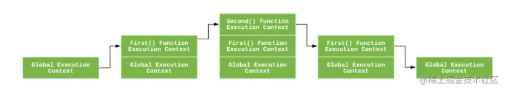

# JavaScript执行上下文和执行上下文栈

## 1.什么是执行上下文

执行上下文是评估和执行 JavaScript 代码的环境的抽象概念

## 2.执行上下文类型

- 全局执行上下文

一个程序中只会有一个全局执行上下文。

- 函数执行上下文

每当一个函数被调用时, 都会为该函数创建一个新的上下文

- eval函数执行上下文

执行在 `eval` 函数内部的代码也会有它属于自己的执行上下文

执行上下文最明显的就是this的指向是执行时确定的。而作用域访问的变量是编写代码的结构确定的

作用域和执行上下文之间最大的区别是： **执行上下文在运行时确定，随时可能改变；作用域在定义时就确定，并且不会改变**。

## 3.如何存储执行上下文？

执行上下文被存储在栈结构里面，被称为执行上下文栈。

### （1）执行上下文栈（Execution context stack，ECS）

执行上下文栈，也就是在其它编程语言中所说的“调用栈”，是一种拥有 LIFO（后进先出）数据结构的栈，被用来存储代码运行时创建的所有执行上下文。

遇到函数调用时会逐个入栈，执行栈顶元素，一个一个出栈，控制流程到达执行上下文

```js
let a = 'Hello World!';
function first() {
  console.log('Inside first function');
  second();
  console.log('Again inside first function');
}
function second() {
  console.log('Inside second function');
}
first();
console.log('Inside Global Execution Context');
```



如上图所示，上述代码经历了`全局执行上下文入栈->first入栈->second入栈->second出栈->first出栈->全局上下文出栈`

#### 举个例子

```js
var scope = "global scope";
function checkscope(){
    var scope = "local scope";
    function f(){
        return scope;
    }
    return f();
}
checkscope();
```

1.执行全局代码，创建全局执行上下文，全局上下文被压入执行上下文栈

```js
    ECStack = [
        globalContext
    ];
```

2.全局上下文初始化

```js
    globalContext = {
        VO: [global],
        Scope: [globalContext.VO],
        this: globalContext.VO
    }
```

2.初始化的同时，checkscope 函数被创建，

```js
    checkscope.[[scope]] = [//保存作用域链到函数的内部属性[[scope]]
      globalContext.VO
    ];
```

3.执行 checkscope 函数，创建 checkscope 函数执行上下文，

```js
    ECStack = [
        checkscopeContext,//checkscope 函数执行上下文被压入执行上下文栈
        globalContext
    ];
```

4.checkscope 函数执行上下文初始化：

```js
checkscopeContext = {
        AO: {//活动对象
            arguments: {//形参
                length: 0
            },
            scope: undefined,//变量声明
            f: reference to function f(){}//函数声明
        },
        Scope: [AO, globalContext.VO],//作用域链
        this: undefined//暂不知道指向
    }
```

5.执行 f 函数，创建 f 函数执行上下文，

```js
  ECStack = [
        fContext,//f 函数执行上下文被压入执行上下文栈
        checkscopeContext,
        globalContext
    ];
```

6.f 函数执行上下文初始化

```js
 fContext = {
        AO: {//活动对象
            arguments: {//形参
                length: 0
            }
        },
        Scope: [AO, checkscopeContext.AO, globalContext.VO],//作用域链
        this: undefined//指向未明
    }
```

7.f 函数执行，沿着作用域链查找 scope 值，返回 scope 值

8.f 函数执行完毕，f 函数上下文从执行上下文栈中弹出

9.checkscope 函数执行完毕，checkscope 执行上下文从执行上下文栈中弹出

10.全局执行上下文代码弹出结束

JavaScript 引擎并非一行一行地分析和执行程序，而是一段一段地分析执行。当执行一段代码的时候，会进行一个“准备工作”，比如第一个例子中的变量提升，和第二个例子中的函数提升。

```js
var foo = function () {
    console.log('foo1');
}
foo();  // foo1
var foo = function () {
    console.log('foo2');
}
foo(); // foo2
```

```js
function foo() {
    console.log('foo1');
}
foo();  // foo2
function foo() {
    console.log('foo2');
}
foo(); // foo2
```

#### 再举个例子

用来管理多个执行上下文，是个栈

```js
var scope = "global scope";
function checkscope(){
    var scope = "local scope";
    function f(){
        return scope;
    }
    return f();
}
checkscope();

var scope = "global scope";
function checkscope(){
    var scope = "local scope";
    function f(){
        return scope;
    }
    return f;
}
checkscope()();
```

两段代码执行的结果一样，都是打印local scope，但是两段代码执行上下文栈的变化不一样。

让我们模拟第一段代码：

```js
ECStack.push(<checkscope> functionContext);//checkscope入栈
ECStack.push(<f> functionContext);//调用了f，f入栈
ECStack.pop();//f出栈
ECStack.pop();//checkscope出栈
```

让我们模拟第二段代码：

```js
ECStack.push(<checkscope> functionContext);//checkscope入栈
ECStack.pop();//立即执行函数出栈
ECStack.push(<f> functionContext);//f函数入栈
ECStack.pop();//f出栈
```

## 4.执行上下文生命周期

- 创建阶段
- 执行阶段
- 销毁阶段

### （1）创建阶段

1. 确定**this** 的值：在创建上下文的时候绑定，指向取决于函数怎么调用，或者全局中指向window
2. 进行变量和函数的初始化声明。
3. 构建作用域链

### （2）执行阶段

js开始执行语句，对定义的变量赋值、顺着作用域链访问变量、如果内部有函数调用就创建一个新的执行上下文压入执行栈并把控制权交出

### （3）销毁阶段

当前执行上下文（局部环境）会被弹出执行上下文栈并且销毁，控制权被重新交给执行栈上一层的执行上下文。

但是对于闭包来说，当闭包的父函数执行完成后，父函数本身执行环境的作用域链会被销毁，但是由于闭包的作用域链仍然在引用父函数的变量对象，导致了父函数的变量对象会一直驻存于内存，无法销毁，除非闭包的引用被销毁，闭包不再引用父函数的变量对象，这块内存才能被释放掉。过度使用闭包会造成 **内存泄露** 的问题


