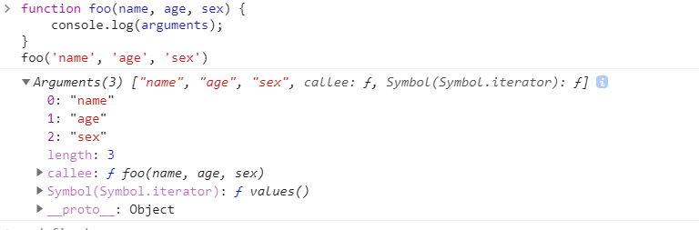

# JavaScript类数组对象与arguments

### 1.类数组

类数组：有length和若干索引的对象

类数组的作用其实本意就是设计一个`有序`和`可遍历`的对象

```js
var array = ['name', 'age', 'sex'];
var arrayLike = {
    0: 'name',
    1: 'age',
    2: 'sex',
    length: 3
}
```

这两个数组在读写和长度方面很像，遍历也可以，但是类数组不能使用数组的方法，比如push

### 2.类数组怎么调用数组方法？

虽然没办法直接调用数组的方法，但是可以间接调用数组的方法，使用call调用

```js
var arrayLike = {0: 'name', 1: 'age', 2: 'sex', length: 3 }
Array.prototype.join.call(arrayLike, '&'); // name&age&sex
Array.prototype.slice.call(arrayLike, 0); // ["name", "age", "sex"] // slice可以做到类数组转数组
Array.prototype.map.call(arrayLike, function(item){
    return item.toUpperCase();
}); 
Array.prototype.concat.apply([], arrayLike)
// ["NAME", "AGE", "SEX"]
```

### 3.类数组对象

（1）Arguments 对象就是一个类数组对象



（2）前端中document.getElementByTagName()也返回类数组对象

（3）字符也是类数组对象

```js
const str ="abc"
console.log(str.length) // 3
console.log(str[0]) // a
```

### 4.一些类数组对象的属性

#### （1）length属性

Arguments对象的length属性，表示实参的长度，举个例子：

```js
function foo(b, c, d){
    console.log("实参的长度为：" + arguments.length)
}
console.log("形参的长度为：" + foo.length)
foo(1)
// 形参的长度为：3
// 实参的长度为：1
```

#### （2）callee属性，通过它可以调用函数自身

新增闭包解决办法

```js
//关于闭包使用callee解决的办法
var data = [];
for (var i = 0; i < 3; i++) {
    (data[i] = function () {
       console.log(arguments.callee.i) 
    }).i = i;
}
data[0]();
data[1]();
data[2]();
// 0
// 1
// 2
```

#### （3） argument和参数绑定

```js
function foo(name, age, sex, hobbit) {
    console.log(name, arguments[0]); // name name
    // 改变形参
    name = 'new name';
    console.log(name, arguments[0]); // new name new name
    // 改变arguments
    arguments[1] = 'new age';
    console.log(age, arguments[1]); // new age new age
    // 测试未传入的是否会绑定 没有绑定
    console.log(sex); // undefined
    sex = 'new sex';
    console.log(sex, arguments[2]); // new sex undefined 形参没有传递所以undefined
    arguments[3] = 'new hobbit';
    console.log(hobbit, arguments[3]); // undefined new hobbit 形参直接被赋值了，但是实参还是没有的
}
foo('name', 'age')
//传入的参数，实参和 arguments 的值会共享，当没有传入时，实参与 arguments 值不会共享
//以上是在非严格模式下，如果是在严格模式下，实参和 arguments 是不会共享的。
```

#### （4）类数组转数组

es6…运算符

```js
function func(...arguments){
	console.log(arguments);//[1,2,3]
}
func(1,2,3);
```

Array.form

```js
function add(a,b){
    const arr = Array.from(arguments) // ES6 类数组转化成数组
    console.log(arr) // [1,2]
}
add(1,2)
```

call 方法

```js
function sum(a,b){
    const arr= Array.prototype.filter.call(arguments,(value)=>{
        return value >1   
    }) // 不算是类数组转化成数组方法，只是改变了数组filter执行环境
    console.log(arr) // [2]
    
    // 还可以使用数组 slice 方法
    const arr2 = Array.prototype.slice.call(arguments)
}
sum(1,2)
```

es6解构

```js
[...arguments]
```

### 5.应用场景

使用arguments的应用很多，我们会在 jQuery 的 extend 实现、函数柯里化、递归等场景

比如

1. 参数不定长
2. 函数柯里化
3. 递归调用
4. 函数重载