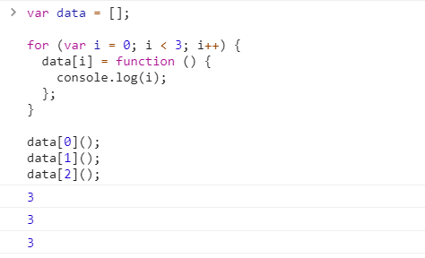
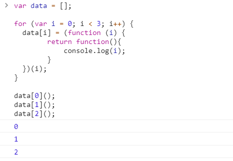

# JavaScript闭包

## 1.定义

MDN：闭包是指那些能够访问自由变量**（自由变量是指在函数中使用的，但既不是函数参数也不是函数的局部变量的变量。）**的函数

 **父函数被销毁** 的情况下，返回出的子函数的`[[scope]]`中仍然保留着父级的单变量对象和作用域链，因此可以继续访问到父级的变量对象，这样的函数称为闭包。

```js
var a = 1;
function foo() {
    console.log(a);//foo函数可以访问变量a,但是a既不是foo的局部变量也不是参数，所以a是自由变量
}
foo();
```

所以 函数+函数可以访问的自由变量=闭包

## 2.闭包实例

**从技术的角度讲，所有的JavaScript函数都是闭包。**

**从实践的角度讲，闭包是：**

1. 即使创建它的上下文已经销毁，它仍然存在（比如，内部函数从父函数中返回）
2. 在代码中引用了自由变量

```js
var scope = "global scope";
function checkscope(){
    var scope = "local scope";
    function f(){
        return scope;
    }
    return f;
}
var foo = checkscope();
foo();
/*
全局执行上下文入栈然后全局执行上下文初始化->checkscope执行上下文入栈然后初始化->checkscope上下文出栈->f入栈然后初始化->f出栈
*/
//这个代码，在checkscope销毁之后，f函数依旧可以读取到 checkscope 作用域下的 scope 值，就是因为闭包
```

因为f函数维护了一个作用域链

```js
fContext = {
    Scope: [AO, checkscopeContext.AO, globalContext.VO],
}
```

就是因为这个作用域链，所以可以继续读到checkscopeContext.AO的值,以此实现闭包

## 3.面试必刷题

### （1）循环和闭包





当执行到data[0]之前，全局上下文的VO都是：

```js
globalContext = {
    VO: {
        data: [...],
        i: 3
    }
}
```

但是例子1的data[0]的作用域链为：

```js
data[0]Context = {
    Scope: [AO, globalContext.VO]
}
```

直接查找全局的执行上下文，所以结果是 3，3，3

例子2的data[0]的作用域链为：

```js
data[0]Context = {
    Scope: [AO, 匿名函数Context.AO,globalContext.VO]
}
```

匿名函数执行上下文的AO为：

```js
匿名函数Context = {
    AO: {
        arguments: {
            0: 0,
            length: 1
        },
        i: 0
    }
}
```

所以在匿名函数的执行上下文中找到了i，分别输出0,1,2

### （2）var 和 let的循环

闭包只存储外部变量的引用，而不会拷贝这些外部变量的值

```js
function initEvents(){
  for(var i=1; i<=3; i++){
    $("#btn" + i).click(function showNumber(){
      alert(i);//4
    });
  }
}
initEvents();
```

我们创建了3个闭包，皆引用了同一个变量 `i`，且这三个闭包都是事件处理函数。由于变量 `i` 随着循环自增，因此最终输出的都是同样的值。

修复这个问题最简单的方法是在 `for` 语句块中使用 `let` 变量声明，这将在每次循环中为 `for` 语句块创建一个新的局部变量。如下：

```js
function initEvents(){
  for(let i=1; i<=3; i++){
    $("#btn" + i).click(function showNumber(){
      alert(i);//1 2 3
    });
  }
}
initEvents();
```

但是，如果变量声明在 `for` 语句块之外的话，即使用了 `let` 变量声明，所有的闭包还是会引用同一个变量，最终输出的还是同一个值。

在《你不知道的JavaScript》里面，有写到 let 关键字将 for 循环的块隐式地声明为块作用域。而 for 循环头部的 let 不仅将 i 绑定到了 for 循环的块中，事实上它将其重新绑定到了循环的每一个迭代中，确保使用上一个循环迭代结束时的值重新进行赋值。和闭包有所不一样

## 4.小总结

 闭包意味着信息隐藏，可以创建私有状态的函数，使状态被封装起来

