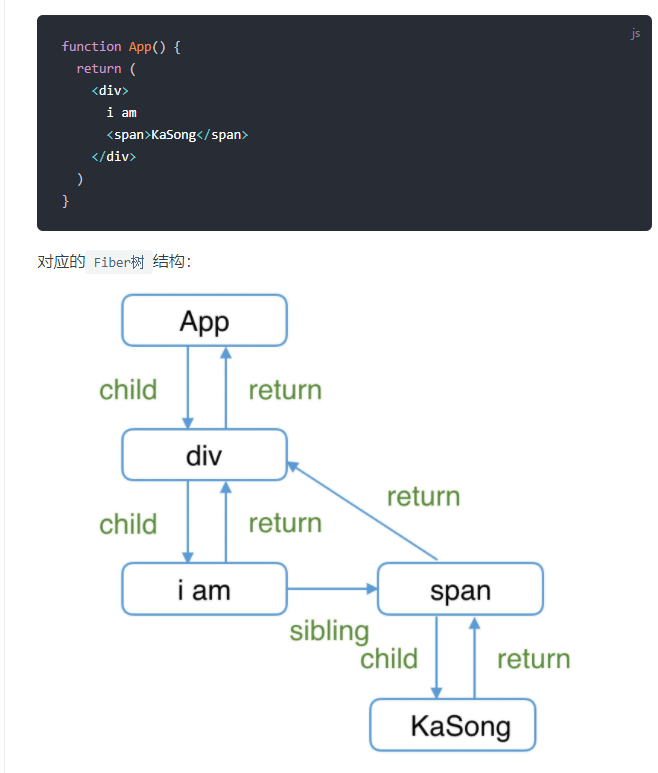
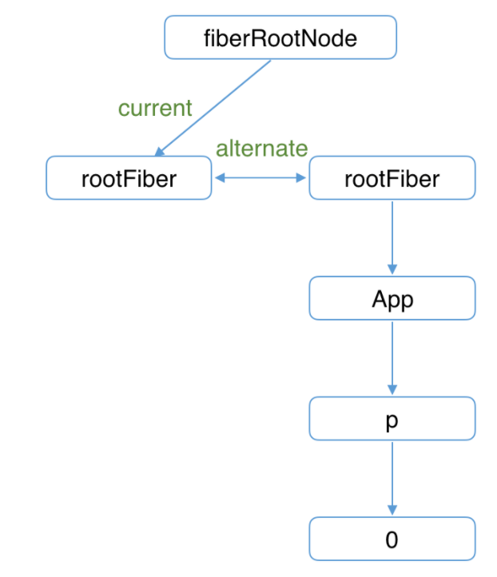
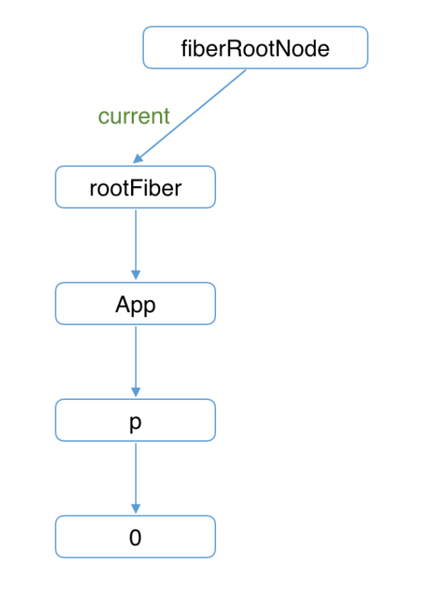
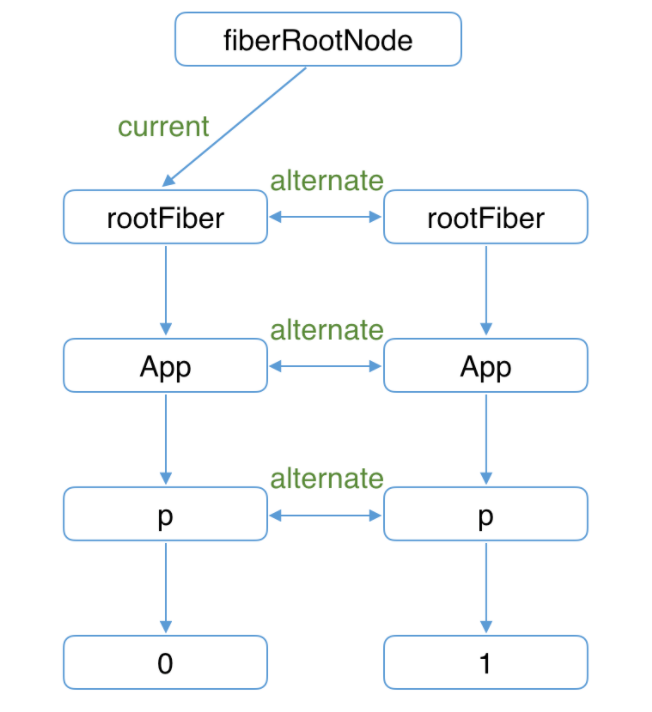
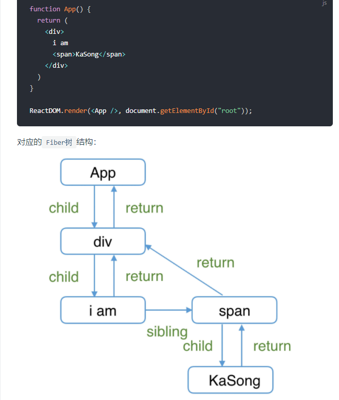
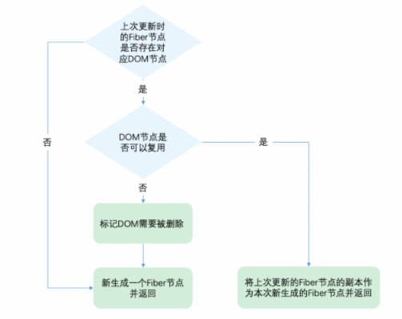

# react技术揭秘(源码学习)

# 第一部分 理念

## 1.react是什么？

React 是用 JavaScript 构建**快速响应**的大型 Web 应用程序的首选方式

影响快速响应的因素

- CPU的瓶颈：当遇到大计算量的操作或者设备性能不足使页面掉帧，导致卡顿。
- IO的瓶颈：发送网络请求后，由于需要等待数据返回才能进一步操作导致不能快速响应。

## 2.为了达到快速响应，react做了什么？

### （1）解决CPU的瓶颈

```
实现时间切片，而时间切片的关键是：将同步的更新变为可中断的异步更新。
```

主流浏览器刷新频率为60Hz，即每（1000ms / 60Hz）16.6ms浏览器刷新一次。

JS可以操作DOM，`GUI渲染线程`与`JS线程`是互斥的。所以**JS脚本执行**和**浏览器布局、绘制**不能同时执行，所以16.6ms必须完成js脚本绘制-样式布局-样式绘制，但是如果组件很多，js执行时间过长，页面掉帧，造成卡顿

react解决方案：预留时间5ms（源码中）给js线程，不够用就又将线程控制权交还给浏览器进行ui渲染，react等待下一帧时间又来执行js线程

```js
这种将长任务分拆到每一帧中，像蚂蚁搬家一样一次执行一小段任务的操作，被称为时间切片（time slice）
```

长任务被拆分到每一帧不同的`task`中，`JS脚本`执行时间大体在`5ms`左右，这样浏览器就有剩余时间执行**样式布局**和**样式绘制**，减少掉帧的可能性。

### （2）解决IO的瓶颈

```
react实现Suspense功能及配套的hook-useDeferredValue
```

网络延迟是前端开发者无法解决的，但是可以减少用户对网络延迟的感知，使用**loading**和将**同步的更新**变为**可中断的异步更新**

Suspense:React 16.6 新增了 `` 组件，让你可以“等待”目标代码加载，并且可以直接指定一个加载的界面（像是个 spinner），让它在用户等待的时候显示

```react
const ProfilePage = React.lazy(() => import('./ProfilePage')); // 懒加载

// 在 ProfilePage 组件处于加载阶段时显示一个 spinner
<Suspense fallback={<Spinner />}>//显示的组件
  <ProfilePage />
</Suspense>
```

useDeferredValue：返回一个延迟响应的值

```react
const deferredValue = useDeferredValue(value, { timeoutMs: 2000 });
//for example:文本输入框
function App() {
  const [text, setText] = useState("hello");
  const deferredText = useDeferredValue(text, { timeoutMs: 2000 }); 

  return (
    <div className="App">
      {/* 保持将当前文本传递给 input */}
      <input value={text} onChange={handleChange} />
      ...
      {/* 但在必要时可以将列表“延后” */}
      <MySlowList text={deferredText} />
    </div>
  );
 }
```

## 3. react15框架：不能支持异步更新

不满足快速响应的理念，所以被重构

React15架构可以分为两层：

- Reconciler（协调器）—— 负责找出变化的组件
- Renderer（渲染器）—— 负责将变化的组件渲染到页面上

### （1）Reconciler（协调器）

通过`this.setState`、`this.forceUpdate`、`ReactDOM.render`等API触发更新。

每当有更新发生时，**Reconciler**会做如下工作：

- 调用函数组件、或class组件的`render`方法，将返回的JSX转化为虚拟DOM
- 将虚拟DOM和上次更新时的虚拟DOM对比
- 通过对比找出本次更新中变化的虚拟DOM
- 通知**Renderer**将变化的虚拟DOM渲染到页面上

### （2）Renderer（渲染器）

浏览器环境渲染的**Renderer** —— [ReactDOM](https://www.npmjs.com/package/react-dom)

```
ReactNative (opens new window)渲染器，渲染App原生组件
ReactTest (opens new window)渲染器，渲染出纯Js对象用于测试
ReactArt (opens new window)渲染器，渲染到Canvas, SVG 或 VML (IE8)
```

每次更新发生时，**Renderer**接到**Reconciler**通知，将变化的组件渲染在当前宿主环境。所以是同步，一次一次渲染

缺点：在**Reconciler**中，`mount`的组件会调用mountComponent,`update`的组件会调用updateComponent。这两个方法都会递归更新子组件,如果有递归更新，中途无法中断，层级很深时，递归更新超过16ms，用户交互卡顿

## 4. react16框架：支持异步更新

三层架构：

- Scheduler（调度器）—— 调度任务的优先级，高优任务优先进入**Reconciler**
- Reconciler（协调器）—— 负责找出变化的组件
- Renderer（渲染器）—— 负责将变化的组件渲染到页面上

### （1）Scheduler调度器

既然要时间切片，就需要浏览器进行通知（是否还有剩余时间）

`React`实现了功能更完备的`requestIdleCallback`polyfill，这就是**Scheduler**。除了在空闲时触发回调的功能外，**Scheduler**还提供了多种调度优先级供任务设置。

### （2）Reconciler协调器

用于处理虚拟DOM，更新工作从递归变成了可以中断的循环过程。每次循环都会调用`shouldYield`判断当前是否有剩余时间。

```
function workLoopConcurrent() {
  // Perform work until Scheduler asks us to yield
  while (workInProgress !== null && !shouldYield()) {
    workInProgress = performUnitOfWork(workInProgress);
  }
}
```

如何解决中断更新时DOM渲染不完全的问题？

**Reconciler**与**Renderer**不再是交替工作。当**Scheduler**将任务交给**Reconciler**后，**Reconciler**会为变化的虚拟DOM打上代表增/删/更新的标记，类似这样：

```js
export const Placement = /*             */ 0b0000000000010;
export const Update = /*                */ 0b0000000000100;
export const PlacementAndUpdate = /*    */ 0b0000000000110;
export const Deletion = /*              */ 0b0000000001000;
```

整个**Scheduler**与**Reconciler**的工作都在内存中进行。只有当所有组件都完成**Reconciler**的工作，才会统一交给**Renderer**。

### （3）Renderer渲染器

执行被标记的虚拟DOM的操作，进行渲染

由此发现，（）（2）步骤可能被打断，但是不会影响DOM的更新，因为最后DOM才进行更新，用户也不会看出来更新不完全的DOM

## 5. Fiber框架

`React16`采用新的`Reconciler`。

`Reconciler`内部采用了`Fiber`的架构。

### （1）代数效应

`代数效应`是`函数式编程`中的一个概念，用于将`副作用`从`函数`调用中分离。

在react中就是Hooks,从`React15`到`React16`，协调器（`Reconciler`）重构的一大目的是：将老的`同步更新`的架构变为`异步可中断更新`。

`异步可中断更新`可以理解为：`更新`在执行过程中可能会被打断（浏览器时间分片用尽或有更高优任务插队），当可以继续执行时恢复之前执行的中间状态

`React Fiber`可以理解为：

`React`内部实现的一套状态更新机制。支持任务不同`优先级`，可中断与恢复，并且恢复后可以复用之前的`中间状态`。

其中每个任务更新单元为`React Element`对应的`Fiber节点`。

### （2）Fiber实现原理

`Fiber`包含三层含义：

1. 作为架构来说，之前`React15`的`Reconciler`采用递归的方式执行，数据保存在递归调用栈中，所以被称为`stack Reconciler`。`React16`的`Reconciler`基于`Fiber节点`实现，被称为`Fiber Reconciler`。
2. 作为静态的数据结构来说，每个`Fiber节点`对应一个`React element`，保存了该组件的类型（函数组件/类组件/原生组件...）、对应的DOM节点等信息。
3. 作为动态的工作单元来说，每个`Fiber节点`保存了本次更新中该组件改变的状态、要执行的工作（需要被删除/被插入页面中/被更新...）。

Fiber结构：Fiber节点的属性定义

```js
function FiberNode(
  tag: WorkTag,
  pendingProps: mixed,
  key: null | string,
  mode: TypeOfMode,
) {
  // 作为静态数据结构的属性
  this.tag = tag;// Fiber对应组件的类型 Function/Class/Host...
  this.key = key;// key属性
  this.elementType = null;// 大部分情况同type，某些情况不同，比如FunctionComponent使用React.memo包裹
  this.type = null;// 对于 FunctionComponent，指函数本身，对于ClassComponent，指class，对于HostComponent，指DOM节点tagName
  this.stateNode = null;// Fiber对应的真实DOM节点

  // 用于连接其他Fiber节点形成Fiber树
  this.return = null;//指向父级Fiber节点
  this.child = null;//指向子Fiber节点
  this.sibling = null;//指向右边第一个兄弟Fiber节点
  this.index = 0;

  this.ref = null;

  // 作为动态的工作单元的属性
      // 保存本次更新造成的状态改变相关信息
  this.pendingProps = pendingProps;
  this.memoizedProps = null;
  this.updateQueue = null;
  this.memoizedState = null;
  this.dependencies = null;

  this.mode = mode;
// 保存本次更新会造成的DOM操作
  this.effectTag = NoEffect;
  this.nextEffect = null;

  this.firstEffect = null;
  this.lastEffect = null;

  // 调度优先级相关
  this.lanes = NoLanes;
  this.childLanes = NoLanes;

  // 指向该fiber在另一次更新时对应的fiber
  this.alternate = null;
}
```



### （3）Fiber工作原理

Fiber树和DOM树 有什么关系？Fiber如何更新DOM？

`Fiber节点`可以保存对应的`DOM节点`。

相应的，`Fiber节点`构成的`Fiber树`就对应`DOM树`。

#### 1.如何更新DOM？

使用双缓存技术：

`canvas`绘制动画，每一帧绘制前都会调用`ctx.clearRect`清除上一帧的画面。如果当前帧画面计算量比较大，导致清除上一帧画面到绘制当前帧画面之间有较长间隙，就会出现白屏。

为了解决这个问题，我们可以在内存中绘制当前帧动画，绘制完毕后直接用当前帧替换上一帧画面，由于省去了两帧替换间的计算时间，不会出现从白屏到出现画面的闪烁情况。

**在内存中构建并直接替换**的技术叫做[双缓存](https://baike.baidu.com/item/双缓冲)

`React`使用“双缓存”来完成`Fiber树`的构建与替换——对应着`DOM树`的创建与更新。

#### 2.双缓存Fiber树

react对应两个Fiber树，当前屏幕上显示内容对应的`Fiber树`称为`current Fiber树`，正在内存中构建的`Fiber树`称为`workInProgress Fiber树`

```
//两棵树之间通过alternate属性连接
currentFiber.alternate === workInProgressFiber;
workInProgressFiber.alternate === currentFiber;
//两个树通过指针来更换，workInProgress Fibler更新完成之后就指向current Fiber树，然后完成替换（完成DOM更新）
```

（1）mount时





（2）update时

如果进行更新，开启一次新的`render阶段`并构建一棵新的`workInProgress Fiber 树`。



渲染更新完成之后，最后变成current Fiber 树，展示在页面上

## 6. 总结

- `Reconciler`工作的阶段被称为`render`阶段。因为在该阶段会调用组件的`render`方法。
- `Renderer`工作的阶段被称为`commit`阶段。就像你完成一个需求的编码后执行`git commit`提交代码。`commit`阶段会把`render`阶段提交的信息渲染在页面上。
- `render`与`commit`阶段统称为`work`，即`React`在工作中。相对应的，如果任务正在`Scheduler`内调度，就不属于`work`。

# 第二部分 前置知识

## 1.react三层

- Scheduler（调度器）—— 调度任务的优先级，高优任务优先进入**Reconciler**
- Reconciler（协调器）—— 负责找出变化的组件
- Renderer（渲染器）—— 负责将变化的组件渲染到页面上

## 2.源码文件结构

```text
根目录
├── fixtures        # 包含一些给贡献者准备的小型 React 测试项目
├── packages        # 包含元数据（比如 package.json）和 React 仓库中所有 package 的源码（子目录 src）
├── scripts         # 各种工具链的脚本，比如git、jest、eslint等
```

### packages目录

目录下的文件夹非常多，我们来看下：

#### （1）react文件夹

React的核心，包含所有全局 React API，如：

- React.createElement
- React.Component
- React.Children

这些 API 是全平台通用的，它不包含`ReactDOM`、`ReactNative`等平台特定的代码。在 NPM 上作为[单独的一个包 发布。

#### （2）scheduler文件夹

Scheduler（调度器）的实现。

#### （3）shared 文件夹

源码中其他模块公用的**方法**和**全局变量**，比如在[shared/ReactSymbols.js中保存`React`不同组件类型的定义。

```js
// ...
export let REACT_ELEMENT_TYPE = 0xeac7;
export let REACT_PORTAL_TYPE = 0xeaca;
export let REACT_FRAGMENT_TYPE = 0xeacb;
// ...
```

### Renderer相关的文件夹

如下几个文件夹为对应的**Renderer**

```js
- react-art
- react-dom              # 注意这同时是DOM和SSR（服务端渲染）的入口
- react-native-renderer
- react-noop-renderer     # 用于debug fiber（后面会介绍fiber）
- react-test-renderer
```

### 试验性包的文件夹

`React`将自己流程中的一部分抽离出来，形成可以独立使用的包，由于他们是试验性质的，所以不被建议在生产环境使用。包括如下文件夹：

```js
- react-server        # 创建自定义SSR流
- react-client        # 创建自定义的流
- react-fetch         # 用于数据请求
- react-interactions  # 用于测试交互相关的内部特性，比如React的事件模型
- react-reconciler    # Reconciler的实现，你可以用他构建自己的Renderer
```

### 辅助包的文件夹

`React`将一些辅助功能形成单独的包。包括如下文件夹：

```js
- react-is       # 用于测试组件是否是某类型
- react-client   # 创建自定义的流
- react-fetch    # 用于数据请求
- react-refresh  # “热重载”的React官方实现
```

### react-reconciler文件夹

源码学习中 80%的代码量都来自这个包。

他一边对接**Scheduler**，一边对接不同平台的**Renderer**，构成了整个 React16 的架构体系。

## 3.深入理解JSX

- `JSX`和`Fiber节点`是同一个东西么？
- `React Component`、`React Element`是同一个东西么，他们和`JSX`有什么关系？

`JSX`在编译时会被`Babel`编译为`React.createElement`方法。

```jsx
// 编译前
<p>KaSong</p>
// 编译后
h("p", null, "KaSong");
```

`JSX`是一种描述当前组件内容的数据结构，他不包含组件**schedule**、**reconcile**、**render**所需的相关信息

在组件`mount`时，`Reconciler`根据`JSX`描述的组件内容生成组件对应的`Fiber节点`。

在`update`时，`Reconciler`将`JSX`与`Fiber节点`保存的数据对比，生成组件对应的`Fiber节点`，并根据对比结果为`Fiber节点`打上`标记`

# 第三部分 架构

## 1.render阶段

`Fiber节点`是如何被创建并构建`Fiber树`的？

`render阶段`开始于`performSyncWorkOnRoot`或`performConcurrentWorkOnRoot`方法的调用。这取决于本次更新是同步更新还是异步更新。

```js
// performSyncWorkOnRoot会调用该方法
function workLoopSync() {
  while (workInProgress !== null) {
    performUnitOfWork(workInProgress);
  }
}

// performConcurrentWorkOnRoot会调用该方法
function workLoopConcurrent() {
  while (workInProgress !== null && !shouldYield()) {
    performUnitOfWork(workInProgress);//创建下一个Fiber节点并赋值给workInProgress，并将workInProgress与已创建的Fiber节点连接起来构成Fiber树
  }
}
//唯一的区别是是否调用shouldYield。
//如果当前浏览器帧没有剩余时间，shouldYield会中止循环，直到浏览器有空闲时间后再继续遍历。
```

通过遍历的方式实现可中断的递归，所以`performUnitOfWork`的工作可以分为两部分：“递”和“归”

###  （1）递

向下深度优先遍历，遍历到的每个节点调用beginWork方法（根据传入的`Fiber节点`创建`子Fiber节点`，并将这两个`Fiber节点`连接）

到叶子节点就会进入“归”阶段

### （2）归

调用[completeWork处理`Fiber节点`，不断向上遍历执行该方法，如果存在兄弟节点就“递”兄，如果不存在兄，就进行父亲的“递”

“递”和“归”阶段会交错执行直到“归”到`rootFiber`

例子：



```sh
1. rootFiber beginWork
2. App Fiber beginWork
3. div Fiber beginWork
4. "i am" Fiber beginWork
5. "i am" Fiber completeWork
6. span Fiber beginWork
7. span Fiber completeWork
8. div Fiber completeWork
9. App Fiber completeWork
10. rootFiber completeWork
```

### （3）递实现beginWork实现

```js
function beginWork(
  current: Fiber | null,//上一次更新时的Fiber节点，即workInProgress.alternate
  workInProgress: Fiber,//当前组件对应的Fiber节点
  renderLanes: Lanes,//优先级
): Fiber | null {
  // ...省略函数体
}
  // update时：如果current存在可能存在优化路径，可以复用current（即上一次更新的Fiber节点）
  if (current !== null) {//代表更新，为null代表mount
    const oldProps = current.memoizedProps;
    const newProps = workInProgress.pendingProps;

    if (
      oldProps !== newProps ||
      hasLegacyContextChanged() ||
      (__DEV__ ? workInProgress.type !== current.type : false)//直接复用前一次更新的子Fiber,不需要新建Fiber
    ) 
    {
      didReceiveUpdate = true;
    }
      else if (!includesSomeLane(renderLanes, updateLanes)) {//当前节点优先级不够
      didReceiveUpdate = false;
      switch (workInProgress.tag) {
        // 省略处理
      }
      return bailoutOnAlreadyFinishedWork(
        current,
        workInProgress,
        renderLanes,
      );
    } else {
      didReceiveUpdate = false;
    }
  } else {
    didReceiveUpdate = false;
  }

  // mount时：根据tag不同，创建不同的子Fiber节点
  switch (workInProgress.tag) {
    case IndeterminateComponent: 
      // ...省略
    case LazyComponent: 
      // ...省略
    case FunctionComponent: 
      // ...省略
    case ClassComponent: 
      // ...省略
    case HostRoot:
      // ...省略
    case HostComponent:
      // ...省略
    case HostText:
      // ...省略
    // ...省略其他类型
  }
}
/*对于我们常见的组件类型，如（FunctionComponent/ClassComponent/HostComponent），最终会进入reconcileChildren (opens new window)方法。*/

```

#### 1.reconcileChildren

`Reconciler`模块的核心部分

- 对于`mount`：创建新的`子Fiber节点`
- 对于`update`：将当前组件与该组件在上次更新时对应的`Fiber节点`比较（也就是俗称的`Diff`算法），将比较的结果生成新`Fiber节点`

```js
export function reconcileChildren(
  current: Fiber | null,
  workInProgress: Fiber,
  nextChildren: any,
  renderLanes: Lanes
) {
  if (current === null) {//通过是否等于null来判断是mounthaishiupdate
    // 对于mount的组件
    workInProgress.child = mountChildFibers(
      workInProgress,
      null,
      nextChildren,
      renderLanes,
    );
  } else {
    // 对于update的组件
    workInProgress.child = reconcileChildFibers(
      workInProgress,
      current.child,
      nextChildren,
      renderLanes,
    );
  }
}
```

#### 2.effectTag

`render阶段`在内存中进行，当工作结束后会通知`Renderer`需要执行的`DOM`操作。要执行`DOM`操作的具体类型就保存在`fiber.effectTag`中

### （4）归实现complteWork实现

```js
function completeWork(
  current: Fiber | null,
  workInProgress: Fiber,
  renderLanes: Lanes,
): Fiber | null {
  const newProps = workInProgress.pendingProps;
//针对不同fiber.tag调用不同的处理逻辑
  switch (workInProgress.tag) {
    case IndeterminateComponent:
    case LazyComponent:
    case SimpleMemoComponent:
    case FunctionComponent:
    case ForwardRef:
    case Fragment:
    case Mode:
    case Profiler:
    case ContextConsumer:
    case MemoComponent:
      return null;
    case ClassComponent: {
      // ...省略
      return null;
    }
    case HostRoot: {
      // ...省略
      updateHostContainer(workInProgress);
      return null;
    }
    case HostComponent: {//原生DOM组件对应的Fiber节点
  popHostContext(workInProgress);
  const rootContainerInstance = getRootHostContainer();
  const type = workInProgress.type;

  if (current !== null && workInProgress.stateNode != null) {
    // update的情况：Fiber节点已经存在对应DOM节点，所以不需要生成DOM节点。需要做的主要是处理props
    updateHostComponent(
    current,
    workInProgress,
    type,
    newProps,
    rootContainerInstance,
  );
  } else {
    // mount的情况
   const currentHostContext = getHostContext();
// 为fiber创建对应DOM节点
const instance = createInstance(
    type,
    newProps,
    rootContainerInstance,
    currentHostContext,
    workInProgress,
  );
// 将子孙DOM节点插入刚生成的DOM节点中
appendAllChildren(instance, workInProgress, false, false);
// DOM节点赋值给fiber.stateNode
workInProgress.stateNode = instance;

// 与update逻辑中的updateHostComponent类似的处理props的过程
if (
  finalizeInitialChildren(
    instance,
    type,
    newProps,
    rootContainerInstance,
    currentHostContext,
  )
) {
  markUpdate(workInProgress);
}
  }
  return null;
    }
  // ...省略
```

```
completeWork`属于“归”阶段调用的函数，每次调用`appendAllChildren`时都会将已生成的子孙`DOM节点`插入当前生成的`DOM节点`下。那么当“归”到`rootFiber`时，我们已经有一个构建好的离屏`DOM树
```

render部分结束，在`performSyncWorkOnRoot`函数中`fiberRootNode`被传递给`commitRoot`方法，开启`commit阶段`工作流程。

```js
commitRoot(root);
```

### （5）commit阶段

`commit`阶段的主要工作（即`Renderer`的工作流程）分为三部分：

- before mutation阶段（执行`DOM`操作前）
- mutation阶段（执行`DOM`操作）
- layout阶段（执行`DOM`操作后）

#### 1.before mutation

主要进行变量赋值，状态重置的工作

1. 处理`DOM节点`渲染/删除后的 `autoFocus`、`blur`逻辑
2. 调用`getSnapshotBeforeUpdate`生命周期钩子
3. 调度`useEffect`

```js
do {
    // 触发useEffect回调与其他同步任务。由于这些任务可能触发新的渲染，所以这里要一直遍历执行直到没有任务
    flushPassiveEffects();
  } while (rootWithPendingPassiveEffects !== null);

  // root指 fiberRootNode
  // root.finishedWork指当前应用的rootFiber
  const finishedWork = root.finishedWork;

  // 凡是变量名带lane的都是优先级相关
  const lanes = root.finishedLanes;

/***********************************************************************/
/***********以上属于before mutation的工作********************************/
  if (finishedWork === null) {
    return null;
  }
  root.finishedWork = null;
  root.finishedLanes = NoLanes;

  // 重置Scheduler绑定的回调函数
  root.callbackNode = null;
  root.callbackId = NoLanes;

  let remainingLanes = mergeLanes(finishedWork.lanes, finishedWork.childLanes);
  // 重置优先级相关变量
  markRootFinished(root, remainingLanes);

  // 清除已完成的discrete updates，例如：用户鼠标点击触发的更新。
  if (rootsWithPendingDiscreteUpdates !== null) {
    if (
      !hasDiscreteLanes(remainingLanes) &&
      rootsWithPendingDiscreteUpdates.has(root)
    ) {
      rootsWithPendingDiscreteUpdates.delete(root);
    }
  }

  // 重置全局变量
  if (root === workInProgressRoot) {
    workInProgressRoot = null;
    workInProgress = null;
    workInProgressRootRenderLanes = NoLanes;
  } else {
  }

  // 将effectList赋值给firstEffect
  // 由于每个fiber的effectList只包含他的子孙节点
  // 所以根节点如果有effectTag则不会被包含进来
  // 所以这里将有effectTag的根节点插入到effectList尾部
  // 这样才能保证有effect的fiber都在effectList中
  let firstEffect;
  if (finishedWork.effectTag > PerformedWork) {
    if (finishedWork.lastEffect !== null) {
      finishedWork.lastEffect.nextEffect = finishedWork;
      firstEffect = finishedWork.firstEffect;
    } else {
      firstEffect = finishedWork;
    }
  } else {
    // 根节点没有effectTag
    firstEffect = finishedWork.firstEffect;
  }
```

#### 2.mutation阶段

`mutation阶段`会遍历`effectList`，依次执行`commitMutationEffects`。该方法的主要工作为“根据`effectTag`调用不同的处理函数处理`Fiber`。

#### 3.layout阶段

1. `useEffect`相关的处理

2. 性能追踪相关。

源码里有很多和`interaction`相关的变量。他们都和追踪`React`渲染时间、性能相关，在Profiler API和DevTools中使用。

3. 在`commit`阶段会触发一些生命周期钩子（如 `componentDidXXX`）和`hook`（如`useLayoutEffect`、`useEffect`）。

`layout阶段`会遍历`effectList`，依次执行`commitLayoutEffects`。该方法的主要工作为“根据`effectTag`调用不同的处理函数处理`Fiber`并更新`ref`。

# 第四部分 实现

## 1.Diff算法

```
一个DOM节点在某一时刻最多会有4个节点和他相关。

current Fiber。如果该DOM节点已在页面中，current Fiber代表该DOM节点对应的Fiber节点。

workInProgress Fiber。如果该DOM节点将在本次更新中渲染到页面中，workInProgress Fiber代表该DOM节点对应的Fiber节点。

DOM节点本身。

JSX对象。即ClassComponent的render方法的返回结果，或FunctionComponent的调用结果。JSX对象中包含描述DOM节点的信息。

Diff算法的本质是对比1和4，生成2。
```

### （1）DIff瓶颈及react如何应对

将前后两棵树完全比对的算法的复杂程度为 O(n 3 )，其中`n`是树中元素的数量。

为了降低算法复杂度，`React`的`diff`会预设三个限制

1. 只对同级元素进行`Diff`。如果一个`DOM节点`在前后两次更新中跨越了层级，那么`React`不会尝试复用他。
2. 两个不同类型的元素会产生出不同的树。如果元素由`div`变为`p`，React会销毁`div`及其子孙节点，并新建`p`及其子孙节点。
3. 通过 `key prop`来暗示哪些子元素在不同的渲染下能保持稳定。

```jsx
// 更新前
<div>
  <p key="ka">ka</p>
  <h3 key="song">song</h3>
</div>

// 更新后
<div>
  <h3 key="song">song</h3>
  <p key="ka">ka</p>
</div>
/*用key指明了节点前后对应关系后，React知道key === "ka"的p在更新后还存在，所以DOM节点可以复用，只是需要交换下顺序。*/
```

### （2）Diff实现

从`Diff`的入口函数`reconcileChildFibers`出发，该函数会根据`newChild`（即`JSX对象`）类型调用不同的处理函数

```js
// 根据newChild类型选择不同diff函数处理
function reconcileChildFibers(
  returnFiber: Fiber,
  currentFirstChild: Fiber | null,
  newChild: any,
): Fiber | null {

  const isObject = typeof newChild === 'object' && newChild !== null;

  if (isObject) {
    // object类型，可能是 REACT_ELEMENT_TYPE 或 REACT_PORTAL_TYPE
    switch (newChild.$$typeof) {//单节点进入reconcileSingleElement
      case REACT_ELEMENT_TYPE:
        // 调用 reconcileSingleElement 处理
      // // ...省略其他case
    }
  }

  if (typeof newChild === 'string' || typeof newChild === 'number') {
    // 调用 reconcileSingleTextNode 处理
    // ...省略
  }

  if (isArray(newChild)) {//多节点处理
    // 调用 reconcileChildrenArray 处理
    // ...省略
  }

  // 一些其他情况调用处理函数
  // ...省略

  // 以上都没有命中，删除节点
  return deleteRemainingChildren(returnFiber, currentFirstChild);
}
```

#### 1.单节点：object`、`number`、`string



```javascript
 const key = element.key;
  let child = currentFirstChild;
  
  // 首先判断是否存在对应DOM节点
  while (child !== null) {
    // 上一次更新存在DOM节点，接下来判断是否可复用

    // 首先比较key是否相同
    if (child.key === key) {

      // key相同，接下来比较type是否相同

      switch (child.tag) {
        // ...省略case
        
        default: {
          if (child.elementType === element.type) {
            // type相同则表示可以复用
            // 返回复用的fiber
            return existing;
          }
          
          // type不同则跳出switch
          break;
        }
      }
      // 代码执行到这里代表：key相同但是type不同
      // 将该fiber及其兄弟fiber标记为删除
      deleteRemainingChildren(returnFiber, child);
      break;
    } else {
      // key不同，将该fiber标记为删除
      deleteChild(returnFiber, child);
    }
    child = child.sibling;
  }

  // 创建新Fiber，并返回 ...省略
```

判断key是否相同，相同再判断type，都相同就可以复用

- 当`child !== null`且`key相同`且`type不同`时执行`deleteRemainingChildren`将`child`及其兄弟`fiber`都标记删除。
- 当`child !== null`且`key不同`时仅将`child`标记删除

#### 2.多节点：Array

##### 情况1：节点更新

```jsx
// 之前
<ul>
  <li key="0" className="before">0<li>
  <li key="1">1<li>
</ul>

// 之后 情况1 —— 节点属性变化
<ul>
  <li key="0" className="after">0<li>
  <li key="1">1<li>
</ul>

// 之后 情况2 —— 节点类型更新
<ul>
  <div key="0">0</div>
  <li key="1">1<li>
</ul>
```

##### 情况2：节点新增或减少

```jsx
// 之前
<ul>
  <li key="0">0<li>
  <li key="1">1<li>
</ul>

// 之后 情况1 —— 新增节点
<ul>
  <li key="0">0<li>
  <li key="1">1<li>
  <li key="2">2<li>
</ul>

// 之后 情况2 —— 删除节点
<ul>
  <li key="1">1<li>
</ul>
```

##### 情况3：节点位置变化

```jsx
// 之前
<ul>
  <li key="0">0<li>
  <li key="1">1<li>
</ul>

// 之后
<ul>
  <li key="1">1<li>
  <li key="0">0<li>
</ul>
```

同级多个节点的`Diff`，一定属于以上三种情况中的一种或多种。

# 参考资料

[react技术揭秘](https://react.iamkasong.com/)