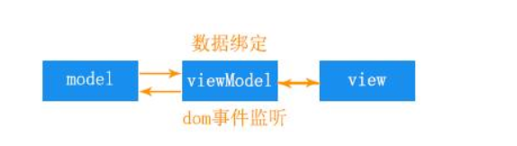
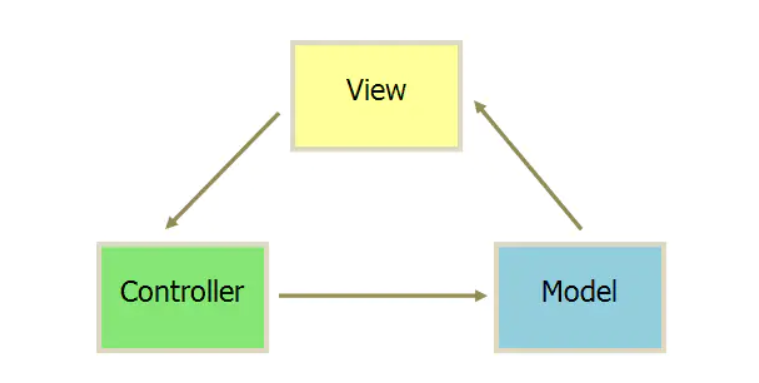
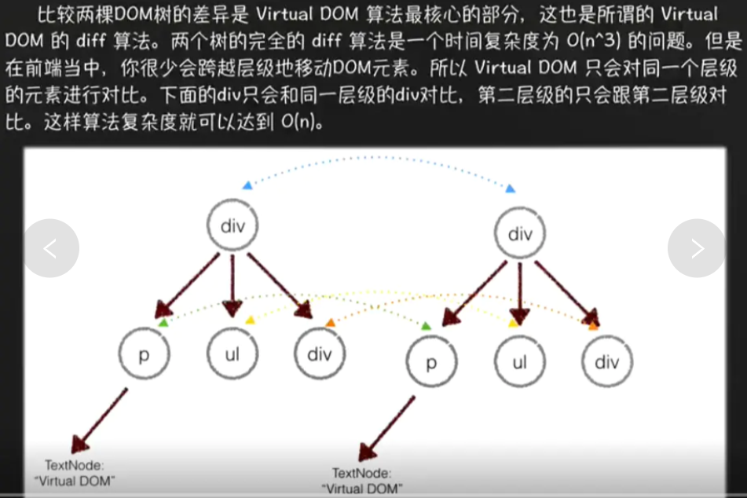
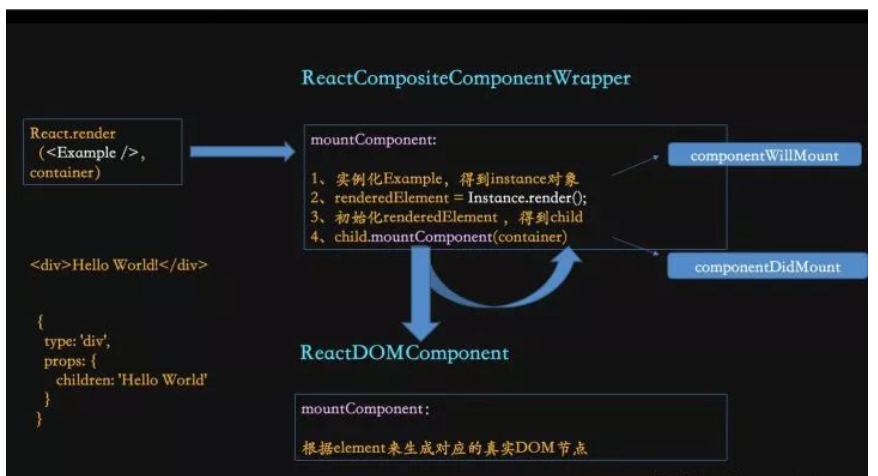
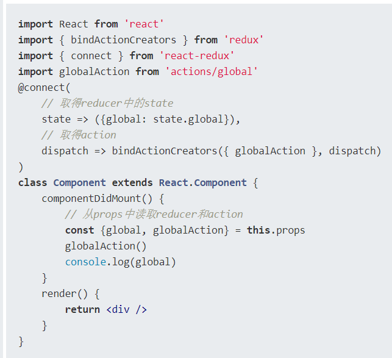
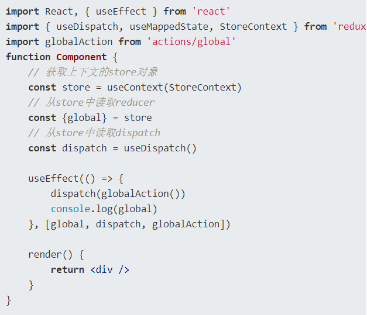
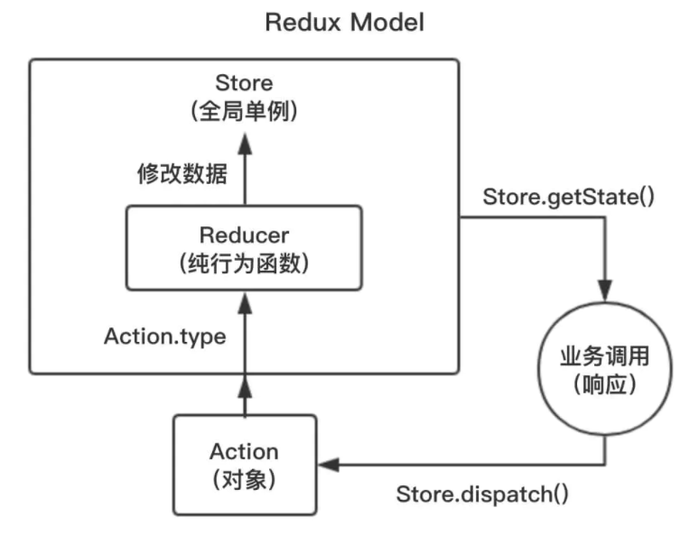
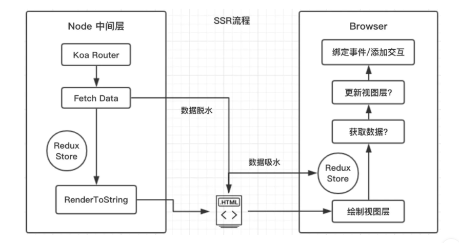
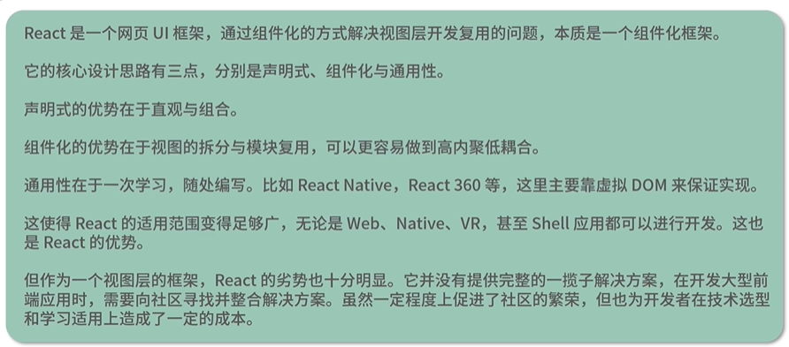

### 1.MVC和MVVM的区别

MVVM：Model-View-ViewModel的简写。即模型-视图-视图模型

采用双向绑定（data-binding）：View的变动，自动反映在 ViewModel，反之亦然



MVC：Model View Controller，模型(model)－视图(view)－控制器(controller)



1. View 传送指令到 Controller
2. Controller 完成业务逻辑后，要求 Model 改变状态
3. Model 将新的数据发送到 View，用户得到反馈

### 2.react生命周期及react16.3新生命周期

挂载、渲染、更新、卸载

#### （1）react生命周期函数


（1） constructor()：完成了React数据的初始化，它接受两个参数：props和context，当想在函数内部使用这两个参数时，需使用super()传入这两个参数。
 注意：只要使用了constructor()就必须写super(),否则会导致this指向错误。

（2）componentWillMount()：未渲染DOM

（3）componentDidMount()：组件第一次渲染完成，此时dom节点已经生成，可以在这里调用ajax请求，返回数据setState后组件会重新渲染

（4）componentWillUnmount ()：组件的卸载和数据的销毁

（5）componentWillReceiveProps (nextProps)：接受父组件改变后的props需要重新渲染组件时用到的比较多

（6）shouldComponentUpdate(nextProps,nextState)：控制组件重新渲染的生命周期，由于在react中，setState以后，state发生变化，组件会进入重新渲染的流程，在这里return false可以阻止组件的更新

（7）componentWillUpdate (nextProps,nextState)：shouldComponentUpdate返回true以后，组件进入重新渲染的流程，

（8）componentDidUpdate(prevProps,prevState)：组件更新完毕后

（9）render()：react会生成一份虚拟dom树，

#### （2）react16.3新周期函数

新周期函数：`getDerivedStateFromProps`，`getSnapshotBeforeUpdate` 

v17.0 版本中即将被移除的三个生命周期函数 `componentWillMount`，`componentWillReceiveProps`，`componentWillUpdate`

componentWillMount：首屏无数据导致白屏，鼓励将数据请求部分的代码放在组件的 `constructor` 中

 React 并不能够保证在 `componentWillMount` 被调用后，同一组件的 `componentWillUnmount` 也一定会被调用

#####  a.**getDerivedStateFromProps(nextProps, prevState)：代替componentWillReceiveProps()**

在 componentWillReceiveProps 中，我们一般会做以下两件事，一是根据 props 来更新 state，二是触发一些回调，如动画或页面跳转等。

1. 在老版本的 React 中，这两件事我们都需要在 componentWillReceiveProps 中去做。
2. 而在新版本中，官方将更新 state 与触发回调重新分配到了 getDerivedStateFromProps 与 componentDidUpdate 中，使得组件整体的更新逻辑更为清晰。

```js
// before
componentWillReceiveProps(nextProps) {//一是根据 props 来更新 state，二是触发一些回调，如动画或页面跳转等
  if (nextProps.isLogin !== this.props.isLogin) {
    this.setState({ 
      isLogin: nextProps.isLogin,   
    });
  }
  if (nextProps.isLogin) {
    this.handleClose();
  }
}
123456789101112
// after
static getDerivedStateFromProps(nextProps, prevState) {//更新 state 
  if (nextProps.isLogin !== prevState.isLogin) {
    return {
      isLogin: nextProps.isLogin,
    };
  }
  return null;
}

componentDidUpdate(prevProps, prevState) {//触发回调
  if (!prevState.isLogin && this.props.isLogin) {
    this.handleClose();
  }
}
```

##### b.**getSnapshotBeforeUpdate(prevProps, prevState)：代替componentWillUpdate（代替组件更新前）**

这两者的区别在于：

1. 在 React 开启异步渲染模式后，在 render 阶段读取到的 DOM 元素状态并不总是和 commit 阶段相同，这就导致在
   componentDidUpdate 中使用 componentWillUpdate 中读取到的 DOM 元素状态是不安全的，因为这时的值很有可能已经失效了。
2. getSnapshotBeforeUpdate 会在最终的 render 之前被调用，也就是说在 getSnapshotBeforeUpdate 中读取到的 DOM 元素状态是可以保证与 componentDidUpdate 中一致的。
   此生命周期返回的任何值都将作为参数传递给componentDidUpdate（）。

https://blog.csdn.net/c_kite/article/details/80303341

### 3.diff算法时间复杂度

广度优先算法：层级比较



### 4.什么时候要使用状态管理器？

**当状态提升提升不能够满足开发需求，状态树并不总是以一种线性的，单向的方式流动。就需要使用状态管理器。**

摘抄阮老师的

- 从项目的整体看

1. 用户的使用方式复杂

2. 不同身份的用户有不同的使用方式（比如普通用户和管理员）

3. 多个用户之间可以协作

4. 与服务器大量交互，或者使用了WebSocket

5. View要从多个来源获取数据

   

- 从组件角度看

1. 某个组件的状态，需要共享
2. 某个状态需要在任何地方都可以拿到
3. 一个组件需要改变全局状态
4. 一个组件需要改变另一个组件的状态

### 5.render函数中return如果没有使用()会有什么问题?

只写一行代码不换行不会出问题

```js
export default function App() {
  return <a>aaa</a>;
}
```

我们在使用JSX语法书写react代码时，babel会将JSX语法编译成js，同时会在每行自动添加**分号**（；），如果`return`后换行了，那么就会变成 `return；` 就会报错

### 6.componentWillUpdate可以直接修改state的值吗

**可以直接改变state的值**，而不能用setState。

### 7.react渲染原理的理解

渲染原理决定着性能优化的方法，只有在了解原理之后，才能完全理解为什么这样做可以优化性能。

（1）JSX经过babel编译成React.createElement的表达式

```js
return (
  <div className='cn'>
     <Header> hello </Header>
  </div>
)
return (
  React.createElement(
    'div',//type 标签
    {
      className : 'cn',//标签属性 无是null
         children : [// 标签的子节点
      {
        type : function Header,
        props : {
          children : 'hello'
        }
      },
    },
   )
)
```



（2）得到虚拟DOM

（3）根据比较更新前后虚拟DOM找到更新最小操作，然后render

### 8.React 高阶组件

高阶组件：高阶函数传入的参数变成了react组件，并返回一个新的组件.

高阶组件允许你做：

- 代码复用，逻辑抽象，抽离底层准备（bootstrap）代码
- 渲染劫持
- State 抽象和更改
- Props 更改

实现高阶组件的方法：属性代理（Props Proxy）和 反向继承（Inheritance Inversion）

```js
import React, { Component } from 'react';

const simpleHoc = WrappedComponent => {
  console.log('simpleHoc');
  return class extends Component {
    render() {
      return <WrappedComponent {...this.props}/>//返回了一个 type 为 WrappedComponent 的 React Element（也就是被包装的那个组件），我们把高阶组件收到的 props 传递给它，因此得名 Props Proxy
    }
  }
}
export default simpleHoc;
```

Props Proxy 可以

- 更改 props
- 通过 refs 获取组件实例
- 抽象 state
- 把 WrappedComponent 与其它 elements 包装在一起

### 9.react和redux建立通信的方式

（1）老方案：connect



（2）新方案：hook(提供取代react-redux的新插件redux-react-hook)

redux-react-hook使用了react提供的Context（上下文）功能，给顶层组件Provide传入了store对象，绑定到上下文



### 10.redux-react-hook

https://www.jianshu.com/p/a9809958133d

### 11.react有状态组件（容器组件）和无状态组件（展示组件）

（1）有状态组件的区别是它属于一个class类,

有继承,

可以通过this来接收状态和属性

如果你想用react的生命周期,

想对一些数据进行增删改查的话就要用到有状态组件

（2）无状态组件是属于一个函数

没有继承功能;

也没有生命周期,

他的动态数据都是通过父组件传值子组件通过props接收渲染,

针对一些简单的逻辑判断等等,选 用无状态组件

无状态组件应该保持模板的纯粹性，以便于组件复用

**推荐使用无状态组件，大量用有状态的组件容易触发生命周期和钩子函数,页面会出面加载慢等问题**

### 12.react和react-hooks优缺点比较

react-hooks优点

1.代码复用：高度类似的逻辑，可以通过封装一个高阶组件来抽象它们

2.代码量少，函数式编程风格，函数式组件，状态保存在运行环境里面，每个功能都包裹在函数中

缺点：

1.响应式的useEffect：依赖时机不对，触发时机不对，没生命周期函数好用

2.不擅长异步代码：函数的运行是独立的，每个函数都有一份独立的作用域。函数的变量是保存在运行时的作用域里面，当我们有异步操作的时候，经常会碰到异步回调的变量引用是之前的，也就是旧的（这里也可以理解成闭包）

### 13.Fiber

Fiber 其实可以算是一种编程思想，在其它语言中也有许多应用(Ruby Fiber)。核心思想是 任务拆分和协同，主动把执行权交给主线程，使主线程有时间空挡处理其他高优先级任务。

当遇到进程阻塞的问题时，**任务分割**、**异步调用** 和 **缓存策略** 是三个显著的解决思路。

#### （1）React 的核心流程可以分为两个部分:

- reconciliation (调度算法，也可称为 render):

  - 更新 state 与 props；
- 调用生命周期钩子；
  - 生成 virtual dom；
  - 这里应该称为 Fiber Tree 更为符合；
  - 通过新旧 vdom 进行 diff 算法，获取 vdom change；
  - 确定是否需要重新渲染

- commit:

  - 如需要，则操作 dom 节点更新；

应用变得庞大，大量的组件渲染会导致主进程长时间被占用，导致一些动画或高频操作出现卡顿和掉帧的情况，由于同步阻塞，为了解决，主要实现方案有**异步和任务分割**

简单描述：

在 React V16 将调度算法进行了重构， 将之前的 stack reconciler 重构成新版的 fiber reconciler，变成了具有链表和指针的 **单链表树遍历算法**。通过指针映射，每个单元都记录着遍历当下的上一步与下一步，从而使遍历变得可以被暂停和重启。

这里我理解为是一种 **任务分割调度算法**，主要是 将原先同步更新渲染的任务分割成一个个独立的 **小任务单位**，根据不同的优先级，将小任务分散到浏览器的空闲时间执行，充分利用主进程的事件循环机制。                                                                                                                                                                                                                                                                                                                                                                                                                                                                                                                                                                                                                                                                                                                                                                                                                                                                                                                                                                                                                                                                                                                                                                                                                                                                                                                                                                                                                                                                                                                                                                                                                                                                                                                                                                                                                                                                                                                                                                                                                                                                                                                                                                                                                                                                                                                                                                                                                                                                                                                                                                                                                                                                                                                                                                                                                                                                                                                                                                                                                                                                                                                                                                                                                                                                                                                                                                                                                                                                                                                                                                                                                                                                                                                                                                                                                                                                                                                                                                                                                                                                                                                                                                                                                                                                                                                                                                                                                                                                                                                                                                                                                                                                                                                                                                                                                                                                                                                                                                                                                                                                                                                                                                                                                                                                                                                                                                                                                                                                                                                                                                                                                                                                                                                                                                                                                                                                                                                                                                                                                                                                                                                                                                                                                                                                                                                                                                                                                                                                                                                                                                                                                                                                                                                                                                                                                                                                                                                                                                                                                                                                                                                                                                                                                                                                                                                                                                                                                                                                                                                                                                                                                                                                                                                                                                                                                                                                                                                                                                                                                                                                                                                                                                                                                                                                                                                                                                                                                                                                                                                                                                                                                                                                                                                                                                                                                                                                                                                                                                                                                                                                                                                                                                                                                                                                                                                                                                                                                                                                                                                                                                                                                                                                                                                                                                                                                                                                                                                                                                                                                                                                                                                                                                                                                                                                                                                                                                                                                                                                                                                                                                                                                                                                                                                                                                                                                                                                                                                                                                                                                                                                                                                                                                                                                                                                                                                                                                                                                                                                                                                                                                                                                                                                                                                                                                                                                                                                                                                                                                                                                                                                                                                                                                                                                                                                                                                                                                                                                                                                                                                                                                                                                                                                                                                                                                                                                                                                                                                                                                                                                                                                                                                                                                                                                                                                                                                                                                                                                                                                                                                                                                                                                                                                                                                                                                                                                                                                                                                                                                                                                                                                                                                                                                                                                                                                                                                                                                                                                                                                                                                                                                                                                                                                                                                                                                                                                                                                                                                                                                                                                                                                                                                                                                                                                                                                                                                                                                                                                                                                                                                                                                                                                                                                                                                                                                                                                                                                                                                                                                                                                                                                                                                                                                                                                                                                                                                                                                                                                                                                                                                                                                                                                                                                                                                                                                                                                                                                                                                                                                                                                                                                                                                                                                                                                                                                                                                                                                                                                                                                                                                                                                                                                                                                                                                                                                                                                                                                                                                                                                                                                                                                                                                                                                                                                                                                                                                                                                                                                                                                                                                                                                                                                                                                                                                                                                                                                                                                                                                                                                                                                                                                                                                                                                                                                                                                                                                                                                                                                                                                                                                                                                                                                                                                                                                                                                                                                                                                                                                                                                                                                                                                                                                                                                                                                                                                                                                                                                                                                                                                                                                                                                                                                                                                                                                                                                                                                                                                                                                                                                                                                                                                                                                                                                                                                                                                                                                                                                                                                                                                                                                                                                                                                                                                                                                                                                                                                                                                                                                                                                                                                                                                                                                                                                                                                                                                                                                                                                                                                                                                                                                                                                                                                                                                                                                                                                                                                                                                                                                                                                                                                                                                                                                                                                                                                                                                                                                                                                                                                                                                                                                                                                                                                                                                                                                                                                                                                                                                                                                                                                                                                                                                                                                                                                                                                                                                                                                                                                                                                                                                                                                                                                                                                                                                                                                                                                                                                                                                                                                                                                                                                                                                                                                                                                                                                                                                                                                                                                                                                                                                                                                                                                                                                                                                                                                                                                                                                                                                                                                                                                                                                                                                                                                                                                                                                                                                                                                                                                                                                                                                                                                                                                                                                                                                                                                                                                                                                                                                                                                                                                                                                                                                                                                                                                                                                                                                                                                                                                                                                                                                                                                                                                                                                                                                                                                                                                                                                                                                                                                                                                                                                                                                                                                                                                                                                                                                                                                                                                                                                                                                                                                                                                                                                                                                                                                                                                                                                                                                                                                                                                                                                                                                                                                                                                                                                                                                                                                                                                                                                                                                                                                                                                                                                                                                                                                                                                                                                                                                                                                                                                                                                                                                                                                                                                                                                                                                                                                                                                                                                                                                                                                                                                                                                                                                                                                                                                                                                                                                                                                                                                                                                                                                                                                                                                                                                                                                                                                                                                                                                                                                                                                                                                                                                                                                                                                                                                                                                                                                                                                                                                                                                                                                                                                                                                                                                                                                                                                                                                                                         

#### （2）React 生命周期可以分成 reconciliation 与 commit 两个阶段

**reconciliation**:

- `componentWillMount`
- `componentWillReceiveProps`
- `shouldComponentUpdate`
- `componentWillUpdate`

**commit**:

- `componentDidMount`
- `componentDidUpdate`
- `componentWillUnmount`

在 Fiber 中，reconciliation 阶段进行了任务分割，涉及到 暂停 和 重启，因此可能会导致 reconciliation 中的生命周期函数在一次更新渲染循环中被 **多次调用** 的情况，产生一些意外错误。

### 15.setState

 React 一个包装结构: **Transaction**

- 事务

  (Transaction):

  - 是 React 中的一个调用结构，用于包装一个方法，结构为: **initialize - perform(method) - close**。通过事务，可以统一管理一个方法的开始与结束；处于事务流中，表示进程正在执行一些操作；

`setState`: React 中用于修改状态，更新视图

**异步与同步**: `setState`并不是单纯的异步或同步，这其实与调用时的环境相关

1.在 **合成事件** 和 **生命周期钩子(除 componentDidUpdate)** 中，`setState`是"异步"的；

- 无法在`setState`后马上从`this.state`上获取更新后的值。
- **解决**: 如果需要马上同步去获取新值，`setState`其实是可以传入第二个参数的。`setState(updater, callback)`，在回调中即可获取最新值；

2.**原生事件** 和 **setTimeout** 中，`setState`是同步的，可以马上获取更新后的值

### 16.Redux

**核心理念**:

- **单一数据源**: 整个应用只有唯一的状态树，也就是所有 state 最终维护在一个根级 Store 中；

- **状态只读**

  : 为了保证状态的可控性，最好的方式就是监控状态的变化。那这里就两个必要条件：

  - Redux Store 中的数据无法被直接修改；
  - 严格控制修改的执行；

- **纯函数**: 规定只能通过一个纯函数 (Reducer) 来描述修改；



- **Store**

  全局 Store 单例， 每个 Redux 应用下只有一个 store， 它具有以下方法供使用:

  - `getState`: 获取 state；
  - `dispatch`: 触发 action, 更新 state；
  - `subscribe`: 订阅数据变更，注册监听器；

```js
// 创建
const store = createStore(Reducer, initStore)
```

- **Action**: 它作为一个行为载体，用于映射相应的 Reducer，并且它可以成为数据的载体，将数据从应用传递至 store 中，是 store **唯一的数据源**；

```js
// 一个普通的 Action
const action = {
	type: 'ADD_LIST',
	item: 'list-item-1',
}

// 使用：
store.dispatch(action)

// 通常为了便于调用，会有一个 Action 创建函数 (action creater)
funtion addList(item) {
	return const action = {
		type: 'ADD_LIST',
		item,
	}
}

// 调用就会变成:
dispatch(addList('list-item-1'))
```

- **Reducer**: 用于描述如何修改数据的纯函数，Action 属于行为名称，而 Reducer 便是修改行为的实质；

```js
// 一个常规的 Reducer
// @param {state}: 旧数据
// @param {action}: Action 对象
// @returns {any}: 新数据
const initList = []
function ListReducer(state = initList, action) {
	switch (action.type) {
		case 'ADD_LIST':
			return state.concat([action.item])
			break
		defalut:
			return state
	}
}
```

> **注意**:
>
> 1. 遵守数据不可变，不要去直接修改 state，而是返回出一个 **新对象**，可以使用 `assign / copy / extend / 解构` 等方式创建新对象；
> 2. 默认情况下需要 **返回原数据**，避免数据被清空；
> 3. 最好设置 **初始值**，便于应用的初始化及数据稳定；

**进阶**:

- React-Redux: 结合 React 使用；

  - provider: 将 store 通过 context 传入组件中；
  - connect: 一个高阶组件，可以方便在 React 组件中使用 Redux；
    
    1.将`store`通过`mapStateToProps`进行筛选后使用`props`注入组件
    
    2.根据`mapDispatchToProps`创建方法，当组件调用时使用`dispatch`触发对应的`action`

- Reducer 的拆分与重构

  - 随着项目越大，如果将所有状态的 reducer 全部写在一个函数中，将会 **难以维护**；
  - 可以将 reducer 进行拆分，也就是 **函数分解**，最终再使用`combineReducers()`进行重构合并；

- 异步 Action: 由于 Reducer 是一个严格的纯函数，因此无法在 Reducer 中进行数据的请求，需要先获取数据，再dispatch(Action)即可，下面是三种不同的异步实现:

  - [redex-thunk](https://github.com/reduxjs/redux-thunk)
  - [redux-saga](https://github.com/redux-saga/redux-saga)
  - [redux-observable](https://github.com/redux-observable/redux-observable)

### 17.Hooks

优点：

1、**跨组件复用**: 其实 render props / HOC 也是为了复用，相比于它们，Hooks 作为官方的底层 API，最为轻量，而且改造成本小，不会影响原来的组件层次结构和传说中的嵌套地狱；

2、**类定义更为复杂**:

- 不同的生命周期会使逻辑变得分散且混乱，不易维护和管理；
- 时刻需要关注`this`的指向问题；
- 代码复用代价高，高阶组件的使用经常会使整个组件树变得臃肿；

3、**状态与UI隔离**: 正是由于 Hooks 的特性，状态逻辑会变成更小的粒度，并且极容易被抽象成一个自定义 Hooks，组件中的状态和 UI 变得更为清晰和隔离。

####  react hooks常使用函数

1.**状态钩子** (`useState`): 用于定义组件的 State

2.**生命周期钩子（useEffect）**:`componentDidMount`、`componentDidUpdate`和`componentWillUnmount`的结合。

`useEffect(callback, [source])`接受两个参数

- `callback`: 钩子回调函数；
- `source`: 设置触发条件，仅当 source 发生改变时才会触发；
- `useEffect`钩子在没有传入`[source]`参数时，默认在每次 render 时都会优先调用上次保存的回调中返回的函数，后再重新调用回调；

3.useContext:获取context对象

4.`useCallback`: 缓存回调函数，避免传入的回调每次都是新的函数实例而导致依赖组件重新渲染，具有性能优化的效果；

5.`useRef`: 获取组件的真实节点；

6.`useLayoutEffect`:

- DOM更新同步钩子。用法与`useEffect`类似，只是区别于执行时间点的不同。
- `useEffect`属于异步执行，并不会等待 DOM 真正渲染后执行，而`useLayoutEffect`则会真正渲染后才触发；
- 可以获取更新后的 state；

### 18.SSR

SSR，俗称 **服务端渲染** (Server Side Render)，讲人话就是: 直接在服务端层获取数据，渲染出完成的 HTML 文件，直接返回给用户浏览器访问。

**前后端分离**: 前端与服务端隔离，前端动态获取数据，渲染页面。

**痛点**:

- **首屏渲染性能瓶颈**:

  空白延迟: HTML下载时间 + JS下载/执行时间 + 请求时间 + 渲染时间。在这段时间内，页面处于空白的状态。

- **SEO 问题**: 由于页面初始状态为空，因此爬虫无法获取页面中任何有效数据，因此对搜索引擎不友好。

  



### 19.react是什么？

讲概念（UI框架）、说用途（声明式、组件化、通用性）、理思路、列优缺点



