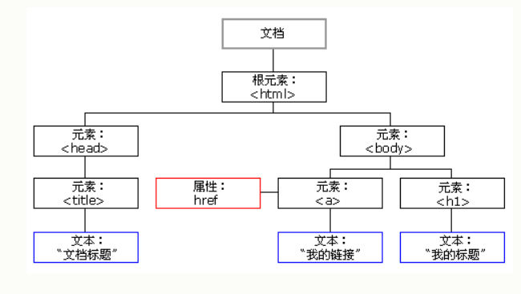
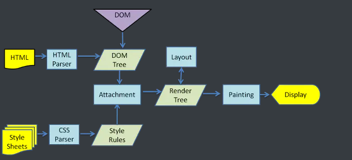
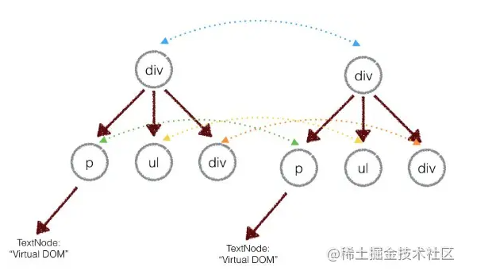
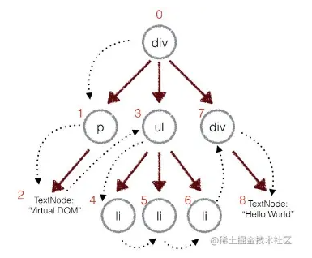

## Virtual DOM 

### 1.DOM概念

#### （1）什么是dom?

 DOM (Document Object Model) 译为**文档对象模型**，是 HTML 和 XML 文档的编程接口。

DOM 以树结构表达 HTML 文档。 



#### （2）dom的渲染流程

渲染引擎： Firefox使用Geoko， Safari和Chrome都使用webkit ， 

区别：Gecko在HTML与DOM树之间有一个附加的层 ，称作”content sink”，是创建DOM对象的工厂。 

webkit和Geoko工作流程大致差不多：

1. 创建dom树

   浏览器使用HTML分析器分析HTML元素成为树形的数据结构

2. 创建styleRules

   浏览器使用CSS分析器分析CSS文件和内联样式，生成样式表，也是树形的数据结构

3. 创建Render树

   DOM和CSSOM合并后生成Render Tree。 

4. 布局Layout

   有了Render Tree，浏览器已经知道网页中有哪些节点和这些节点的css，现在就进行每个节点的定位和布局

5. 绘制Painting

   调用每个节点paint方法，把它们绘制出来。 

 reflow（回流）：当浏览器发现某个部分发生了点变化影响了布局，需要倒回去重新渲染，这个回退的过程叫 reflow 

 repaint（重绘）：改变某个元素的背景色、文字颜色、边框颜色等等不影响它周围或内部布局的属性时，屏幕的一部分要重画，但是元素的几何尺寸没有变。 

注意：

1. dom树的构建不必等整个HTML文档解析完毕之后才开始构建render和布局

2. 前三步在进行的时候不是完全独立的，可以一边加载一边解析一遍渲染。

   

    

 webkit渲染引擎工作流程图

##### **问题：什么是vdom?为什么需要（有什么优点）？** 

虚拟DOM其实就是一个JavaScript对象。通过这个JavaScript对象来描述真实DOM

 网页里面dom节点浏览器资源开销很大，使用js操作dom，浏览器会从dom树从头到尾执行，每次操作必须经过Reflow / Layout阶段 ，回流和重绘越多就越卡。

 虚拟DOM是放在JS 和 HTML中间的一个层。它可以通过新旧DOM的对比，来获取对比之后的差异对象，然后有针对性的把差异部分真正地渲染到页面上，从而减少实际DOM操作，最终达到性能优化的目的。

```
//最一般的虚拟dom
var a = document.createElement("div");
//让虚拟dom变成真的dom 只需要加入到页面中
document.body.append(a);
```

##### **问题：什么时候进行虚拟dom对比的？**

 Vue 在更新 DOM 时是**异步**执行的。只要侦听到数据变化，Vue 将开启一个队列，并缓冲在同一事件循环中发生的所有数据变更 

react在setState

### 2.react实现vdom

#### （1）Virtual DOM算法步骤

- js对象表示DOM树结构，构建真正的DOM树，插入到文档中
- 状态变更的时候，重新构造新的js虚拟DOM树，新旧对比，记录差异
- 更新差异到真正的DOM树上

#### （2）Rect、React.createElement源码查看

react是一个对象，src/isomorphic/React.js查看源码

```react
var React = {
  Children: {
    map: ReactChildren.map,
    forEach: ReactChildren.forEach,
    count: ReactChildren.count,
    toArray: ReactChildren.toArray,
    only: onlyChild,
  },
  Component: ReactComponent,// 用来创建React组件
  PureComponent: ReactPureComponent,// 创建React纯组件类
  createElement: createElement,//创建 React 元素
  cloneElement: cloneElement,//拷贝 React 元素
  isValidElement: ReactElement.isValidElement,// 判断是否是有效的 React 元素
  PropTypes: ReactPropTypes,//定义 React props 类型。(过时的API)
  createClass: ReactClass.createClass,//创建 React 组件类（过时的API）
  createFactory: createFactory,// 创建 React 工厂函数。（不建议使用）
  createMixin: function(mixin) {// 创建 Mixin
    return mixin;
  },
  DOM: ReactDOMFactories,
  version: ReactVersion,
  __spread: __spread,//已废弃，直接用 Object.assign() 代替
};

```

React.createElement

```react
var ReactElement = function(type, key, ref, self, source, owner, props) {//是一个工厂函数，接受7个参数，最终返回一个React Element对象
  var element = {// 每个被包装了的react元素都是这样的对象
    ?typeof: REACT_ELEMENT_TYPE,//React Element 的标志，是一个Symbol类型
    type: type,// 元素类型，字符串类型
    key: key,// 元素的key，diff算法会用到
    ref: ref,// DOM的引用
    props: props,// 元素属性，是一个对象
    _owner: owner,// 负责创建这个 React 元素的组件
  };
  if (__DEV__) {
    // ...
  }
  return element;
};
```

#### （3）react创建虚拟DOM的过程

一般的HTML代码

```html
<div class="hello">
      <span>Hello World</span>
      <ul>
        <li>one</li>
        <li>two</li>
        <li>three</li>
      </ul>
</div>
```

```js
//上面的代码可以写成如下
//将原先的代码转换成JavaScript对象，再转化成真实dom,这个JavaScript对象就是虚拟dom，这个JavaScript对象包含了type、props、children等属性
const VitrualDom = {
type:"div",// 节点类型
props:{"class" : "hello"},//节点属性
children:[//子节点
	{
		type: "span",
		children: "Hello World"
	},
	{
	type:"ul",
	children:[
		{
			{type: "li", children: 'one'},
			{type: "li",children: "two"},
			{type: "li",children: "three"}
		}
	]
	}
]}
}

//但是如果使用上述写法就很难写，所以我们一般使用jsx
<div className="hello">
      <span>Hello World</span>
      <ul>
        <li> one </li>
        <li> two </li>
        <li> three </li>
      </ul>
</div>

//在react中，jsx都会被babel转换成如下的形式,所以只需要实现这个方法，接受这些参数，然后返回元素对象就可以了，如同源码的展示
var virtualDOM = React.createElement("div", {className: "hello"}, React.createElement("span", null, "Hello World"), React.createElement("ul", null, React.createElement("li", null, "one"), React.createElement("li", null, "two"), React.createElement("li", null, "three")));

```

正常项目开发中，如果需要将jsx转换成js,那需要安装parcel

```js
 npm install -g parcel-bundler
```

配置babel ,可以将jsx转换成js

实现过程（代码）

```js
//JSX是被处理成虚拟DOM

//实现creatElement,接收参数并返回JavaScript对象,虚拟dom
const createElement = (type, props, ...childs) => {
   return {
    type,
    props: props || {},
    childs: childs.flat()
  }
}
const React = {
    createElement
}

//render方法是为了将虚拟DOM渲染成真实的DOM

//render的第一个参数接受的是createElement返回的对象，也就是虚拟DOM,第二个参数则是挂载的目标DOM,最后将差异更新到真实DOM中
    ReactDOM.render(
        element,
        document.getElementById( 'root' )
    );
```

#### （2）diff算法

找出变化的地方，然后渲染到真实的dom上的算法，

直接比较真实dom和虚拟dom，然后一边比较一边更新到真实dom上。

传统diff算法两棵树完全比较的时间复杂度为O(N^3),但是 React的Diff算法的时间复杂度是O(n) ，意味着**只能相同层比较节点**，而不是深度遍历（比较的是两个dom树，得到差异对象diff）



实际的代码上，首先会对新旧两棵树进行一个深度优先的便利，每个节点都会有一个唯一的标记



每次遍历一个节点就把该节点和新的树对比，如果有差异就记录到一个对象里面

#### （2）具体实现

1. diff方法，对比真实dom和虚拟dom,然后返回更新后的真实dom

```js
function diff(dom,newdom){
	return ....
}
```

2. 实现这个diff方法，比较节点是否一样

a. 节点类型不同，直接删除该节点，然后在虚拟dom中是创建并插入新节点，如果该节点有子节点，也被完全删除，不会用于后面的比较，比较发现没有的节点都是新建并插入

```
A.parent.remove(A); 
D.append(A);
```

b. 相同类型的节点，对比属性变化，进行改变diffAttributes

c. 对比节点里面的子节点：子节点可能是数组，数组改变了顺序或者数量，所以比较难确定，然后就给每个节点设置key值，渲染时对比key值相同的节点就好，每个子节点唯一标识，如果没有发现唯一的key,就认为应该是做节点的删除和新增插入。

d.对比组件（同节点类型）： 如果组件类型没有变化，则重新比较属性，如果组件类型变化，则移除掉原来组件，并渲染新的组件

##### **问题： 虚拟dom会不会重绘和回流？不需要，是真实dom进行改变。**

#####  **问题：虚拟DOM与真实DOM的区别** 

1. 虚拟DOM不会进行排版与重绘操作
2. 虚拟DOM进行频繁修改，然后一次性比较并修改真实DOM中需要改的部分（注意！），最后并在真实DOM中进行排版与重绘，减少过多DOM节点排版与重绘损耗
3. 真实DOM频繁排版与重绘的效率是相当低的
4. 虚拟DOM有效降低大面积（真实DOM节点）的重绘与排版，因为最终与真实DOM比较差异，可以只渲染局部（同2）

##### **问题：虚拟dom的缺点**

保证了高效的渲染，但是首次渲染的时候，多了一份虚拟dom的计算，会比innerHTml慢。

JS操作真实DOM速度很快 直接操作DOM的性能并不会低于虚拟DOM和Diff算法，甚至还会优于，但是在react和vue框架里面，把命令式编程变成函数式编程，提升代码可维护性和可读性， 最原始的情况下，框架一旦发现数据发生了变动就对整个页面进行更新，这样的做法效率低下，因为数据的变动而导致的页面变动很可能只是局部的，虚拟dom进行差异性改变，是为了解决 **由命令式编程转变为函数式编程、数据驱动**后所带来的性能问题的 

我觉得最主要的是，看是不是进行**频繁的局部更新**，其实dom也是一个对象，但是操作dom会引发浏览器的回流和重绘这些，一旦发现数据变动就对整个页面进行更新，效率低下，有**不必要的性能消耗**，如果有的话，那就虚拟dom性能更优。