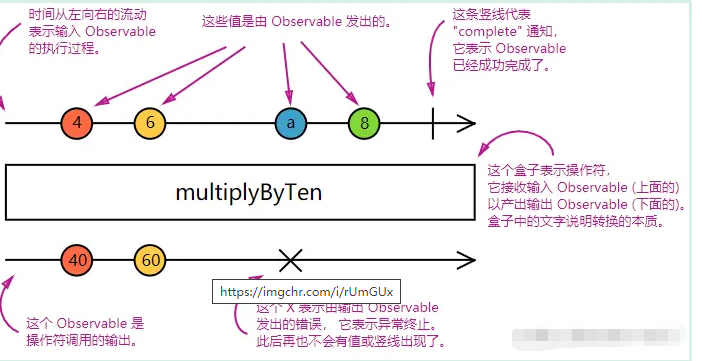

# RxJS

## 1.RxJS是什么

RxJS 是使用 Observables 的响应式编程的库，它使编写异步或基于回调的代码更容易

RxJS结合了 [观察者模式](https://en.wikipedia.org/wiki/Observer_pattern)、[迭代器模式](https://en.wikipedia.org/wiki/Iterator_pattern) 和 [使用集合的函数式编程](http://martinfowler.com/articles/collection-pipeline/#NestedOperatorExpressions)

## 2.观察者模式


比如有一个天气app，有很多组件，组件分别显示摄氏温度、华氏温度、气温感受，还有一个对象用于获取实时的天气

天气对象和界面组件之间的关系就是观察者模式，天气对象是目标对象，天气数据是状态，界面组件就是观察者对象，天气对象获取天气数据之后，通知所有的组件

Subject：目标类，抽象类，所有目标对象的弗雷，提供增加删除，通知观察者的所有接口

Observer:观察者类，抽象类，是所有观察者对象的父类

ConcreteSubject：具体目标类，可以有多个不同的具体目标类，它们同时继承Subject类

ConcreteObserver：具体观察者类，可以有多个不同的具体观察者类，它们同时继承Observer类。

## 3.RxJS基本概念

- **Observable (可观察对象):** 表示一个概念，这个概念是一个可调用的未来值或事件的集合。
- **Observer (观察者):** 一个回调函数的集合，它知道如何去监听由 Observable 提供的值。
- **Subscription (订阅):** 表示 Observable 的执行，主要用于取消 Observable 的执行。
- **Operators (操作符):** 采用函数式编程风格的纯函数 (pure function)，使用像 `map`、`filter`、`concat`、`flatMap` 等这样的操作符来处理集合。
- **Subject (主体):** 相当于 EventEmitter，并且是将值或事件多路推送给多个 Observer 的唯一方式。
- **Schedulers (调度器):** 用来控制并发并且是中央集权的调度员，允许我们在发生计算时进行协调，例如 `setTimeout` 或 `requestAnimationFrame` 或其他。

### （1）作用

- 把现有的异步代码转换成可观察对象
- 迭代流中的各个值
- 把这些值映射成其它类型 
- 对流进行过滤
- 组合多个流

个人理解：


Obervable将函数等创建成一个可观察对象，tap（）、map（）等是可以对可观察对象进行操作的函数，这些操作函数会观察可观察对象中的值，然后进行操作转换最后返回新的可观察对象【pipe可以将操作函数组合】，而subscribe是对可观察对象进行观察的，通过subscribe可以处理流程并生成想要的结果

### （2）特性

a.纯净性

纯函数生产值的能力，意味着代码不容易出错

b.流动性

提供了一整套操作符来帮助控制事件如何流经 observables

c.值

对于流经 observables的值，可以对其进行转换

Observables 是同步的，输出数据是依次的，传递值可以是同步的也可以是异步的

函数只能返回一个值，但是Observables 可以返回多个值

```js
//函数返回
function foo() {
  console.log('Hello');
  return 42;
  return 100; // 死代码，永远不会执行
}
//Observables 返回，可以同步返回值，也可以异步返回
var foo = Rx.Observable.create(function (observer) {
  console.log('Hello');
  observer.next(42);
  observer.next(100); // “返回”另外一个值
  observer.next(200); // 还可以再“返回”值
 /*  setTimeout(() => {
    observer.next(300); // 异步执行
  }, 1000);*/
});

console.log('before');
foo.subscribe(function (x) {
  console.log(x);
});
console.log('after');
```

## 4.Observable

表示一个概念，这个概念是一个可调用的未来值或事件的集合。它能被多个`observer`订阅，每个订阅关系相互独立、互不影响。


**Observable是一个数据源，用来产生数据的数据源**

```js
const Rx = require('rxjs/Rx')
const myObservable = Rx.Observable.create(observer => {
  observer.next('foo');
  setTimeout(() => observer.next('bar'), 1000);
});
//调用Observable.create方法来创建一个Observable
```

## 5.Observer

一个回调函数的集合，它知道如何去监听由`Observable`提供的值。`Observer`在信号流中是一个观察者（哨兵）的角色，它负责观察任务执行的状态并向流中发射信号。


在`RxJS`中，`Observer`是可选的。在`next`、`error` 和 `complete`处理逻辑部分缺失的情况下，`Observable`仍然能正常运行，未包含的特定通知类型的处理逻辑会被自动忽略

```js
const myObservable = Rx.Observable.create((observer) => {
    observer.next('111')
    setTimeout(() => {
        observer.next('777')
    }, 3000)
})
myObservable.subscribe((text) => console.log(text));
```

直接使用`subscribe`方法让一个`observer`订阅一个`Observable`，我们可以看看这个`subscribe`的函数定义来看看怎么实现订阅的：

```ts
subscribe(next?: (value: T) => void, error?: (error: any) => void, complete?: () => void): Subscription;
复制代码
```

从入参来看，从左至右依次是`next`、`error`，`complete`，且是可选的，我们可以自己选择性的传入相关回调，从这里也就印证了我们上面所说`next`、`error` 和 `complete`处理逻辑部分缺失的情况下仍可以正常运行，因为他们都是可选的。

## 6.Subscription与Subject

### （1）Subscription

`Subscription`就是表示`Observable`的执行，可以被清理。这个对象最常用的方法就是`unsubscribe`方法，它不需要任何参数，只是用来清理由`Subscription`占用的资源。同时，它还有`add`方法可以使我们取消多个订阅

```js
const myObservable = Rx.Observable.create(observer => {
  observer.next('foo');
  setTimeout(() => observer.next('bar'), 1000);
});
const subscription = myObservable.subscribe(x => console.log(x));
// 稍后：
// 这会取消正在进行中的 Observable 执行
// Observable 执行是通过使用观察者调用 subscribe 方法启动的
subscription.unsubscribe();
```

### （2）Subject(主体)

它是一个代理对象，既是一个 `Observable` 又是一个 `Observer`，它可以同时接受 `Observable` 发射出的数据，也可以向订阅了它的 `observer` 发射数据，同时，`Subject` 会对内部的 `observers` 清单进行多播(`multicast`)


**`Subjects` 是将任意 `Observable` 执行共享给多个观察者的唯一方式**

**相当于 多播**


#### a.单播

每个普通的 `Observables` 实例都只能被一个观察者订阅，当它被其他观察者订阅的时候会产生一个新的实例。也就是普通 `Observables` 被不同的观察者订阅的时候，会有多个实例，不管观察者是从何时开始订阅，每个实例都是从头开始把值发给对应的观察者。

```js
const Rx = require('rxjs/Rx')
const source = Rx.Observable.interval(1000).take(3);//每隔一秒发送一个从0开始递增整数的Observable
source.subscribe((value) => console.log('A ' + value))
setTimeout(() => {
    source.subscribe((value) => console.log('B ' + value))
}, 1000)
// A 0
// A 1
// B 0
// A 2
// B 1
// B 2
//每次创建都是新的实例，所以就需要取消
```

#### b.多播

不论什么时候订阅只会接收到实时的数据的功能

```js
const source = Rx.Observable.interval(1000).take(3);
const subject = {
	observers: [],
	subscribe(target) {
		this.observers.push(target);
	},
	next: function(value) {
		this.observers.forEach((next) => next(value))
	}
}
source.subscribe(subject);
subject.subscribe((value) => console.log('A ' + value))
setTimeout(() => {
	subject.subscribe((value) => console.log('B ' + value))
}, 1000)

// A 0
// A 1
// B 1
// A 2
// B 2
//订阅的对象由source变成了subject,subject移除了error、complete这样的处理函数，只保留了next,然后内部含有一个observers数组，这里包含了所有的订阅者，暴露一个subscribe用于观察者对其进行订阅
```

在使用过程中，让这个中间商`subject`来订阅`source`，这样便做到了统一管理，以及保证数据的实时性，因为本质上对于`source`来说只有一个订阅者。

#### c.自动控制数据发送

```js
const source = Rx.Observable.interval(1000).take(3).publish().refCount();
setTimeout(() => {
	source.subscribe(data => { console.log("A：" + data) });
	setTimeout(() => {
		source.subscribe(data => { console.log("B：" + data) });
	}, 1000);
}, 2000);

// A：0
// A：1
// B：1
// A：2
// B：2
```

只有当`A`订阅的时候才开始发送数据（`A`拿到的数据是从0开始的），并且当`B`订阅时，也是只能获取到当前发送的数据，而不能获取到之前的数据。

当所有订阅者都取消订阅的时候它就会停止再发送数据了

## 7.Schedulers(调度器)

`Schedulers`来控制数据发送的时机,所以我们不需要进行特殊处理他们就能良好的进行同步或异步运行。

```js
const source = Rx.Observable.create(function (observer: any) {
    observer.next(1);
    observer.next(2);
    observer.next(3);
    observer.complete();
});
console.log('订阅前');
source.observeOn(Rx.Scheduler.async) // 设为 async
.subscribe({
    next: (value) => { console.log(value); },
    error: (err) => { console.log('Error: ' + err); },
    complete: () => { console.log('complete'); }
});
console.log('订阅后');
// 订阅前
// 订阅后
// 1
// 2
// 3
// complete
//数据的发送时机的确已经由同步变成了异步，如果不进行调度方式修改，那么“订阅后”的打印应该是在数据发送完毕之后才会执行的。
```

## 8.Observable详解

Observable 的核心关注点：

- **创建** Observables
- **订阅** Observables
- **执行** Observables
- **清理** Observables

### （1）创建Observable

Observables 可以使用 `create` 来创建, 但通常我们使用所谓的[创建操作符](https://cn.rx.js.org/manual/overview.html#creation-operators), 像 `of`、`from`、`interval`、等等

```js
var observable = Rx.Observable.create(function subscribe(observer) {
  var id = setInterval(() => {
    observer.next('hi')
  }, 1000);
});
```

### （2）订阅Observables

```js
observable.subscribe(x => console.log(x));
```

订阅 Observable 像是调用函数, 并提供接收数据的回调函数。

### （3）执行Observables

Observable 执行”，它是惰性运算，只有在每个观察者订阅后才会执行。随着时间的推移，执行会以同步或异步的方式产生多个值。

- "Next" 通知： 发送一个值，比如数字、字符串、对象，等等。
- "Error" 通知： 发送一个 JavaScript 错误 或 异常。
- "Complete" 通知： 不再发送任何值。

后两者只执行一次，并且只执行其中一个

```js
var observable = Rx.Observable.create(function subscribe(observer) {
  observer.next(1);
  observer.next(2);
  observer.next(3);
  observer.complete();
  observer.next(4); // 因为违反规约，所以不会发送
});
```

在 `subscribe` 中用 `try`/`catch` 代码块来包裹任意代码，如果捕获到异常的话，会发送 "Error" 通知

### （4）清理Observables

调用 `unsubscribe()` 方法就可以取消执行

## 9.常用操作符

采用函数式编程风格的纯函数 (`pure function`)，使用像 `map`、`filter`、`concat`、`flatMap` 等这样的操作符来处理集合。也正因为他的纯函数定义，所以我们可以知道调用任意的操作符时都不会改变已存在的`Observable`实例，而是会在原有的基础上返回一个新的`Observable`。



相当于一个filter操作

| 类别 | 操作                                                         |
| :--- | :----------------------------------------------------------- |
| 创建 | `from`, `fromEvent`, `of``from`, `fromPromise`,`fromEvent`, `of` |
| 组合 | `combineLatest`, `concat`, `merge`, `startWith` , `withLatestFrom`, `zip` |
| 过滤 | `debounceTime`, `distinctUntilChanged`, `filter`, `take`, `takeUntil` |
| 转换 | `bufferTime`, `concatMap`, `map`, `mergeMap`, `scan`, `switchMap` |
| 工具 | `tap`                                                        |
| 多播 | `share`                                                      |

## 10.错误处理

除了可以在订阅时提供 `error()` 处理器外，RxJS 还提供了 `catchError` 操作符，它允许你在管道中处理已知错误

```js
import { Observable, of } from 'rxjs';
import { ajax } from 'rxjs/ajax';
import { map, catchError } from 'rxjs/operators';

// Return "response" from the API. If an error happens,
// return an empty array.
const apiData = ajax('/api/data').pipe(
  map((res: any) => {
    if (!res.response) {
      throw new Error('Value expected!');
    }
    return res.response;
  }),
  catchError(() => of([]))
);

apiData.subscribe({
  next(x: T) { console.log('data: ', x); },
  error() { console.log('errors already caught... will not run'); }
});
```

## 11.angular中的可观察对象

angular使用可观察对象作为处理各种异步接口的操作

- `EventEmitter` 类派生自 `Observable`。
- HTTP 模块使用可观察对象来处理 AJAX 请求和响应。
- 路由器和表单模块使用可观察对象来监听对用户输入事件的响应。

### （1）组件之间传递数据

Angular 提供了一个 `EventEmitter` 类，它用来通过组件的 [`@Output()` 装饰器](https://angular.cn/guide/inputs-outputs#output) 发送一些值。`EventEmitter` 扩展了 [RxJS`Subject`](https://rxjs.dev/api/index/class/Subject)，并添加了一个 `emit()` 方法，这样它就可以发送任意值了。当你调用 `emit()` 时，就会把所发送的值传给订阅上来的观察者的 `next()` 方法。

```js
//子组件引入Output和EventEmitter
import {Component,OnInit,Input,Output,EventEmitter} from '@angular/core'
//子组件中实例化EventEmitter
@Output() private outer = new EventEmitter<string>();//用EventEmiter和output装饰器配合使用
this.outer.emit("hhhh")//子组件emit提交数据
//父组件调用子组件方法，定义一个接收事件，outer就是子组件的EventEmitter对象outer
<app-child (outer)="runParent($event)"></app-child>
```

### （2）HTTP

ngular 的 `HttpClient` 从 HTTP 方法调用中返回了可观察对象。例如，`http.get(‘/api’)` 就会返回可观察对象。相对于基于承诺（Promise）的 HTTP API，它有一系列优点：

- 可观察对象不会修改服务器的响应（和在承诺上串联起来的 `.then()` 调用一样）。反之，你可以使用一系列操作符来按需转换这些值。
- HTTP 请求是可以通过 `unsubscribe()` 方法来取消的。
- 请求可以进行配置，以获取进度事件的变化。
- 失败的请求很容易重试。

### （3）Async管道

[AsyncPipe](https://angular.cn/api/common/AsyncPipe) 会订阅一个可观察对象或承诺，并返回其发出的最后一个值。当发出新值时，该管道就会把这个组件标记为需要进行变更检查的（译注：因此可能导致刷新界面）。

下面的例子把 `time` 这个可观察对象绑定到了组件的视图中。这个可观察对象会不断使用当前时间更新组件的视图。

```js
@Component({
  selector: 'async-observable-pipe',
  template: `<div><code>observable|async</code>:
       Time: {{ time | async }}</div>`
})
export class AsyncObservablePipeComponent {
  time = new Observable<string>(observer => {
    setInterval(() => observer.next(new Date().toString()), 1000);
  });
}
```

### （4）路由

[`Router.events`](https://angular.cn/api/router/Router#events) 以可观察对象的形式提供了其事件。 你可以使用 RxJS 中的 `filter()` 操作符来找到感兴趣的事件，并且订阅它们，以便根据浏览过程中产生的事件序列作出决定。

```js
import { Router, NavigationStart } from '@angular/router';
import { filter } from 'rxjs/operators';

@Component({
  selector: 'app-routable',
  template: 'Routable1Component template'
})
export class Routable1Component implements OnInit {

  navStart: Observable<NavigationStart>;

  constructor(router: Router) {
    // Create a new Observable that publishes only the NavigationStart event
    this.navStart = router.events.pipe(
      filter(evt => evt instanceof NavigationStart)
    ) as Observable<NavigationStart>;
  }

  ngOnInit() {
    this.navStart.subscribe(() => console.log('Navigation Started!'));
  }
}
```

[ActivatedRoute](https://angular.cn/api/router/ActivatedRoute) 是一个可注入的路由器服务，它使用可观察对象来获取关于路由路径和路由参数的信息。

```js
import { ActivatedRoute } from '@angular/router';

@Component({
  selector: 'app-routable',
  template: 'Routable2Component template'
})
export class Routable2Component implements OnInit {
  constructor(private activatedRoute: ActivatedRoute) {}

  ngOnInit() {
    this.activatedRoute.url
      .subscribe(url => console.log('The URL changed to: ' + url));
  }
}
```

### （5）响应式表单

使用可观察对象来监听表单控件的值。 [`FormControl`](https://angular.cn/api/forms/FormControl) 的 `valueChanges` 属性和 `statusChanges` 属性包含了会发出变更事件的可观察对象。

```js
import { FormGroup } from '@angular/forms';

@Component({
  selector: 'my-component',
  template: 'MyComponent Template'
})
export class MyComponent implements OnInit {
  nameChangeLog: string[] = [];
  heroForm!: FormGroup;

  ngOnInit() {
    this.logNameChange();
  }
  logNameChange() {
    const nameControl = this.heroForm.get('name');
    nameControl?.valueChanges.forEach(
      (value: string) => this.nameChangeLog.push(value)
    );
  }
}
```

### （6）举个栗子

#### 1.输入防抖

```js
import { fromEvent, Observable } from 'rxjs';
import { ajax } from 'rxjs/ajax';
import { debounceTime, distinctUntilChanged, filter, map, switchMap } from 'rxjs/operators';

const searchBox = document.getElementById('search-box') as HTMLInputElement;

const typeahead = fromEvent(searchBox, 'input').pipe(
  map(e => (e.target as HTMLInputElement).value),
  filter(text => text.length > 2),
  debounceTime(10),
  distinctUntilChanged(),
  switchMap(searchTerm => ajax(`/api/endpoint?search=${searchTerm}`))
);

typeahead.subscribe(data => {
  // Handle the data from the API
});
```

#### 2.指数化退避

连续失败之后让重试的时间变长，超过最大重试次数之后就会彻底放弃

```js
import { of, pipe, range, throwError, timer, zip } from 'rxjs';
import { ajax } from 'rxjs/ajax';
import { map, mergeMap, retryWhen } from 'rxjs/operators';

export function backoff(maxTries: number, delay: number) {
  return pipe(
    retryWhen(attempts =>
      zip(range(1, maxTries + 1), attempts).pipe(
        mergeMap(([i, err]) => (i > maxTries) ? throwError(err) : of(i)),
        map(i => i * i),
        mergeMap(v => timer(v * delay)),
      ),
    ),
  );
}

ajax('/api/endpoint')
  .pipe(backoff(3, 250))
  .subscribe(function handleData(data) { /* ... */ });
```

## 12.参考资料

（1）[RxJS中文文档](https://cn.rx.js.org/manual/overview.html)

（2）[Angular中RxJS基本使用](https://angular.cn/guide/observables)

（3）[RxJS-给你如丝一般顺滑的编程体验](https://juejin.cn/post/6910943445569765384)

