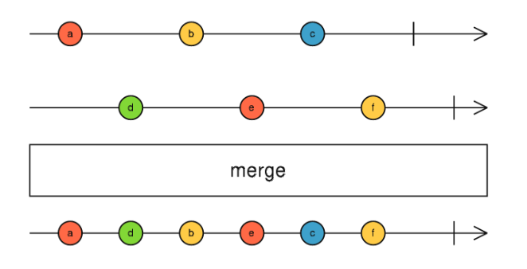
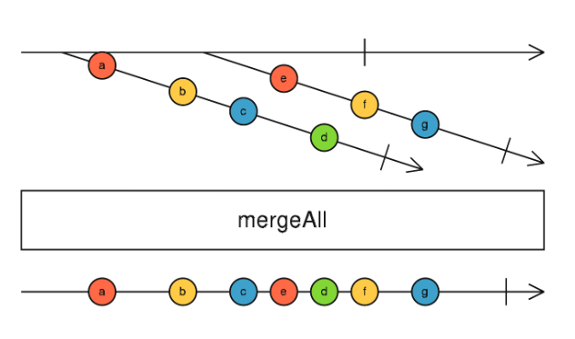
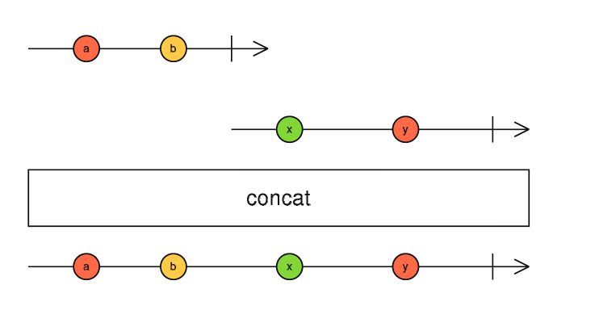
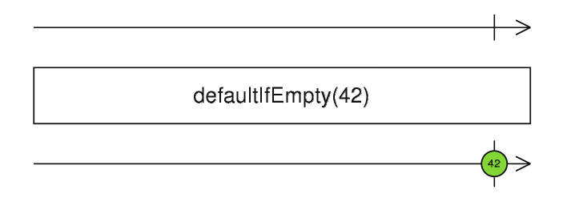
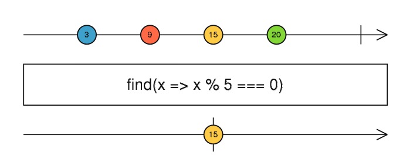
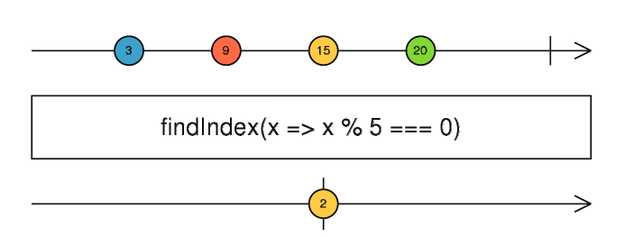
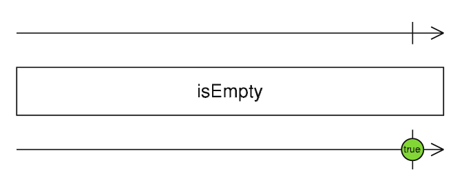

# RxJS常用操作符

## 1.组合

### （1）forkJoin

适用场景： 当你同时发起多个请求，并希望在所有的请求都响应之后再进行操作,与Promise.all异曲同工

```ts
/*
  当所有 observables 完成时，将每个 observable 
  的最新值作为数组发出
*/
forkJoin(
  // 立即发出 'Hello'
  of('Hello'),
  // 1秒后发出 'World'
  of('World').pipe(delay(1000)),
).subscribe(val => console.log(val));
//输出: ["Hello", "World"]
```

### （2）merge



使用静态方法合并多个 observables

```ts
interval(2500).pipe(merge(interval(1000))).subscribe(val => console.log(val));
//// 输出: 0,1,0,2....
```

### （3）mergeAll



```ts
// RxJS v6+
import { map, mergeAll } from 'rxjs/operators';
import { of } from 'rxjs';

const myPromise = val =>
  new Promise(resolve => setTimeout(() => resolve(`Result: ${val}`), 2000));
// 发出 1,2,3
const source = of(1, 2, 3);

const example = source.pipe(
  // 将每个值映射成 promise
  map(val => myPromise(val)),
  // 发出 source 的结果
  mergeAll()
);

/*
  输出:
  "Result: 1"
  "Result: 2"
  "Result: 3"
*/
const subscribe = example.subscribe(val => console.log(val));
```

###  （4）concat

连接多个输入 Observable，顺序的发出它们的值，一个 Observable 接一个 Observable。



```ts
const example =  of(1, 2, 3).pipe(concat(of(4, 5, 6))).subscribe(val =>
  console.log(val)
);
// 输出: 1,2,3,4,5,6
```

## 2.条件

### （1）defaultIfEmpty

如果源Observable本来就是空的,那么这个操作符会发出一个默认值



```ts
// 当源 observable 为空时，发出 'Observable.of() Empty!'，否则发出源的任意值
 of().pipe(defaultIfEmpty('Observable.of() Empty!')).subscribe(val => console.log(val));
// 输出: 'Observable.of() Empty!'

// 当源 observable 为空时，发出 'Observable.empty()!'，否则发出源的任意值
const example = empty().pipe(defaultIfEmpty('Observable.empty()!')).subscribe(val => console.log(val));
// 输出: 'Observable.empty()!'
```

### （2）every

如果完成时所有的值都能通过断言，那么发出 true，否则发出 false 。

```ts
of(1, 2, 3, 4, 5).pipe(
  // 每个值都是偶数吗？
  every(val => val % 2 === 0)
).subscribe(val => console.log(val));
// 输出: false
```

### （3）find

找到满足条件的第一个值



```ts
of(1, 2, 3, 4, 5).pipe(
  every(val => val % 2 === 0)
).subscribe(val => console.log(val));
// 输出: 2
```

### （4）findIndex

找到符合条件的第一个值的索引



```ts
of(1, 2, 3, 4, 5).pipe(
  every(val => val % 2 === 0)
).subscribe(val => console.log(val));
// 输出: 1
```

### （5）isEmpty

如果数据返回是空的话，返回true 的 Observable，否则是false



```ts
of().pipe(isEmpty()).subscribe(val => console.log(val));
// 打印输出：true
```

## 3.创建

## 4.错误处理

## 5.过滤

### （1）debounce

### （2）debounceTime

### （3）take

### （4）takeUtil

#### （5）takeWhile

### （6）throttle


## 6.多播

## 7.转换

## 8.工具

