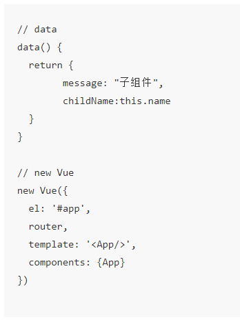
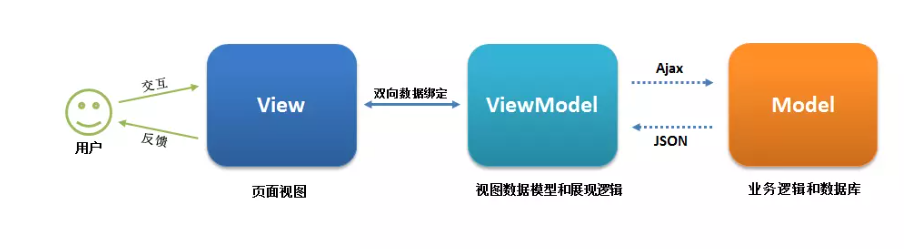
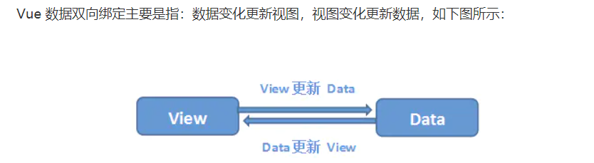
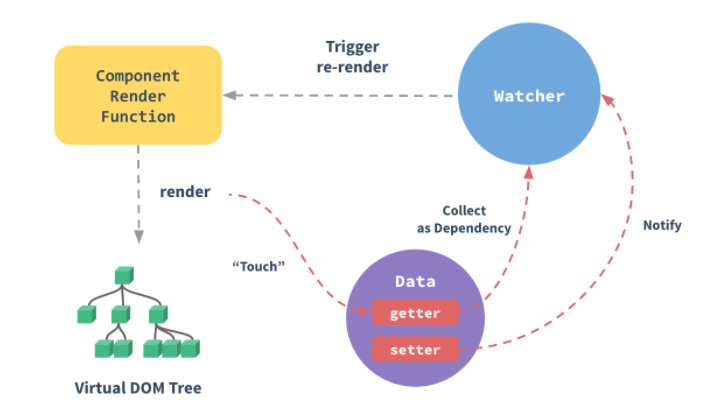

### 1、v-show 与 v-if 有什么区别？

v-if会被销毁重建，v-show不会

v-show元素总是会被渲染，简单地基于 CSS 的 “display” 属性进行切换。

v-if 适用于不需要频繁切换条件的场景时；v-show 适用于非常频繁切换条件

### 2.SPA单页面、MAP多页面的理解，优缺点分别是什么

**单页面web应用:一般整个应用只有一个html页面，通过前端路由实现无刷新跳转。**

页面初始化时加载相应的 HTML、JavaScript 和 CSS。一旦页面加载完成，SPA 不会因为用户的操作而进行页面的重新加载或跳转；利用路由机制实现 HTML 内容的变换，UI 与用户的交互，避免页面的重新加载。

优点：

- 用户体验好、快，内容的改变不需要重新加载整个页面，避免了不必要的跳转和重复渲染；
- 展示逻辑和数据渲染在前端完成，服务器任务更明确，压力减轻
- 前后端职责分离，架构清晰，前端进行交互逻辑，后端负责数据处理，使用MVVM开发模式；
- 无刷新切换页面，用户体验好

缺点

- 初次加载耗时多：为实现单页 Web 应用功能及显示效果，需要在加载页面的时候将 JavaScript、CSS 统一加载，部分页面按需加载；
- 前进后退路由管理：由于是单页应用，所以不能使用浏览器的前进后退功能，所有的页面切换需要自己建立堆栈管理；
- SEO （搜索引擎优化）难度较大（网站优化）：应用数据是通过请求接口动态渲染,由于所有的内容都在一个页面中动态替换显示，所以在 SEO 上其有着天然的弱势。

**MAP多页面：多个html页面组成，跳转刷新所有资源，每个公共资源需选择性重新加载**

优点：

- 首屏加载时间快：只加载一个页面，后面的html根据请求再加载，所以比较快
- SEO效果相对于单页面较好

缺点：

- 切换慢，如果网络卡顿，在页面之间来回切换，就会有明显的卡顿

### 3、computed 和 watch 的区别和运用的场景？

**computed：** 是计算属性，依赖其它属性值，并且 computed 的值有**缓存**，只有它依赖的属性值发生改变，下一次获取 computed 的值时才会重新计算 computed  的值

computed是在HTML DOM加载后马上执行的，

**watch：**「观察」

某些数据的监听回调 ，每当监听的数据变化时都会执行回调进行后续操作（数据变化时执行异步或开销较大的操作）

**methods：**而methods则必须要有一定的触发条件才能执行，如点击事件

默认加载的时候先computed再watch，不执行methods；等触发某一事件后，则是：先methods再watch。

### 4、Vue 生命周期？

Vue 实例有一个完整的生命周期，也就是从开始**创建、初始化数据、编译模版、挂载 Dom -> 渲染、更新 -> 渲染、卸载**等一系列过程，我们称这是 Vue 的生命周期

**各个生命周期的作用**

| 生命周期      | 描述                                                         |
| ------------- | ------------------------------------------------------------ |
| beforeCreate  | 组件实例被创建之初，组件的属性生效之前                       |
| created       | 组件实例已经完全创建，属性也绑定，但真实 dom 还没有生成，$el 还不可用 |
| beforeMount   | 在挂载开始之前被调用：相关的 render 函数首次被调用           |
| mounted       | el 被新创建的 vm.$el 替换，并挂载到实例上去之后调用该钩子    |
| beforeUpdate  | 组件数据更新之前调用，发生在虚拟 DOM 打补丁之前              |
| update        | 组件数据更新之后                                             |
| activited     | keep-alive 专属，组件被激活时调用                            |
| deactivated   | keep-alive 专属，组件被销毁时调用                            |
| beforeDestory | 组件销毁前调用                                               |
| destoryed     | 组件销毁后调用                                               |

**生命周期示意图**


### 5.Vue 的父组件和子组件生命周期钩子函数执行顺序？

Vue 的父组件和子组件生命周期钩子函数执行顺序可以归类为以下 4 部分：

- 加载渲染过程

  父 beforeCreate -> 父 created -> 父 beforeMount -> 子 beforeCreate -> 子 created -> 子 beforeMount -> 子 mounted -> 父 mounted

- 子组件更新过程

  父 beforeUpdate -> 子 beforeUpdate -> 子 updated -> 父 updated

- 父组件更新过程

  父 beforeUpdate -> 父 updated

- 销毁过程

  父 beforeDestroy -> 子 beforeDestroy -> 子 destroyed -> 父 destroyed

### 6、在哪个生命周期内调用异步请求？

可以在钩子函数 **created、beforeMount、mounted** 中进行调用，

因为在这三个钩子函数中，data 已经创建，可以将服务端端返回的数据进行赋值。

推荐在 created 钩子函数中调用异步请求：

- 能更快获取到服务端数据，减少页面 loading 时间；
- ssr 不支持 beforeMount 、mounted 钩子函数，所以放在 created 中有助于一致性；

### 7、在什么阶段才能访问操作DOM？

mounted中就可以，已经挂载了

### 8、谈谈你对 keep-alive 的了解？

是 Vue 内置的一个组件，可以使被包含的组件保留状态，避免重新渲染，对于不活动的组件实例，进行缓存而不是销毁，和transition相似

是一个抽象组件，且在页面渲染完成之后不会被渲染成一个DOM元素

```vue
<keep-alive>
	<router-view/>// 缓存所有页面
</keep-alive>

<keep-alive include = "test">// 缓存name为test的页面 也可以:include ="/a|b/"使用正则
	<router-view/>
</keep-alive>

<keep-alive exclude = "test">// 不缓存name为test的页面
	<router-view/>
</keep-alive>
// 或者直接在路由上写
{
path:"/",
name:"hello",
components:Home,
meta:{
	keepAlive: true //
}
}
```

只有组件被keep-alive包裹时，actived和deactived两个生命周期才会被调用，正常组件不会被调用

存在问题：如果是需要及时渲染的页面，在你获取请求之后，keep-alive组件是不会立即渲染的

### 9、组件中 data 为什么是一个函数？

组件中的 data 必须是一个函数，然后 return 一个对象，而 new Vue 实例里，data 可以直接是一个对象



组件拿来复用的，一个组件被创建好之后，可以用在任何地方，

在js对象里面是引用关系，如果组件中data是一个对象，那么这样作用域没有隔离，子组件中的data属性值会相互影响

组件中 data 选项是一个函数，那么每个实例可以维护一份被返回对象的独立的拷贝，组件实例之间的 data 属性值不会互相影响

new Vue 的实例，是不会被复用的，因此不存在引用对象的问题。

### 10、Vue 组件间常用通信有哪几种方式？

[学习地址](https://github.com/niuniunn/notes/blob/main/vue%E7%BB%84%E4%BB%B6%E9%97%B4%E7%9A%84%E9%80%9A%E4%BF%A1%E6%96%B9%E5%BC%8F/%E7%BB%84%E4%BB%B6%E9%97%B4%E7%9A%84%E9%80%9A%E4%BF%A1%E6%96%B9%E5%BC%8F.md)

#### **父子组件传值：**

##### （1）`props / $emit`

```vue
//父组件
<component
    :title="title"//父传子
    @changeTitle="changeTitle"
/>
//子组件
 props: {
     title: {
        type: String,
        required: true
     }
  },
methods里面使用:
this.$emit("changeTitle", "我变了");//子组件通过emit去触发事件，父组件使用
```

##### （2）`ref`

`ref`：如果在普通的 DOM 元素上使用，引用指向的就是 DOM 元素；如果用在子组件上，引用就指向组件实例

```js
 <comp1 ref="comp1"/>
 // 使用
 this.$refs.comp1.msg;//直接调用组件方法
```

##### （3）`$parent / $children` /`$root`

```js
直接使用
this.$parent.方法;// $parent则是当前实例的父实例
this.$children.方法;// $children是当前实例的直接子组件,不保证顺序，数组顺序不一定是子组件在该父组件中的渲染顺序，也不是响应式的
this.$root.方法;// $root是当前组件树的根 Vue 实例。如果当前实例没有父实例，此实例将会是其自己。通过this.$root来访问。
```

最好不用，不友好，特别是`$children`不保证顺序

##### （4）`provide/inject`

一起使用，`provide`在父组件中将子组件要使用的数据抛出，然后在子组件中`inject`注入要使用的数据

不需要层层声明，只需要在需要的地方进行使用就可以

```js
// 父组件里面
// 对于方法
provide() {
    return {
        btnHandleAuth: this.btnHandleAuth(),
        btnDelAuth: this.btnDelAuth()	
    };
},
// 子组件里面
inject: ['btnHandleAuth', 'btnDelAuth'],//然后直接使用

//对于变量
// 父组件
provide: {
    mag:"xxxx"
}
    
// 子组件
 inject: ["msg"],
//使用 像data里面的数据一样this调用
 console.log(this.msg);
```

#### **非父子组件传值：**

##### （1）中央事件总线 bus：适用于跨级或兄弟组件间通信。

使用中央事件总线实际就是创建一个vue实例，利用这个vue实例来传递消息。

```js
使用方式一：
// 定义一个bus文件
import Vue from "vue";
const bus = new Vue();
export default bus;
// 引入bus文件
import bus from "@/bus";
bus.$emit("myEvent", "bus msg")
// 引入bus文件
import bus from "@/bus";
bus.$on("myEvent", data => {
    console.log(data);
});

使用方法二：
// main.js
import Vue from 'vue'
import App from './App.vue'
Vue.prototype.$bus = new Vue();
new Vue({
  render: h => h(App),
}).$mount('#app')
// 发送事件
this.$bus.$emit("myEvent", "bus msg")；
// 接收事件
this.$bus.$on("myEvent", data => {
    console.log(data);
})
```

##### **（2）Vuex  适用于 父子、隔代、兄弟组件通信**

Vuex 是一个专为 Vue.js 应用程序开发的状态管理模式。每一个 Vuex 应用的核心就是 store（仓库）。“store” 基本上就是一个容器，它包含着你的应用中大部分的状态 ( state )。

- Vuex 的状态存储是响应式的。当 Vue 组件从 store 中读取状态的时候，若 store 中的状态发生变化，那么相应的组件也会相应地得到高效更新。
- 改变 store 中的状态的唯一途径就是显式地提交  (commit) mutation。这样使得我们可以方便地跟踪每一个状态的变化。

### 11、vue-router 路由模式有几种

路由的本质就是建立起url和页面之间的映射关系

 3 种路由模式：hash、history、abstract

```js
//源码 根据mode确定history实际的类并实例化
switch (mode) {
  case 'history':
	this.history = new HTML5History(this, options.base)// 依赖 HTML5 History API 和服务器配置，没有#
	break
  case 'hash':
	this.history = new HashHistory(this, options.base, this.fallback)//使用 URL hash 值来作路由。支持所有浏览器，加上#
	break
  case 'abstract':
	this.history = new AbstractHistory(this, options.base)//支持所有 JavaScript 运行环境
	break
  default:
	if (process.env.NODE_ENV !== 'production') {
	  assert(false, `invalid mode: ${mode}`)
	}
}
```

#### **(1）hash 模式的实现原理**

vue默认使用hash

location.hash 的值就是 URL 中 #（#代表锚点） 后面的内容。其原理是**通过hashChange() 事件监听hash值的变化, 根据路由表对应的hash值来判断加载对应的路由加载对应的页面**

```js
https://www.word.com#search//location.hash 的值为 '#search'
```

hash  路由模式的实现主要是基于下面几个特性：

- URL 中 hash 值只是客户端的一种状态，也就是说**当向服务器端发出请求时，hash 部分不会被发送**；
- hash 值的改变，都会在**浏览器的访问历史中增加一个记录**。因此我们能通过浏览器的回退、前进按钮控制hash 的切换；
- 可以通过 a 标签，并设置 href 属性，当用户点击这个标签后，URL 的 hash 值会发生改变；或者使用  **JavaScript** 来对 window.loaction.hash 进行赋值，**改变 URL 的 hash 值**；

优点：

- 兼容性好，浏览器都能支持

缺点：

- hash值前面需要加#,不符合url规范，也不美观

#### **（2）history 模式的实现原理**

HTML5 提供了 **History API history.pushState() 或 history.replaceState() 来实现 URL 的变化**。

最主要的 API：不进行刷新的情况下，操作浏览器的历史纪录

history.pushState():新增一个历史记录

history.repalceState():直接替换当前的历史记录

```js
window.history.pushState(null, null, path);
window.history.replaceState(null, null, path);
```

history 路由模式的实现主要基于存在下面几个特性：

- 我们可以使用 popstate  事件来监听 url 的变化，从而对页面进行跳转（渲染）；
- history.pushState() 或 history.replaceState() 不会触发 popstate 事件，这时我们需要手动触发页面跳转（渲染）。

优点：

- 符合url地址规范

缺点：

- 在用户手动输入地址和刷新页面都会发起url请求，需要配置匹配不到页面的情况
- 兼容性差，需要浏览器支持history.pushState() 或 history.replaceState() 方法

### 12. MVVM



解耦了view和model

（1）View 层

```html
<div id="app">
    <p>{{message}}</p>
    <button v-on:click="showMessage()">Click me</button>
</div>
```

（2）ViewModel 层

```vue
var app = new Vue({
    el: '#app',
    data: {  // 用于描述视图状态   
        message: 'Hello Vue!', 
    },
    methods: {  // 用于描述视图行为  
        showMessage(){
            let vm = this;
            alert(vm.message);
        }
    },
    created(){
        let vm = this;
        // Ajax 获取 Model 层的数据
        ajax({
            url: '/your/server/data/api',
            success(res){
                vm.message = res;
            }
        });
    }
})
```

（3） Model 层

```
{
    "url": "/your/server/data/api",
    "res": {
        "success": true,
        "name": "IoveC",
        "domain": "www.cnblogs.com"
    }
}
```

### 13、数据双向绑定，vue响应式原理

#### （1）数据双向绑定



View 变化更新 Data ：事件监听

Data变化更新 View:订阅者 Watcher


**监听器 Observer**：对数据对象进行遍历，包括子属性对象的属性，利用 Object.defineProperty() 对属性都加上 setter 和 getter。给这个对象的某个值赋值，触发 setter，监听到数据变化。

**解析器 Compile**：解析 Vue 模板指令，模板中的变量替换成数据，初始化渲染页面视图，并将每个指令对应的节点绑定更新函数，添加监听数据的订阅者，一旦数据有变动，收到通知，调用更新函数进行数据更新。

**订阅者 Watcher**：Watcher 订阅者是 Observer 和 Compile 之间通信的桥梁 ，主要的任务是订阅 Observer 中的属性值变化的消息，当收到属性值变化的消息时，触发解析器 Compile 中对应的更新函数。

**订阅器 Dep**：订阅器采用 发布-订阅 设计模式，用来收集订阅者 Watcher，对监听器 Observer 和 订阅者 Watcher 进行统一管理。

**vue 监听对象和数组源码**：还是利用的监听器observer

```js
 /**
   * Observe a list of Array items，监听数组
   */
  observeArray (items: Array<any>) {
    for (let i = 0, l = items.length; i < l; i++) {
      observe(items[i])  // observe 功能为监测数据的变化，给数组每一个都循环监听
    }
  }

  /**
   * 对属性进行递归遍历，监听对象
   */
  let childOb = !shallow && observe(val) // observe 功能为监测数据的变化
```

#### （2）`vue3.0Proxy`和`Object.definePrototype`优点对比

**Proxy 的优势:**

- Proxy 可以直接监听对象而非属性；
- Proxy 可以直接监听数组的变化；
- Proxy 有多达 13 种拦截方法,不限于 apply、ownKeys、deleteProperty、has 等等是 Object.defineProperty 不具备的；
- Proxy 返回的是一个新对象,我们可以只操作新的对象达到目的,而 Object.defineProperty 只能遍历对象属性直接修改；
- Proxy 作为新标准将受到浏览器厂商重点持续的性能优化，也就是传说中的新标准的性能红利；

**Object.defineProperty 的优势:**

- 兼容性好，支持 IE9，而 Proxy 的存在浏览器兼容性问题,而且无法用 polyfill 磨平，因此 Vue 的作者才声明需要等到下个大版本( 3.0 )才能用 Proxy 重写。

#### （3）vue响应式原理

在data里面的数据，都会被`Object.definePrototype`，把这些特性全部转换成getter/setter, getter/setter 对用户来说是不可见的，但是在内部它们让 Vue 能够追踪依赖，在 property 被访问和修改时通知变更

每个组件实例都对应一个 **watcher** 实例，它会在组件渲染的过程中把“接触”过的数据 property 记录为依赖。之后当依赖项的 setter 触发时，会通知 watcher，从而使它关联的组件重新渲染。



##### a.对象响应式

见知识点19点，set使用

##### b.数组响应式

Vue 不能检测以下数组的变动：

1. 当你利用索引直接设置一个数组项时，例如：`vm.items[indexOfItem] = newValue`
2. 当你修改数组的长度时，例如：`vm.items.length = newLength`

```js
var vm = new Vue({
  data: {
    items: ['a', 'b', 'c']
  }
})
vm.items[1] = 'x' // 不是响应性的
vm.items.length = 2 // 不是响应性的
```

实现索引赋值

```js
// Vue.set
Vue.set(vm.items, indexOfItem, newValue)
// Array.prototype.splice
vm.items.splice(indexOfItem, 1, newValue)
```

实现数组长度改变

```js
vm.items.splice(newLength)
```

##### c.异步更新队列

vue在更新DOM的时候是异步执行的，为了等待vue更新dom，使用Vue.nextTick(callback)，回调函数在DOm更新完成后被调用

```js
this.$nextTick(()=>{//不需要全局Vue,回调函数中的this也直接绑定当前vue实例
   // xxxx
});
//$nextTick()返回Promise对象，也可以使用async和await完成
```

### 14.**虚拟DOM实现原理**

[Virtual-DOM学习](../React学习笔记/虚拟DOM.md)

- 用 JavaScript 对象模拟真实 DOM 树，对真实 DOM 进行抽象；
- diff 算法 — 比较两棵虚拟 DOM 树的差异；
- pach 算法 — 将两个虚拟 DOM 对象的差异应用到真正的 DOM 树。

**Vue 中 key 的作用是：key 是为 Vue 中 vnode 的唯一标记，通过这个 key，我们的 diff 操作可以更准确、更快速**

```
Vue 的 diff 过程可以概括为：oldCh 和 newCh 各有两个头尾的变量 oldStartIndex、oldEndIndex 和 newStartIndex、newEndIndex，它们会新节点和旧节点会进行两两对比，即一共有4种比较方式：newStartIndex 和oldStartIndex 、newEndIndex 和  oldEndIndex 、newStartIndex 和 oldEndIndex 、newEndIndex 和 oldStartIndex，如果以上 4 种比较都没匹配，如果设置了key，就会用 key 再进行比较，在比较的过程中，遍历会往中间靠，一旦 StartIdx > EndIdx 表明 oldCh 和 newCh 至少有一个已经遍历完了，就会结束比较。
```

**更准确**：带 key 不是就地复用，在 sameNode 函数 `a.key === b.key` 对比中可以避免就地复用的情况。所以会更加准确。

**更快速**：利用 key 的唯一性生成 map 对象来获取对应节点，比遍历方式更快

```
//源码如下：
function createKeyToOldIdx (children, beginIdx, endIdx) {
  let i, key
  const map = {}
  for (i = beginIdx; i <= endIdx; ++i) {
    key = children[i].key
    if (isDef(key)) map[key] = i
  }
  return map
}
```

### 15.vue项目优化

#### **（1）代码层面的优化**

- v-if 和 v-show 区分使用场景
- computed 和 watch  区分使用场景
- v-for 遍历必须为 item 添加 key
- 避免同时使用 v-if
- 长列表性能优化
- 事件的销毁
- 图片资源懒加载

```js
//安装 vue-lazyload
// 使用
Vue.use(VueLazyLoad)

```

- 路由懒加载

```js
import Vue from "vue";
import VueRouter from "vue-router";
const Rule = () => import("./rule");//这样导入而不是直接import导入

Vue.use(VueRouter);
const routes = [
	{ path: "/rule", component: Rule },
];
const router = new VueRouter({ routes });
export default router;
```

- 第三方插件的按需引入
- 优化无限列表性能
- 服务端渲染 SSR or 预渲染

#### **（2）Webpack 层面的优化**

- Webpack 对图片进行压缩
- 减少 ES6 转为 ES5 的冗余代码
- 提取公共代码
- 模板预编译
- 提取组件的 CSS
- 优化 SourceMap
- 构建结果输出分析
- Vue 项目的编译优化

#### **（3）基础的 Web 技术的优化**

- 开启 gzip 压缩
- 浏览器缓存
- CDN 的使用
- 使用 Chrome Performance 查找性能瓶颈

### 16.vue3.0(去了解)

**（1）监测机制的改变**：基于代理 Proxy 的 observer 实现

**（2）模板**:把作用域插槽改成了函数的方式，影响子组件的重新渲染，提升了渲染的性能

**（3）对象式的组件声明方式**:

  **(4)	压缩包体积更小** 10Kb

（5）代码迁移成TypeScript

### 17.`$route`和​`$router`

route是路由信息对象route为当前router跳转对象里面可以获取name、path、query、params等,

router是路由跳转，相当于一个全局的路由器对象，里面含有很多属性和子对象，例如history对象，经常用的跳转链接就可以用this.路由的前进后退

### 18.Vue-router路由传参的方式有哪些？

  答： 1：js导航的router.push({path:”/user”,query:{ }}) 

​    2：动态路由 ｛path：”/user/:id” name：”user”｝

3：mate

4：Storage/仓库

### 19.`Vue.set`与 `vue.$set`在使用中的区别

当生成vue实例后，当再次给数据赋值时，有时候并不会自动更新到视图上去

```js
var vm = new Vue({
  data:{
    a:1
  }
})

// `vm.a` 是响应式的
//  property 必须在 data 对象上存在才能让 Vue 将它转换为响应式

vm.b = 2
// `vm.b` 是非响应式的
```

1、通过Vue.set方法设置data属性sex，如下：【**Vue.set(object, propertyName, value)**】

```js
Vue.set(data,'sex', '男')
```

2、您还可以使用 vm.$set实例方法，这也是全局 Vue.set方法的别名:

```js
var key = 'content'; //这种主要用于当对象中某个属性值动态生成时处理方式
this.$set('info.'+key, 'what is this?');
 或
this.$set('info.content', 'what is this?');
```

有时你可能需要为已有对象赋值多个新 property，比如使用 `Object.assign()` 或 `_.extend()`。但是，这样添加到对象上的新 property 不会触发更新。在这种情况下，你应该用原对象与要混合进去的对象的 property 一起创建一个新的对象。

```js
// 代替 `Object.assign(this.someObject, { a: 1, b: 2 })`
this.someObject = Object.assign({}, this.someObject, { a: 1, b: 2 })
```

### 20.Proxy 相比于 defineProperty 的优势

- 数组变化也能监听到
- 不需要深度遍历监听

```js
let data = { a: 1 }
let reactiveData = new Proxy(data, {
	get: function(target, name){
		// ...
	},
	// ...
})
```

### 21.vuex

- `state`: 状态中心
- `mutations`: 更改状态
- `actions`: 异步更改状态
- `getters`: 获取状态
- `modules`: 将`state`分成多个`modules`，便于管理

### 22.Vue项目中props传值、data数据初始化、watch（immediate: true）和常用钩子之间先后关系

beforeCreate > props > data初始化 >computed > watch（顺序不定） > created > beforeMount > mounted