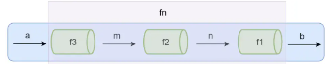

# compose

## 1.什么是组合？

多个函数组合之后返回了一个新函数，比如`f4 = compose(f1,f2,f3);`

函数组合默认情况下是从右到左执行，并且管道函数都是一元函数；函数组合遵循结合律



```js
var compose = function(f,g) {
  return function(x) {
    return f(g(x));
  };
};// 组合函数
var toUpperCase = function(x) { return x.toUpperCase(); };
var exclaim = function(x) { return x + '!'; };
var shout = compose(exclaim, toUpperCase);//非常清晰

shout("send in the clowns");
//=> "SEND IN THE CLOWNS!"
// 函数组合就是从右往左顺序调用，每个函数的执行结果作为为下一个函数的输入，直至最后一个函数的输出作为最终的输出结果。
```

## 2.实现

```js
function compose(...args: any[]) {
  return (subArgs: any) => {
    return args.reverse().reduce((acc, func,index) => {
      return func(acc);// 倒序再reduce,实现从右往左
    }, subArgs);
  }
}
//实践可行
compose(...funcs) {
    if (funcs.length === 0) {
        return arg => arg;
    }
    if (funcs.length === 1) {
        return funcs[0];
    }
    return funcs.reduce((a, b) => (...args) => a(b(...args)));
},

```

## 3.有什么用？

1.避免洋葱代码。

纯函数和柯里化函数很容易导致洋葱代码：h(g(f(x)))

如：获取数组的最后一个元素再转换成大写字母`_.toUpper(_.first(_.reverse(array)))`

洋葱代码就是嵌套调用,

```js
a(b(c(d())));
// d() -> c() -> b() -> a()
// 先内后外，一层一层执行
```

2.代替链式调用

```js
链式调用是以数据为主语 data.fn1().fn2().fn3() // 链式调用侧重于 oop 风格，先有对象，在调用对象的方法
函数组合是以函数为主语 compose(fn1, fn2, fn3)(data)// 函数组合（pipe&compose）将对象和操作对象的方法分离开来，更侧重于对函数（逻辑）的操作（组合），复用性更好！
```

## 4.总结

优点：将嵌套执行的函数平铺，将功能单一的函数，再进行组合，达到实现复杂功能的目的，让代码逻辑更清晰

缺点：不能直观的看到参数

compose是从右往左的，pipe（管道）是从左往右的，二者区别只有数据流方向不同，但是希望项目中只使用一种风格

## 5.参考资料

（1）[JS函数式编程指南](http://shouce.jb51.net/js-function/index.html)

（2）[函数式编程](https://zhuanlan.zhihu.com/p/399961704)

