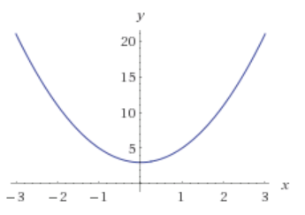

# 函数式编程

## （1）通用编程原则

DRY（不要重复自己，don't repeat yourself）

高内聚低耦合（loose coupling high cohesion）

YAGNI （你不会用到它的，ya ain't gonna need it）

最小意外原则（Principle of least surprise）

单一责任（single responsibility）

## （2）例子

实现函数简单加减乘除：

```js
var Flock = function(n) {
  this.seagulls = n;
};

Flock.prototype.conjoin = function(other) {
  this.seagulls += other.seagulls;
  return this;
};

Flock.prototype.breed = function(other) {
  this.seagulls = this.seagulls * other.seagulls;
  return this;
};

var flock_a = new Flock(4);
var flock_b = new Flock(2);
var flock_c = new Flock(0);

var result = flock_a.conjoin(flock_c).breed(flock_b).conjoin(flock_a.breed(flock_b)).seagulls;
//=> 32
```

flock_a在运算过程中被改变，直面过程直接赋值的方法的弊端

函数式编写:

```js
var add = function(x, y) { return x + y };
var multiply = function(x, y) { return x * y };

var flock_a = 4;
var flock_b = 2;
var flock_c = 0;

var result = add(multiply(flock_b, add(flock_a, flock_c)), multiply(flock_a, flock_b));
//=>16
```

## （3）一等公民的函数

### 为什么函数是一等公民？

把函数存在数组里，当作参数传递，赋值给变量...等等

通用代码

```js
// 只针对当前的博客
const validArticles = articles =>
  articles.filter(article => article !== null && article !== undefined),

// 对未来的项目更友好
const compact = xs => xs.filter(x => x !== null && x !== undefined);
```

```js
// 这行
ajaxCall(json => callback(json));

// 等价于这行
ajaxCall(callback);

// 那么，重构下 getServerStuff
const getServerStuff = callback => ajaxCall(callback);

// ...就等于
const getServerStuff = ajaxCall // <-- 看，没有括号哦
```

## （4）纯函数

### 纯函数概念

纯函数是这样一种函数，即相同的输入，永远会得到相同的输出，而且没有任何可观察的副作用。

副作用：引入了外部环境和状态

使用纯函数，函数就可以做到自给自足。

```js
// 不纯的
var minimum = 21;
var checkAge = function(age) {
  return age >= minimum;
};
// 纯的
var checkAge = function(age) {
  var minimum = 21;
  return age >= minimum;
};
```

### 副作用包括：

- 更改文件系统
- 往数据库插入记录
- 发送一个 http 请求
- 可变数据
- 打印/log
- 获取用户输入
- DOM 查询
- 访问系统状态

函数式编程的哲学就是假定副作用是造成不正当行为的主要原因

**为什么要要求相同输入相同输出？？**

函数是不同数值之间的特殊关系：每一个输入值返回且只返回一个输出值。或许有一个输入或许有多个输入，如同数学中的函数映射

如果输入直接指明了输出，那么就没有必要再实现具体的细节了。因为函数仅仅只是输入到输出的映射而已



### **纯函数的好处：**

（1）可缓存性(cacheable):缓存中读取结果作为输入值

通过延迟执行的方式把不纯的函数转换为纯函数

```js
var pureHttpCall = memoize(function(url, params){
  return function() { return $.getJSON(url, params); }
});
// 没有发送真正的http请求，而是返回来函数，当调用这个函数的时候才会发送请求，之所以会成为纯函数，只是因为他会根据相同的输入输出返回相同的结果，返回这个函数
```

（2）可移植性／自文档化（Portable / Self-Documenting）：

可移植性：可以在新的地方进行调用，不用搭建环境，因为不依赖环境

自文档化：传入参数明显，可读性高

（3）可测试性

不需要配置环境，直接可以测试

（4）合理性

引用透明：如果一段代码可以替换成它执行所得的结果，而且是在不改变整个程序行为的前提下替换的，那么我们就说这段代码是引用透明的。

（5）并行代码

并行运行任意纯函数。因为纯函数根本不需要访问共享的内存，而且根据其定义，纯函数也不会因副作用而进入竞争态（race condition）

## （5）[柯里化](./柯里化curry.md)

## （6）[代码组合](./代码组合compose.md)

## （7）声明式

命令式：怎么做，直接实现细节

声明式：做什么，不关心实现细节

```js
// 命令式
var authenticate = function(form) {
  var user = toUser(form);
  return logIn(user);
};//一步一步执行

// 声明式
var authenticate = compose(logIn, toUser);// 行为代码的组合实现
```

声明式代码不指定执行顺序，天然适合并行运算

## （8）Hindley-Milner类型签名

作用：1.暴露函数的行为和目的

2.

