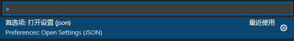

# VsCode代码格式化自动化配置

## 1.代码风格

根据公司代码规范

## 2.代码格式化插件准备

- [`Vuter`](https://link.juejin.cn/?target=https%3A%2F%2Fmarketplace.visualstudio.com%2Fitems%3FitemName%3Doctref.vetur) 提供`vue`代码片段、语法支持、代码高亮等
- [`ESlint`](https://link.juejin.cn/?target=https%3A%2F%2Fmarketplace.visualstudio.com%2Fitems%3FitemName%3Ddbaeumer.vscode-eslint)检查`javascript`语法检查和代码规范，不包括css，html
- [`Prettier - Code formatter`](https://link.juejin.cn/?target=https%3A%2F%2Fmarketplace.visualstudio.com%2Fitems%3FitemName%3Desbenp.prettier-vscode) 各种代码格式化，只关注格式化，并不具有eslint检查语法等能力，只关心格式化文件(最大长度、混合标签和空格、引用样式等)，包括JavaScript · Flow · TypeScript · CSS · SCSS · Less · JSX · Vue · GraphQL · JSON · Markdown

## 3.自动化配置

### （1）打开配置

- 打开`VS Code`配置文件`setting.json`
- 快捷键`ctrl + shirt + p`，搜索`Settings(JSON)`



### （2）配置

```js
{
    "eslint.validate": [
    "javascript",
    "javascriptreact",
    "html",
    "vue"
  ],
   
  "editor.formatOnSave": true,// 每次保存的时候将代码按格式进行修复
  "editor.codeActionsOnSave": { // #每次保存的时候将代码按eslint格式进行修复
    "source.fixAll.eslint": true
  },
  "editor.detectIndentation": false, // vscode默认启用了根据文件类型自动设置tabsize的选项
  "editor.tabSize": 2, // 重新设定tabsize,根据自己的习惯
  "editor.detectIndentation": false,
  "editor.insertSpaces": false,//tab时不插入空格
  "editor.formatOnType": true //开启自动格式化
      
  "javascript.format.insertSpaceBeforeFunctionParenthesis": true,//  #让函数(名)和后面的括号之间加个空格
  "javascript.format.insertSpaceAfterConstructor": true,// 在构造函数和括号之间加空格
  "javascript.format.insertSpaceAfterOpeningAndBeforeClosingJsxExpressionBraces": true,
  "javascript.format.insertSpaceAfterOpeningAndBeforeClosingNonemptyParenthesis": true,
  "javascript.format.insertSpaceAfterOpeningAndBeforeClosingTemplateStringBraces": true,
  "javascript.format.insertSpaceAfterSemicolonInForStatements": true,
  "javascript.format.insertSpaceBeforeAndAfterBinaryOperators": true,// 在二进制运算符之后定义空间处理。
      
  "prettier.printWidth": 120, // 超过最大值换行
  "prettier.tabWidth": 4, // 缩进字节数
  "prettier.useTabs": true, // 缩进使用tab，不使用空格
  "prettier.semi": true, // 句尾添加分号
  "prettier.singleQuote": true, // 使用单引号代替双引号
  "prettier.proseWrap": "preserve", // 默认值。因为使用了一些折行敏感型的渲染器（如GitHub comment）而按照markdown文本样式进行折行
  "prettier.arrowParens": "avoid", //  (x) => {} 箭头函数参数只有一个时是否要有小括号。avoid：省略括号
  "prettier.bracketSpacing": true, // 在对象，数组括号与文字之间加空格 "{ foo: bar }"
  "prettier.disableLanguages": ["vue"], // 不格式化vue文件，vue文件的格式化单独设置
  "prettier.endOfLine": "auto", // 结尾是 \n \r \n\r auto
  "prettier.eslintIntegration": false, //不让prettier使用eslint的代码格式进行校验
  "prettier.htmlWhitespaceSensitivity": "ignore",
  "prettier.ignorePath": ".prettierignore", // 不使用prettier格式化的文件填写在项目的.prettierignore文件中
  "prettier.jsxBracketSameLine": false, // 在jsx中把'>' 是否单独放一行
  "prettier.jsxSingleQuote": false, // 在jsx中使用单引号代替双引号
  "prettier.parser": "babylon", // 格式化的解析器，默认是babylon
  "prettier.requireConfig": false, // Require a 'prettierconfig' to format prettier
  "prettier.stylelintIntegration": false, //不让prettier使用stylelint的代码格式进行校验
  "prettier.trailingComma": "es5", // 在对象或数组最后一个元素后面是否加逗号（在ES5中加尾逗号）
  "prettier.tslintIntegration": false, // 不让prettier使用tslint的代码格式进行校验
}
```

## 4.其他插件

1.`Trailing Spaces` 尾部空格删除插件，高亮空格，并提供了一键删除。

2.`Code Spell Checker`拼写检查

