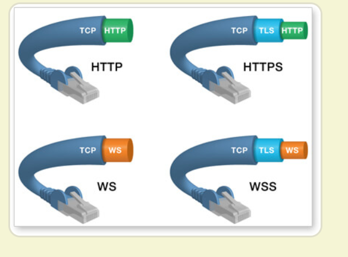

# webpack

### 1.有了解过webpack吗？常用的配置项有哪些？

JavaScript 的 **模块打包工具** (module bundler)。通过分析模块之间的依赖，最终将所有模块打包成一份或者多份代码包 (bundler)，供 HTML 直接引用。实质上，Webpack 仅仅提供了 **打包功能** 和一套 **文件处理机制**，然后通过生态中的各种 Loader 和 Plugin 对代码进行预编译和打包。

**配置项：**

mode：配置webpack环境，包含developer和production环境 （4+）

 entry：配置项目的入口文件

  output：打包后的文件名，存放的地址，chunk的名字。。。

  module：loader test use指定loader

  plugins：插件

  devserver：配置webpack-dev-server 

  resolve：杂项，别名，文件的扩展名。。。

   devtools：soure-map 

loader：模块加载器，进行各种文件类型的加载与转换；

modules：模块，在 Webpack 中任何文件都可以作为一个模块，会根据配置的不同的 Loader 进行加载和打包

module Resolution

targets

**工作流程** (加载 - 编译 - 输出)

- 1、读取配置文件，按命令 **初始化** 配置参数，创建 Compiler 对象；
- 2、调用插件的 apply 方法 **挂载插件** 监听，然后从入口文件开始执行编译；
- 3、按文件类型，调用相应的 Loader 对模块进行 **编译**，并在合适的时机点触发对应的事件，调用 Plugin 执行，最后再根据模块 **依赖查找** 到所依赖的模块，递归执行第三步；
- 4、将编译后的所有代码包装成一个个代码块 (Chuck)， 并按依赖和配置确定 **输出内容**。这个步骤，仍然可以通过 Plugin 进行文件的修改;
- 5、最后，根据 Output 把文件内容一一写入到指定的文件夹中，完成整个过程；

### 2.webpack常用的插件有哪些？分别的作用什么？

 答：

   MiniCssExtractPlugin ：抽离css从js中

   DefinePlugin：定义全局变量

   htmlWebpackPlugin 设置模版 会自动帮我们打包好的文件路径注入模版

   PurifyCSSPlugin：去掉没用的css样式

   CopyWebpackPlugin：拷贝静态资源

   HotModuleReplacementPlugin：组件热更新

### 3.wesocket概念



```javascript
var ws = new WebSocket("wss://echo.websocket.org");
ws.onopen = function(evt) { //onopen用于指定连接成功之后的回调函数
  console.log("Connection open ..."); 
  ws.send("Hello WebSockets!");//向服务器发送数据。
};
ws.onmessage = function(evt) {//用于指定收到服务器数据后的回调函数。
  console.log( "Received Message: " + evt.data);
  ws.close();
};
ws.onclose = function(evt) {//用于指定连接关闭后的回调函数
  console.log("Connection closed.");
};  
```

`readyState`属性返回实例对象的当前状态，共有四种。

> - CONNECTING：值为0，表示正在连接。
> - OPEN：值为1，表示连接成功，可以通信了。
> - CLOSING：值为2，表示连接正在关闭。
> - CLOSED：值为3，表示连接已经关闭，或者打开连接失败。

### 4.Gulp和webpack的区别

`gulp`是工具链、构建工具，可以配合各种插件做js压缩，css压缩，less编译 替代手工实现自动化工作

`webpack`是文件打包工具，可以把项目的各种js文、css文件等打包合并成一个或多个文件，主要用于模块化方案，预编译模块的方案

browserify / webpack ，seajs / requirejs 。这四个都是JS模块化的方案

seajs / require : 是一种在线"编译" 模块的方案，相当于在页面上加载一个 CMD/AMD 解释器。这样浏览器就认识了 define、exports、module 这些东西。也就实现了模块化。

browserify / webpack : 是一个预编译模块的方案，相比于上面 ，这个方案更加智能。没用过browserify，这里以webpack为例。首先，它是预编译的，不需要在浏览器中加载解释器。另外，你在本地直接写JS，不管是 AMD / CMD / ES6 风格的模块化，它都能认识，并且编译成浏览器认识的JS。

区别：gulp强调的是前端开发的工作流程，webpack是一个前端模块化方案，更侧重模块打包

### 5.Vite？？

Vite 是一个由原生 ESM 驱动的 Web 开发构建工具。在开发环境下基于浏览器原生 ES imports 开发，在生产环境下基于 Rollup 打包。

特点：

- 快速的冷启动
- 即时的模块热更新
- 真正的按需编译

```powershell
$ npm init vite-app <project-name>
$ cd <project-name>
$ npm install
$ npm run dev
```

架构一样的和vue-cli生成的代码，只是主页面index.html多了

```html
<script type="module" src="/src/main.js"></script>
```

`script module` 是 ES 模块在浏览器端的实现，目前主流的浏览器都已经支持

- webpack 之类的打包工具为了在浏览器里加载各模块，会借助胶水代码用来组装各模块，比如 webpack 使用 map 存放模块 id 和路径，使用 **webpack_require** 方法获取模块导出，vite 利用浏览器原生支持模块化导入这一特性，省略了对模块的组装，也就不需要生成 bundle，所以 **冷启动是非常快的**
- 打包工具会将各模块提前打包进 bundle 里，但打包的过程是静态的——不管某个模块的代码是否执行到，这个模块都要打包到 bundle 里，这样的坏处就是随着项目越来越大打包后的 bundle 也越来越大。而 **ESM 天生就是按需加载的，只有 import 的时候才会去按需加载**

### 6.Loader

 **对 Webpack 传入的字符串进行按需修改**

通常是需要将代码进行分析，构建 **AST (抽象语法树)**， 遍历进行定向的修改后，再重新生成新的代码字符串。

- babylon 将 ES6/ES7 代码解析成 AST
- babel-traverse 对 AST 进行遍历转译，得到新的 AST
- 新 AST 通过 babel-generator 转换成 ES5

特性：

- **链式传递**，按照配置时相反的顺序链式执行；
- 基于 Node 环境，拥有 **较高权限**，比如文件的增删查改；
- 可同步也可异步；

常用loader:

file-loader: 加载文件资源，如 字体 / 图片 等，具有移动/复制/命名等功能；

url-loader: 通常用于加载图片，可以将小图片直接转换为 Date Url，减少请求；

babel-loader: 加载 js / jsx 文件， 将 ES6 / ES7 代码转换成 ES5，抹平兼容性问题；

ts-loader: 加载 ts / tsx 文件，编译 TypeScript；

style-loader: 将 css 代码以<style>标签的形式插入到 html 中；

css-loader: 分析`@import`和`url()`，引用 css 文件与对应的资源；

postcss-loader: 用于 css 的兼容性处理，具有众多功能，例如 **添加前缀，单位转换** 等；

less-loader / sass-loader: css预处理器，在 css 中新增了许多语法，提高了开发效率；

