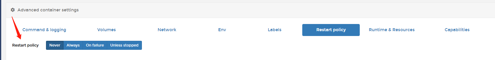

# Docker 入门

## 引言

假如我们没有虚拟机，该怎么样让别人运行我们的项目，初学的时候，我们往往是打包代码，发给对方，然后让对方安装相应的环境，比如node、数据库，要是配置不同，项目很有可能无法运行，还会报错，如果多个人想要运行这份代码，那还得多次安装配置环境。

当学习完虚拟机之后，我们可以直接发个链接给别人就可以查看，就得开始部署在服务器上。然后去买了服务器，学了linux,去服务器上搭建环境，下载node、mongogb，安装各种项目启动需要的东西，中途可能还安装不成功，然后XShell上传打包好的代码，然后解压运行，测试是否运行正常，ok，可以链接发给别人看了。

但是总归是有些不方便吧，毕竟安装虚拟机配置环境，运行起来之后还特别吃内存，占用资源直接一半。

直到学习docker之后，发现这些问题突然就可以得到解决了，那接下来让我们看看docker到底是什么，解决了什么样的问题，怎么操作吧

----

## 1.环境配置的问题

软件开发的时候，环境配置不同，很可能造成项目无法运行，每次其他人运行都需要配置相应的环境，

从根本上解决问题：软件带环境安装，安装的时候把原始环境一模一样的复制过去

解决方案：

### （1）虚拟机

带环境安装的一种解决办法，可以在windows上运行linux系统，通过虚拟机可以还原软件原始环境

优点：

- 相当于真实系统，但是对于底层又是一个普通文件，可以随时删除，方便删除

缺点：

- 资源占用多：在物理服务器创建一台虚拟机时，便需要虚拟出一套硬件并在上面运行完整的操作系统
- 冗余步骤多：必须有完整的操作过程，比如登录
- 启动慢

### （2）Linux容器

Linux 容器（Linux Containers，缩写为 LXC）：Linux不是模拟的完整的操作系统，而是对进程进行隔离，在正常进程的外面套了一个保护层形成容器。对于容器里面的进程来说，它接触到的各种资源都是虚拟的，从而实现与底层系统的隔离

优势【相对于虚拟机】：

- 启动快
- 用资源少
- 体积小：只是一个进程，而不是完整的操作系统

类似一个轻量级的虚拟机，但是对比于虚拟机，优点很多，虚拟机和linux都是带环境安装的解决办法，而Docker就是在linux容器的基础上发展的。

## 2.Docker是什么

**Docker 基于Linux 容器的一种封装，提供简单易用的容器使用接口**。

Docker 将应用程序与该程序的依赖，打包在一个文件里面。运行这个文件，就会生成一个虚拟容器。就不用担心环境问题了，容器还可以进行版本管理、复制修改等。

常常我们会觉得Docker是一个小型的虚拟机，但是其实本质不同，Docker不是在宿主机上虚拟出一套硬件后再虚拟出一个操作系统，而是让 Docker 容器里面的进程直接运行在宿主机上（Docker 会做文件、网络等的隔离），被隔离的进场也就是容器，可以完全独立于宿主机的进程

### （1）Docker优点

（1）提供一次性的环境：本地测试他人软件，持续集成的时候提供单元测试和构建的环境

（2）配置简化：将环境和配置放入代码然后部署，同样的Docker配置能够在各种环境中使用

（3）快速部署：适用于持续集成和持续交付（CI/CD）

### （2）docker容器和虚拟机的对比

| 对比       | docker容器 | 虚拟机         |
| ---------- | ---------- | -------------- |
| 启动时间   | 秒级       | 分钟级         |
| 系统支持量 | 上千个     | 一般只能几十个 |
| 硬盘占用   | KB-MB      | GB-TB          |
| 隔离级别   | 进程级     | 操作系统级     |

## 3.Docker组成

### （1）Docker架构

Docker使用C/S架构

客户端：Docker*客户端*与 Docker*守护进程*对话，，比如使用docker run等命令

服务端：负责构建、运行和分发 Docker 容器的繁重工作

- Client：客户端是是Docker用户和Docker交互的方式,比如那些执行命令
- DOCKER_HOST：用来监听客户端请求命令管理**Docker对象**的
- Registry：镜像仓库存储Docker镜像，类似代码仓库github，比如[Docker Hub](https://hub.docker.com/) （官方的），本文后续使用Harbor（私有的）


### （2）Docker对象：

Docker管理的对象包含镜像、容器、网络、数据卷，仅介绍镜像和容器，是在操作中常用的

- Image（镜像）：**Docker 把应用程序及其依赖[提供运行项目的时候所需的程序，库，资源，配置等]，打包在 image 文件里面**。只有通过image，才能生成 Docker 容器。image 文件可以看作是容器的模板。Docker 根据 image 文件生成容器的实例。同一个 image 文件，可以生成多个同时运行的容器实例。
- Container（容器）：容器 = 镜像（dockerfile每个命令生成一层，但是都是只读层） + 读写层(可读可写的最后一层包含容器)，容器可以被创建、启动、停止、删除、暂停等。

## 4.Docker的使用教程

### （1）安装Docker

[菜鸟教程](https://www.runoob.com/docker/ubuntu-docker-install.html)中有各个平台安装Docker的方法，本文将在windows上进行安装操作

[windows docker安装](https://docs.docker.com/desktop/windows/install/)【win10上安装需要查看电脑属性，需要符合64位的win10专业版，企业版，或者教育版构建在15063或者更高版本】

安装之后报错：Docker. ApiServices. WSL2. WslKernelUpdateNotIns talledException的异常


[下载wsl路径及办法](https://blog.csdn.net/LeungSr/article/details/117900614)

检查windows版本之后安装wsl，重启电脑之后报错消失

cmd里面运行`docker version`或者`docker info`查看是否安装成功

通常使用cli命令行来操作Docker,就像git一样

```js
// 打印docker版本
docker version
```

### （2）运行Docker测试

创建文件夹 hello-docker,创建index.html文件，随便写点儿什么

再创建Dockerfile文件，复制以内容：

```js
 # 基于哪个镜像
FROM nginx
 # 将宿主机中的./index.html文件复制进容器里的/html/index.html
COPY ./index.html html/index.html
 # 容器对外暴露80端口
EXPOSE 80
```

然后打包镜像：

```js
cd hello-docker/ // 进入刚刚的目录 以管理员身份打开PowerShell
docker image build ./ -t hello-docker:1.0.0 // 打包镜像 基于路径./（当前路径）打包一个镜像，镜像的名字是hello-docker，版本号是1.0.0。该命令会自动寻找Dockerfile来打包出一个镜像
```

然后查看本机已有镜像【基础命令可以在cmd里面执行，也可以直接打开安装好的docker desktop 直接查看镜像容器等情况】：

```js
docker images
docker images ls
```

删除本机已有的镜像：

```js
docker rmi [imageId] // 可删除
```

运行容器：

```javascript
docker container create -p 5000:80 hello-docker:1.0.0 // 根据镜像创建一个容器并返回容器id 端口是本机暴露5000端口
docker container start xxx // xxx 为上一条命令运行得到的结果 ## 启动一个创建好的容器
```

查看容器：

```js
docker container ls//查看正在运行的容器
docker ps //查看正在运行的容器
docker ps -a // 查看所有的容器，包括停止运行的容器
```

最后访问http://localhost:5000/就可以查看到index.html里面的内容

更多创建容器的命令请查看官方文档https://docs.docker.com/engine/reference/commandline/create/

### （3）下拉官方镜像运行

让我们继续进行Docker的使用

我们可以直接使用Docker 的官方仓库里面的东西，比如一个hello world 案例，直接在某个文件夹中进行下面的操作

```js
docker image pull library/hello-world // 将 image 文件从仓库抓取到本地。
docker image ls // 看到所有的image文件
docker container run hello-world // 运行image生成的运行的容器实例
docker container kill [containID] //终止容器 有的是可以自动终止的
```

```js
docker container rm [containerID] //  删除容器
docker container ls --all //列出本机所有容器，包括终止运行的容器
```

学习如上操作之后，Docker的基本操作都上手了一遍，从上面的简单例子中知道要image文件之后，需要生成image文件就需要Dockerfile 文件，是一个包含用于组合映像的命令的文本文档，用来配置image的。

下面进行Dockerfile文件内容的编写和学习，学完之后就可以进行自己项目的镜像，提供给其他人使用了。

### （4）Dockerfile文件学习

Docker 根据 该文件生成二进制的 image 文件。

- 基本结构

基础镜像信息、维护者信息、镜像操作指令和容器启动时执行指令，’#’ 为 Dockerfile 中的注释

- 常用文件说明

FROM：指定基础镜像，必须是第一个命令

```js
// FROM <image>:<tag>
// FROM <image>@<digest>
// FROM <image>
FROM mysql:5.6
// tag或digest是可选的，不使用这两个值时，会使用latest版本的基础镜像
```

MAINTAINER：指定作者

```js
 MAINTAINER <name>
 // MAINTAINER sorex@163.com
```

RUN:构建镜像时执行的命令

```js
// RUN 《command》
RUN npm i
```

ADD:将本地文件添加到容器中

```js
// ADD 《src》 《destination》
ADD test /absoluteDir/    # 添加 "test" 到 /absoluteDir/
```

COPY:复制命令 类似ADD

CMD：提供了容器默认的执行命令,构建容器后调用，也就是在容器启动时才进行调用。多个CMD就只会执行最后一个，

```js
CMD echo "This is a test." | wc -
CMD ["/usr/bin/wc","--help"]
// CMD ["executable","param1","param2"] (执行可执行文件，优先)
// CMD ["param1","param2"] (设置了ENTRYPOINT，则直接调用ENTRYPOINT添加参数)
// CMD command param1 param2 (执行shell内部命令)
```

EXPOSE：指定容器在运行时监听的端口

```js
EXPOSE <port>;
// EXPOSE 80;
```

 ENV：设置环境变量。它们使用键值对，增加运行程序的灵活性

```js
// ENV <key> <value>
ENV LOG_LEVEL=debug
ENV NODE_ENV=production
```

 USER：镜像正在运行时设置一个UID

```js
USER <uid>
```

WORKDIR:相当于cd 进入文件夹

```js
// WORKDIR path
WORKDIR /usr/local/hello
```

### （5）本地项目操作封装成docker

本地项目使用主要技术如下

```
1.Vue3.0+ts+element-plus构建前端页面
2.koa+koa-router+ts构建后台服务
```

新建忽略文件.dockerignore

```
.git
node_modules
npm-debug.log
```

由于docker是只能启动一个服务，所以把前后端合在一起，然后打包前端项目

```js
//新建配置文件 vue.config.js
module.exports = {
	publicPath: './',  // 公共路径
	outputDir: '../back/page', // 打包到back的page中
	assetsDir: 'static', // 相对于outputDir的静态资源(js、css、img、fonts)目录
	lintOnSave: false, // 是否在开发环境下通过 eslint-loader 在每次保存时 lint 代码
	runtimeCompiler: true, // 是否使用包含运行时编译器的 Vue 构建版本
	chainWebpack: config => {
		config.resolve.symlinks(true); // 修复热更新失效
	},
	devServer: {
		overlay: { // 让浏览器 overlay 同时显示警告和错误
			warnings: true,
			errors: true
		},
		host: "localhost",
		port: 8080, // 端口号
		https: false, // https:{type:Boolean}
		open: false, // 配置自动启动浏览器
		hotOnly: true, // 热更新
		proxy: 'http://localhost:8080'   // 配置跨域处理,只有一个代理
	}
};
// 打包
npm run build
// 后端index.ts引入
import KoaStatic from 'koa-static';
app.use(KoaStatic(path.join( __dirname, '../page/'), {extensions: ["html"]}));
// 运行
tsc
node dist/index.js
```

如果是单独的前端项目，则只需要直接进行打包之后新建一个文本文件 Dockerfile，按照上面的Dockerfile进行学习之后编写即可

项目Dockerfile如下

```js
# Build environment 指定基础镜像
FROM node:alpine

# Copy packages 复制本地的代码
COPY . .

# run Monorepo 安装依赖
RUN yarn install

# run project 进入运行目录
WORKDIR packages/back

# 导出端口
EXPOSE 3000

# 运行命令
CMD ["node","dist/index.js"] 
```

运行启动

```js
docker image build ./ -t filedemo:1.0.0
docker container create -p 5000:3000 filedemo:1.0.0 //-p参数：容器的 3000 端口映射到本机的 5000 端口,访问时启动5000端口
docker container start 容器id号
```

直接访问ip：5000端口即可，现在在本机可以进行项目的自由访问了，但是如果别人需要使用，就需要上传仓库。

## 5.Harbor镜像上传和下载操作

虽然docker官方提供了公共的镜像仓库，但是出于安全和效率方面的考虑，将镜像上传私有仓库也是非常好的选择，比如Harbor

下面将项目上传私有仓库

### （1）Harbor镜像上传

**账号登录**

```js
// docker login ip地址
docker login 192.168.0.7
// 然后输入账号密码即可
// or
// docker login -u 账号名 -p 密码 仓库地址端口
docker login -u xxx -p xxx 192.168.0.7
// WARNING! Using --password via the CLI is insecure. Use --password-stdin.
// Error response from daemon: Get "https://192.168.0.7/v2/": dial tcp 192.168.0.7:443: connect: connection refused
```

```js
// 如果登录失败，则是原因是因为仓库没有配置https 的问题
// 去修改docker里面的daemon.json
  "insecure-registries": [
    "192.168.0.7"// 加上远程的仓库地址
  ],
// 然后重启docker
```

**给项目打tag**

```js
//查看image
docker images
```

```js
// docker tag 本地镜像名字:标签名字 仓库tag名字
docker tag filedemo:1.0.1 192.168.0.7/node/fileupload:v1.0.1
```

**上传仓库**

```js
docker push 192.168.0.7/node/fileupload:v1.0.1
```

### （2）Harbor镜像下载操作

依旧登录进去

然后拉取镜像,和代码仓库命令类似

```js
docker pull 192.168.0.7/node/fileupload:v1.0.1
```

拉取后docker images查看是否拉取到本地

直接创建容器并运行

```js
docker container create -p 3002:3000 192.168.0.7/node/fileupload:v1.0.1 # 根据镜像创建一个容器并返回容器id
docker container start 前一步返回的ID # 运行容器
```

访问localhost:3002即可

### （3）portainer基础使用教程

portainer是docker的图形化管理界面，可以把仓库里面的docker放在上面进行管理，就不需要使用命令进行启动这些操作，图形化界面操作会更简单容易。

拉取私有仓库的images


创建容器，选择侧边的containers->add container


如上所示，就建好了容器管理了私有仓库的镜像，然后就可以根据根据自己设置的端口进行访问，别人也可以直接访问，可以形成和虚拟机一样的效果，但是操作更简单方便。

### （4）Docker容器的重启策略



Docker容器的重启策略是面向生产环境的启动策略，开发过程中可以忽略。

never，默认策略，在容器退出时不重启容器
on-failure，在容器非正常退出时（退出状态非0），才会重启容器
on-failure:3，在容器非正常退出时重启容器，最多重启3次
always，在容器退出时总是重启容器
unless-stopped，在容器退出时总是重启容器，但是不考虑在Docker守护进程启动时就已经停止了的容器

## 6.Docker镜像的优化

由于构建镜像之后，发现镜像比较大，可能有几百MB或者有的上TB，那其实应该进行一个优化的，让这些镜像尽量占用少的空间，因为本来容器设计初衷就是为了快速和小巧独立，利于一次构建，多处运行

### （1）命令合在一起使用&&等操作符,减少层

docker镜像是分层构建的，Dockerfile每条指令都会新建一层作为只读层，如果你新建容器，就会在最顶部添加读写层，每新增一层都会增加镜像的尺寸，所以可以减少命令的条数，把运行命令合在一起

```js
 RUN cd /home/app && npm install --production
```

### （2）使用小的基础镜像

可以使用Alpine作为基础镜像,一般基础镜像有Ubuntu、CentOs、Debian、Alpine,下面是一般的基础镜像的大小

```js
REPOSITORY  TAG       IMAGE ID             SIZE
centos      7         49f7960eb7e4         200MB
debian      latest    0af60a5c6dd0         101MB
ubuntu      18.04     47b19964fb50         88.1MB
ubuntu      latest    47b19964fb50         88.1MB
alpine      3.8       3f53bb00af94         4.41MB
```

一看alpine就小得多，可以减少大部分的体积

### （3）依赖的话需要打包的只需要安装到生产环境里面

需要的运行时的依赖，放到生产环境中，开发时候的依赖，放到开发环境中，不必要放到生产环境中

### （4）善用.dockerignore文件

.dockerignore文件，是用来声明不会被镜像包括的文件和目录。这有助于避免将不必要的大文件或敏感文件打包进去，并避免将它们添加到公共镜像。

## 7.参考资料

1.[《Docker run reference》](https://docs.docker.com/engine/reference/run/)

2.[阮一峰Docker入门教程](https://www.ruanyifeng.com/blog/2018/02/docker-tutorial.html)

3.[Linux容器](https://opensource.com/article/18/1/history-low-level-container-runtimes)

4.[Docker官网](https://docs.docker.com/get-started/overview/)

