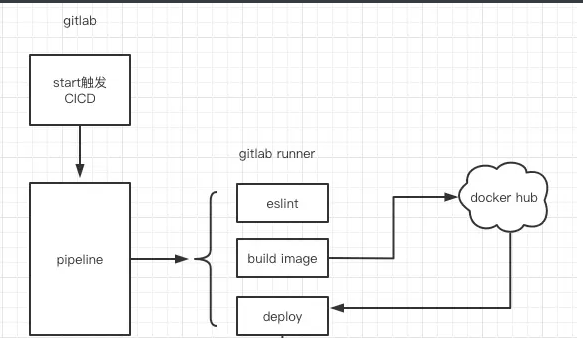

# GitLab CI入门及实践操作

## 前言

假如我们有一个项目，已经部署在服务器上面了，然后但是我们想要修改其中的一个页面的部分功能，我们需要做些什么事情呢？

- 先拉取gitlab上的代码
- 对代码进行修改开发
- 测试代码是否正常运行
- 打包我们的前端代码
- 将代码重新上传服务器【要是是第一次部署服务器，那你得在服务器上安装你的项目所需要的环境，比如node，还得维护环境】
- 在服务器上看代码是否正常运行
- 提交代码

这样一看，非常麻烦，但凡我们想要修改一点儿东西都得经历上述步骤，时间也浪费了，也没法保证每次提交服务器都是正常运行的。

所以我们有了GitLab CI,让我们关注于开发，而不是这些提交部署的流程，直接一键上传，自动部署

+++

## 1.什么是GitLab CI?

GitLab CI/CD是一个GitLab工具，是基于GitLab的CI/CD系统，用于持续方法进行软件开发，CI/CD就是一个流程（也称管道）

- 持续集成 (CI)：指的是，频繁地（一天多次）将代码集成到主干。
- 持续交付/持续部署 (CD):当开发人员在主分支合并一个提交时，这个分支将被构建，测试，如果一切顺利，则部署到生产环境中

从GitLab8.0开始，GitLab全面集成了GItLab-CI,且对所有项目默认开启。只要在项目仓库的根目录添加 `.gitlab-ci.yml` 文件，并且配置了 `Runner` （运行器），那么每一次合并请求（MR）或者 `push` 都会触发 `CI pipeline`

每次推送时，都要运行一系列脚本来构建、测试和验证代码更改，然后再将其合并到主分支中。持续交付和部署相当于更进一步的CI，可以在每次推送到仓库默认分支的同时将应用程序部署到生产环境。

意思是把测试、打包、发布都交给自动化的工具，提高效率，减少失误，开发人员只需要开发和提交代码到git就可以完成后续工作

## 2.基础概念

### （1）Pipelines

**是CI/CD的最上层组件**,就是流水线，一次`Pipeline` 其实相当于一次构建任务，可以包含安装依赖、运行测试、编译、部署等流程，任何提交或者Merge Request的合并都可以触发`Pipeline`

### （2）Stages

一次`Pipeline` 中可以有多个`Stages`,一个Stages失败，后面就都失败，构建`Pipeline`也就失败

```js
+--------------------------------------------------------+
|  Pipeline                                              |
|  +-----------+     +------------+      +------------+  |
|  |  Stage 1  |---->|   Stage 2  |----->|   Stage 3  |  |
|  +-----------+     +------------+      +------------+  |
+--------------------------------------------------------+
```

### （3）Jobs

job是任务，是GitLab CI中可以独立控制并运行的最小单位,一次提交可能完成一个或者多个job

一次`Stages` 中可以有多个`Jobs`,一个Jobs失败，后面就都失败，`Stages`也就失败,`Pipelines`也失败

```js
+------------------------------------------+
|  Stage 1                                 |
|  +---------+  +---------+  +---------+   |
|  |  Job 1  |  |  Job 2  |  |  Job 3  |   |
|  +---------+  +---------+  +---------+   |
+------------------------------------------+
```

### （4）Runners

Runner 是用来用执行Pipeline的应用，保证每次代码变更就根据`.gitlab-ci.yml`执行

**GitLab-Runner**是配合GitLab-CI进行使用的。GitLab里面的每一个工程都会定义一个属于这个工程的软件集成脚本，用来自动化地完成一些软件集成工作。

++++

在GitLab的项目上，侧边的CI/CD上可以看到上述的Pipelines和Jobs，可以看到项目pipelines和jobs的关系。


Pipelines和Stages和jobs的关系可以如下所示，一个pipelines可包含多个Stages,一个Stages可以包含多个Jobs，一旦其中一个失败，后续的都不会成功，但是如果某个任务设置为可以失败，那就可以继续运行


## 3.CI/CD发布流程



正常的发布流程可以包括检查样式-测试-构建-部署，但是可以根据项目的实际情况而定

触发CI/CD有多种方式，比如git tag 合并分支，调用api各种，可以配置.gitlab-ci.yml文件来达到你想要的效果

### **CICD的好处**

- 持续集成加快开发周期：让开发者的工作效率变高，减少代码检测的时间，交给自动化工具去实现
- 持续部署让发布频率变快，风险变低：容易发现问题，一旦构建哪一步出错，就可以在几秒钟几分钟内得到反馈进行修正
- 构建测试部署自动化，轻松应对代码变更，加速迭代
- 降低测试成本：语言可以检查编译错误，测试检查输入输出错误，CICD直接全部一次性检查，

## 4.GitLab CI/CD环境搭建及使用教程

如果要触发CI、CD，就需要一个可以用来执行pipeline的Runner,git runner 安装注册如下流程

```js
gitlab-runner是一个执行Gitlab CI/CD的应用，先注册gitlab-runner，然后配置的.gitlab-ci.yml的任务和指令就可以成功执行，然后再通过api将结果反馈Gitlab。
```

### （1）GitLab Runner分类

runner有下面三种分类，每种分类对应不同场景

- shared runners：共享runner 可以让当前gitlab仓库的所有项目共用，是gitlab管理员统一配置的runner，只要你在当前的gitlab中，就可以使用
- group runners：组runner 可以让组中的项目共用，在组cicd中注册
- Specific Runners：项目runner 仅可以在当前项目使用，在当前项目下配置

GitLab Runner在不同的类型中，我们所扮演的角色不同，权限不同，是否能看到runner也不一样，这个也需要进行安装和注册之后，才可以进行使用。

### （2）安装注册过程

[官网安装教程](https://docs.gitlab.com/runner/install/windows.html)：在windows上,选择64位


#### 1.以管理员身份安装

右键PowerShell，跳转到gitlab-runner.exe所在目录

```js
 .\gitlab-runner.exe install // 安装
  .\gitlab-runner.exe start // 运行
```

#### 2.注册新建runner

在不使用已经建好的shared runners和group runners情况下

注册新建新的runner，新建Specific Runners【仅在当前项目使用的runner】

```
.\gitlab-runner.exe register
```

要注册新建runner，需要url和token

url和token在gitlab项目里面的setting->CI/CD里面，找到Runners展开可查看


注册流程选项如下

成功之后会出现新的runner在这个Runners下面,注册成功之后就可以进行gitlab.yml文件的编写工作了，编写之前先学习常用的配置，看这些命令是什么意思。

###  （3）.gitlab-ci.yml常用配置学习

GitLab Runner准备就绪之后，就应该学习配置文件，知道如何编写配置文件达到运行的目的。

将.gitlab-ci.yml文件添加到存储库的根目录，并将GitLab项目配置为使用Runner，则每次提交或推送都会触发CI 管道。

常用命令如下

#### （1）Stages

用来定义pipeline的，比如发布（publish）之前需要进行lint、test、build，那这四个stage就构成一个pipeline

```js
stages
  - lint
  - test
  - build
  - publish
```

#### （2）Job

 假如我们需要看lint是否有错误,就加一个job进行判断，并写出该job属于哪个stage，一个stage可以有多个job

```js
job-lint: //任务名称
	stages:lint // 是哪个stage的
	script:npm run lint // 执行命令是什么
```

#### （3）variables

在`.gitlab-ci.yml`中定义变量，Jobs中定义的变量有作用域。

在跑一个job的时候，我们或许需要环境变量，或者不希望展示的东西，在variables下可以配置变量名和值，通常是需要保密的变量

```js
variables:
  TEST: "HELLO WORLD"
```

然后让这个变量被引用

```js
  script:    - echo $TEST  //执行打印变量TEST
```

#### （4）only/except

只希望在什么时候触发,不执行某项任务

```js
job-lint: // 任务名称	
	stages:lint // 是哪个stage的	
    script:npm run lint // 执行命令是什么	
    only:		
		-tags // 希望在打tag的时候触发    
    //或者    
        expect:/^hotfix-.+$/ // 不对某个文件进行lint
```

#### （5）when

什么时候执行什么当前job，默认值on_success，表示当前任务之前的任务全部执行成功，则执行当前工作，其他的常见属性有：on_failure,always,manual,delayed,never

```js
build_job:
  when: on_success // 当前面成功的时候，就执行
  stage: build
  needs: lint_job
```

#### （6）image

需要的docker镜像

```js
 image: node:12.18
```

#### （7）tags

定义执行该Job的runner，值为定义runner的tag，不写则无法执行

```js
job:
  tags:
    - hello //runner的名字
```

当前job会在对应名字的Runner中执行，如果已经有了其他的shared runners或者group runners,也可以直接使用，就不需要新建runner了

#### （8）script

script是Job的必选字段，用来写shell脚本，可以执行多个行命令

`before_script`、`after_script`分别在Job开始之前前和结束后执行的脚本，可以写在全局变量中

```js
job:
  before_script:
    - npm install
  script:
  	- npm install --registry=https://registry.npm.taobao.org
  	- npm run build
```

#### （9）cache、artifacts

cache：定义缓存文件或缓存文件夹

artifacts：可以在任务执行完毕后，缓存对应的资源，可以直接下载本地

```js
artifacts:    
	paths:      //执行任务完成之后，可以下载对应的dist文件
		- dist/ 
```

学习完.gitlab-ci.yml文件中的基本命令之后，进行一个项目实战，并结合上一篇文章中的docker进行使用，一举完成自动化构建部署。

## 5.GitLab CI+Docker+GitLab Runner自动化部署

有了前期的docker基础，有了Dockerfile文件，编写`.gitlab-ci.yml`文件

### （1）`.gitlab-ci.yml`文件示例

```js
image: node:alpine //使用的docker镜像

stages: //两个stages，build和push
  - build
  - push

cache: //定义缓存文件夹，缓存node_modules包
  paths:
    - node_modules/
    - packages/font/node_modules/
    - packages/back/node_modules/

install:// 前端项目build
    stage: build
    script: // script里面写执行的命令
      - yarn install // 安装依赖
      - cd packages/font //进入前端目录
      - npm run build //打包前端项目
    only: //主分支提交的时候该job运行
      - master
    tags: // 在名字是shell的runner上
      - shell
    artifacts:// 在这个job完成之后可以下载packages/back/page文件
      paths:
        - packages/back/page


docker-image: // 上传docker
  stage: build
  script:
    - docker image build ./ -t file_upload:$CI_COMMIT_REF_NAME // 新建docker镜像 名字是file_upload:tag名字
  only:
    - tags // 在打tag的时候执行该job
  tags:
    - shell

docker-push:// 部署到远程私有仓库
  stage: push 
  script:
    - docker login 远程接口地址 -u 账号名 -p 密码 //登录远程仓库
    - docker tag file_upload:$CI_COMMIT_REF_NAME 远程仓库接口地址/node/fileupload:$CI_COMMIT_REF_NAME // 给docker镜像打tag
    - docker push 远程仓库接口地址/node/fileupload:$CI_COMMIT_REF_NAME //上传到远程仓库
    - docker rmi 远程仓库接口地址/node/fileupload:$CI_COMMIT_REF_NAME //删除本地的镜像
  only:
    - tags
  tags:
    - shell //在哪个runner上运行，这个是runner的名字
```

写好`.gitlab-ci.yml`文件和Dockerfile文件之后，相当于Docker和GitLab CI都已经准确就绪，现在上传代码到GitLab,就可以自动化构建和检测代码这些了

其中的构建流程全是靠`.gitlab-ci.yml`文件实现的，所以需要会写`.gitlab-ci.yml`文件

### （2）遇到的问题

在新的 WIN10 机器上安装带有 shell 执行器（即 powershell）的 gitlab-runner 并启动 CI 构建会引发以下错误


修改config.toml文件

```js
// 修改
[[runners]]
  name = "ci-runner"
  url = "http://xxx.yyy.xx/"
  token = "XXXXX"
  executor = "shell"
  shell = "pwsh"
// 成为
[[runners]]
  name = "ci-runner"
  url = "http://xxx.yyy.xx/"
  token = "XXXXX"
  executor = "shell"
  shell = "powershell"
```

### （3）总结

我们要进行CI /CD，就需要一个可以用来执行pipeline的Runner，所以安装注册了GitLab Runner，然后编写`.gitlab-ci.yml`文件达到自动化构建的目的，如果

## 6.参考资料

（1）[基于 GitLab CI 搭建前端自动构建环境](https://juejin.cn/post/6844903637320368135)

（2）[基于 GitLab CI/CD 的前端自动化构建、发布实践](https://juejin.cn/post/6844903877695766542)

（3）[Install GitLab Runner on Windows](https://docs.gitlab.com/runner/install/windows.html)

（4）[gitlab CI/CD](https://docs.gitlab.com/ee/ci/)

