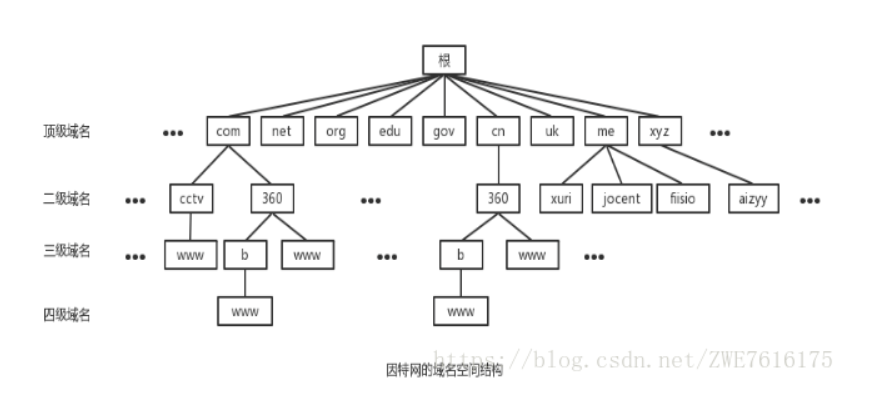
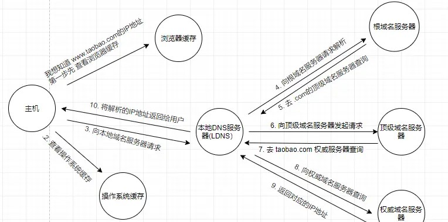
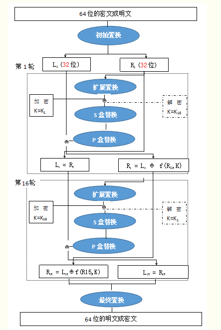
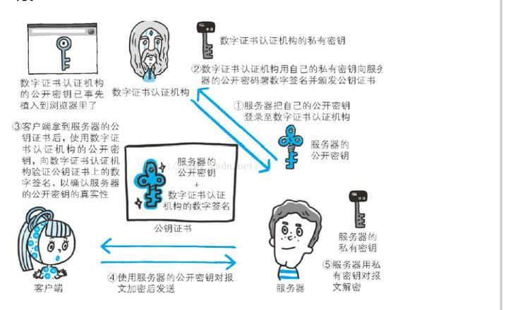
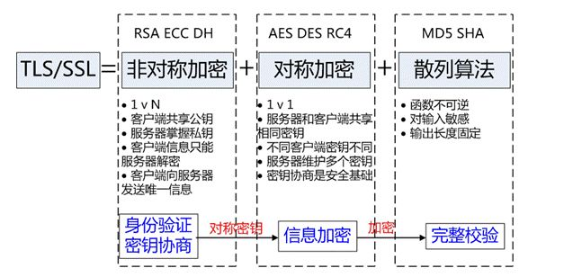
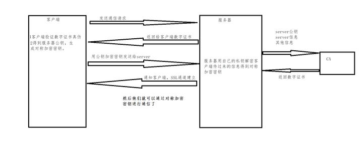
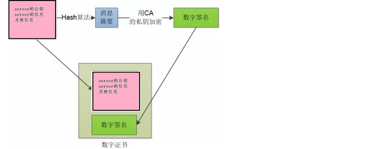

# HTTPS加密原理及加密算法

https是什么？(要知道https是什么，先掌握http是什么)

## （1）认识http

 	定义：超文本传输协议（http，hypertext transfer protocol) ， 它指定了客户端可能发送给服务器什么样的消息以及得到什么样的响应，所有的WWW文件都必须遵守这个标准。设计HTTP最初的目的是为了提供一种发布和接收HTML页面的方法。 

HTTP协议通过请求/响应的方式，在客户端和服务端之间进行通信。

### 1.简要过程

（举个🌰当你输入一个url进行页面访问的时候， 比如访问百度http://www.baidu.com ）

**scheme://hostname[:port]/path/filename？name=xxx&id=xxx#ch**

服务类型(HTTP或者HTTPS)://主机名(域名/ip):端口号/文件路径/资源名称?参数=参数值#片段标志符**（http协议的端口为80，https的端口为443）

访问过程：

1. 使用DNS域名解析（域名和服务器IP对应关系保存在hosts文件中），找到对应服务器IP
2. 发起TCP（传输连接协议）**三次握手**建立连接（ 建立连接三次🤝 ）
3. 建立tcp连接后发起请求(包括端口路径，请求参数和各种信息)								
4. 服务器响应（response）http请求（浏览器获取HTML页面
5. 浏览器解析html代码，并请求相关css,js和图片资源
6. 浏览器渲染页面
7. 释放连接四次👋

总结：浏览器缓存----->DNS解析------->TCP连接------->服务器请求和响应------->DOM树渲染------>TCP释放连接

### 2.知识补充

##### (1)DNS（域名系统）

在www.baidu.com`的域名中，`com`成为顶级域名，`baidu称为2级域名，`www`称为3级域名





如果某个用户正在用浏览器www.baidu.com`的网址，当你敲下回车键的一瞬间：

\- 1、检查**浏览器缓存**中是否存在该域名与IP地址的映射关系，如果有则解析结束，没有则继续
\- 2、到**系统本地**查找映射关系，一般在`hosts`文件中，如果有则解析结束，否则继续
\- 3、到**本地域名服务器**去查询，有则结束，否则继续
\- 4、**本地域名服务器**查询**根域名服务器**，该过程并不会返回映射关系，只会告诉你去下级服务器(顶级域名服务器)查询
\- 5、**本地域名服务器**查询**顶级域名服务器**(即`com`服务器)，同样不会返回映射关系，只会引导你去二级域名服务器查询
\- 6、**本地域名服务器**查询**二级域名服务器**(即`baidu.com`服务器)，引导去三级域名服务器查询
\- 7、**本地域名服务器**查询**三级域名服务器**(即www.baidu.com`服务器)，此时已经是最后一级了，如果有则返回映射关系，则**本地域名服务器**加入自身的映射表中，方便下次查询或其他用户查找，同时返回给该用户的计算机，没有找到则网页报错
\- 8、如果还有下级服务器，则依此方法进行查询，直至返回映射关系或报错 

根服务器获对应顶级域名的ip，然后再逐级从定义域名ip向下查找各个下属域服务的，找到完整的域名ip。这是一个迭代查询的过程 ，是一个 **由近及远的过程，采取就近原则，再自顶向下搜索** 

#####  (2)tcp建立连接（三次🤝）


相当于：A：你听得到吗？B:我听得到，你听得到吗？A：我听得到

**思考：为什么不是四次握手或者两次握手？**

不是两次握手的原因：为了防止失效的连接请求报文段突然又传送到主机B，因而产生错误。失效的连接请求报文段是指：主机A发出的连接请求没有收到主机B的确认，于是经过一段时间后，主机A又重新向主机B发送连接请求，且建立成功，顺序完成数据传输。考虑这样一种特殊情况，主机A第一次发送的连接请求并没有丢失，而是因为网络节点导致延迟达到主机B，主机B以为是主机A又发起的新连接，于是主机B同意连接，并向主机A发回确认，但是此时主机A根本不会理会，主机B就一直在等待主机A发送数据，导致主机B的资源浪费。（这就是缺少第三次握手(A再给B确认））

**TCP连接和HTTP请求之间的联系？**

HTTP是比TCP更高层次的应用层协议，根据规则，只有低层协议建立之后才能，才能进行更高层协议的连接，因此，首先要建立TCP连接，一般TCP连接的端口号是80

一个TCP连接可发送多个HTTP请求，可保持TCP连接，一个 TCP 连接中 HTTP 请求依次发送。

**浏览器是如何提高页面加载效率的呢？**

1. 维持和服务器已经建立的 TCP 连接，在同一连接上顺序处理多个请求。
2. 和服务器建立多个 TCP 连接。

##### (3)tcp四次挥手👋

　　	A:我没有数据发给你了，你如果还有数据发给我，就继续发吧B：我知道了，我发完了告诉你B：我也发完了，你可以关了	A：我知道了，我断开了，可以确认断开了	

## （2）认识https

​	定义： HTTPS（全称： Hyper Text Transfer Protocol over SecureSocket Layer，超文本传输安全协议），是以安全为目标的HTTP通道，简单讲是HTTP的安全版。 

## （3）为什么要用https？

**就是因为http不安全**(DNS欺骗，ARP欺骗)

在 HTTP协议通过请求/响应的方式，在客户端和服务端之间进行通信，他们之间**没有任何身份确认**的过程，**数据全部明文传输**【报文不是二进制而是文本】，所以很容易被攻击被窃取，被替换，被修改

http缺点：明文不加密（会被窃听）【加密算法】，不验证身份（可能被伪装）【数字证书】，不验证信息完整（可能被修改）【数字签名】

### 1.ARP（将IP地址映射成物理地址）欺骗：

ARP缺点：当收到ARP应答包后，不会去验证自己是否向对方主机发送过ARP请求包，就直接把这个返回包中的IP地址与MAC地址的对应关系保存进ARP缓存表中，如果原有相同IP对应关系，则原有的会被替换。

```
1、单项欺骗
A、B、C三个人，A与C正常通信，
B想知道A给C发的内容，
就伪造ARP响应包，更改A的ARP表，所以A发送给C的信息会先传送到B，B可以丢弃数据包，这样C就收不到A发的数据了，但是C还是可以正常给A发送数据的，这就是单项欺骗
2.双向欺骗
同样是A、B、C三个人，B同时给A、C发送响应包
B告诉A它的ip是C的ip，Mac地址还是B的，
告诉C它的ip是自己的，Mac地址是A的，这样A、C的通信就都会经过B，这就叫双向欺骗
3.区别
单向欺骗:是指欺骗网关
双向欺骗:是欺骗网关跟被攻击的两个机器
```

预防措施：

- 在主机上静态绑定MAC地址

- 在主机上设置ARP防火墙

- 利用交换机的房ARP欺骗技术，比如DAI

### 2.DNS(域名解析成对应IP)欺骗

```
首先欺骗者向目标机器发送构造好的ARP应答数据包，ARP欺骗成功后，嗅探到对方发出的DNS请求数据包，分析数据包取得ID和端口号后，向目标发送自己构造好的一个DNS返回包，对方收到DNS应答包后，发现ID和端口号全部正确，即把返回数据包中的域名和对应的IP地址保存进DNS缓存表中，而后来的当真实的DNS应答包返回时则被丢弃。
```

防御措施：

有效防止DNS欺骗攻击的方法就是禁用VPS服务器DNS缓存

- 启动注册表编辑器(Regedit.exe)；　　
- 在以下注册表项中找到MaxCacheEntryTtlLimit值：HKEY_LOCAL_MACHINE\SYSTEM\CurrentControlSet\Services\Dnscache\Parameters；　　
- 在编辑菜单上，单击修改，键入数值1并确定；　　
- 后退出注册表编辑器。　　

保护内部设备、不要过分依赖DNS、定时检查[服务器安全](http://vps.zzidc.com/VPSjianjie/504.html)以及使用DNSSEC替代DNS等

## （4）加密方式

​	为了保证消息的可靠，所以我们需要对明文进行加密

### 1.对称加密

单密钥加密：公用一个密钥来对消息进行加密解密，客户端和服务器约定好一个加密的密钥，然后通过密钥对信息进行加密，然后传输，然后解密

常见对称加密算法DES，AES

**DES算法：数据加密标准**

 以64比特的明文为一个单位来进行加密的 ， 超过64比特的数据要求64比特的大小分组 ， DES使用的密钥长度为64比特，但由于每隔7个比特设置一个奇偶校验位（检验错误），因此其密钥长度实际为56比特 。

算法简单过程

（1）明文数据分组，每组8字节（64位）

（2）初始置换，分成L0,R0两部分（每部分32位，根据置换规则表置换）

（3）64位明文，进行了16轮相同的加密过程，在运算过程中数据和密钥结合

大致是Ln=Rn-1（第一轮L1=R0，原来的右半部分成为新的左半部分）;

​			 Rn = L(n - 1)⊕f(Rn-1,kn) （第一轮R1=L0⊕f(R0,K1)，左边部分经过F函数后进行异或成为新的右边部分)

​			注：f是以Rn-1和Kn为参数输出的32位函数，Kn是第N层输入的48位密钥

（3.1)f函数的四步运算：密钥置换（Kn的生成），扩展置换，s-盒置换；p-盒置换

​		(3.1.1)密钥置换（两种置换规则PC-1，PC-2）

​				奇偶校验位不算，剩56位，pc-1将56位分为28位的两部分

​				将28位的两部分进行循环左移，每轮循环左移的位数按照轮数来,然后置换完之后合并（然后去掉8位，9 18 22 25 35 38 43 54变成48位，）再通过pc-2置换生成子密钥

​		(3.1.2)扩展运算

​			数据右半部分（Rn）从32位扩展到48位，改变了位置次序，重复了一些位

​			然后数据48位和子密钥（Kn）进行异或

​		(3.1.3)s-盒置换

​			把48位数据变成32位

​			 代替运算由8个不同的代替盒(S盒)完成 ， 经过S-盒代替，形成8个4位分组结果。 

​		(3.1.4)p-盒置换		

​			将上面的32位输出作为p盒置换的输入

​			然后将每个输入映射到输出

​			输出结果和左半部分Ln异或

​			然后左右不分交换，进行下一轮迭代

​			 Ln = Rn-1； Rn = Ln-1 ⊕ f (Rn-1 , Kn-1) 

（4）逆置换

​		加密后的L16和R16作为输入块，进行逆置换得到最终密文输出（逆置换就是**初始置换的逆运算**） 

 加密是秘钥循环左移，解密是秘钥循环右移 



虽然感觉使用密钥加密之后还蛮安全的，但是我们虽然对消息进行了加密，但是最开始客户端和服务端进行密钥约定的时候，还是使用的明文，就很容易密钥也被泄露，中间人得到了密钥，依然可以对消息进行读取。

### 2.非对称加密

（加密解密使用的是不同的密钥，所以是非对称）：（一组密钥，一个公钥，一个私钥，并且只知道公钥无法推断出私钥，而且 **通过公钥加密的内容，只有私钥才可以解开，而通过私钥加密的内容，只有公钥才可以解开。** ）


小红生成一对密钥，一公一私。发过去公钥key1

然后现在小灰有了小红的公钥key1,小灰自己生成一个密钥key2（公钥），用key1对key2进行加密，发给小红

小红现在使用自己的密钥，解开了公钥key1,然后有了key2，然后，就可以使用key2进行加密通信了。

相同的，小灰要和小红通信也是一样的。

常见非对称加密算法RSA，DSA

**RSA算法：（涉及n,e1,e2三个参数）**

原理：(将两个大质数相乘十分容易，但是想要对其乘积进行因式分解却极其困难，因此可以将乘积公开作为加密密钥。)

（1）两个很大的质数p,q，n=p*q,n的二进制表示密钥长度

（2） **欧拉函数** φ(n)是小于或等于n的正整数中与*n*互质（整数之间最大公约数为1）的数的数目。 

​			 *r = φ(N) = φ(p)φ(q) = (p-1)(q-1)*。 （举个🌰， *φ(5) = 4*，因为*1,2,3,4*均和*5*互质 ）

（3）e1,e2相关

​			e1可以随意取和r互质的数，e2要求(e2*e1)mod(r）=1。（n，e1),(n，e2)就是密钥对。其中(n，e1)为公钥，(n，e2)为私钥。 

​			e2这个元素很关键，我们知道了n,e1，在传递过程中，那怎么知道e2,那就需要知道p,q,然后就需要因式分解n.

RSA加解密算法完全一样， 设A为明文，B为密文，则：A=B^e2 mod n；B=A^e1 mod n 

这个好像是比对称的更好了，但是，加密解密过程更复杂，更慢了。但是如果中间人得到了小红的公钥key1呢？

### 3.数字证书和数字签名

如上所说，为了解决公钥来源的不安全性，引入第三方 数字证书认证中心（CA） 

服务器可以向CA来申请数字证书

小红：拿着公钥key1和其他信息去CA申请数字证书

CA：

（CA公钥公开，私钥特别保护，CA拿到信息之后，使用单向hash算法，比如常见的MD5，对信息进行加密，加密后称为摘要，CA私钥对摘要进行加密变成数字签名，数字签名和各种信息合在一起成为数字证书）

小红：把证书发给小灰

小灰：验证证书真假（ **各大浏览器和操作系统已经维护了所有权威证书机构的名称和公钥** ），去看是哪个机构，然后从本地拿到机构的公钥解密数字签名，然后按照相同的规则小灰把其他的信息（不是摘要）也生成一信息摘要，摘要一致，证书有效，然后从解码的信息中得到小红的公钥key1

A1:公钥，123:其他信息(时间 host各种需要的信息) ，C2:CA私钥

A1（123）---> CA        C2(MD5(A1+123))+A1+123+MD5  最后对比MD5(A1+123)是否一致

 小灰：然后自己生成的公钥key2，使用小红的公钥加密key2，发给小红，小红用自己的私钥解开得到key2，然后进行通信



**无法篡改的原因？**

1.拿到证书，如果伪造证书，但是你没有CA的密钥C2

2.如果直接使用原数据，可以解密后看数据，证书里面是有host的，如果你的网站的host和证书不一致，也不行

### 4.单向加密算法
​        只能单向对明文进行加密，而不能逆向通过密文得到明文。不需要使用密钥。因为没有密钥，所以就无法通过密文得到明文。

         MD5,全称Message Digest Algorithm 5，翻译过来就是消息摘要算法第5版，是计算机安全领域广泛使用的一种散列函数，用于确保信息传输的完整性,是一种单向加密算法，一种不可逆的加密方式。MD5值长度固定为128位
    
        1. 原文处理
    
           如果原文.length%512!=448,需要填充使得求余等于448， 填充的方法是第一位填充1，其余位填充0。填充完后，信息的长度就是512*N+448。 然后剩余的位数512-448记录原文长度，把长度二进制放在后面，最后的信息为512（n+1）
    
        2. 设置初始值
    
             MD5的哈希结果长度为128位，按每32位分成一组共4组。  4组结果是由4个初始值A、B、C、D经过不断演变得到 ,这四个值是官方设置的。
    
        3. 循环加工ABCD
    
           循环次数：原文.length/512,然后每次循环里面有64次子循环，上图是一次子循环
    
           F：线性函数四种，交替使用
    
           红色田：相加
    
           Mi:处理后的原文，每份512/16=32，子循环里面循环使用一小份
    
           Ki:常量，每次循环不同
      
        4. 拼接ABCD

## （5）https原理

### 1.HTTPS是什么？

  	https将如上的技术整合，达到性能和安全的最大化，（整合技术称为SSL（ Secure Scoket Layer 安全套接层 ）），所以https不是新的协议，而是http穿上了外套。

HTTP+ 加密 + 认证 + 完整性保护 =HTTPS

HTTP+SSL = HTTPS



  https使用： 提供了消息安全传输的通道，但是每次消息的加解密十分耗时，消息系统资源 ，然后购买证书也很贵 在一些对安全性比较高的场景下，比如银行系统，购物系统中我们必须要使用https进行通信，其他一些对安全性要求不高的场景，我们其实没必要使用https。 

非对称加密对比于对称加密来说，处理速度慢，但是更安全，所以两者加起来，使用非对称加密的加密方式获得对称加密中要使用到的密钥，然后对称加密的速度更快。

### 2.https协议的缺点

https握手阶段比较费时，会使页面加载时间延长50%，增加10%~20%的耗电。

https缓存不如http高效，会增加数据开销。

SSL证书也需要钱，功能越强大的证书费用越高。

SSL证书需要绑定IP，不能再同一个ip上绑定多个域名，ipv4资源支持不了这种消耗。

### 3.知识补充

SSL（Secure Socket Layer，安全套接字层）/TLS(Transport Layer Security，传输层安全协议)介绍

#### （1）SSL的基本概念

**TLS 是以SSL 为原型开发的协议，有时会统一称该协议为 SSL。***当前主流的版本是SSL3.0 和 TLS1.0

SSL位于应用层和传输层之间，所以可以为任何基于TCP等可靠连接的应用层协议提供安全性保证，用于Web浏览器和服务器之间的身份认证和加密数据传输.

SSL{SSL记录层：位于可靠的传输之上（比如TCP），提供压缩，认证，加密等功能

​		SSL握手层：位于ssl记录层之上，提供数据传输前的身份验证，协商算法，交换密钥等功能。}

#### （2）SSL/TLS握手阶段（建立通信连接）

（1）浏览器发出加密通信的请求（ClientHello）

```
提供的信息如下
（1） 支持的协议版本，比如TLS 1.0版。
（2） 一个客户端生成的随机数，稍后用于生成"对话密钥"。
（3） 支持的加密方法，比如RSA公钥加密。
（4） 支持的压缩方法。
```

通常一台服务器只能有一张数字证书:客户端发送的信息之中不包括服务器的域名,后来加入扩展

（2）服务器回应（SeverHello）

```
（1） 确认使用的加密通信协议版本，比如TLS 1.0版本。如果浏览器与服务器支持的版本不一致，服务器关闭加密通信。
（2） 一个服务器生成的随机数，稍后用于生成"对话密钥"。
（3） 确认使用的加密方法，比如RSA公钥加密。
（4） 服务器证书（数字证书和公钥）。
```

（3）4.3 客户端回应（检验证书是否正确可信任，没有问题，取出公钥）

```
（1） 一个随机数。该随机数用服务器公钥加密，防止被窃听。
（2） 编码改变通知，表示随后的信息都将用双方商定的加密方法和密钥发送。
（3） 客户端握手结束通知，表示客户端的握手阶段已经结束。这一项同时也是前面发送的所有内容的hash值，用来供服务器校验。
```

（4）4.4 服务器的最后回应

```
(1)编码改变通知，表示随后的信息都将用双方商定的加密方法和密钥发送。
(2)服务器握手结束通知，表示服务器的握手阶段已经结束。这一项同时也是前面发送的所有内容的hash值，用来供客户端校验。
```

**思考：加密信息进行通信处理速度变慢问题？**

但是？当使用SSL时，处理速度会变慢

- 通信慢：在HTTP的基础上，必须进行SSL通信，整体通信量增加
- 由于大量消耗CPU资源及内存等资源，处理速度变慢：SSL加密处理，消耗更多资源。

```
**每次使用公钥加密计算量太大，如何减少耗用的时间？**
解决方法：每一次对话（session），客户端和服务器端都生成一个"对话密钥"（session key），用它来加密信息。由于"对话密钥"是对称加密，所以运算速度非常快，而服务器公钥只用于加密"对话密钥"本身，这样就减少了加密运算的消耗时间。
```

#### （3）SSL/TLS协议提供的服务主要有：

- 认证用户和服务器，确保数据发送到正确的客户机和服务器；
- 加密数据以防止数据中途被窃取；
- 维护数据的完整性，确保数据在传输过程中不被改变。

基本思路：公钥加密

客户端先向服务器端索要公钥，然后用公钥加密信息，服务器收到密文后，用自己的私钥解密

公钥放在数字证书中，证书可信，公钥即可信

## (6)总结-两张图





## (7)参考资料

1.[tcp三次握手，四次挥手](https://blog.csdn.net/qq_38950316/article/details/81087809)

2.[TLS/SSL工作原理](https://blog.csdn.net/huakai_sun/article/details/79802539)

3.[深入理解HTTPS工作原理](https://juejin.cn/post/6844903830916694030)

4.《图解HTTP》

