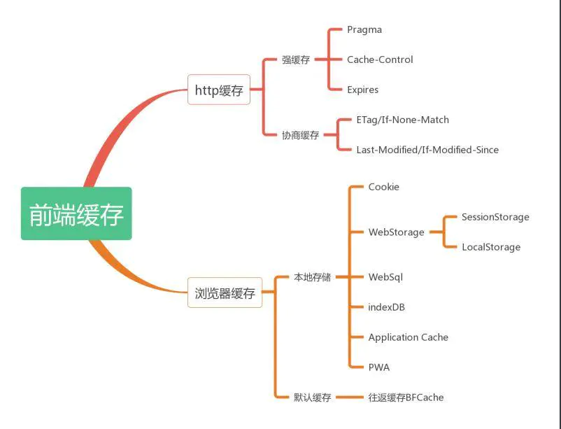
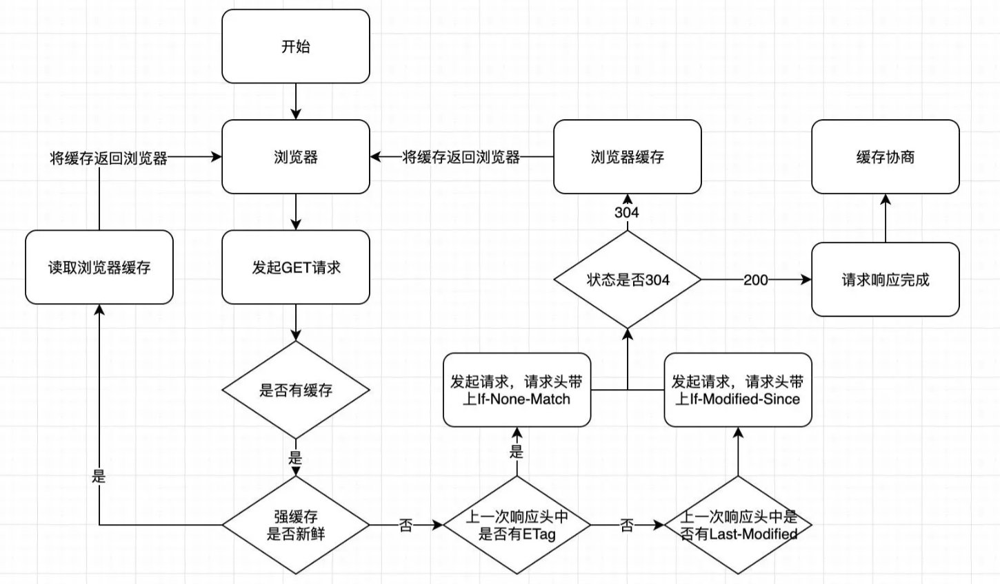
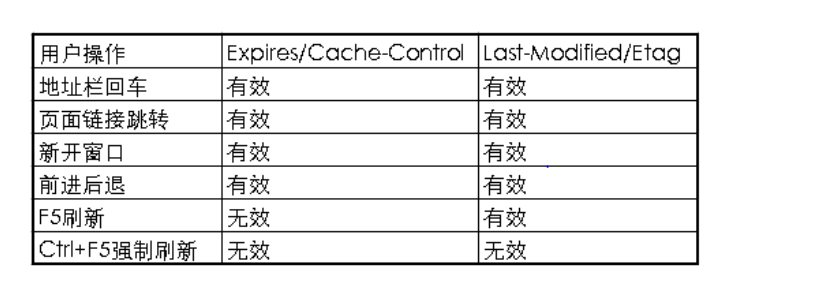

# http缓存

## 1.响应和请求

HTTP协议通过请求/响应的方式，在客户端和服务端之间进行通信。

HTTP报文就是浏览器和服务器通信时发送和响应的数据块，发送request报名，返回response报文

## 2.报文

### （1）报文内容

报文分为两部分：报文头部+数据主体

报文头部：一些附加信息（cookie，缓存信息等），与缓存相关的规则信息，均包含在头部中

数据主体：要传输的数据内容

**请求报文**：由`请求行`、`请求头`、`空行`、`请求体`四部分组成

```js
请求行：方法 + 路径 + http版本 # GET /home HTTP/1.1
请求头：https://kb.cnblogs.com/page/92320/ # 详情可见链接
空行：用来区分头部和具体数据
请求头：请求的参数
```

**响应报文**：由`状态行`、`响应头`、`空行`、`响应体`四部分组成

```js
状态行：http版本、状态码和原因 # HTTP/1.1 200 OK
响应头：https://kb.cnblogs.com/page/92320/ # 详情可见链接
空行：用来区分头部和具体数据
响应体：服务端返回的数据
```

如果在头部中间加入空行，那空行后面的内容都会被认为是实体

### （2）与缓存有关的报文头部

其他报文头部详情可见链接https://kb.cnblogs.com/page/92320/

Request部分

| Header              | 示例                                               | 解释                                                         |
| ------------------- | -------------------------------------------------- | ------------------------------------------------------------ |
| Cache-Control       | Cache-Control: no-cache                            | 指定请求和响应遵循的缓存机制                                 |
| Pragma              | Pragma: no-cache                                   | 用来包含实现特定的指令                                       |
| If-Match            | If-Match: “737060cd8c284d8af7ad3082f209582d”       | 只有请求内容与实体相匹配才有效                               |
| If-Modified-Since   | If-Modified-Since: Sat, 29 Oct 2010 19:43:31 GMT   | 如果请求的部分在指定时间之后被修改则请求成功，未被修改则返回304代码 |
| If-None-Match       | If-None-Match: “737060cd8c284d8af7ad3082f209582d”  | 如果内容未改变返回304代码，参数为服务器先前发送的Etag，与服务器回应的Etag比较判断是否改变 |
| If-Range            | If-Range: “737060cd8c284d8af7ad3082f209582d”       | 如果实体未改变，服务器发送客户端丢失的部分，否则发送整个实体。参数也为Etag |
| If-Unmodified-Since | If-Unmodified-Since: Sat, 29 Oct 2010 19:43:31 GMT | 只在实体在指定时间之后未被修改才请求成功                     |

Response部分

| Header        | 示例                                         | 解释                       |
| ------------- | -------------------------------------------- | -------------------------- |
| ETag          | ETag: “737060cd8c284d8af7ad3082f209582d”     | 请求变量的实体标签的当前值 |
| Expires       | Expires: Thu, 01 Dec 2010 16:00:00 GMT       | 响应过期的日期和时间       |
| Last-Modified | Last-Modified: Tue, 15 Nov 2010 12:45:26 GMT | 请求资源的最后修改时间     |

## 3.什么是HTTP缓存？

当客户端想要获取资源时，先会从浏览器缓存获取资源，如果浏览器缓存中没有，再去找服务器请求资源

前端缓存有http缓存和浏览器缓存，见下图



常见的http缓存只能缓存get请求响应的资源

http缓存都是从第二次请求开始的。第一次请求资源时，服务器返回资源，并在respone header头中回传资源的缓存参数；

第二次请求时，浏览器判断这些请求参数，命中强缓存就直接从本地取出来用，否则 就把请求参数加到request header头中传给服务器，看是否命中协商缓存，命中则返回304，否则服务器会返回新的资源。



## 4.强缓存

命中强缓存就直接读取浏览器本地的资源。控制强缓存的字段有 Expires、Cache-Control 和 Pragma

### （1）**Expires**

指服务器返回文件有效期，如果当前系统时间大于了这个时间，就缓存失效

存在问题：当系统时间和服务器时间不一致的时候，会有缓存有效期不准的问题，在强缓存的三个字段中，优先级最低

### （2）**Cache-Control**

定义其缓存策略

1.max-age:单位是s，设置文件最大缓存时间，用得最多，在这个时间内均使用本地缓存，不再向服务器发起请求。

2.public:缓存可以被多用户共享，例如360浏览器可以登录不同账号，电脑系统可以切换不同账号，可以被中间代理、CDN缓存。

3.private:仅单用户私有，不被多用户共享。

4.no-cache:不使用强缓存。

5.no-store:不允许被存储，包括强缓存和协商缓存，直接向服务器请求最新资源。

6.must-revalidate:在缓存过期前可以使用，过期后必须向服务器验证

### （3）Pragma

只有一个属性值，no-cache,也是不使用强缓存，必须向服务器进行验证，优先级最高

但是如果在xxx秒内，服务器上面的资源更新了，客户端在没有强制刷新的情况下，看到的内容还是旧的。如果说你不着急，可以接受这样的，那是不是完美？然而，很多时候不是你想的那么简单的，如果发布新版本的时候，后台接口也同步更新了有缓存的用户还在使用旧接口，而那个接口已经被后台干掉了。怎么办？

## 5.协商缓存

强缓存失效或者不被允许的时候，就走协商缓存，去服务器进行验证，控制协商缓存的字段有Etag、 Last-Modified、If-Modified-Since、 If-None-Match 

### （1）ETag/If-None-Match

```js
文件内容标识字段：//是否有变化

Response：`E-tag`
Request：`If-None-Match`
```

值是代表资源的hash码，一旦资源变化，hash码随之改变，通过请求头里面的If-None-Match与当前文件的hash码进行比较，如果相等则命中协商缓存，然后根据文件差异决定是否返回，Etag有强弱校验之分，如果是弱校验（Etag值开头是“W/”）,只有服务器上的文件差异能触发hash值后缀变化的时候，才会真的请求资源

### （2）Last-Modified/If-Modified-Since

```js
文件最后修改时间字段：//最后修改时间

Response：`Last-Modified`
Request：`If-Modified-Since`
```

代表的是文件的最后修改时间，第一次请求服务端会把资源的最后修改时间放到 Last-Modified 响应头中，第二次发起请求的时候，请求头会带上上一次响应头中的 Last-Modified 的时间，并放到 If-Modified-Since 请求头属性中，服务端根据文件最后一次修改时间和 If-Modified-Since 的值进行比较，如果相等，返回 304 ，并加载浏览器缓存。

协商缓存的最大问题就是每次都要向服务器验证一下缓存的有效性，但是如果每次都去请求服务器才知道是否有效，那缓存就没有什么意义

## 6.最佳实践

缓存的意义就在于减少请求，更多地使用本地的资源，给用户更好的体验的同时，也减轻服务器压力。

所以我们应该尽量命中强缓存，同时服务端更新的时候能够让客户端的缓存失效，为了让用户第一时间拿到最新的资源文件，在服务端更新的时候，顺带把静态资源的路径也修改了，这样客户端拿到的就一直是最新的

webpack可以让我们在打包的时候，可以在文件的命名上带上hash值。

```js
entry:{
    main: path.join(__dirname,'./main.js'),
    vendor: ['react', 'antd']
},
output:{
    path:path.join(__dirname,'./dist'),
    publicPath: '/dist/',
    filname: 'bundle.[chunkhash].js'
}
```

```
HTML:使用协商缓存
CSS&JS&图片：使用强缓存，文件命名带上hash值
```

webpack给我们提供了三种哈希值计算方式，分别是hash、chunkhash和contenthash

hash：跟整个项目的构建相关，构建生成的文件hash值都是一样的，只要项目里有文件更改，整个项目构建的hash值都会更改。

chunkhash：根据不同的入口文件(Entry)进行依赖文件解析、构建对应的chunk，生成对应的hash值。

contenthash：由文件内容产生的hash值，内容不同产生的contenthash值也不一样。

一般使用chunkhash和contenthash

### （1）Etag生成源码简读

所以etag带上的hash是文件生成的

```js
//Nginx官方默认的ETag计算方式是为"文件最后修改时间16进制-文件长度16进制"。例：ETag： “59e72c84-2404”
//Express框架使用了serve-static中间件来配置缓存方案，其中，使用了一个叫etag的npm包来实现etag计算。从其源码可以看出，有两种计算方式
/*一是使用文件大小和修改时间*/
function stattag (stat) {
  var mtime = stat.mtime.getTime().toString(16)
  var size = stat.size.toString(16)
  return '"' + size + '-' + mtime + '"'
}
/*二是使用文件内容的hash值和内容长度*/
function entitytag (entity) {
  if (entity.length === 0) {
    // fast-path empty
    return '"0-2jmj7l5rSw0yVb/vlWAYkK/YBwk"'
  }

  // compute hash of entity
  var hash = crypto
    .createHash('sha1')
    .update(entity, 'utf8')
    .digest('base64')
    .substring(0, 27)

  // compute length of entity
  var len = typeof entity === 'string'
    ? Buffer.byteLength(entity, 'utf8')
    : entity.length

  return '"' + len.toString(16) + '-' + hash + '"'
}
```

## 7.问题

### （1）有了last-modified为什么还要Etag？

解决几个问题：1.文件周期性更改，但是文件内容并不修改，只改变了时间，所以我们并不希望客户端认为这个文件被修改

2.文件修改频繁，比如一秒修改很多次，但是last-modified-Since检查不精确，它只检查到秒

3.某些服务器不能精确的得到文件最后的修改时间

### （2）ETag和Lst-Modified谁优先？fresh源码简读

```js
//在Express中，使用了fresh这个包来判断是否是最新的资源
function fresh (reqHeaders, resHeaders) {
  // fields
  var modifiedSince = reqHeaders['if-modified-since']
  var noneMatch = reqHeaders['if-none-match']

  // unconditional request
  if (!modifiedSince && !noneMatch) {//如果不是协商缓存
    return false
  }

  // Always return stale when Cache-Control: no-cache
  // to support end-to-end reload requests
  // https://tools.ietf.org/html/rfc2616#section-14.9.4
  var cacheControl = reqHeaders['cache-control']
  if (cacheControl && CACHE_CONTROL_NO_CACHE_REGEXP.test(cacheControl)) {
    return false
  }

  // if-none-match
  if (noneMatch && noneMatch !== '*') {
    var etag = resHeaders['etag']

    if (!etag) {
      return false
    }

    var etagStale = true
    var matches = parseTokenList(noneMatch)
    for (var i = 0; i < matches.length; i++) {
      var match = matches[i]
      if (match === etag || match === 'W/' + etag || 'W/' + match === etag) {//Etag有强弱校验之分，如果是弱校验（Etag值开头是“W/”）,只有服务器上的文件差异能触发hash值后缀变化的时候，才会真的请求资源
        etagStale = false
        break
      }
    }

    if (etagStale) {
      return false
    }
  }

  // if-modified-since
  if (modifiedSince) {
    var lastModified = resHeaders['last-modified']
    var modifiedStale = !lastModified || !(parseHttpDate(lastModified) <= parseHttpDate(modifiedSince))

    if (modifiedStale) {
      return false
    }
  }

  return true//走304
}
```

如果不是强制刷新，而且请求头带上了if-modified-since和if-none-match两个字段，则先判断Etag，然后再验证Last-Modified，最后才决定是否返回304；

### （3）用户行为对缓存的影响如下



强缓存如何重新加载缓存过的资源

**通过更新页面中引用的资源路径，让浏览器主动放弃缓存，加载新资源。**

Ctrl + F5强制刷新，都会直接向服务器提取数据。
按F5刷新或浏览器的刷新按钮，默认加上Cache-Control：max-age=0，即会走协商缓存

禁用缓存的做法：可以设置请求头: Cache-Control: no-cache, no-store, must-revalidate

## 8.总结

优缺点总结：

优点：

1.减少冗余的数据传递

2.减少服务器负担，提高网站性能

3.加快客户端加载网页的速度，因为有了缓存

缺点：

缓存过期之后，客户端资源不能及时更新，所以需要我们进行一些处理

## 8.参考文章

### （1）[图解Http缓存](https://juejin.cn/post/6844904153043435533)

### （2）[HTTP header详解](https://kb.cnblogs.com/page/92320/)

### （3）[前端缓存最佳实践](https://juejin.cn/post/6844903737538920462)

