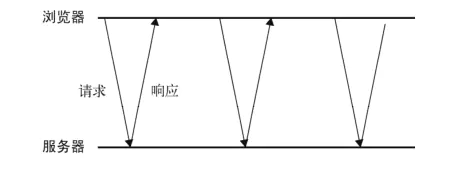
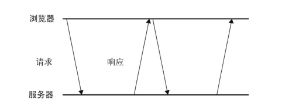
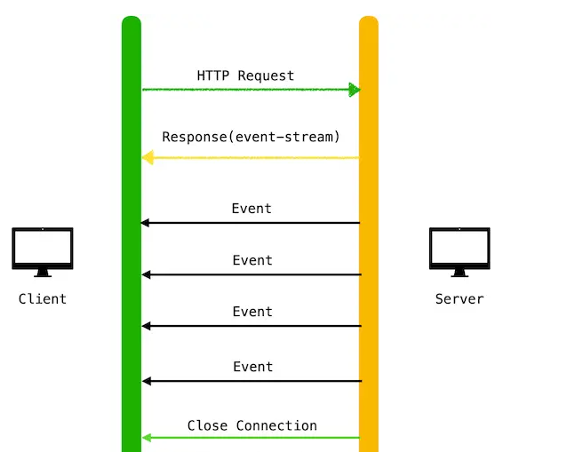

# Websocket使用

## 1.WebSocket是什么？

WebSocket 是一种在单个TCP连接上进行全双工通信的协议。WebSocket 使得客户端和服务器之间的数据交换变得更加简单，允许服务端主动向客户端推送数据，可以双方双向的平等对话，属于服务器的推送技术的一种

## 2.为什么要用WebSocket?

在HTTP协议中，我们可以通过客户端发起通信，但是服务器不能给客户端推送信息

单向的请求无法感知服务器的变化，如果服务器连续变化，我们只能进行**轮询**，隔一段时间发起请求，效率低且浪费资源

### （1）http短轮询

浏览器向服务器请求，看有没有数据更新，每隔一段时间请求一次，无论更没更新都响应



优点：


缺点：

* 不断发送请求，对服务器压力比较大，开启HTTP连接时一件比较消耗资源的事情
* 轮询时间不好控制，实时性比较高的话，就无法及时获得消息

### （2）http长轮询

页面发起一个到服务器的请求，如果服务端数据更新就返回，如果没有更新，到达时间限制就返回，客户端处理完返回信息之后再次发起请求



优点：

缺点：

- 

### （3）SSE(Server-Sent Events)

SSE是服务端给客户端主动推送消息的技术，本质是HTTP的长连接，客户端不会关闭连接，会一直等待发送过来的数据



优点：

- 使用简单，websocket相对更复杂一点
- 默认支持断线重连
- SSE 使用 HTTP 协议，现有的服务器软件都支持

缺点：

- 一般用来传输文本，二进制数据需要编码后传送

### （3）websocket

HTTP做不到服务器向浏览器推送数据，所以有了websocket,HTTP2.0具有服务器推送功能，但是只能推送静态资源

当建立连接之后，服务器可以向浏览器发送信息，浏览器也可以向服务器发送信息，能更好的节省服务器资源和带宽，并且能够更实时地进行通讯。

特点：

（1）建立在 TCP 协议之上，双向通信，减少轮询时候HTTP连接数量的开销。

（2）与 HTTP 兼容性良好。默认端口也是80和443，并且握手阶段采用 HTTP 协议，因此握手时不容易屏蔽，能通过各种 HTTP 代理服务器。

（3）数据格式比较轻量，性能开销小，通信高效。

（4）可以发送文本，也可以发送二进制数据。

（5）没有同源限制，客户端可以与任意服务器通信，完全可以取代 Ajax。

（6）协议标识符是`ws`（如果加密，则为`wss`，对应 HTTPS 协议），服务器网址就是 URL

## 3.websocket API

整个流程就是建立连接—>发送数据--->接收数据--->处理错误--->断开连接

```

```


## 4.websocket封装

## 6.参考资料

1.[WebSocket 原理及单例组件封装](https://juejin.cn/post/7020344512903905316)

2.[前端webSocket实现聊天消息&心跳检测&断线重连](https://juejin.cn/post/6914113426436390926)

3.[阮一峰websocket教程](https://www.ruanyifeng.com/blog/2017/05/websocket.html)

