### 1.HTTP长轮询，HTTP短轮询，WebSocket

#### （1）http 长轮询

http 长轮询是server 收到请求后如果有数据，立刻响应请求；如果没有数据 就会 停留 一段时间，这段时间内，如果 server 请求的数据到达（如查询数据库或数据的逻辑处理完成），就会立刻响应；如果这段时间过后，还没有数据到达，则以空数据的形式响应http请求；若浏览器收到的数据为空，会再次发送同样的http请求到server；

缺点：server 没有数据到达时，http连接会停留一段时间，这会造成服务器资源浪费；

看个荔枝：

假设有 1000个人停留在某个客户端页面，等待server端的数据更新，那就很有可能服务器这边挂着1000个线程，在不停检测数据是否发生变化，这依然是有问题的；

#### （2）http 短轮询

http 短轮询是 server 收到请求 不管是否有数据到达都直接响应http 请求；如果浏览器收到的数据为空，则隔一段时间，浏览器又会发送相同的http请求到server 以获取数据响应；

缺点：消息交互的实时性较低（server端到浏览器端的数据反馈效率低）；

#### （3）http 长轮询 和 短轮询的异同
1）相同点：当server 的数据不可达时，基于http长轮询和短轮询 的http请求，都会 停留一段时间；
2）不同点：http长轮询是在服务器端的停留，而http 短轮询是在 浏览器端的停留；
3）性能总结：从这里可以看出，不管是长轮询还是短轮询，都不太适用于客户端数量太多的情况，因为每个服务器所能承载的TCP连接数是有上限的，这种轮询很容易把连接数顶满；

#### （4）WebSocket

WebSocket 是 html5 规范发布的新协议，和 http协议完全是两个不同的概念，或者说基本没关系；WebSocket 协议 和 http协议的唯一联系点在于，WebSocket 协议为了兼容现有浏览器的握手规范而采用了 http协议中的握手规范 以建立WebSocket连接；

WebSocket协议：其客户端与服务器建立的是 持久连接；

WebSocket 解决了 HTTP 的几个难题：

1.（http协议的被动性）：采用 WebSocket 协议后，服务器可以主动推送消息给客户端；而不需要客户端以（长/短）轮询的方式发起http请求到server以获取数据更新反馈；这样一来，客户端只需要经过一次HTTP请求，就可以做到源源不断的信息传送了（在程序设计中，这种设计叫做回调，即：server 端有信息了再来通知client 端，而不是 client 端 每次都傻乎乎地跑去轮询server端 是否有消息更新）；

2.（http协议的无状态性/健忘性）：短轮询是每次http请求前都要建立连接，而长轮询是相邻几次请求前都要建立连接；http请求响应完成后，服务器就会断开连接，且把连接的信息全都忘记了；所以每次建立连接都要重新传输连接上下文（下面有补充），将 client 端的连接上下文来告诉server 端；而 WebSockct只需要一次HTTP 握手，整个通讯过程是建立在一次连接（状态）中的，server 端会一直推送消息更新反馈到客户端，直到客户端关闭请求，这样就无需 客户端为发送消息而建立不必要的 tcp 连接 和 为了建立tcp连接而发送不必要的冗余的连接上下文消息；


### 2.TCP拥塞控制

∑对资源的需求>可用资源

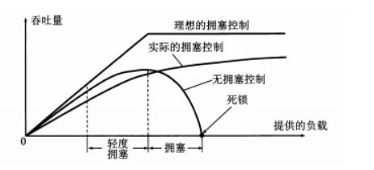

拥塞的标志:

1. 重传计时器超时
2. 接收到三个重复确认

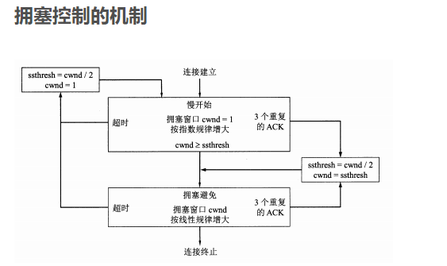

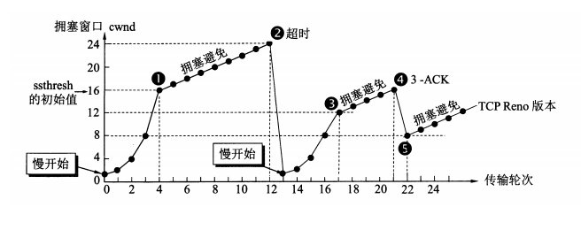

当cnwd（拥塞窗口大小）＜ssthresh（门限阈值），使用慢开始算法
		当cnwd=ssthresh，既可使用慢开始算法，也可以使用拥塞避免算法
		当cnwd＞ssthresh，使用拥塞避免算法

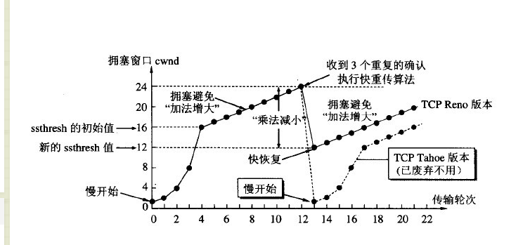

TCP通过在发送数据时设置一个**重传定时器**来监控数据的丢失状态，如果重传定时器溢出时还没收到确认信号，则重传该数据。这就是建立重传机制的原因。
下面解释两个名词：
**RTT(Round Trip Time)：**一个连接的往返时间，即数据发送时刻到接收到确认的时刻的差值；
**RTO(Retransmission Time Out)：**重传超时时间，即从数据发送时刻算起，超过这个时间便执行重传。
RTT和RTO 的关系是：由于网络波动的不确定性，每个RTT都是动态变化的，所以RTO也应随着RTT动态变化。

### 3.HTTP有哪些字段？

### 

| Header             | 解释                                                         | 示例                                                   |
| ------------------ | ------------------------------------------------------------ | ------------------------------------------------------ |
| Accept-Ranges      | 表明服务器是否支持指定范围请求及哪种类型的分段请求           | Accept-Ranges: bytes                                   |
| Age                | 从原始服务器到代理缓存形成的估算时间（以秒计，非负）         | Age: 12                                                |
| Allow              | 对某网络资源的有效的请求行为，不允许则返回405                | Allow: GET, HEAD,POST                                  |
| Cache-Control      | 告诉所有的缓存机制是否可以缓存及哪种类型                     | Cache-Control: no-cache(不允许缓存)                    |
| Content-Encoding   | web服务器支持的返回内容压缩编码类型。                        | Content-Encoding: gzip                                 |
| Content-Language   | 响应体的语言                                                 | Content-Language: en,zh                                |
| Content-Length     | 响应体的长度                                                 | Content-Length: 348                                    |
| Content-Location   | 请求资源可替代的备用的另一地址                               | Content-Location: /index.htm                           |
| Content-MD5        | 返回资源的MD5校验值                                          | Content-MD5: Q2hlY2sgSW50ZWdyaXR5IQ==                  |
| Content-Range      | 在整个返回体中本部分的字节位置                               | Content-Range: bytes 21010-47021/47022                 |
| Content-Type       | 返回内容的MIME类型                                           | Content-Type: text/html; charset=utf-8                 |
| Date               | 原始服务器消息发出的时间                                     | Date: Tue, 15 Nov 2010 08:12:31 GMT                    |
| ETag               | 请求变量的实体标签的当前值                                   | ETag: “737060cd8c284d8af7ad3082f209582d”               |
| Expires            | 响应过期的日期和时间                                         | Expires: Thu, 01 Dec 2010 16:00:00 GMT                 |
| Last-Modified      | 请求资源的最后修改时间                                       | Last-Modified: Tue, 15 Nov 2010 12:45:26 GMT           |
| Location           | 用来重定向接收方到非请求URL的位置来完成请求或标识新的资源    | Location: http://www.zcmhi.com/archives/94.html        |
| Pragma             | 包括实现特定的指令，它可应用到响应链上的任何接收方           | Pragma: no-cache                                       |
| Proxy-Authenticate | 它指出认证方案和可应用到代理的该URL上的参数                  | Proxy-Authenticate: Basic                              |
| refresh            | 应用于重定向或一个新的资源被创造，在5秒之后重定向（由网景提出，被大部分浏览器支持） | Refresh: 5; url= http://www.zcmhi.com/archives/94.html |
| Retry-After        | 如果实体暂时不可取，通知客户端在指定时间之后再次尝试         | Retry-After: 120                                       |
| Server             | web服务器软件名称                                            | Server: Apache/1.3.27 (Unix) (Red-Hat/Linux)           |
| Set-Cookie         | 设置Http Cookie                                              | Set-Cookie: UserID=JohnDoe; Max-Age=3600; Version=1    |
| Trailer            | 指出头域在分块传输编码的尾部存在                             | Trailer: Max-Forwards                                  |
| Transfer-Encoding  | 文件传输编码                                                 | Transfer-Encoding:chunked                              |
| Vary               | 告诉下游代理是使用缓存响应还是从原始服务器请求               | Vary: *                                                |
| Via                | 告知代理客户端响应是通过哪里发送的                           | Via: 1.0 fred, 1.1 nowhere.com (Apache/1.1)            |
| Warning            | 警告实体可能存在的问题                                       | Warning: 199 Miscellaneous warning                     |
| WWW-Authenticate   | 表明客户端请求实体应该使用的授权方案                         | WWW-Authenticate: Basic                                |

### 4.HTTP状态码

HTTP 状态码由三个十进制数字组成，第一个十进制数字定义了状态码的类型。响应分为五类：信息响应(100–199)，成功响应(200–299)，重定向(300–399)，客户端错误(400–499)和服务器错误 (500–599)：

| 分类 | 分类描述                                       |
| :--- | :--------------------------------------------- |
| 1**  | 信息，服务器收到请求，需要请求者继续执行操作   |
| 2**  | 成功，操作被成功接收并处理                     |
| 3**  | 重定向，需要进一步的操作以完成请求             |
| 4**  | 客户端错误，请求包含语法错误或无法完成请求     |
| 5**  | 服务器错误，服务器在处理请求的过程中发生了错误 |

HTTP状态码列表:

| 状态码 | 状态码英文名称                  | 中文描述                                                     |
| :----- | :------------------------------ | :----------------------------------------------------------- |
| 100    | Continue                        | 继续。客户端应继续其请求                                     |
| 101    | Switching Protocols             | 切换协议。服务器根据客户端的请求切换协议。只能切换到更高级的协议，例如，切换到HTTP的新版本协议 |
|        |                                 |                                                              |
| 200    | OK                              | 请求成功。一般用于GET与POST请求                              |
| 201    | Created                         | 已创建。成功请求并创建了新的资源                             |
| 202    | Accepted                        | 已接受。已经接受请求，但未处理完成                           |
| 203    | Non-Authoritative Information   | 非授权信息。请求成功。但返回的meta信息不在原始的服务器，而是一个副本 |
| 204    | No Content                      | 无内容。服务器成功处理，但未返回内容。在未更新网页的情况下，可确保浏览器继续显示当前文档 |
| 205    | Reset Content                   | 重置内容。服务器处理成功，用户终端（例如：浏览器）应重置文档视图。可通过此返回码清除浏览器的表单域 |
| 206    | Partial Content                 | 部分内容。服务器成功处理了部分GET请求                        |
|        |                                 |                                                              |
| 300    | Multiple Choices                | 多种选择。请求的资源可包括多个位置，相应可返回一个资源特征与地址的列表用于用户终端（例如：浏览器）选择 |
| 301    | Moved Permanently               | 永久移动。请求的资源已被永久的移动到新URI，返回信息会包括新的URI，浏览器会自动定向到新URI。今后任何新的请求都应使用新的URI代替 |
| 302    | Found                           | 临时移动。与301类似。但资源只是临时被移动。客户端应继续使用原有URI |
| 303    | See Other                       | 查看其它地址。与301类似。使用GET和POST请求查看               |
| 304    | Not Modified                    | 未修改。所请求的资源未修改，服务器返回此状态码时，不会返回任何资源。客户端通常会缓存访问过的资源，通过提供一个头信息指出客户端希望只返回在指定日期之后修改的资源 |
| 305    | Use Proxy                       | 使用代理。所请求的资源必须通过代理访问                       |
| 306    | Unused                          | 已经被废弃的HTTP状态码                                       |
| 307    | Temporary Redirect              | 临时重定向。与302类似。使用GET请求重定向                     |
|        |                                 |                                                              |
| 400    | Bad Request                     | 客户端请求的语法错误，服务器无法理解                         |
| 401    | Unauthorized                    | 请求要求用户的身份认证                                       |
| 402    | Payment Required                | 保留，将来使用                                               |
| 403    | Forbidden                       | 服务器理解请求客户端的请求，但是拒绝执行此请求               |
| 404    | Not Found                       | 服务器无法根据客户端的请求找到资源（网页）。通过此代码，网站设计人员可设置"您所请求的资源无法找到"的个性页面 |
| 405    | Method Not Allowed              | 客户端请求中的方法被禁止                                     |
| 406    | Not Acceptable                  | 服务器无法根据客户端请求的内容特性完成请求                   |
| 407    | Proxy Authentication Required   | 请求要求代理的身份认证，与401类似，但请求者应当使用代理进行授权 |
| 408    | Request Time-out                | 服务器等待客户端发送的请求时间过长，超时                     |
| 409    | Conflict                        | 服务器完成客户端的 PUT 请求时可能返回此代码，服务器处理请求时发生了冲突 |
| 410    | Gone                            | 客户端请求的资源已经不存在。410不同于404，如果资源以前有现在被永久删除了可使用410代码，网站设计人员可通过301代码指定资源的新位置 |
| 411    | Length Required                 | 服务器无法处理客户端发送的不带Content-Length的请求信息       |
| 412    | Precondition Failed             | 客户端请求信息的先决条件错误                                 |
| 413    | Request Entity Too Large        | 由于请求的实体过大，服务器无法处理，因此拒绝请求。为防止客户端的连续请求，服务器可能会关闭连接。如果只是服务器暂时无法处理，则会包含一个Retry-After的响应信息 |
| 414    | Request-URI Too Large           | 请求的URI过长（URI通常为网址），服务器无法处理               |
| 415    | Unsupported Media Type          | 服务器无法处理请求附带的媒体格式                             |
| 416    | Requested range not satisfiable | 客户端请求的范围无效                                         |
| 417    | Expectation Failed              | 服务器无法满足Expect的请求头信息                             |
|        |                                 |                                                              |
| 500    | Internal Server Error           | 服务器内部错误，无法完成请求                                 |
| 501    | Not Implemented                 | 服务器不支持请求的功能，无法完成请求                         |
| 502    | Bad Gateway                     | 作为网关或者代理工作的服务器尝试执行请求时，从远程服务器接收到了一个无效的响应 |
| 503    | Service Unavailable             | 由于超载或系统维护，服务器暂时的无法处理客户端的请求。延时的长度可包含在服务器的Retry-After头信息中 |
| 504    | Gateway Time-out                | 充当网关或代理的服务器，未及时从远端服务器获取请求           |
| 505    | HTTP Version not supported      | 服务器不支持请求的HTTP协议的版本，无法完成处理               |

### 5.SSL/TSL

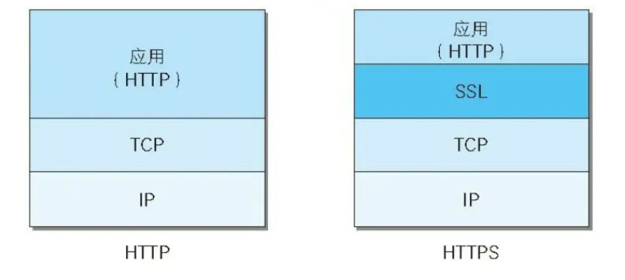

不使用SSL/TLS的HTTP通信，就是不加密的通信。所有信息明文传播

#### （1）HTTP三大风险

（1） **窃听风险**（eavesdropping）：第三方可以获知通信内容。//**加密传播**

（2） **篡改风险**（tampering）：第三方可以修改通信内容。//**校验机制**

（3） **冒充风险**（pretending）：第三方可以冒充他人身份参与通信。//**身份证书**

基本思路：公钥加密（非对称加密），保证公钥不被篡改使用数字证书，为了节约时间（公钥加密计算量太大），使用对称加密

HTTPS： 采用 对称加密 和 非对称加密 结合的方式来保护浏览器和服务端之间的通信安全。

**对称加密算法加密数据+非对称加密算法交换密钥+数字证书验证身份=安全**

（1） 客户端向服务器端索要并验证公钥。

（2） 双方协商生成"对话密钥"。

（3） 双方采用"对话密钥"进行加密通信。

#### （2）HTTPS四次握手

握手阶段：四次握手

（1）客户端（通常是浏览器）先向服务器发出加密通信的请求

携带信息：支持的协议版本TSL1.0、客户端随机数、支持的加密方式、支持的压缩方法

（2）服务器回应

携带信息：确认加密版本、服务器生成的随机数、确认加密方法、服务器证书

（3）客户端回应,验证是否可靠证书

携带信息：随机数（用于服务器公钥加密，防止被窃听）、编码方式改变通知（商定加密方法和密钥发送）、通知握手结束

三个随机数是为了保证密钥的随机性

（4）服务器最后的回应

携带信息：编码改变通知、握手阶段结束

### 6.HTTP GET和POST比较

| GET                                                 | POST                                         |
| --------------------------------------------------- | -------------------------------------------- |
| 请求可被缓存                                        | 不会被缓存                                   |
| 请求保留在浏览器历史记录中                          | 请求不会保留在浏览器历史记录中               |
| 请求可被收藏为书签                                  | 不能被收藏为书签                             |
| 请求有长度限制，浏览器的限制原因，因为URL有长度限制 | 请求对数据长度没有要求                       |
| 请求只应当用于取回数据                              | 可以修改数据，但是其实两者都可以传参改变数据 |

其实无论是url还是header还是body，http都是明文传输，所以都不安全，唯一手段是https

GET产生一个TCP数据包；POST产生两个TCP数据包。

```
（对于GET方式的请求，浏览器会把http header和data一并发送出去，服务器响应200（返回数据）；

而对于POST，浏览器先发送header，服务器响应100 continue，浏览器再发送data，服务器响应200 ok（返回数据）。）
```

其实GET和POST没有本质区别，就是发送数据的两种方式

### 7.TCP和UDP的区别

（1）TCP是面向连接的，udp是无连接的即发送数据前不需要先建立链接。

（2）TCP提供可靠的服务。也就是说，通过TCP连接传送的数据，无差错，不丢失，不重复，且按序到达;UDP尽最大努力交付，即不保证可靠交付。 并且因为tcp可靠，面向连接，不会丢失数据因此适合大数据量的交换。

（3）TCP是面向字节流，UDP面向报文，并且网络出现拥塞不会使得发送速率降低（因此会出现丢包，对实时的应用比如IP电话和视频会议等）。

（4）TCP只能是1对1的，UDP支持1对1,1对多。

（5）TCP的首部较大为20字节，而UDP只有8字节。

（6）TCP是面向连接的可靠性传输，而UDP是不可靠的。

### 8.什么是套接字？

一条TCP连接的两端就是两个套接字。
		套接字 = IP地址 ：端口号
		因此，TCP连接 = （套接字1，套接字2）= （IP1：端口号1，IP2：端口号2）

### 9.OSI（开放系统互连）???从这里开始重新整理

模型 ：应 表 会 传 网 数 物

a) 应用层 ：处理应用进程之间发送和接收的数据包含的信息内容

 b) 表示层 ：使通信的应用程序能解释交换数据的含义，包括数据压缩、解密、描述

 c) 会话层 ：：提供数据交换定界和同步功能，包括建立检查点和恢复方案的方法

d) 传输层 ：为会话层提供与网络无关的可靠信息传送机制

 e) 网络层 ：路由、转发、拥塞控制 （路由器）

f) 数据链路层 ：成帧、差错控制、流量控制、物理寻址、媒体访问控制 （将比特流封装成帧）（网桥）

g) 物理层 ：缆线，网络插件的电机械接口（比特流）

协议栈：物理层 –>数据链路层 –> 网络层 -> 运输层 -> 应用层 

信息形式：比特 -> 帧 -> 数据报 -> 报文段 -> 报文

### 10.应用层

（不同端系统上的应用程序如何互相传递报文）

#### （1）原理

客户—服务器体系结构、对等 P2P 体系结构

套接字：同一台主机内应用层与运输层之间的接口 API

TCP 服务：面向连接（全双工连接）、可靠的数据传送服务 

UDP 服务：无连接、不可靠的数据传送服务

#### （2）web和HTTP

Web 三要素：Web 浏览器、HTTP 协议、HTML 语言

HTTP 使用 TCP 作为支撑运输协议，其不保存状态信息，是无状态协议，端口号 80

#### （3）文件传输协议：FTP

1、FTP 使用两个并行的 TCP 连接来传输文件：控制连接（带外传送） + 数据连接 

2、FTP 使用持续的控制连接、非持续的数据连接，会话期间保留用户的状态，端口号 21

往返时间 RTT：指一个短分组从客户到服务器然后再返回客户所花费的时间

TCP 每次建立连接需要三次握手，耗费 1.5 个 RTT

SMTP（简单邮件传输协议） 采用 TCP 作为支撑运输协议，使用持续连接，端口号 25

**DNS 采用 UDP 作为支撑运输协议，端口号：53**

### 11.运输层

1、运输层只工作在端系统中，中间路由器既不处理也不识别运输层所加的报文信息 

2、运输层只看得见报文与报文段，看不见数据报 

3、网络层提供了主机之间的逻辑通信，而运输层为其进程提供了逻辑通信 

4、运输层协议：用户数据报协议 UDP、传输控制协议 TCP

 5、运输层最低限度的服务：数据交付、差错检查

UDP 套接字：使用二元组（目的 IP 地址，目的端口号）标识

 TCP 套接字：使用四元组（源 IP 地址，源端口号，目的 IP 地址，目的端口号）标识

UDP 的优点：

应用层能避开 TCP 拥塞控制，从而更精细地控制何时发送什么数据

 无需建立连接，不会引入建立连接的时延 

无需维持连接状态，能支持更多活跃客户 

分组首部开销小（UDP 只有 8 字节，TCP 有 20 字节）

#### （1）**可靠数据传输原理**

停等协议：发送一个就停止并等待，等待确认帧的回复（发送窗口=1，接收窗口=1））

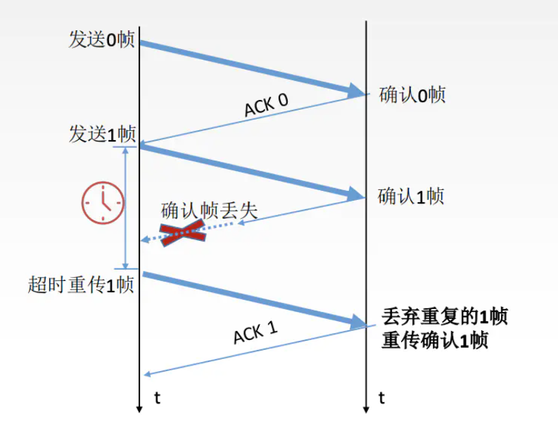

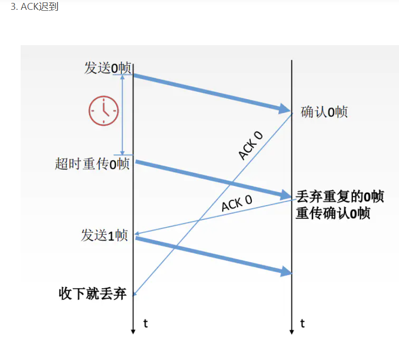

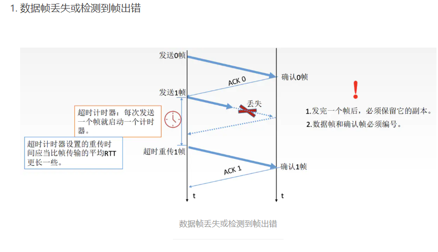

滑动窗口协议（发送窗口>1，接收窗口>1）：不等待确认帧，可以持续发送数据帧，每个数据帧还是设置超时定时器，如果有一个帧出错，那就需要重传该帧之后的所有帧，

选择重传协议（发送窗口>1，接收窗口>1）：只有出错的那个帧需要重传。

TCP拥塞控制：**对网络中某一资源的需求超过了该资源所能提供的可用部分，网络性能就要变坏**，这种情况就叫做**网络拥塞**。

**出现拥塞需要进行控制**：

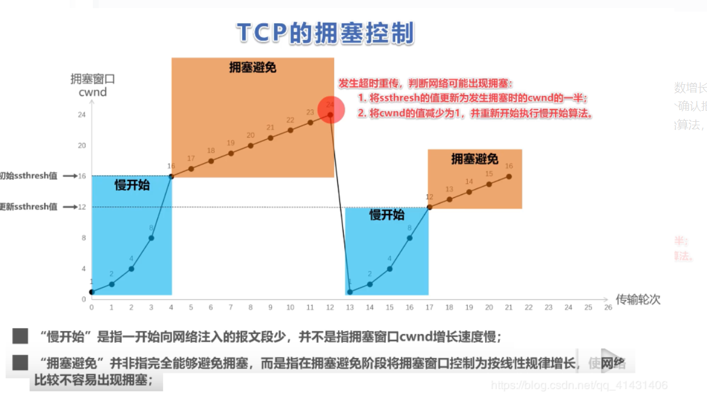

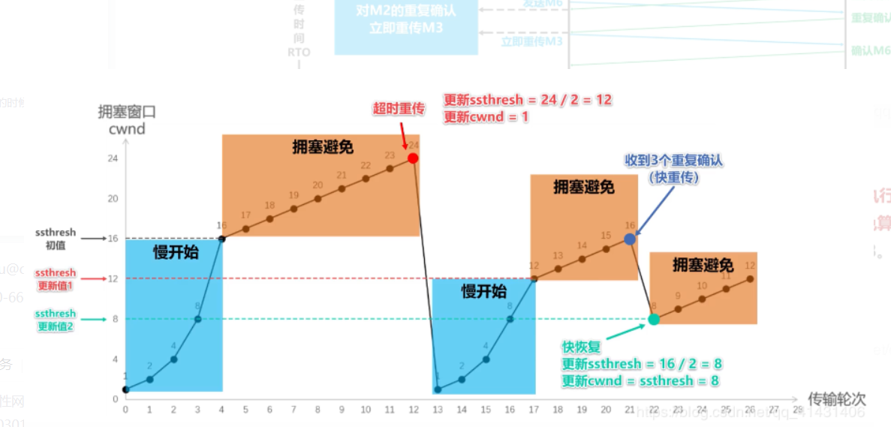

### 12.网络层

三大功能：转发、路由选择、连接建立

IP 协议：网络层主要协议 

路由选择协议：用于计算转发表

 ICMP 协议：因特网控制报文协议，用于因特网的网络层差错和信息报告

路由选择协议：

路由选择信息协议 RIP、开放最短路优先 OSPF

### 13.链路层：链路、接入网和局域网

链路层提供的服务： 

成帧 

链路接入，使用媒体访问控制协议 MAC 

可靠交付，通过确认与重传实现 

差错检测与纠正，用硬件实现

差错检验和纠正技术：循环冗余检测CRC

**轮流协议：** 

轮询： 主结点轮询到的结点才可以传输 能传输的帧的最大数量由主结点通知 令牌传递： 持有令牌的结点才可以传输 无帧可发或发送完一个帧，将令牌传递给下一个结点

以太网的变革：同轴电缆 + 转发器 –> 集线器星型拓扑 -> 交换机星型拓扑

 **转发器：物理层设备，在输入端接收信号并在输出端再生信号，使得传输更长距离** 

**集线器：物理层设备，作用于比特，放大传输其受到的信号** 

**交换机：链路层设备，作用于帧，不会出现碰撞**

***

OSI七层模型是一种框架性的设计方法，建立七层模型的主要目的是为**解决异种网络互连时所遇到的兼容性问题**，其最主要的功能就是**帮助不同类型的主机实现数据传输**。它的**最大优点是将服务、接口和协议这三个概念明确地区分开来**，通过七个层次化的结构模型使不同的系统不同的网络之间实现可靠的通讯。

OSI七层参考模型的各个层次的划分遵循下列原则：
1、**同一层**中的各网络节点都有**相同的层次结构，具有同样的功能**。
2、同一节点内**相邻层之间通过接口**（可以是逻辑接口）进行通信。
3、七层结构中的每一层使用下一层提供的服务，并且向其**上层提供服务**。
4、不同节点的同等层按照协议实现对等层之间的通信。

各层简介：

　　【1】物理层：主要**定义物理设备标准**，如网线的接口类型、光纤的接口类型、各种传输介质的传输速率等。它的主要作用是传输比特流（就是由1、0转化为电流强弱来进行传输,到达目的地后在转化为1、0，也就是我们常说的数模转换与模数转换），这一层的数据叫做**比特**。

　　【2】数据链路层：**负责物理传输的准备**。在物理层提供比特流服务的基础上，建立相邻结点之间的数据链路，通过差错控制提供数据帧（Frame）在信道上无差错的传输，并进行各电路上的动作系列。数据链路层在不可靠的物理介质上提供可靠的传输。该层的作用包括：**物理地址寻址、数据的成帧、流量控制、数据的检错、重发**等。在这一层，数据的单位称为**帧**（frame）。**MAC地址和交换机在这一层**。

　　【3】网络层：网络层的任务就是选择合适的网间路由和交换结点， 确保数据及时传送。网络层将数据链路层提供的帧组成数据包。网络层还可以实现拥塞控制、网际互连等功能。在这一层，数据的单位称为**数据包**（packet）。网络层协议的代表包括：IP、IPX、RIP、OSPF等。**负责管理网络地址、定位设备、决定路由，路由器工作在这层**。

　　【4】传输层：OSI中最重要的一层，**负责分割组合数据，实现端到端的逻辑连接**。为上层提供端到端（最终用户到最终用户）的透明的、可靠的数据传输服务。传输层协议的代表包括：TCP、UDP、

　　【5】会话层：**负责在网络中两个节点间建立、维护、控制会话，区分不同的会话，以及提供单工、半双工、全双工三种通信模式服务**。

　　【6】表示层：可**确保一个系统的应用层所发送的信息可以被另一个系统的应用层读取**。数据的压缩和解压缩， 加密和解密等工作都由表示层负责。

　　【7】应用层： 是最靠近用户的OSI层，这一层为用户的操作系统或应用程序（例如电子邮件、文件传输和终端仿真）**提供网络服务**。应用层协议的代表包括：Telnet、FTP、HTTP、SNMP等。
**TCP拥塞控制**
发生原因：资源(带宽、交换节点的缓存、处理机)的**需求>可用资源**。

对比流量控制：拥塞控制是一个全局的过程，涉及到所有的主机、路由器、以及降低网络相关的所有因素。流量控制往往指点对点通信量的控制。是端对端的问题。

发送方如何知道网络拥塞了呢？发送方发送一些报文段时，如果发送方没有在时间间隔内收到接收方的确认报文段，则就可以人为网络出现了拥塞。

拥塞避免：为了防止cwnd增加过快而导致网络拥塞，所以需要设置一个慢开始门限ssthresh状态变量（我也不知道这个到底是什么，就认为他是一个拥塞控制的标识）,它的用法：

1、当cwnd （拥塞窗口）< ssthresh,使用慢启动算法，

2、 当cwnd > ssthresh,使用拥塞控制算法，停用慢启动算法。

3、 当cwnd = ssthresh，这两个算法都可以。

无论是慢启动算法还是拥塞避免算法，只要判断网络出现拥塞，就要把慢启动开始门限(ssthresh)设置为设置为发送窗口的一半（>=2），cwnd(拥塞窗口)设置为1，然后在使用慢启动算法，这样做的目的能迅速的减少主机向网络中传输数据，使发生拥塞的路由器能够把队列中堆积的分组处理完毕。

实例：1、TCP连接进行初始化的时候，cwnd=1,ssthresh=16。

2、在慢启动算法开始时，cwnd的初始值是1，每次发送方收到一个ACK拥塞窗口就增加1，当ssthresh =cwnd时，就启动拥塞控制算法，拥塞窗口按照规律增长，

3、当cwnd=24时，网络出现超时，发送方收不到确认ACK，此时设置ssthresh=12,(二分之一cwnd),设置cwnd=1,然后开始慢启动算法，当cwnd=ssthresh=12,慢启动算法变为拥塞控制算法，cwnd按照线性的速度进行增长。
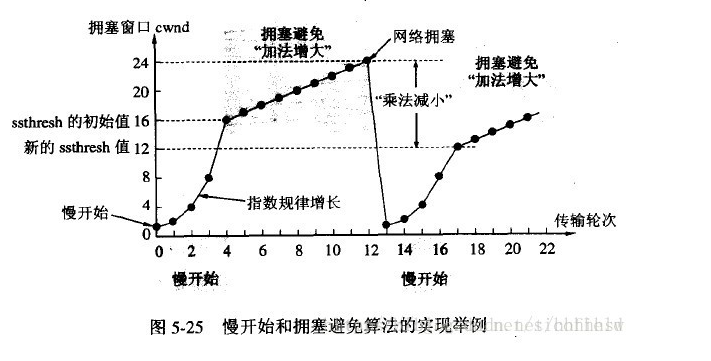

快重传：

快重传算法要求首先接收方收到一个失序的报文段后就立刻发出重复确认，而不要等待自己发送数据时才进行捎带确认。接收方成功的接受了发送方发送来的M1、M2并且分别给发送了ACK，现在接收方没有收到M3，而接收到了M4，显然接收方不能确认M4，因为M4是失序的报文段。如果根据可靠性传输原理接收方什么都不做，但是按照快速重传算法，在收到M4、M5等报文段的时候，不断重复的向发送方发送M2的ACK,如果接收方一连收到三个重复的ACK,那么发送方不必等待重传计时器到期，由于发送方尽早重传未被确认的报文段。

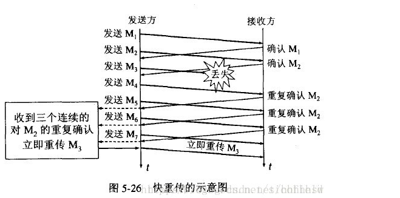

快恢复：

当发送方连续接收到三个确认时，就执行乘法减小算法，把慢启动开始门限（ssthresh）设置为cwnd的一半，但是接下来并不执行慢开始算法。

此时不执行慢启动算法，而是把cwnd设置为新的ssthresh值， 然后执行拥塞避免算法，使拥塞窗口缓慢增大。

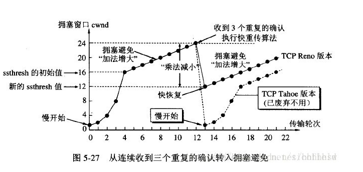

 TCP滑动窗口

只有接收窗口向前滑动并发送了确认时，发送窗口才能向前滑动。

回退N针协议

有可能有把正确的数据帧重传一遍，降低了传送效率。

选择重传协议

只选择没有传输成功的

**状态码**描述文本有如下取值：

　　200 OK：表示客户端请求成功;

​		301：完全重定向

​		302：临时重定向

​		304：请求没有更新，直接从缓存取得

　　400 Bad Request：表示客户端请求有语法错误，不能被服务器所理解;

　　401 Unauthonzed：表示请求需要用户验证;

　　403 Forbidden：表示服务器收到请求，但是拒绝提供服务，通常会在响应正文中给出不提供服务的原因;

　　404 Not Found：请求的资源不存在，例如，输入了错误的URL;

　　500 Internal Server Error：表示服务器发生不可预期的错误，导致无法完成客户端的请求;

　　503 Service Unavailable：表示服务器当前不能够处理客户端的请求，在一段时间之后，服务器可能会恢复正常;

**http处理长连接**

http1.0：客户端带着Connection： keep-alive，服务端判断出来之后不关闭连接

http1.1:服务端收到http1.1后就认为这是一个长连接,会在返回的response设置Connection： keep-alive,同时不会关闭已建立的连接.不需要客户端设置

**Cookie和Session工作原理**

Cookie：用户访问某个网站，服务器存下cookie信息，默认存储在浏览器内存中，用户退出就删除，如果要存在磁盘上，就要设置最大时效，

session：当用户访问到一个服务器，服务器创建一个SESSION，在创建这个SESSION的时候，按照这个SESSION ID把这个SESSION在服务器的内存中查找不包含有SESSION ID，创建一个SESSION并生成一个与此SESSION相关的SESSION ID。

**比较：**

1、存放位置：Cookie保存在客户端，Session保存在服务端。

2 、存取方式的不同

Cookie中只能保管ASCII字符，而Session中能够存取任何类型的数据

3、安全性（隐私策略）的不同

Cookie存储在浏览器中，对客户端是可见的，客户端的一些程序可能会窥探、复制以至修正Cookie中的内容。而Session存储在服务器上，对客户端是透明的，不存在敏感信息泄露的风险。 假如选用Cookie，比较好的方法是，敏感的信息如账号密码等尽量不要写到Cookie中。最好是像Google、Baidu那样将Cookie信息加密，提交到服务器后再进行解密，保证Cookie中的信息只要本人能读得懂。而假如选择Session就省事多了，反正是放在服务器上，Session里任何隐私都能够有效的保护。

4、有效期上的不同

只需要设置Cookie的过期时间属性为一个很大很大的数字，Cookie就可以在浏览器保存很长时间。 由于Session依赖于名为JSESSIONID的Cookie，而Cookie JSESSIONID的过期时间默许为–1，只需关闭了浏览器（一次会话结束），该Session就会失效。

5、对服务器造成的压力不同

Session是保管在服务器端的，每个用户都会产生一个Session。假如并发访问的用户十分多，会产生十分多的Session，耗费大量的内存。而Cookie保管在客户端，不占用服务器资源。假如并发阅读的用户十分多，Cookie是很好的选择。

6、 跨域支持上的不同

Cookie支持跨域名访问，例如将domain属性设置为“.baidu.com”，则以“.baidu.com”为后缀的一切域名均能够访问该Cookie。而Session则不会支持跨域名访问。Session仅在他所在的域名内有效。

**访问网页过程**

**DNS、HTTP、TCP、OSPF、IP、ARP**

**往下：**

**应用层：**

DNS：找到相应的url则返回其ip

HTTP（80）：HTTP协议的主要职责是生成针对目标web服务器的http请求报文（请求行、请求头部）

**传输层**
TCP：将http请求报文分割成报文段，按序号分为多个报文段。（三次握手）

**网络层**
IP：搜索目标的地址，一边中转一边传送。（路由）

ARP：IP地址转换成数据链路层认识的MAC地址。

**往上**

**网络层**

RARP：这其实是ARP的逆过程，将MAC地址转换成Ip地址

**传输层**
TCP：将接收到的报文段按序号进行重组。

**应用层**
 HTTP：HTTP协议对http请求进行解析处理。

**Ping的整个过程。ICMP报文是什么**

同一网段内的ping,

一种是跨网段的ping：需要找网关转发

ICMP报文
1、 ICMP允许主机或路由报告差错情况和提供有关异常情况。ICMP是因特网的标准协议，但ICMP不是高层协议，而是IP层的协议。通常ICMP报文被IP层或更高层协议（TCP或UDP）使用。一些ICMP报文把差错报文返回给用户进程。

2、 ICMP报文作为IP层数据报的数据，加上数据报的首部，组成数据报发送出去。

3、 ICMP报文的种类有两种，即ICMP差错报告报文和ICMP询问报文。

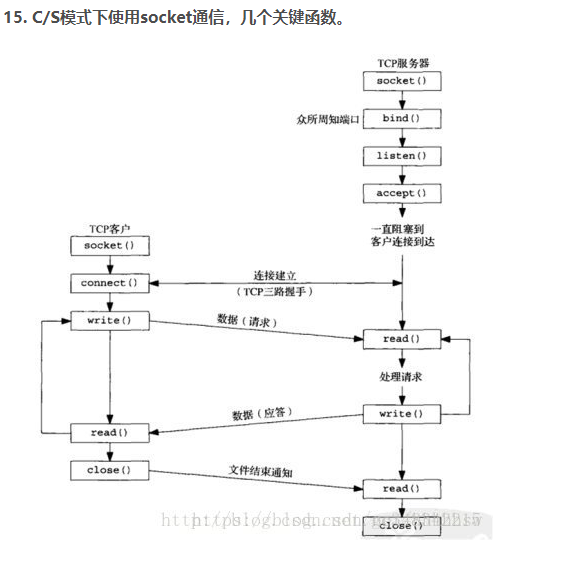

**IP地址分类**

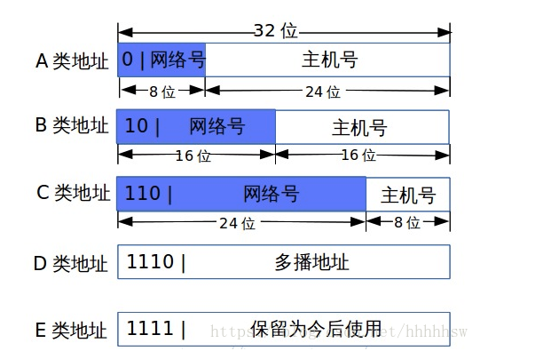

A：0-127 网络数：2^7

B：128-191网络数：2^11

C:192-223网络数：2^21

D:224-239组播地址

E：240-254

网络地址：主机部分全为0的IP地址

广播地址：主机部分全为1的IP地址

例子：当发送信息到广播地址100.255.255.255时，意思为放松到网络地址为100.0.0.0的所有主机上。

0.0.0.0指这个主机、这个网络，出现在路由表中的默认路由。

255.255.255.255 广播地址：送达全网所有主机，会被路由器截至

**子网划分：**

例子：某单位分到一个C类网络号193.71.56.0，需要分成五个子网，每个子网需要连接20台主机，如何规划子网？

为了分成五个子网，我们需要借主机位3位，可创建8个子网>5个子网；同时剩下5个主机位，提供主机位2^5-2=30个>20个，所以我们可以子网掩码设置位255.255.255.224。

**交换机和路由器**

| 区别     | 交换机                | 路由器                 |
| :------- | --------------------- | ---------------------- |
| 工作层次 | 数据链路层            | 网络层                 |
| 转发对象 | 根据MAC地址转发数据帧 | 根据IP地址转发IP数据报 |
| 工作     | 组建局域网            | 让主机连接外网         |

