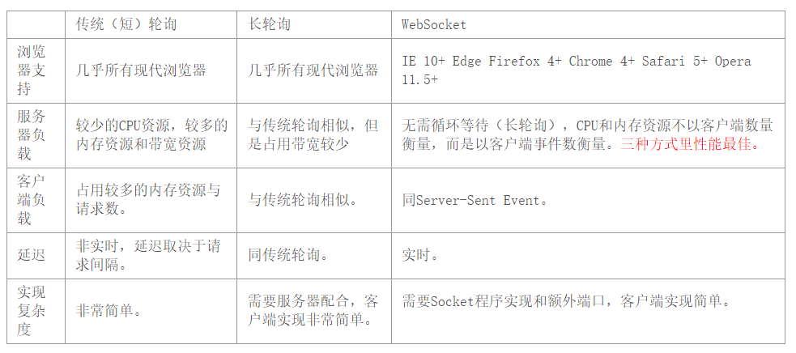

### 1.HTTP长轮询，HTTP短轮询，WebSocket

#### （1）http 长轮询
http 长轮询是server 收到请求后如果有数据，立刻响应请求；如果没有数据 就会 停留 一段时间，这段时间内，如果 server 请求的数据到达（如查询数据库或数据的逻辑处理完成），就会立刻响应；如果这段时间过后，还没有数据到达，则以空数据的形式响应http请求；若浏览器收到的数据为空，会再次发送同样的http请求到server；
缺点：server 没有数据到达时，http连接会停留一段时间，这会造成服务器资源浪费；
3）看个荔枝：假设有 1000个人停留在某个客户端页面，等待server端的数据更新，那就很有可能服务器这边挂着1000个线程，在不停检测数据是否发生变化，这依然是有问题的；

【2.2】http 短轮询
1）介绍：http 短轮询是 server 收到请求 不管是否有数据到达都直接响应http 请求；如果浏览器收到的数据为空，则隔一段时间，浏览器又会发送相同的http请求到server 以获取数据响应；
2） http 短轮询的缺点：消息交互的实时性较低（server端到浏览器端的数据反馈效率低）；

【2.3】http 长轮询 和 短轮询的异同
1）相同点：当server 的数据不可达时，基于http长轮询和短轮询 的http请求，都会 停留一段时间；
2）不同点：http长轮询是在服务器端的停留，而http 短轮询是在 浏览器端的停留；
3）性能总结：从这里可以看出，不管是长轮询还是短轮询，都不太适用于客户端数量太多的情况，因为每个服务器所能承载的TCP连接数是有上限的，这种轮询很容易把连接数顶满；【3】WebSocket
1）介绍：WebSocket 是 html5 规范发布的新协议，和 http协议完全是两个不同的概念，或者说基本没关系；WebSocket 协议 和 http协议的唯一联系点在于，WebSocket 协议为了兼容现有浏览器的握手规范而采用了 http协议中的握手规范 以建立WebSocket连接；
2）WebSocket协议：其客户端与服务器建立的是 持久连接；
3）WebSocket 解决了 HTTP 的几个难题
3.1）难题1（http协议的被动性）：采用 WebSocket 协议后，服务器可以主动推送消息给客户端；而不需要客户端以（长/短）轮询的方式发起http请求到server以获取数据更新反馈；这样一来，客户端只需要经过一次HTTP请求，就可以做到源源不断的信息传送了（在程序设计中，这种设计叫做回调，即：server 端有信息了再来通知client 端，而不是 client 端 每次都傻乎乎地跑去轮询server端 是否有消息更新）；
3.2）难题2（http协议的无状态性/健忘性）：短轮询是每次http请求前都要建立连接，而长轮询是相邻几次请求前都要建立连接；http请求响应完成后，服务器就会断开连接，且把连接的信息全都忘记了；所以每次建立连接都要重新传输连接上下文（下面有补充），将 client 端的连接上下文来告诉server 端；而 WebSockct只需要一次HTTP 握手，整个通讯过程是建立在一次连接（状态）中的，server 端会一直推送消息更新反馈到客户端，直到客户端关闭请求，这样就无需 客户端为发送消息而建立不必要的 tcp 连接 和 为了建立tcp连接而发送不必要的冗余的连接上下文消息；

