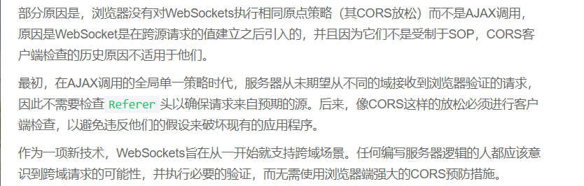
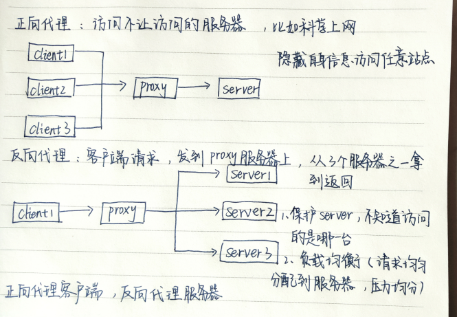

# 跨域的原理及常用跨域方法

## 1.前置知识

### （1） 什么是域

域是由网络上的用户和计算机组成的一个逻辑组或逻辑集合，域中所有的对象都存储在活动目录下

一个网络可以建立一个或者多个域，每个域都是一个安全界限，意味着各种权限不能跨域

### **（2）URL**

URL:(Uniform Resource Locator,统一资源定位器），它是WWW的统一资源定位标志，就是指网络地址。

URL组成：协议、主机、端口、路径【[http://www.baidu.com:80](http://www.baidu.com/)】

(服务类型（HTTP或者HTTPS://主机名（域名或者IP地址)[:端口号]/文件路径/资源名称?参数=参数值&参数=参数值#片段标志符

在www.baidu.com`的域名中，`com`成为顶级域名，`baidu称为2级域名，`www`称为3级域名

## 2. 跨域是什么？

 **跨域概念：**

```
跨域是指浏览器不能执行其他网站的脚本，是因为浏览器的同源策略造成的，是浏览器的安全限制。
```

 **同源概念**

```
同源概念：域名、协议、端口号均相同
```

**二级域名不同，发起请求也是跨域请求，可以在header里面添加域名限制，也可以修改domain**

**将子域和主域的document.domain设为同一个主域.前提条件：这两个域名必须属于同一个基础域名，而且所用的协议，端口都要一致，否则无法利用document.domain进行跨域**

所以当协议、子域名、主域名、端口号中任意一各不相同时，都算不同的“域”。他们之间请求资源，都是跨域

## 3. 为什么有跨域？

为了安全，浏览器执行javascript脚本的时候，会检查这个脚本属于哪个页面，不是同源页面，就不会被执行。

同源策略的主要目的是为了防止XSS（跨站脚本攻击）【反射型，非反射型、基于DOM】【[看这里](https://juejin.cn/post/6844903685122703367)】、CSRF(跨站请求伪造)【[看这里](https://juejin.cn/post/6844903689702866952)】等恶意攻击

但是实际开发中，经常会有跨域加载资源的需求【比如我们直接使用引入的jquery等，还有向后端发起请求】，避免不了跨域请求，所以出现了跨域。

## 4. 怎么跨域（方法）？

```
//前端发起请求
var xhr = new XMLHttpRequest();
xhr.open('get', 'http://localhost:3000/?name=yuqing&age=21');
xhr.send();
//后端自行搭建一个服务器，端口设置为3000，返回数据为请求参数
```

### 1.JSONP

js中自带跨域请求的技能：<script><script/>这个标签,我们可以请求网上的资源

JSONP原理就是利用了script标签，在标签外套了一层壳，利用标签特性达到跨域加载资源的效果。
 JSONP由两部分组成，回调函数和数据

```
// 以往不用src请求，会出现跨域请求失败的错误
var script = document.createElement('script');
script.src = 'http://127.0.0.1:3000/?name=yuqing&age=21';
document.head.appendChild(script);
function getData(res) {
  console.log(res);
   document.head.removeChild(script);
}
// 相当于网页里面写的
 <script>
        function getData(res) {
            console.log(res);
        }
</script>
<script src="http://127.0.0.1:3002/?name=yuqing&age=21"></script>
```

 优点：
	兼容性好，在多浏览器都能运行。
 缺点：
 （1）只支持GET请求，不支持POST请求；
 （2）不够安全。因为JSONP是从其他域中加载代码执行，如果其他域不安全，可能会在响应中带有恶意代码。
 （3）不容易确认请求是否失败。

注：理论上来说，带有src属性的标签都可以，<script>、、<iframe>每次这种标签加载，相当于发起一个get请求

###  2.CORS（跨域资源共享）

```
CORS是一个W3C标准，全称是"跨域资源共享"（Cross-origin resource sharing）。
它允许浏览器向跨源服务器，发出XMLHttpRequest请求，从而克服了AJAX只能同源使用的限制。
CORS需要浏览器和服务器同时支持。目前，所有浏览器都支持该功能，IE浏览器不能低于IE10
```

服务端设置Access-Control-Allow-Origin 就可以开启CORS，该属性表示哪些域名可以访问资源，如果设置通配符则表示所有网站都可以访问资源。

```
Access-Control-Allow-Origin:"*"// 表示服务端允许的请求源，*标识所有网站都可以访问
Access-Control-Allow-Credentials：false // 是否允许发送cookie

```

###  3.webSockets

不受同源策略影响。使用一种自定义的协议，专门为快速传输小数据设计。

server4.js

```
 let socket = new WebSocket("ws://localhost:3001");//ws协议是webSocket自己创造的
    socket.onopen = function(){
     socket.send("yuqing");
    }
    socket.onmessage = function(e){
     console.log(e.data);//你好,我叫yuqing！
}
```



### 4.Nginx

 代理跨域。反向代理跨域。

```csharp
server{
    # 监听3002端口
    listen 3002;
    # 本地的域名是localhost
    server_name localhost;
    # 凡是localhost:3002/index这个样子的，都转发到真正的服务端地址http://www.baidu.com
    location ^~ /index {
        proxy_pass http://wwww.baidu.com;
    }    
}
```

我们发出请求：http://localhost:3002/index/xxxxx,然后Nginx监听的是localhost:3002/index,然后往http://www.baidu.com转发



## 5.引起跨域检查策略的必要条件

1. **浏览器限制**： 即浏览器对跨域行为进行检测和阻止
2. **触发跨域的三要素**： `不同协议`、`不同域名`、`不同端口`，满足其一
3. **发起的是xhr请求**： 即发起的是XMLHttpRequest类型的请求

破坏其中之一，就可以跨域

