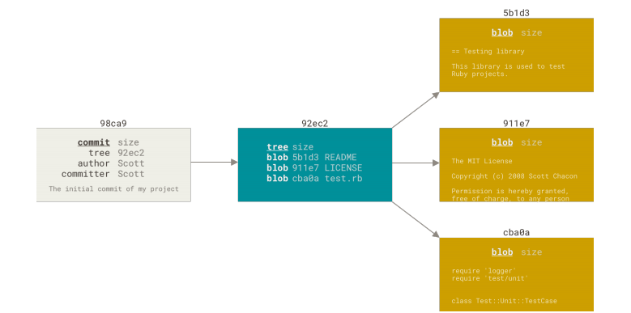

## 1.git学习

### （1）版本控制

记录一个或者若干个文件内容变化，查阅修订情况（比如文档备份），记录文件差异

- 集中版本控制：单一集中管理的服务器，所有人都提交到服务器上

缺点：服务器故障则全部人无法工作，丢失数据，丢失历史记录

- 分布式版本控制：将代码仓库完整备份，服务器故障，数据在本地也还有，可以和若干远端代码仓库进行交互

### （2）git基本知识

#### 【1】特点

1. 直接记录快照，而不是差异性比较（每次提交就是对全部文件创建快照并保存索引）

2. 本地操作文件
3. 保证完整性（所有数据存储前计算校验和，用来引用，更改文件会被发现，传送丢失也会发现【SHA-1散列】）
4. 一般只添加数据（不可恢复操作不会被执行）

#### 【2】三种状态

已提交（committed），已修改（modified），已暂存(staged)


已暂存就是标记，包含在下次提交的快照中

#### 【3】安装

- 下载git:开 https://git-scm.com/ download/win
- 配置用户名和邮箱

```js
$ git config --global user.name "用户名" 
$git config --global user.email 
$git config --global user.email "邮箱名字"
```

- 设置SSH key

  ```
  ssh-keygen -t rsa -C "邮箱"
  ```

  找到用户下的.ssh文件复制到gitLab或者github上

#### 【4】常规操作

##### 1.获取git项目

```js
git init //初始化
git clone 仓库地址 //克隆仓库 git或者http都可以
git add 文件名 //暂存
git commit -m "描述" //提交
git push origin master //推送到远程仓库
```

##### 2.查看文件状态

```js
git status
git status -s
git status --short 简洁文件状态
【？？未跟踪 A新添加到暂存区 M已修改】
git diff //具体的变化
git diff --staged 对比已暂存和最后一次提交的文件差异
```

##### 3.忽略文件.gitignore

```js
+ 所有空行或者以 # 开头的行都会被 Git 忽略。
• 可以使用标准的 glob 模式匹配，它会递归地应用在整个工作区中。(正则表达式)
• 匹配模式可以以（/）开头防止递归。
• 匹配模式可以以（/）结尾指定目录。
• 要忽略指定模式以外的文件或目录，可以在模式前加上叹号（!）取反。
```

##### 4.提交文件

```js
git add 文件名
git add . //提交全部到暂存区
git commit //多行
git commit -m "..."//一行
git commit -a "..."//跳过git add
```

##### 5.移除文件

```js
git rm 文件名/glob(正则)
```

##### 6.移动文件(改名字)

```js
git mv file_from file_to
```

##### 7.查看提交历史

```js
git log
git log -p -2 // 显示差异和最近的两次提交
git log --stat // 简略统计信息
git log --pretty=oneline // 浏览大量提交信息可用，一行展示一个
git log --pretty=format:"%h - %an,%ar : %s" // 记录格式提取
git log --since=2.weeks //限制最近两周的所有提交
```

##### 8.撤销操作

```js
(1)没有git add的时候
git checkout -- 文件名字 // 取消修改某个文件
git checkout . //放弃对工作区内所有文件的修改
(2)已经git add了
git reset HEAD 文件名字 // 已暂存的撤销变成修改未暂存
git reset HEAD . // 撤销所有的已经add到暂存区的文件
(3)已经git commit了
git reset --hard HEAD^ // 回退到上个版本
git reset --hard commit_id // 退到/进到 指定commit_id
```

##### 9.别名

```js
$ git config --global alias.co checkout // 直接git co
$ git config --global alias.br branch // git br
$ git config --global alias.ci commit // git ci
$ git config --global alias.st status // git st
git config --global alias.last 'log -1 HEAD' // git last
```

##### 10.远程仓库

- 查看远程仓库

```js
gut remote -v
git remote show // 查看更多
```

- 添加远程仓库并且改名字

```js
git remote add pb（改的名字） url
```

- 拉取仓库中信息

```js
git fetch pb
```

- 拉取并合并master->master

```js
git pull
```

- 重命名和移除

```js
git remote rename pb pc(pb->pc名字变化)
git remote remove // 移除
```

- 打标签：给某个重要的提交节点

```js
git tag // 列出已有标签
git tag -l "v1.8.5*" // 列出1.8.5系列
git tag -a v1.0 -m "描述"  // 创建附注标签
git show v1.0 // 显示标签信息
git tag v1.0-lw // 创建轻量标签
git show v1.0-lw //显示轻量标签的提交信息
git tag -a v1.2（标签名字） 9fceb02（部分校验和） //后期打标签 使用git log --pretty=oneline展示出提交历史之后
git tag -d <tagname> // 删除某个标签
git push origin --delete <tagname> // 删除远程标签
```

##### 11.分支

Git 仓库中有五个对象：三个 blob 对象（保存着文件快照）、一个 树 对象 （记录着目录结构和 blob 对 象索引）以及一个 提交 对象（包含着指向前述树对象的指针和所有提交信息）。



做些修改后再次提交，那么这次产生的提交对象会包含一个指向上次提交对象（父对象）的指针。

**git分支本质是指向提交对象的可变指针**

- 分支创建

```js
git branch testing(名字)
git branch // 显示本地分支 *号显示HEAD指针所指分支
git branch -a //显示本地和远程所有分支
git branch -r //显示所有远程分支
git branch --merged // 显示已合并的分支
git branch --no-merged // 显示未合并的分支
```

- 切换

```
git checkout testing(名字)
```

git log --oneline --decorate --graph --all ，它会输出你的提交历史、各个分支的指向以及项目的分支分叉情况。

- 创建并且切换分支

```
git checkout -b name
```

- 合并

```
git merge 分支名字
```

- 删除分支

```js
git branch -d 分支名字 // 删除本地分支
```

- 本地分支关联远程分支

  远程还没有分支

```
git branch -b newbranch // 新建切换
git push origin newbranch:newbranch  // 新建远程
git push --set-upstream origin newbranch // 关联
```

​	有分支了

```
git checkout -b 分支名字 // 新建并切换到本地d分支
git pull origin 分支名字 // 本地分支与远程分支相关联
```

- 删除

  ```js
  git push origin --delete 分支名字 //删除远程分支
  ```

- 整合不同分支的方法:merge和rebase

可以使用 rebase 命令将提交到某一分支上的所有修改都移至另一分支上,叫做**变基**

```
$ git checkout master
$ git merge experiment
```

merge最终结果没有什么区别，但是变基可以让提交历史更加整洁，最后是一条直线，但是merge会有被整合的分支记录


上图变成下图所示，需要使用--noto选项

```
git rebase --onto master server client
```

最终结果如下图:


然后如果想要整合server分支内容，也可以不切换分支直接整合

```
git rebase master server
```

变基缺点：

变基实际上是丢弃一些现有的操作，没有了分支的那些记录，然后新建内容一样但是实际上并不同的提交，所以需要谨慎，如果有人基于这些提交进行开发，就不要执行变基操作

## 2. 使用git cz

阮一峰博客地址：

http://www.ruanyifeng.com/blog/2016/01/commit_message_change_log.html

```js
npm install -g commitizen cz-conventional-changelog standard-version
npm init --yes
commitizen init cz-conventional-changelog --save --save-exact
```

---

归纳：

git cz用来规范git commit 格式，最后好查看历史信息，生成符合格式的提交信息

npm run changelog 用来记录版本之间的差异，用了git cz方便changelog打包

## 3.git flow

当我们使用git进行多人协作,为了避免协作过程中产生冲突，必须有一个规范的工作流程。

 Git flow是基于Git的强大分支能力所构建的一套***软件开发工作流***，Git flow使用多个分支来记录项目开发的历史，而不是使用单一的master分支

在`Git Flow`中，主要的分支有`master`、`develop`、`hotfix`、`release`、`feature` 这五种分支

关系如图所示


#### （1）master分支

主要用来存放稳定、随时可以上线的版本

只能从其他分支合并，不能在这个分支直接修改

也会在这个分支上的提交打上版本号标签

#### （2）develop分支

开发分支的基础分支

可以直接在上面开发，当添加新的功能的时候，就从这个版本切出去，在feature上实现功能之后再切回来，并合并代码

#### （3）hotfix分支

线上产品发生问题的时候，从master切到该分支进行紧急修复

修复完成之后,合并到master也合并到develop

#### （4）release分支

从develop切过去的测试分支

实现之后，合并到develop中，等待最后的测试发布，如果完成也合并到master打上版本号

#### （5）feature分支

当需要补充功能的时候，从develop分支中切到该分支进行功能开发

功能实现之后，合并到develop等待测试发布
