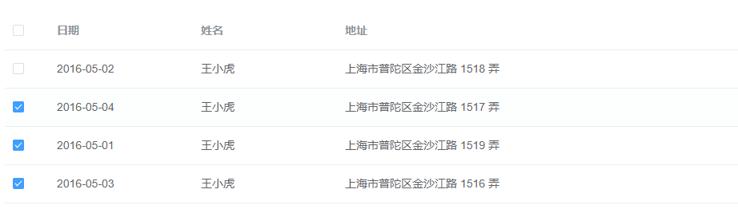
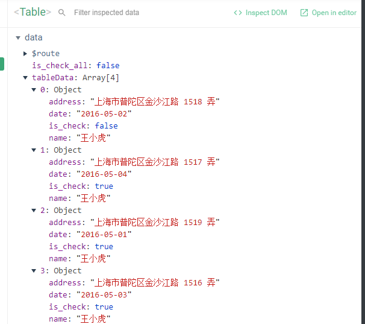

# Element UI 自定义表格多选框不响应问题

## 1.问题发现

如果想要完成一个element ui表格的多选框，通常会直接使用table组件的`type="selection"`和`selection-change`等方法，如果要想自己去实现table的多选框，就需要用到`template`,如下所示



```vue
 <el-table-column prop="is_check" width="55">
        <template slot="header">
          <el-checkbox
            v-model="is_check_all"
            @change="tableAllChecked"
          ></el-checkbox>
        </template>
        <template slot-scope="scope">
          <el-checkbox
            v-model="scope.row.is_check"
            @change="checkSingle"
          ></el-checkbox>
        </template>
      </el-table-column>
```

但是实现之后发现如果全选下面的选择框，表头的选择框并不会被选上，但是表头的多选框会有反应，周边变色，启动vue插件也可以看到变化，但是就是没有勾选上




https://jsfiddle.net/towry/k5ythLqc/1/这里可线上查看展示效果

## 2.解决办法

百度之后，只找到了解决办法，就是header中即时不使用scope，也要把插槽加上（slot-scope="scope"），但是皆没告诉是什么原因，也有人提到是因为不加slot-scope="scope"，就是静态的了。

尝试不写`slot-scope="scope"`,父组件给子组件传值，但是没有丝毫影响，证明不是slot的问题

```vue
 <template slot="bar">
        <span>Hello {{ is_check_all }}</span>
        <el-checkbox
          v-model="is_check_all"
          @change="tableAllChecked"
        ></el-checkbox>
      </template>
      <template slot="foo" slot-scope="prop">
        <span>{{ prop.msg }}</span>
</template>
```

那就只能是element-ui组件的问题，可能是table的表头的`template`有什么问题
