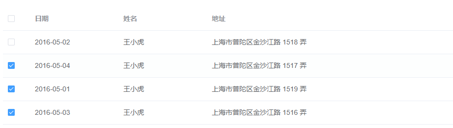

# Element UI 自定义表格多选框不响应问题

## 1.问题发现

如果想要完成一个element ui表格的多选框，通常会直接使用table组件的`type="selection"`和`selection-change`等方法，如果要想自己去实现table的多选框，就需要用到`template`,如下所示



```vue
 <el-table-column prop="is_check" width="55">
        <template slot="header">
          <el-checkbox
            v-model="is_check_all"
            @change="tableAllChecked"
          ></el-checkbox>
        </template>
        <template slot-scope="scope">
          <el-checkbox
            v-model="scope.row.is_check"
            @change="checkSingle"
          ></el-checkbox>
        </template>
      </el-table-column>
```

但是实现之后发现如果全选下面的选择框，表头的选择框并不会被选上，但是表头的多选框会有反应，周边变色，启动vue插件也可以看到变化，但是就是没有勾选上


https://jsfiddle.net/towry/k5ythLqc/1/这里可线上查看展示效果

## 2.解决办法

百度之后，只找到了解决办法，就是header中即时不使用scope，也要把插槽加上（slot-scope="scope"），但是皆没告诉是什么原因，也有人提到是因为不加slot-scope="scope"，就是静态的了。

尝试不写`slot-scope="scope"`,父组件给子组件传值，但是没有影响，证明不是slot的问题

```vue
 <template slot="bar">
        <span>Hello {{ is_check_all }}</span>
        <el-checkbox
          v-model="is_check_all"
          @change="tableAllChecked"
        ></el-checkbox>
      </template>
      <template slot="foo" slot-scope="prop">
        <span>{{ prop.msg }}</span>
</template>
```

那就只能是element-ui组件的问题，可能是table组件的表头的`template`有什么问题，在`node_modules\element-ui\packages\table\src\table-column.js`中阅读源码

```js
import { cellStarts, cellForced, defaultRenderCell, treeCellPrefix } from './config';
import { mergeOptions, parseWidth, parseMinWidth, compose } from './util';
import ElCheckbox from 'element-ui/packages/checkbox';

let columnIdSeed = 1;

export default {
  name: 'ElTableColumn',

  props: {
    type: {
      type: String,
      default: 'default'
    },
    label: String,
    className: String,
    labelClassName: String,
    property: String,
    prop: String,
    width: {},
    minWidth: {},
    renderHeader: Function,
    sortable: {
      type: [Boolean, String],
      default: false
    },
    sortMethod: Function,
    sortBy: [String, Function, Array],
    resizable: {
      type: Boolean,
      default: true
    },
    columnKey: String,
    align: String,
    headerAlign: String,
    showTooltipWhenOverflow: Boolean,
    showOverflowTooltip: Boolean,
    fixed: [Boolean, String],
    formatter: Function,
    selectable: Function,
    reserveSelection: Boolean,
    filterMethod: Function,
    filteredValue: Array,
    filters: Array,
    filterPlacement: String,
    filterMultiple: {
      type: Boolean,
      default: true
    },
    index: [Number, Function],
    sortOrders: {
      type: Array,
      default() {
        return ['ascending', 'descending', null];
      },
      validator(val) {
        return val.every(order => ['ascending', 'descending', null].indexOf(order) > -1);
      }
    }
  },

  data() {
    return {
      isSubColumn: false,
      columns: []
    };
  },

  computed: {
    owner() {
      let parent = this.$parent;
      while (parent && !parent.tableId) {
        parent = parent.$parent;
      }
      return parent;
    },

    columnOrTableParent() {
      let parent = this.$parent;
      while (parent && !parent.tableId && !parent.columnId) {
        parent = parent.$parent;
      }
      return parent;
    },

    realWidth() {
      return parseWidth(this.width);
    },

    realMinWidth() {
      return parseMinWidth(this.minWidth);
    },

    realAlign() {
      return this.align ? 'is-' + this.align : null;
    },

    realHeaderAlign() {
      return this.headerAlign ? 'is-' + this.headerAlign : this.realAlign;
    }
  },

  methods: {
    getPropsData(...props) {
      return props.reduce((prev, cur) => {
        if (Array.isArray(cur)) {
          cur.forEach((key) => {
            prev[key] = this[key];
          });
        }
        return prev;
      }, {});
    },

    getColumnElIndex(children, child) {
      return [].indexOf.call(children, child);
    },

    setColumnWidth(column) {
      if (this.realWidth) {
        column.width = this.realWidth;
      }
      if (this.realMinWidth) {
        column.minWidth = this.realMinWidth;
      }
      if (!column.minWidth) {
        column.minWidth = 80;
      }
      column.realWidth = column.width === undefined ? column.minWidth : column.width;
      return column;
    },

    setColumnForcedProps(column) {
      // 对于特定类型的 column，某些属性不允许设置
      const type = column.type;
      const source = cellForced[type] || {};
      Object.keys(source).forEach(prop => {
        let value = source[prop];
        if (value !== undefined) {
          column[prop] = prop === 'className' ? `${column[prop]} ${value}` : value;
        }
      });
      return column;
    },

    setColumnRenders(column) {
      // renderHeader 属性不推荐使用。
      if (this.renderHeader) {
        console.warn('[Element Warn][TableColumn]Comparing to render-header, scoped-slot header is easier to use. We recommend users to use scoped-slot header.');
      } else if (column.type !== 'selection') {
        column.renderHeader = (h, scope) => {
          const renderHeader = this.$scopedSlots.header;
          return renderHeader ? renderHeader(scope) : column.label;
        };
      }

      let originRenderCell = column.renderCell;
      // TODO: 这里的实现调整
      if (column.type === 'expand') {
        // 对于展开行，renderCell 不允许配置的。在上一步中已经设置过，这里需要简单封装一下。
        column.renderCell = (h, data) => (<div class="cell">
          { originRenderCell(h, data) }
        </div>);
        this.owner.renderExpanded = (h, data) => {
          return this.$scopedSlots.default
            ? this.$scopedSlots.default(data)
            : this.$slots.default;
        };
      } else {
        originRenderCell = originRenderCell || defaultRenderCell;
        // 对 renderCell 进行包装
        column.renderCell = (h, data) => {
          let children = null;
          if (this.$scopedSlots.default) {
            children = this.$scopedSlots.default(data);
          } else {
            children = originRenderCell(h, data);
          }
          const prefix = treeCellPrefix(h, data);
          const props = {
            class: 'cell',
            style: {}
          };
          if (column.showOverflowTooltip) {
            props.class += ' el-tooltip';
            props.style = {width: (data.column.realWidth || data.column.width) - 1 + 'px'};
          }
          return (<div { ...props }>
            { prefix }
            { children }
          </div>);
        };
      }
      return column;
    },

    registerNormalWatchers() {
      const props = ['label', 'property', 'filters', 'filterMultiple', 'sortable', 'index', 'formatter', 'className', 'labelClassName', 'showOverflowTooltip'];
      // 一些属性具有别名
      const aliases = {
        prop: 'property',
        realAlign: 'align',
        realHeaderAlign: 'headerAlign',
        realWidth: 'width'
      };
      const allAliases = props.reduce((prev, cur) => {
        prev[cur] = cur;
        return prev;
      }, aliases);

      Object.keys(allAliases).forEach(key => {
        const columnKey = aliases[key];

        this.$watch(key, (newVal) => {
          this.columnConfig[columnKey] = newVal;
        });
      });
    },

    registerComplexWatchers() {
      const props = ['fixed'];
      const aliases = {
        realWidth: 'width',
        realMinWidth: 'minWidth'
      };
      const allAliases = props.reduce((prev, cur) => {
        prev[cur] = cur;
        return prev;
      }, aliases);

      Object.keys(allAliases).forEach(key => {
        const columnKey = aliases[key];

        this.$watch(key, (newVal) => {
          this.columnConfig[columnKey] = newVal;
          const updateColumns = columnKey === 'fixed';
          this.owner.store.scheduleLayout(updateColumns);
        });
      });
    }
  },

  components: {
    ElCheckbox
  },

  beforeCreate() {
    this.row = {};
    this.column = {};
    this.$index = 0;
    this.columnId = '';
    
  },

  created() {
    const parent = this.columnOrTableParent;
    this.isSubColumn = this.owner !== parent;
    this.columnId = (parent.tableId || parent.columnId) + '_column_' + columnIdSeed++;

    const type = this.type || 'default';
    const sortable = this.sortable === '' ? true : this.sortable;
    const defaults = {
      ...cellStarts[type],
      id: this.columnId,
      type: type,
      property: this.prop || this.property,
      align: this.realAlign,
      headerAlign: this.realHeaderAlign,
      showOverflowTooltip: this.showOverflowTooltip || this.showTooltipWhenOverflow,
      // filter 相关属性
      filterable: this.filters || this.filterMethod,
      filteredValue: [],
      filterPlacement: '',
      isColumnGroup: false,
      filterOpened: false,
      // sort 相关属性
      sortable: sortable,
      // index 列
      index: this.index
    };

    const basicProps = ['columnKey', 'label', 'className', 'labelClassName', 'type', 'renderHeader', 'formatter', 'fixed', 'resizable'];
    const sortProps = ['sortMethod', 'sortBy', 'sortOrders'];
    const selectProps = ['selectable', 'reserveSelection'];
    const filterProps = ['filterMethod', 'filters', 'filterMultiple', 'filterOpened', 'filteredValue', 'filterPlacement'];

    let column = this.getPropsData(basicProps, sortProps, selectProps, filterProps);
    column = mergeOptions(defaults, column);

    // 注意 compose 中函数执行的顺序是从右到左
    const chains = compose(this.setColumnRenders, this.setColumnWidth, this.setColumnForcedProps);
    column = chains(column);

    this.columnConfig = column;

    // 注册 watcher
    this.registerNormalWatchers();
    this.registerComplexWatchers();
  },


  mounted() {
    const owner = this.owner;
    const parent = this.columnOrTableParent;
    const children = this.isSubColumn ? parent.$el.children : parent.$refs.hiddenColumns.children;
    const columnIndex = this.getColumnElIndex(children, this.$el);

    owner.store.commit('insertColumn', this.columnConfig, columnIndex, this.isSubColumn ? parent.columnConfig : null);
  },

  destroyed() {
    if (!this.$parent) return;
    const parent = this.$parent;
    this.owner.store.commit('removeColumn', this.columnConfig, this.isSubColumn ? parent.columnConfig : null);
  },

  render(h) {
    // slots 也要渲染，需要计算合并表头
    return h('div', this.$slots.default);
  }
};

```

只有slot的情况下，table-header无法收集到slot组件下的依赖信息，造成了data的改变没有触发table-header更新。
pr里的解决方案是：有设置slot情况下，在beforeUpdate时，重新给renderHeader赋值，触发table-header的更新

在`node_modules\element-ui\packages\table\src\table-column.js`添加如下代码

```js
 beforeUpdate() {
    if (this.$slots.header && this.$scopedSlots.header) {
      this.columnConfig.renderHeader = (h, scope) => {
        const renderHeader = this.$scopedSlots.header;
        return renderHeader ? renderHeader(scope) : this.columnConfig.label;
      };
    }
  },
```

拉取element-ui代码，`npm run dev`之后将代码跑起来，可以访问到源码，加入如上代码之后`npm run dist`生成打包目录lib，将项目里面的`node_modules\element-ui\lib`目录替换成打包之后的lib,然后运行项目就可以看到正确的效果

```vue
 <template slot="header"><!--之后直接这样使用也没有问题了-->
  <el-checkbox
    v-model="is_check_all"
    @change="tableAllChecked"
  ></el-checkbox>
</template>
```

否则就必须加上`slot-scope="scope"`或者直接使用`v-slot`

## 3.参考地址

1.[问题解决issues](https://github.com/ElemeFE/element/pull/21297)
