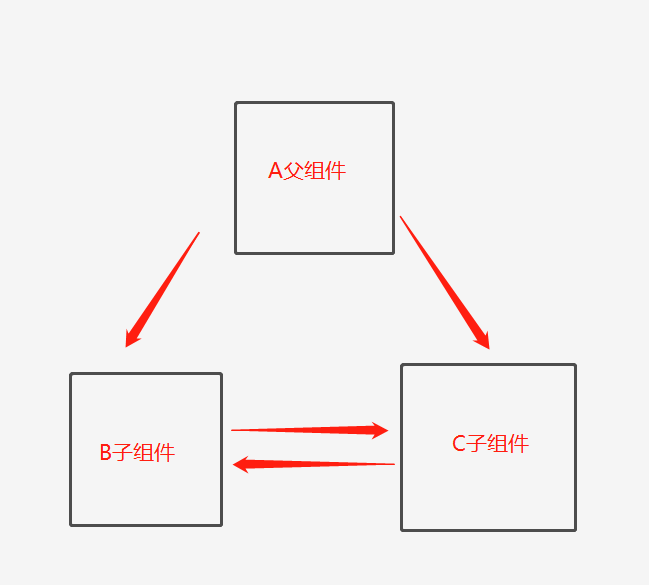

# angular循环依赖的问题

## 1.问题展示

每次编译angular项目的时候，会弹出这样的警告，说检测到了 循环依赖

```js
Circular dependency detected
A组件->B组件->A组件
```

## 2.产生原因

多个组件之间相互引用，形成闭环，比如A依赖于B,B依赖于C,C又依赖于A

## 3.场景及解决办法

###  （1）场景一：数据和方法引用

```js
\brand-data-analysis\open-group-info\open-group-info.component.ts -> \brand-data-analysis\brand-data-analysis.component.ts -> brand-data-analysis\open-group-info\open-group-info.component.ts
```

场景：A组件是父组件，B组件是A组件的子组件（A引入了B），然后B又导入使用了A的一些数据或者方法（导致B引用了A）

```js
//解决办法：新建interface.ts文件，将公用的数据提出到该文件里面，如果是公共的方法就放到新的service.ts文件里面
//interface.ts
export const enum typeEnum{
    a,
    b,
}
//service.ts
@Injectaable({
	providedIn: "root",
})
export class FileService{
    constuctor(){}
    public someFunctions():void{}//公用的方法
}
```

[【angular官网描述循环依赖错误】](https://angular.cn/errors/NG3003)

### （2）场景二： service文件之间相互引用

```js
export class FileService{
    constructor(private imagService: ImagService)
    //用了一些imagService方法
}

export class ImagService{
    constructor(private fileService: FileService)
    //用了一些fileService里面的方法
}
```

```js
//解决办法 换一个依赖注入的方式
private fileService:FileService;
constructor(injector:Injector) {
  this.fileService = injector.get(FileService);
}
```

 ### （3）场景三：多个组件之间相互引用

多个组件之间相互引用，可以提供服务监听数据变化，进行数据的通知，Subject



假如组件之间关系如上图，则很容易造成三个组件循环依赖，理清思路，就是B可以调C，C可以调B，为了不互相依赖，我们都从A过，所以现在提供一个服务，监听点击事件，如果B要调用C了，就通知A去调用C,同理C要调用B了，也通知A去调用B,BC之间就不互相调用了。

```ts
//listenerService.ts
import { Injectable } from "@angular/core"
import { Observable, Subject } from "rxjs"

@Injectable({
  providedIn: "root",
})
export class ListenerService {
  private followBSubject: Subject<B> = new Subject<B>()
  private followCSubject: Subject<C> = new Subject<C>()
  constructor() { }

  public listenBChange(): Observable<B> {
    return this.followCSubject.asObservable()
  }

  public notifyBChange(params: B): void {
    this.followCSubject.next(params)
  }

  public listenCChange(): Observable<C> {
    return this.followBSubject.asObservable()
  }

  public notifyCChange(params: C): void {
    this.followBSubject.next(params)
  }
}

//在A里面去监听B、C的变化
private listener: ListenerService,
this.followResultListener.listenBChange().pipe(
      //一些操作
    ).subscribe((res) => {
      //监听B的变化去操作C
    })
    this.followResultListener.listenCChange().pipe(
      //一些操作
    ).subscribe((res) => {
     //监听C的变化去操作B
    })

//在B、C变化时通知A
this.listener.notifyBChange({//传递需要的数据 })
 this.listener.notifyCChange({//传递需要的数据 })
```

## 4.总结

循环依赖造成各个模块之间耦合性很强，难以独立，形成闭环如果有涉及实例的创建，也很容易造成内存溢出

避免循环依赖的最好办法是理清思路减少尽量相互引用，提出公用的办法，变量等，避免模块之间相互依赖的问题

